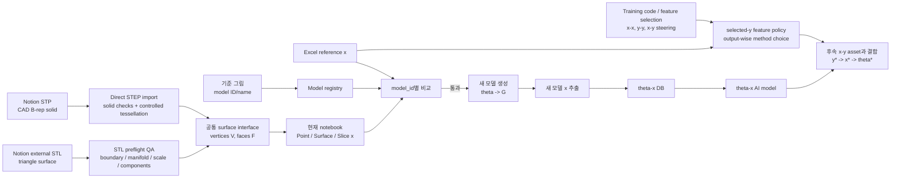

# URP4-1 Professor Project Roadmap

#to-read

## 0. 현재 결론

> **2026-07-16 override:** 현재 우선순위는 아래 과거 순서만 단독으로 따르지 않는다. 이 문서의 `§10 PRM-028`이 descriptor 정확성, modular Lattice/TPMS/Voxel generation, DLP intake, θ→x 집중, x→y domain 분리의 최신 지시로 우선한다.

박사님이 2026-07-10 통화까지 알려준 기준으로, 프로젝트의 현재 활성 과업은 **Slice 검증을 닫은 뒤 Point/Mass Distribution → Initial Area → Surface-mesh Curvature 순으로 descriptor 검증을 확장하고, 동시에 현재 Excel의 약 5개 output에 대해 output별 feature selection/method pilot을 진행하는 것**이다.

- 구조인자 추출 알고리즘을 하나의 Jupyter notebook으로 통합하는 작업은 완료로 취급한다.
- 다음 통과 조건은 기준 그림의 model ID를 사용해 Notion STP/STL을 불러오고, 현재 pipeline이 계산한 구조인자 `x_current`를 Excel의 `x_excel`과 비교해 `y=x` 또는 `y=a*x` 관계와 standout/outlier를 판단하는 것이다.
- Notion 모델은 legacy Excel과 scale이 다를 수 있으므로, 박사님 승인에 따라 별도 processed branch에서 STL을 `40 × 40 × 40 mm`로 정규화해 검증할 수 있다. 원본 STL/STP는 수정하지 않는다.
- 공식 구조인자 검증은 CSV-only가 아니라 **image slicing -> pixel read -> connected component/pixel descriptor calculation**의 artifact trace가 있어야 한다.
- 다만 대량 생성 모델에서는 모든 slice image를 장기 저장하면 시간이/용량이 폭발하므로, 검증된 pipeline 이후에는 image를 생성해 pixel/CSV/component table로 읽은 뒤 바로 삭제하는 streaming 방식도 허용 가능성이 있다. 이때도 설정, 해시, component/pixel table, descriptor CSV, 비교 결과는 남겨야 한다.
- 이 검증을 통과한 뒤에 새 모델을 생성하고 `theta -> x` 데이터베이스를 만든다.
- 먼저 학습할 관계는 `generation parameters theta -> structural descriptors x`이다.
- `x -> performance y`는 그 다음 연결이지만, 박사님/조교님이 feature-selection/Training 코드를 제공했으므로 P2와 병렬로 “x-x, y-y, x-y(y 하나씩)” 전략 준비와 feature-selection steering은 진행한다.
- 2026-07-10 통화에서 현재 Excel 데이터로 먼저 feature selection/AI fitting을 시도하고, 압축시험 데이터가 추가되면 versioned future-y dataset으로 재학습하라는 지시가 확인되었다.
- 새 Training Excel은 기존 Excel과 별개 실험 데이터가 아니라 일부 구조인자가 추가된 Training용 schema variant다.
- Excel에 없는 descriptor는 현재 학습에 억지로 넣지 않는다. 이상값 때문에 과거 제외된 surface curvature는 mesh-QA/outlier gate를 거쳐 최종적으로 다시 포함하는 방향이다.
- “높은 R²”는 누수 없는 family-aware cross-validation R²를 primary로 해석한다. training R²만 높이는 것은 통과 근거가 아니다.
- 최종 목표는 `target y* -> required x* -> generation parameters theta*` 역설계이다.

```text
P1 통합 구현 완료
  -> P2 기준 STP/STL import + Excel 구조인자 검증         [현재]
       ├─ P2-SLICE: image/pixel/component artifact 기반 descriptor 검증
       └─ P2-TRAIN-SUPPORT: Training/feature-selection code crosswalk 병렬 준비
  -> P3 새 모델 생성 + theta-x DB 구축
  -> P4 theta-x AI 모델 학습 / target x* -> theta* 후보화
  -> P5 x-y asset + Training feature selection과 결합 + 최적 성능 역설계
```

기존 `outputs/URP4-1_ROADMAP.md`는 이 문서 아래에서 움직이는 **micro roadmap**이다.

## 1. 박사님으로부터 확인된 사실

### 1.1 코드와 데이터의 권한

- 기존 Python legacy files는 박사님이 사용하던 검증된 개별 알고리즘이다.
- main Jupyter notebook은 legacy files를 하나의 관리 가능한 파일로 연결하기 위해 탄생했다.
- candidate v0.2는 동일 입력 controlled parity 93/93, repeatability 438/438, Lattice/TPMS/Voxel E2E 3/3을 통과했다.
- 2026-07-01 설명에서는 “구조인자 추출 알고리즘이 제대로 구현되었는지 확인” 단계가 완료로 분류되었다.
- Excel `압축+열+진동+구조인자_260212.xlsx`는 실제 실험과 기존 구조인자 결과를 담은 참고 기준이다. 원본을 수정하지 않는다.
- 기준 그림 `Cellular materials: 56+(2) types`가 model family ID/name의 명명 기준이다.
- 현재 외부 geometry 범위는 `.stp`와 `.stl`뿐이다. `.inp`는 제외한다.
- notebook이 생성한 STL은 생성 조건을 아는 controlled output이지만, Notion의 외부 STL은 단위·방향·watertightness·mesh density·revision을 모르는 validation input이다. 같은 확장자라는 이유만으로 같은 품질을 가정하지 않는다.
- STP는 내부가 tetrahedral mesh로 채워진 파일이 아니라 solid topology를 가진 CAD B-rep이다. P2에서는 STL을 STP로 변환하지 않고, STP와 STL을 각자의 importer로 읽어 공통 descriptor interface로 보낸다.
- 기존 `x-y` 연결 파일/코드/모델은 downstream asset이며 박사님이 이후 제공할 예정이다.

### 1.2 지금 연결할 관계

```text
현재 우선: generation parameters theta -> structural descriptors x
다음 단계: structural descriptors x -> performance y
최종 목표: target performance y* -> x* -> theta* -> generated geometry G*
```

따라서 지금 Excel의 성능 `y`로 새 모델을 만드는 단계로 건너뛰지 않는다. 현재 Excel에서 직접 검증할 대상은 먼저 구조인자 `x`이다. 다만 2026-07-10 통화에 따라, 현재 Excel의 약 5개 `y`를 이용한 feature-selection/method pilot은 descriptor 검증과 병렬로 진행할 수 있다. 이 pilot은 최종 역설계나 새 구조 생성의 성공 근거가 아니다.

### 1.3 2026-07-08~2026-07-09 추가 확인 및 해석

#### A. 공식 구조인자 검증 방식

- 박사님은 구조인자 추출 알고리즘 검증을 **정석적인 image slicing -> pixel read -> connected component / pixel 기반 descriptor calculation**으로 해야 한다고 했다.
- CSV 기반 x-x/y-y/x-y 분석은 폐기하지 않는다. 역할은 빠른 전략 수립, 포렌식, feature 후보 탐색, selected-y 준비, Training code steering이다.
- 그러나 CSV-only 분석만으로 “구조인자 추출 알고리즘이 검증되었다”고 주장하지 않는다.
- 초기 대표 모델 검증에서는 image artifact, overlay, pixel table, component table, descriptor CSV, Excel comparison을 남긴다.
- 대량 random model 생성 단계에서는 모든 slice image를 저장하면 비현실적으로 오래 걸리므로, pipeline이 검증된 뒤에는 image를 생성하고 pixel/CSV/component table로 읽은 다음 image를 삭제하는 streaming 방식이 가능하다.
- 단, streaming 방식에서도 아래 정보는 추적 가능해야 한다.

```text
model_id
source_geometry_file
physical_size_mm
slice_axis
slice_count
slice_spacing_mm
pixel_resolution
threshold_rule
connected_component_rule
component_table_path
descriptor_result_csv
comparison_to_excel_csv
y=x / y=a*x / correlation result
scale-difference notes
```

#### B. 30mm Notion model과 40mm legacy/PPT 조건

- 박사님은 Notion 모델이 `30 × 30 × 30 mm`이고 legacy Excel/PPT 조건이 `40 × 40 × 40 mm`일 수 있음을 인정했다.
- 정확히 같은 수치가 나오지 않아도, 배수/scale 차이로 설명되고 `y=x` 또는 `y=a*x` 상관관계가 보이면 유효한 방향으로 볼 수 있다.
- 박사님은 `40 × 40 × 40 mm`로 변환 후 검증해도 된다고 했다.
- 따라서 raw STL/STP는 보존하고, 별도의 processed branch에서 `N40_BBOX_EXACT` STL을 사용한다.

#### C. `avg에 대한 std`

- 박사님은 stdev에 대해 “avg에 대한 std”라는 취지로 설명했다.
- 현재 해석은 완전 확정이 아니라, component/layer/replicate population을 artifact에서 추적해야 하는 미해결 항목이다.
- 특히 MassOri stdev, Curvature stdev, generic Std는 canonical formula로 승격하지 않고 unresolved로 유지한다.

#### D. Training / feature-selection 코드의 역할

- 박사님은 x-x, y-y, x-y를 보는 현재 방향이 맞다고 했다.
- x-y는 한 번에 모든 y를 다루기보다 **y 하나씩 도장깨기** 방식으로 진행한다.
- 조교님이 준 Training 코드에는 feature selection과 output별 model/method 선택 전략이 들어 있다.
- 조교님 설명:

```text
New feature는 Lattice 관련 Feature가 추가되어서
앙상블 모델로 부분적 학습+병합한 코드.

Lattice는 B, C, L만 있고
F랑 T는 Lattice가 아니어서 구조인자가 없다 보니 알고리즘이 살짝 달라짐.

1, 2, 3, 4로 갈수록 좋아지는 게 아니라
각각 Input-Output별로 잘 맞는 모델이 달라서 그 부분을 해결해야 함.
```

- 따라서 Training code는 P2 descriptor 검증을 대체하지 않는다.
- Training code는 P5의 x-y/feature-selection 방향을 준비하고, P3/P4에서 어떤 x를 중점적으로 생성/학습할지 steering하는 상위 전략 asset이다.

#### E. 박사님 지시와 우리 해석을 합친 현재 전략

```text
1. B3 같은 단순 대표 모델로 image/pixel/component artifact 기반 full trace를 만든다.
2. Excel x와 scale-aware y=x / y=a*x / correlation을 비교한다.
3. 상관관계가 보이면 현재 알고리즘을 후보 표준으로 유지한다.
4. 상관관계가 안 보이면 pixel/slice/threshold/component/scale 설정을 DOE로 수정한다.
5. 그래도 안 되면 더 많은 image artifact를 보존하며 black box를 열어본다.
6. 동시에 Training code를 읽고, feature selection / output별 method policy를 준비한다.
```

## 2. 전체 데이터 흐름



Notebook의 목표 직렬 배열은 다음과 같다.

```text
외부 파일 import (STP/STL)
-> 외부 기준 모델 구조인자 추출
-> Excel 구조인자 비교/검증
-> 새 모델 생성
-> 새 모델 구조인자 추출
-> theta-x DB export
```

STP import 구현은 STL 기준 비교와 병행한다. STP는 CAD solid로 직접 읽은 뒤 명시적 설정으로 tessellation하고, STL은 geometry QA/필요 시 복구본을 거쳐 최종적으로 동일한 `V: (n,3), F: (m,3)` surface interface에 들어간다. STL→STP 변환은 삼각형을 faceted solid로 감쌀 뿐 원래 CAD topology를 복원하지 못하므로 기본 경로로 사용하지 않는다.

외부 geometry만으로는 lattice의 node/edge/radius graph가 자동 복원되지 않는다. 따라서 P2의 공통 검증 범위는 Point, Surface/Curvature, Slice/Pixel이며, 외부 Lattice node/strut descriptor는 `not_applicable_without_graph`로 기록한다. 새로 생성한 lattice는 `parameter_json`에 graph가 있으므로 P3 `theta -> x`에서는 기존 `extract_lattice_descriptors(row)`를 계속 사용한다.

## 3. Professor macro phases

## P1. Legacy integration and descriptor implementation

### 목표

검증된 legacy 계산 책임을 하나의 notebook에 연결하고 Lattice/TPMS/Voxel 대표 구조에서 실행 가능하게 만든다.

### 통과 근거

- legacy-to-notebook module map 작성;
- controlled parity 93/93;
- 동일 후보 repeatability 438/438;
- KMK312 E2E Lattice/TPMS/Voxel 3/3;
- candidate SHA-256 `29131CE5F3D8D59CF6A7211D963A23F85C14F950EA335BBD237B52A7FF76980F`.

### 상태

**Completed for implementation/integration.** 이 판정은 P2의 Excel 물리값 재현까지 완료했다는 뜻이 아니다.

## P2. Reference-model import and Excel descriptor validation

### 목표

동일한 model ID에 대해 현재 notebook의 구조인자와 Excel 구조인자가 같게 나오는지 검증한다.

```text
STP/STL reference geometry
-> current-version descriptor extraction
-> model_id join
-> x_current versus x_excel
-> pass/fail/discrepancy report
```

### 입력

- Naming authority: user-provided 56+(2) model-family figure.
- Excel: `outputs/URP4-1/압축+열+진동+구조인자_260212.xlsx`.
- Notion STP attachments: individual `.stp` only; `.zip` and `.inp` excluded.
- Notion printing attachments: every individual `.stl`; `.zip` excluded.
- P1 candidate notebook and frozen KMK312 environment.

### P2 parallel lanes

| Lane | Work | Why parallel |
|---|---|---|
| P2-A0 | imported STL source router and preflight QA | separates controlled `generated_stl` from unknown `imported_stl` mesh quality before descriptor execution |
| P2-A | imported STL robust slicer development | mesh cleanup audit, robust triangle-plane intersection, contour/hole/material classification, connected-component-preserving raster and slice QA |
| P2-B | direct STP B-rep import -> controlled tessellation -> `V,F` | required new input path; must record CAD backend, solid state, tessellation settings, and units |
| P2-C | figure/Excel/Notion model-ID registry | prevents wrong-model comparisons |
| P2-D | Excel descriptor schema/crosswalk | separates structural descriptors from performance and metadata |
| P2-E | same-model comparison report | final gate evidence |
| R09-SURF | STL surface area / normalized surface area validation | professor confirmed surface area came from STL but needs accuracy improvement |
| R09-SLICE | Python one-step Ntop-slice descriptor reproduction | professor confirmed slice descriptors came from Ntop and should be reproduced in Python |
| R09-POINT | INP-node distribution provenance tracking | prevents claiming exact STL-vertex parity for INP-node descriptors |
| R09-TRAIN-SUPPORT | Training code / feature-selection policy intake | runs in parallel as x-y strategy support; does not replace image/pixel descriptor validation |

### P2 gate

P2 passes only when:

1. every compared row has a confirmed `model_id`, source hash, geometry format, unit/scale, import settings, descriptor schema version, and runtime;
2. `generated_stl`, `imported_stl`, and `original_stp` retain explicit source type and route IDs; imported STL reaches its dedicated robust slicer without silent fallback, while the generated-STL route does not regress;
3. current results are compared against the matched Excel structural descriptors under the professor's updated similarity criterion: `x = current parameters`, `y = Excel parameters`, same variable order, `y=x` / `y=a*x` trend check, and standalone listing of standout values;
4. every mismatch is classified as ID, geometry revision, unit/scale, point population, tessellation, slice resolution/orientation, formula/version, or software defect;
5. unresolved aliases retain their original source ID/name, receive a separate provisional mapping, and may be compared without being silently renamed;
6. an accepted pilot is rerun deterministically before full-batch comparison.
7. external lattice node/strut values are not fabricated from triangles; they are marked N/A unless an explicit graph source or separately validated mesh-to-graph algorithm exists.
8. family-specific provenance is preserved: surface-area values are not forced into Ntop 40 mm slice settings, and slice descriptors are not forced into STL-native 30 mm surface-area scaling.
9. official descriptor-validation claims are backed by image/pixel/component artifacts at least for the representative pilot; CSV-only summaries may guide strategy but cannot alone pass the extraction algorithm.
10. for high-volume generated-model batches, temporary image generation followed by pixel/component CSV extraction and image deletion is allowed only after the representative artifact pipeline is accepted and all settings/hashes/tables remain reproducible.

Exact equality is no longer the immediate target. The current P2 diagnostic target is trend agreement and outlier localization. If a descriptor family follows `y=x`, it is treated as strong evidence; if it follows `y=a*x`, it is treated as possible scale/unit/preprocessing evidence; if it does not follow either, it enters the discrepancy lane.

### 현재 확인된 P2 facts

- Notion STP: 33 attachments, 33 unique names/IDs, about 1.154 GiB.
- Notion STL: 33 attachments, 32 unique names/IDs, about 0.149 GiB.
- Four ZIP central directories were inspected without full extraction: 94 geometry entries total and 29 genuinely new geometry files versus the individual attachments.
- All 60 atomic figure IDs have an STL source when ZIP entries are included; 33 have an STP source.
- `F2` STL, T1-T16, CF-A/B, L12-L20, and L18-2 were found in the ZIPs.
- figure/Excel use `T17 D-surface`, while Notion also uses `T19 D-surface`; ZIP T19 STP is byte-identical to individual T17 STP.
- Notion contains two distinct `T19-TPMS-D-surface.stl` attachments with different sizes and hashes; both are preserved separately.
- `B1` figure/Excel name is `SC`, while Notion filename says `SC5`; confirmation is required before semantic renaming.
- The immediate executable gate is external-STL preflight on the 33 individually downloaded STL files, followed by the confirmed-ID B3/C1/L1/F1 descriptor pilot.
- 2026-07-02 professor follow-up clarified descriptor-family provenance:
  - normalized surface area used STL-measured surface area, but that value is not fully accurate and should be improved/validated;
  - slice-based descriptors were generated in Ntop;
  - the target is to reproduce Ntop slice descriptors one-step in Python.
- 2026-07-08 professor follow-up clarified that official descriptor validation must include image slicing, pixel reading, connected components, and traceable descriptor calculations; CSV-only analysis remains strategy/forensic support.
- 2026-07-09 professor follow-up clarified that 30 mm Notion geometry versus 40 mm legacy/PPT conditions can be handled by scale-aware comparison, and that converting STL geometry to `40 × 40 × 40 mm` is acceptable as a separate processed branch.
- 2026-07-09 R09 processing created `N40_BBOX_EXACT` STL copies for 34/34 raw STL files with exact `[0,0,0]` to `[40,40,40] mm` reload checks; raw STL/STP files remain unchanged.
- 2026-07-09 professor/TA Training folder intake established that Training code is a separate feature-selection/modeling support asset, not a replacement for descriptor extraction validation.
- Therefore P2 must keep descriptor-family provenance separate:
  - surface-area lane: STL-native measurement, likely 30 mm external STL scale;
  - slice-descriptor lane: Ntop/PPTX 40 mm slice settings;
  - point-distribution lane: INP-node population, not exact STL-vertex parity.
  - Training lane: x-y/feature selection steering, not extraction proof.

### 상태

**Active.** P2 has shifted from broad CSV-only comparison toward an image/pixel/component artifact proof. External STL preflight, first Excel similarity analysis, PPT-style slice reproduction probes, stdev/lineage forensics, R09-SLICE-001 pipeline spec, R09-SLICE-003 DOE plan, R09-SLICE-002A/B/C B3 smoke packet, and `N40_BBOX_EXACT` 40 mm processed STL branch are complete. The next descriptor-validation action is `R09-SLICE-002D_B3_STANDARD_SEED_FULL_ARTIFACT_PACKET` using the processed B3 40 mm STL. Direct STP/B-rep proof, TPMS representative coverage, high-resolution/lab-PC batch runs, MassOri stdev, Curvature stdev, and `avg에 대한 std` remain unresolved. Training/feature-selection code has been copied, inventoried, crosswalked, and line-by-line textbookized as support, but it has not been executed or validated yet.

## P3. Generation-parameter extraction and theta-x database

### 목표

검증된 P2 pipeline으로 새 구조를 생성하고, 생성 입력 `theta`, geometry `G`, 구조인자 `x`를 한 행 단위로 연결한다.

```text
theta
-> generated geometry G / STL
-> verified descriptor extraction
-> x
-> versioned theta-x database
```

### P3 gate

- P2 passes for the descriptor families used in the DB.
- The descriptor families selected for large-scale theta-x DB generation are informed by P2 artifact validation and Training/feature-selection steering, but not chosen solely from CSV correlation.
- scientific generation parameters and numerical controls are separated.
- ranges, units, constraints, seed, generator family, software version, geometry hash, descriptor version, runtime, validity, and fallback state are recorded.
- failed geometry or descriptor rows remain in the failure ledger and are not mixed with valid training rows.
- train/validation/test grouping can prevent near-duplicate geometry leakage.

### 상태

Pending P2. Existing R07 parameter inventory and batch-runner assets are preserved for reuse.

## P4. AI learning for theta-x

### 목표

`theta -> x` forward prediction and, where identifiable, `target x* -> candidate theta*` inverse proposal capability를 만든다.

### P4 gate

- P3 lineage-complete dataset is frozen.
- baseline, split strategy, metrics, uncertainty, and out-of-domain rules are defined before final evaluation.
- model beats the agreed non-ML baseline on held-out structures/families.
- inverse proposals are regenerated and their `x` is re-extracted by the verified pipeline.
- output-wise Training method notes are used as modeling-policy references, not blindly copied as final theta-x evidence.

### 상태

Pending P3.

## P5. Connect x-y and perform inverse design for optimum performance

### 목표

박사님이 제공할 기존 `x-y` asset을 P4와 연결해, 목표 성능을 만족하는 생성 파라미터를 제안하고 재검증한다.

```text
target y*
-> required descriptor region x*
-> candidate theta*
-> generated G*
-> extracted x_check
-> predicted/measured y_check
```

### P5 gate

- P1-P4 pass.
- x-y feature-selection assets from professor/TA Training code are crosswalked against the current descriptor schema before being used for inverse-design claims.
- `1st`, `2nd`, `3rd`, `4th`, `5th` Training methods are not treated as a simple quality ranking; each input-output pair may have a different best method.
- Lattice-specific New features are used only for families where their meaning exists or is explicitly handled; B/C/L may use lattice features, while F/T require separate policy because they are not lattice families.
- predicted `y` and experimental/simulation `y` are clearly separated.
- candidate selection includes geometry validity and manufacturability constraints.
- final candidate receives approved simulation or experiment validation.
- full result is reproducible from IDs, configs, hashes, code version, and seed.

### 상태

Deferred. Existing R08 inverse-design scaffold is retained as exploratory code, not success evidence.

## 4. Macro-to-micro mapping

| Professor phase | Micro roadmap | Current treatment |
|---|---|---|
| P1 integration implementation | R02, R06, R06-V2 | completed; candidate frozen |
| P2 external import + Excel x validation | **R09 active**, R04 registry support, R06-V2 descriptor core | current priority 1 |
| P2/P5 support: Training feature-selection steering | R09-TRAIN / 020U-F support lane | parallel support; no broad training until policy gate |
| P3 theta-x DB | R07 | resume after P2 pilot/full gate |
| P4 theta-x learning | R07 learning work package + R11 robustness | pending |
| P5 x-y + inverse design | R03-R05 reference assets, professor x-y asset, R08 | deferred |

## 5. Questions for professor/TA

| ID | Question | Why it matters | Status/answer |
|---|---|---|---|
| PQ-001 | Existing x-y connection asset location/version? | prevents rebuilding | answered: provided after upstream integration succeeds |
| PQ-002 | Which legacy file/version is canonical per descriptor family? | formula lineage | answered in practice for P1 candidate; exact version hashes remain frozen in lab evidence |
| PQ-003 | What defines notebook implementation completion? | P1 gate | answered: connect validated legacy files into one Jupyter notebook |
| PQ-004 | Which model files are in scope now? | import scope | answered 2026-07-01: STP and STL only; INP excluded |
| PQ-005 | What is the naming authority for model family? | merge key | answered 2026-07-01: supplied 56+(2) figure |
| PQ-006 | What defines the next validation pass? | P2 gate | superseded 2026-07-01 PM: compare same-ordered `x_current` versus Excel `x` with `y=x` and `y=a*x`; list standout rows |
| PQ-007 | Which of the two distinct T19 STL attachments is canonical for D-surface? | avoids wrong geometry revision | partially answered: ZIP T19 STP and individual T17 STP are byte-identical; both STL candidates will be compared under preserved source IDs |
| PQ-008 | Is Notion `B1 ... SC5` the same model as figure/Excel `B1 SC`? | avoids wrong semantic rename | unanswered |
| PQ-009 | What units, orientation, scale, slice resolution, and point population produced the Excel structural descriptors? | exact reproduction | unanswered |
| PQ-010 | For P3, which families, theta ranges, sample counts, and constraints are required? | DB design | unanswered |
| PQ-011 | For P4, which theta-x outputs and metrics define model success? | training gate | unanswered |
| PQ-012 | Excel point distributions used INP `*NODE`; may the exact node population be provided for validation, or should STP/STL points become a new canonical reference? | exact point parity is otherwise structurally impossible | unanswered |
| PQ-013 | Which slice script/revision and exact width, height, pixel count, layer count, axis, and PNG/color settings generated Excel? | exact slice parity and feasible direct-section implementation | partially answered 2026-07-01 PM: use PPT settings as authority for now; script/version still unresolved |
| PQ-014 | Were Excel `Thickness` and `Perimeter-to-area` produced by `2._Parameter_result_0727.py`, while other families used `3._parameter_angle_all_0727.py` or a mixed lineage? | B3 replay shows formula lineage, not only resolution, controls Excel similarity | new priority after B3 one-model replay |
| PQ-015 | Did normalized surface area use STL-measured surface area? | separates surface-area provenance from Ntop slice provenance | answered 2026-07-02: yes, STL-measured; professor says accuracy needs improvement |
| PQ-016 | Were slice-based structural descriptors generated in Ntop, and should Python reproduce that one-step? | fixes R09-SLICE target | answered 2026-07-02: yes, Ntop; goal is Python one-step extraction |
| PQ-017 | Is CSV-only descriptor comparison sufficient for structural factor extraction validation? | defines P2 proof standard | answered 2026-07-08: no; CSV analysis is useful for strategy/forensics, but official descriptor validation must use image slicing + pixel read + connected-component/pixel artifacts |
| PQ-018 | Are pixel size, slice count, and slice spacing fixed constants or optimization variables? | controls R09-SLICE DOE | answered 2026-07-08: treat them as optimization variables and record them explicitly |
| PQ-019 | Can 30 mm Notion STL geometry be converted to 40×40×40 mm for legacy/PPT comparison? | resolves B3 30mm source versus 801×0.05mm=40mm slice span | answered 2026-07-09: yes; use separate processed branch, preserve raw files |
| PQ-020 | Is exact equality required between current descriptors and Excel descriptors? | defines pass/fail threshold | answered: no; scale-aware `y=x`, `y=a*x`, Pearson/Spearman/correlation and standout/outlier review are acceptable diagnostics |
| PQ-021 | For large generated-model batches, must all slice images be retained? | determines feasibility for thousands of models | likely answered 2026-07-09: no; after validation, generate image -> read pixels/components/CSV -> delete image can be used, but reproducibility artifacts must remain |
| PQ-022 | What exactly is “avg에 대한 std”? | determines MassOri/Curvature/Std canonical definitions | unresolved; requires component/layer/replicate population traceability |
| PQ-023 | How should TA Training methods 1~5 be ranked? | prevents false assumption that later method is always better | answered by TA: not ordinal; each input-output pair can prefer a different method |
| PQ-024 | Which families can use New Lattice features? | prevents invalid features for non-lattice families | answered by TA: Lattice features are for B/C/L; F/T are not lattice families and require a different policy |
| PQ-025 | Is the Training Excel an independent dataset from the original Excel? | prevents double-counting the same samples | answered 2026-07-10: no; it is substantially the same data with several structural descriptors added for Training |
| PQ-026 | Should modeling wait for new compression tests? | controls present-vs-future data strategy | answered 2026-07-10: no; use current data first, then retrain/compare when more compression-test data accumulates |
| PQ-027 | What descriptor validation sequence follows Slice? | fixes the next P2 work queue | answered 2026-07-10: Point-based Mass Distribution, likely Initial Area, then surface-mesh curvature |
| PQ-028 | Why was surface curvature absent from final Training and is it permanently excluded? | defines feature eligibility | answered 2026-07-10: mesh condition produced many curvature outliers, so it was omitted then; final goal is to include it after correction/validation |
| PQ-029 | What are the exact “about five outputs”? | fixes selected-y IDs and units | partially answered: approximately five outputs exist; exact columns/units/objective directions remain unresolved |
| PQ-030 | Which additional STL files will be provided? | controls source registry and duplicate checks | pending; professor said the files will be sent, exact IDs/date unknown |
| PQ-031 | How must compression specimens be stored? | prevents light-induced property drift and breakage | answered 2026-07-10: minimize light, use boxes without forcing closure, label as compression specimens, store at instructed lab location |
| PQ-032 | Must current descriptors match historical Excel before they can be used for x-y? | separates reference reproduction from predictive utility | answered 2026-07-14: no; continue Excel-matching in parallel, but a consistently defined descriptor may be used if it separates models and supports x-y |
| PQ-033 | Should generation parameters theta be added whenever descriptors fail to distinguish models? | prevents domain expansion and identity leakage | answered 2026-07-14: no; do not automatically add theta, and use only a controlled exact-provenance subset if descriptor routes fail |
| PQ-034 | What is the permitted fallback if existing descriptors cannot distinguish structures or connect x-y? | fixes the rescue route | answered 2026-07-14: freshly slice the performance-linked geometries and extract a new versioned descriptor schema |
| PQ-035 | What is the current delivery horizon? | forces resource allocation | answered 2026-07-14: finish the present result-oriented work within three days |

## 6. Update protocol

- 이 문서는 박사님 수준의 목표·순서·gate만 기록한다.
- 일일 구현과 실험은 micro roadmap, task log, runlog에 기록한다.
- 새 설명이 이전 해석을 바꾸면 기존 update ID를 삭제하지 않고 새 ID로 supersede한다.
- 모르는 단위, alias, tolerance는 추정으로 확정하지 않는다.

### Update log

| Update ID | Date | Source | Change |
|---|---|---|---|
| PRM-001 | 2026-06-29 | Chuck's recollection | five-phase macro roadmap created; legacy integration set as active |
| PRM-002 | 2026-06-30 | professor clarification relayed by Chuck | x-y asset deferred; P1 defined as validated legacy integration |
| PRM-003 | 2026-06-30 | R06-V2 evidence | candidate v0.2 reached internal 98/100 strong pass |
| PRM-004 | 2026-07-01 | professor clarification relayed by Chuck | marked descriptor implementation complete; inserted active STP/STL+Excel descriptor validation; fixed current learning target to theta-x; deferred x-y until the next stage |
| PRM-005 | 2026-07-01 | Chuck's alias-handling judgement plus Notion ZIP central-directory evidence | expanded STL coverage to all atomic IDs; retained uncertain source names with provisional mappings; recorded byte-identical T19-STP/T17-STP evidence |
| PRM-006 | 2026-07-01 | Chuck-professor discussion plus geometry-path review | distinguished controlled generated STL from external STL; fixed direct STP and QA-gated STL adapters; rejected STL-to-STP as the default path; scoped external node/strut reconstruction out of the immediate P2 gate |
| PRM-007 | 2026-07-01 | R09 external-STL preflight and first same-ID execution | recorded 33/33 STL load/hash pass, 4/4 common descriptor reachability, and 0/232 exact Excel parity; fixed preprocessing-recovery and direct-STP proof as the next P2 gates |
| PRM-008 | 2026-07-01 | legacy preprocessing code audit | proved Excel point/STL population mismatch and PNG-overlay slice lineage; added professor decisions for original INP/settings versus a regenerated canonical STP/STL reference |
| PRM-009 | 2026-07-01 | professor PM clarification relayed by Chuck plus R09 y=x analysis | replaced strict exact-equality diagnostic with `x_current` vs Excel `x` y=x/y=a*x similarity; recorded point-global as strongly aligned and slice families as the next PPT-setting reproduction target |
| PRM-010 | 2026-07-01 | R09 PPT slice reproduction probe | implemented direct PPT-style plane-section/raster/overlay slice lane and proved B3-z laptop runs; moved full 4000x4000x801 reproduction to research-lab PC scope |
| PRM-011 | 2026-07-01 | R09 cautious pre-lab-PC setting sweep | tested B3/C1/L1/F1 across three low-cost slice-setting hypotheses; no candidate is strong enough to fix the lab-PC full-run standard yet |
| PRM-012 | 2026-07-01 | B3 one-model forensic replay | B3 legacy-v2 formula replay strongly improved Thickness and Perimeter-to-area against Excel; formula-lineage classification now precedes heavy full-resolution runs |
| PRM-013 | 2026-07-01 | B3 quick z/x formula-variant sweep | confirmed stable B3 leading candidates for Thickness and Perimeter-to-area across z/x; Angle, Curvature, and Mass orientation remain unresolved and need a narrow unresolved-family sweep before full runs |
| PRM-014 | 2026-07-01 | B3 unresolved-family survivor sweep | produced strong B3 candidates for Angle and Curvature; Mass orientation remains unresolved; next step is Mass isolation plus C/L/F/T representative generalization |
| PRM-015 | 2026-07-02 | professor follow-up relayed by Chuck | split P2/R09 into `R09-SURF` STL-native surface-area validation and `R09-SLICE` Ntop-slice one-step Python reproduction; do not globally force 30 mm or 40 mm scaling |
| PRM-016 | 2026-07-08 | professor clarification relayed by Chuck | redefined official descriptor-extraction validation as image slicing -> pixel read -> connected-component/pixel descriptor artifacts; retained CSV x-x/y-y/x-y analysis as strategy/forensic support; added pixel/slice DOE variables |
| PRM-017 | 2026-07-08 | R09-SLICE-001 official spec | completed the written image-slicing/pixel-read pipeline contract; next professor-roadmap action is pixel/slice DOE planning before B3 pilot execution |
| PRM-018 | 2026-07-08 | R09-SLICE-003 DOE plan | completed sequential pixel/slice DOE plan; next professor-roadmap action is B3 source lock and artifact pilot |
| PRM-019 | 2026-07-09 | R09-SLICE-002A source lock | locked B3 primary source STL by path/hash/bbox; STP preserved as alternate backend proof branch |
| PRM-020 | 2026-07-09 | R09-SLICE-002B manifest/skeleton | created B3-z run packet, manifest, config hash, source manifest, bbox seed, and explicit threshold/fill/scale policy; next is smoke image/pixel/component packet |
| PRM-021 | 2026-07-09 | R09-SLICE-002C KMK312 smoke | reran B3 smoke under project-local KMK312; filled masks/components/overlays succeeded; full 002D held due to 30mm source vs 40mm 801x0.05 spacing conflict |
| PRM-022 | 2026-07-09 | professor scale clarification and N40 processed STL branch | recorded that 40×40×40 STL normalization is allowed; created `N40_BBOX_EXACT` processed STL branch for B3 002D and later reference-model runs |
| PRM-023 | 2026-07-09 | professor black-box/scalability clarification | recorded that artifact-rich image/pixel validation is required for proof, while high-volume production may generate/read/delete images if CSV/component/descriptor lineage remains reproducible |
| PRM-024 | 2026-07-09 | TA Training-code explanation relayed by Chuck | recorded that New feature adds Lattice features, ensemble/partial merge is used, B/C/L differ from F/T, and method number is not an ordinal quality ranking |
| PRM-025 | 2026-07-09 | Training workspace copy and line-by-line study pack | recorded Training code as feature-selection/modeling support; copied files into workspace, created alias entries, and generated first-pass static line-by-line textbooks |
| PRM-026 | 2026-07-11 | `CALL-DOCTOR-20260710-155723` interpretation | fixed the post-Slice sequence to Point/Mass Distribution → provisional Initial Area → Surface curvature QA; authorized a parallel current-data feature-selection pilot for about five outputs; versioned future compression-y intake; recorded specimen light-protection and future STL delivery |
| PRM-027 | 2026-07-14 | professor direction relayed by Chuck | separated Excel/LEGACY-PY parity from utility-first x-y; prohibited automatic theta expansion; authorized fresh-slice rescue; imposed a 72-hour result sprint ending 2026-07-17 11:33 KST |
| PRM-028 | 2026-07-16 | professor direction and two generator notebooks relayed by Chuck | retained staged descriptor tournament; moved focus to descriptor accuracy and paired theta-to-x; registered DLP periodic/aperiodic VF30/45/60 intake; separated metal and DLP x-y domains; required modular Lattice/TPMS/Voxel generator integration |

## 7. Immediate next action

### Primary next action

```text
R09-SLICE-002D_B3_STANDARD_SEED_FULL_ARTIFACT_PACKET
```

1. R09-SLICE-001 written pipeline contract is complete.
2. R09-SLICE-003 DOE plan is complete.
3. R09-SLICE-002A source lock is complete:
   - primary source = `B3-Basic_Cubic-BCC_Lattice.stl`,
   - sha256 = `a272cdb9222309756d52e07d7bd10bf5c2eb7ebe3b216005fec40c6653843a30`,
   - measured bbox = approximately `30 x 30 x 30 mm`.
4. R09-SLICE-002B manifest/skeleton is complete:
   - run packet = `runs/r09_slice_runs/R09S002_B3_z1000x801_srca272cdb92223_cfg66979db936/`,
   - config hash token = `66979db936`,
   - threshold/fill/scale policy is explicit.
5. R09-SLICE-002C smoke is complete with caveat:
   - accepted environment = `tools/envs/KMK312/python.exe`,
   - run packet = `runs/r09_slice_runs/B3_002C_KMK312_cfg66979d/`,
   - filled masks/components/overlays succeeded,
   - but 30mm source bbox conflicts with 801×0.05mm = 40mm span.
6. Continue R09-SLICE-002 as controlled B3 pilot substeps:
   - `002D`: run B3 standard seed artifact packet using `N40_BBOX_EXACT` processed B3 STL,
   - `002E`: compute descriptor and Excel comparison tables,
   - `002F`: review DOE sensitivity need and candidate lock.
7. Current B3 seed candidate:
   - z-axis,
   - 1000x1000 px,
   - 801 slices,
   - 0.05 mm spacing,
   - 8-connectivity,
   - min component 2 px,
   - threshold/fill/scale rules logged explicitly.
8. High-resolution 2000/4000 px, 1601+ slices, multi-axis, multi-family, and STP/B-rep runs are lab-PC or later controlled tasks.
9. Keep `avg에 대한 std`, MassOri stdev, and Curvature stdev unresolved until component/layer/replicate populations are traceable from artifacts.
10. Do not patch NB-CURRENT or run broad extraction/modeling before B3 artifact packet review.

### Parallel support action

```text
R09-TRAIN-001 / 020U-F_TRAINING_TARGET_SELECTION_AND_METHOD_POLICY_GATE_NO_BROAD_TRAINING
```

Use the Training study pack and alias workbook to prepare feature-selection steering:

```text
input Excel sheet/column policy
feature block policy
target y policy
method-family policy
family-specific Lattice feature policy
no broad model training until gate is defined
```

### Recommended parallelization strategy

```text
Lane A — Descriptor proof:
R09-SLICE-002D -> 002E -> 002F on B3.

Lane B — Training policy:
Read TRAINING_LINE_BY_LINE_INDEX, prioritize TRAIN-5TH-FIXED, map input/output/feature blocks, no broad training yet.

Lane C — Source/model registry:
Keep STP/B-rep proof and family model registry clean for later C/L/F/T expansion.

Lane D — Future scale-up:
Design streaming image->pixel/component CSV->delete-image production rule only after Lane A pilot is accepted.
```

## 8. Latest direction override — PRM-026 / 2026-07-11

If the older `R09-SLICE-002D` immediate-action block above conflicts with this section, this section is authoritative.

### Primary descriptor action

```text
R09-SLICE-002M_NB_COMPAT_DISPATCH_E2E_NONINTERFERENCE_TEST
→ close the current Slice compatibility-dispatch gate
→ then R09-POINT-001_POINT_MASS_DISTRIBUTION_SOURCE_AND_POPULATION_CROSSWALK
→ R09-AREA-001_INITIAL_AREA_TERM_FORMULA_AND_COLUMN_LINEAGE_LOCK
→ R09-SURF-002_SURFACE_CURVATURE_MESH_QA_AND_OUTLIER_GATE
```

### Parallel modeling action

```text
R09-TRAIN-002_CURRENT_DATA_FIVE_OUTPUT_FEATURE_SELECTION_PILOT_SPEC
```

This lane may start now using the current Excel/Training schema, but it must first lock exact target IDs, units, objective directions, eligible feature blocks, family policy, and grouped-CV evaluation. It is a versioned pilot, not final inverse-design evidence.

### Event-triggered intake

```text
Additional STL received
→ hash / alias / family crosswalk / duplicate audit

Additional compression data received
→ R09-YDATA-001_FUTURE_COMPRESSION_DATA_INTAKE_AND_VERSIONING_SPEC
→ retrain and compare against the current-data baseline
```

### Preserved guards

- Excel-missing descriptors are not fabricated for current training.
- Surface curvature remains a holdout until mesh QA and outlier/convergence evidence exist.
- Surface DDG curvature and slice-overlay curvature remain separate descriptor families.
- “High R²” means leakage-safe grouped-CV performance plus stability, not training-fit R² alone.
- The exact five output columns and the transcript term `initial area` remain unresolved until code/column lineage is locked.
## 2026-07-11 implementation status under PRM-026

```text
Slice compatibility dispatch gate: completed (R09-SLICE-002M).
Point/Mass Distribution source/formula crosswalk: completed; exact historical INP source parity awaits INP intake.
Initial Area lineage: columns/units/pixel quantization confirmed; exact slice/lane rule unresolved; NB-CURRENT implementation absent.
Surface Curvature mesh-QA/outlier/convergence: next AI primary (R09-SURF-002).
Current-data feature-selection pilot policy: completed without training (R09-TRAIN-002); exact five targets remain first-pass/likely.
```

This execution status does not replace PRM-026. It records which evidence gates are complete and which external inputs remain open.

### 2026-07-11 overnight continuation under PRM-026

```text
R09-SLICE-002M: completed; generic-native non-interference 408/408 and compatibility parity 30/30.
R09-TRAIN-002: completed as policy-only packet; no model training.
R09-POINT-001: formula/population lineage completed; historical INP source parity remains open.
R09-AREA-001: Initial Area x-column/unit lineage completed; exact image source rule remains open.
R09-SURF-002: completed as a hold gate; 0/5 raw-versus-simplified comparisons passed convergence.
```

The result does not change the professor roadmap. It makes the next technical requirement explicit: surface-DDG curvature cannot enter primary feature selection until a controlled multi-resolution experiment resolves mesh sensitivity. Feature-selection preparation may continue in parallel using only traceable, approved descriptor blocks.

### R09-SURF-003/004 follow-through

The controlled quadric-decimation experiment has now been pre-registered and executed. None of seven representatives passed the complete plateau rule, and the family-generalization gate failed/held. Accordingly, the professor-directed parallel feature-selection lane continues, but surface DDG is excluded from its primary input block. Historical simplification provenance and an approved isotropic-remesh tool are now explicit external inputs rather than assumptions.

## 9. Latest direction override — PRM-027 / 2026-07-14

If any older section implies that Excel parity must finish before useful x-y work, this section is authoritative.

### Research objective for the next 72 hours

```text
Finish by 2026-07-17 11:33 KST:
produce a defensible forward x -> y result route,
or a decisive evidence-backed failure boundary and fresh-slice rescue result.
```

### Parallel lanes

```text
FAST:
use existing and separately versioned formula-consistent x
-> structure/model discrimination
-> grouped x-y feature/method tournament

STRICT:
continue Excel + LEGACY-PY + image/pixel/component comparison
-> explain scale, formula lineage, population, and outliers

RESCUE:
if existing x cannot discriminate/connect y
-> standardized fresh slicing
-> new versioned x schema
-> grouped x-y re-evaluation
```

### Theta rule

Do not add theta merely to identify models. The present legacy cohort has exact theta for 0/55 and cannot use proxy theta. Theta can enter only as a small exact-provenance, engineering-selected sensitivity block after descriptor routes fail. The separate generated `theta -> G -> x` P3 lane remains valid but is not the immediate three-day priority.

### Acceptance rule

Excel disagreement does not automatically exclude a descriptor. Maintain two independent statuses:

```text
reference_parity_status
predictive_utility_status
```

A feature may fail historical parity yet remain useful if its formula and source are consistently versioned and it improves structure discrimination or grouped held-out x-y performance. Conversely, matching Excel does not prove predictive usefulness.

### Immediate task

```text
R09-SPRINT-001_FAST_XY_FEATURE_BLOCK_AND_METHOD_TOURNAMENT_PREREG
```

The detailed execution contract is in:

`experiments/lab_001_xy_connection_20260626/results/R09-20260714-PRM027_DUAL_TRACK_THREE_DAY_EXECUTION_ALIGNMENT_20260714.md`

### 2026-07-14 execution status under PRM-027

```text
FAST Wave 2 integrity: pass.
FAST scientific utility: below minimum.
ALL55: R2 0.031488; RMSE improvement 2.891%.
BCL39 lattice branch: null fallback.
STRICT/QA: independent agreement.
RESCUE trigger: confirmed.
```

RESCUE preparation then identified 29 exact geometry-y rows, all in B/C/L. Exact T geometry is 0, so the intended C/T plus B/L pilot cannot execute. The `X_RESLICE_V1` artifact contract is frozen, but R1 remains failed until original T8/T9 STL and row-mapping provenance are supplied, ambiguous formula/population IDs are split or excluded, and a path-safe native-trace adapter passes.

This is an implementation status under PRM-027, not a new professor instruction or PRM index.

### 2026-07-15 R1 v2 image-pipeline status under PRM-027

```text
B3/C1/L1/T8/T9 native image pipeline: pass 5/5.
Saved slice/overlay PNG readback: 4,005 / 4,000.
Readback/kernel/deletion/artifact-hash failures: 0.
Prior B3/C1/L1 native pixel lineage: exact parity.
F001-F008: larger-batch execution technically eligible.
F009-F012: excluded until unique formula/population/unit validation.
```

The professor-required image generation → pixel read → component/descriptor trace is now proven on the bounded representative set, including temporary-image deletion evidence. F008 MassOri average is a strong pilot-level Excel-parity candidate. The current F007 Thickness population is not the historical Excel formula/scale. T8/T9 remain near-colliding across all nine frozen descriptors despite a GM gap, so the pilot validates the factory but does not yet solve model discrimination or x-y prediction.

The next implementation step is an all-58 F001-F008 extraction campaign with the same artifact/deletion contract, followed by x-x uniqueness/family coverage and grouped x-y utility evaluation. This remains an implementation status under PRM-027, not a new professor instruction or PRM index.

## 10. Latest direction override — PRM-028 / 2026-07-16

### 10.1 Professor chain and priority

```text
theta generation parameters
-> generated geometry
-> structural descriptors x
-> performance outputs y
```

Current emphasis:

```text
focus:
  descriptor extraction/representation accuracy
  theta -> x dataset and model

refine in parallel:
  x -> y modeling and integration

final:
  compression / sound absorption / vibration prediction
  integrated theta -> x -> y route
```

`descriptor accuracy` includes repeatability, formula/population traceability, engineering meaning, structure discrimination and generalization to new periodic/aperiodic/VF domains. RUN-139 confirmed the technical factory, not the final canonical player set.

### 10.2 DLP data plan

Confirmed through Chuck's professor discussion:

```text
periodic DLP:   VF30 / VF45 / VF60, about 190, geometry almost complete
aperiodic DLP:  VF30 / VF45 / VF60, about 150, under production
total planned:  about 340
professor:      periodic descriptors planned for weekend extraction
```

Policy:

- paired DLP `theta-geometry-x` may be used for θ→x after immutable identity/config intake;
- metal legacy and DLP performance rows must not be pooled without material/process/test metadata and an approved domain policy;
- all splits group VF siblings by `base_geometry_id`;
- metal-only, DLP-only, multi-head or explicit-domain models remain options rather than current decisions.

### 10.3 Image/artifact interpretation

```text
ARTIFACT-FULL:
  persistent slice/overlay images + pixel/component/descriptor evidence

STREAMING-SLICE:
  temporary images -> readback/tables/hashes -> delete most -> retain audit/anomaly images

DIRECT-GEOMETRY:
  mesh/B-rep/voxel/graph calculation without treating it as streaming slicing
```

RUN-139 technically validated STREAMING-SLICE. ARTIFACT-FULL and STREAMING must match under the same formula/config. Slice and direct results are compared only when engineering definitions are genuinely equivalent; otherwise they are separate players.

### 10.4 Generator branches

The following immutable raw sources were received and statically audited without execution:

- `GEN-LATTICE-TYPEAB-20260716`: independent Lattice Type A/B generation, graph/Start-End descriptors, descriptor-space LHS, STL/STEP export and separate COM/SOUND DLP printing slices;
- `GEN-TPMS-MULTIWALL-VF50-20260716`: NB-ORIG-derived TPMS Multiwall branch with 7 modes and a new model-summary cell;
- existing Voxel path: retain as `GEN-VOXEL-LEGACY` candidate plugin.

Confirmed TPMS source risks include 98 current rows vs stale expected 64, stale 434-row stored output, row target VF 0.45–0.55 vs global 0.30 error reference, and sampled thickness metadata that does not control current geometry. Therefore no production VF identity or successful current run is claimed.

Do not merge whole notebooks into `NB-CURRENT`. Treat `NB-CURRENT` as a future orchestrator over versioned generator, adapter, slice, descriptor and population plugins.

### 10.5 Status classification

Confirmed:

- staged tournament strategy remains useful;
- descriptor x accuracy and θ→x are the current focus;
- x→y is a refinement/integration lane;
- final goal is θ→x→y;
- DLP periodic/aperiodic VF30/45/60 plan and approximate counts;
- Lattice, TPMS and Voxel require separate generator roles;
- metal and DLP y domains require explicit separation metadata.

Likely:

- Type A+B is the Kim Min-gyeom Lattice branch;
- Multiwall is the Seo-woo TPMS branch;
- DLP 340 will be the main new θ→x cohort.

Unresolved:

- authoritative Multiwall production VF and population;
- professor periodic-x formula/population/config/artifact contract;
- DLP y scope and test conditions;
- exact metal/DLP transfer or multi-domain modeling policy;
- generator authorship if formal attribution is needed.

### 10.6 Macro gates

```text
immutable generator intake and static audit                  [completed]
-> modular generator/descriptor contracts                    [design completed]
-> professor periodic-x metadata/data intake                 [waiting]
-> matched geometry/config descriptor differential audit
-> DLP theta-geometry-x dataset freeze
-> grouped theta-x modeling
-> domain-aware x-y refinement
-> theta-x-y integration and forward verification
```

No DATASET-v0.1, x-x tournament, DLP generation, θ→x training or notebook merge was executed in PRM-028 intake.

### 10.7 2026-07-19 implementation readiness under PRM-028

This is a control-tower implementation update, not a new professor instruction.

```text
Lattice/TPMS/Voxel one-request plugins                  conditional pass
theta activity registry                                local v0.1 frozen
theta-geometry-x fail-closed join contract              local v0.1 frozen
professor periodic DLP x release                        waiting
official DLP theta-geometry-x rows                      0
grouped theta-x learning                                prohibited until intake
```

CINT-07 separated 56 approved-plugin controls into scientific theta,
sensitivity, fidelity, seed/leakage, hold and metadata roles. Sixty bounded
differential probes produced 42 graph/mask/mesh changes, 17 fixture-specific
no-change results and one quarantined failure. The prior 242-row
generated-candidate registry remains a separate population.

The local join contract now requires exact theta, generator code/config,
geometry ID/hash, descriptor parent/hash and VF sibling identity. It also
requires material/process/test domain before any y-bearing record. This reduces
intake ambiguity but does not replace the waiting professor release.

### 10.8 2026-07-19 Training implementation boundary under PRM-028

This is an implementation/control update, not a new professor instruction.

The nine received Training notebooks have now been represented as five
nonordinal, output-specific method families under a read-only static source
registry. B/C/L-only lattice features are explicitly separated from the
all-family descriptor core, so F/T rows cannot acquire fake zero-valued lattice
signals. Grouped split, nested/fixed selection and outer-OOF ensemble policies
are implemented as fail-closed contracts.

`YPOL-GM-v0.1` remains the confirmed GM / Max. Plateau stress / maximize target
policy, but its fit authorization is false. CINT-08 used no numeric x/y and ran
no model. Official DatasetManifest approval and output-specific grouped replay
remain required before Training execution.

```text
CINT-08 local static Training contracts                  accepted
method 1--5 universal quality ordering                   rejected
TRAIN-5TH-FIXED universal canonical status               rejected
B/C/L lattice-only feature zero-imputation into F/T      rejected
official Training model replay                           waiting
```

### 10.9 2026-07-19 local integration-control completion under PRM-028

This is an implementation/control update, not a new professor instruction.

The approved local interfaces from CINT-01 through CINT-08 are now connected by
a thin no-production orchestrator. It records dependency identity, passed work,
resume, quarantine and explicit retry. It does not replace the professor's data,
descriptor, modeling or inverse-design decisions.

```text
local CINT interface stages                         8/8 passed
official DatasetManifest stage                     blocked / waiting owner gate
model replay stage                                 blocked / waiting dataset gate
production/scientific execution                    none
```

The local code architecture is no longer the immediate bottleneck. The immediate
macro step uses the already generated RUN-139 rescue descriptor population:
freeze `DATASET-XRV1-v0.1` and run y-blind x-x before exact GM joining. This is
the FAST result lane; Excel/LEGACY-PY/image-pixel parity remains the STRICT lane.
Professor periodic-x/theta-x is retained as future P3 input and does not block
the current metal-domain x-x work. Legacy metal and DLP domains remain separated
until material/process/test policy is explicit.

## 10.10 Implementation update — first FAST X-only gate completed, 2026-07-19

This records execution against the professor-aligned multi-track roadmap; it is
not a new professor instruction.

```text
RUN-139 58-model descriptor population -> DATASET-XRV1-v0.1     passed
y-blind x-x discrimination/redundancy                           passed
exact GM x-y join and grouped replay                            next
STRICT Excel/LEGACY/image parity                                parallel
periodic-x/theta-x                                               future P3
```

The nine current scalar outputs cover all 58 models. They still leave two
representation near-collisions, `T5/T6` and `T8/T9`. This is a measured RESCUE
target, not a reason to discard the existing formulas or wait for periodic-x.
The next bounded result task is an exact GM join and leakage-safe grouped x-y
replay; model promotion and inverse-design claims remain locked.

## 10.11 Implementation update — synchronized human/AI registry, 2026-07-19

This is a project-control update, not a new professor instruction or scientific
promotion. `URP4-1_MASTER_LEDGER_20260719_v0_2.xlsx` now materializes the
accepted RUN-139/DATASET/T3 state: 58 models, 58 extraction runs, 522 scalar
descriptor rows and 1,854 indexed artifacts. The 20260715 v0.1 parent remains
read-only history.

The registry preserves the professor-aligned priority:

```text
FAST exact GM join/group/null/control preregistration            next
STRICT Excel/LEGACY/image parity                                 parallel
RESCUE new descriptors                                           measured gaps only
periodic-x/theta-x                                                future P3
```

Workbook synchronization does not authorize a feature roster, model fit,
inverse design or an actual tournament.

## 10.12 Implementation update — exact GM T4 contract merged, 2026-07-19

This records project execution under the professor-aligned FAST/STRICT parallel
strategy. It is not a new professor instruction.

```text
current X geometries                                    58
exact one-to-one GM targets                             54
x-only because target identity is not exact             T5/T6/T10/T16
outer / inner family folds                               5 / 20
T4 candidate scalars / promoted scalars                  9 / 0
model fits / predictions                                 0 / 0
next FAST action                                         one bounded grouped T4 replay
STRICT parity                                            parallel
periodic-x/theta-x                                       future P3
```

The 54 values are exact against both the immutable Training workbook
`총정리!GM` cells and the prior `YPOL-GM-v0.1` witness. The combined T5-6 value
is not split between T5 and T6; late-added T10/T16 rows are not forced onto the
current geometries. Random-row splitting, target imputation and outer-test
selection are prohibited.

This contract authorizes only a single bounded replay using univariate linear
and small ridge candidates, at most 375 fits including controls/refits. A
feature roster, T5 team construction, inverse design and actual tournament
remain locked pending result review. Master Ledger v0.2 stays canonical until
that replay produces evidence worth a new materialized version.

## 10.13 Implementation update — bounded GM replay held, 2026-07-19

This is a project implementation result under the existing professor-aligned
FAST/STRICT parallel strategy. It is not a new professor instruction.

```text
exact GM population / outer OOF rows                    54 / 54
nested + outer/control fits                             360 + 10
outer-OOF R² / mean-null RMSE improvement               -0.720458 / -29.249877%
formula selection stability / pilot gates               20% / 0 of 6
feature promotion / T5 / inverse-design claim           0 / 0 / 0
```

The tested global univariate nine-scalar lane is therefore held. This does not
equate unresolved historical parity with low predictive utility, and it does
not reject specialist/domain-specific or newly sliced descriptors. The next
FAST action is a bounded no-promotion failure-anatomy/rescue preregistration:
separate within-family and between-family signal, retain L7 and T8/T9 as fixed
diagnostics, and choose the next representation lane before another fit.

STRICT Excel/LEGACY-PY/image-pixel validation remains parallel. Measured
T8/T9 resolution loss now provides evidence that a RESCUE branch may be needed,
but periodic-x/theta-x remains future P3 until provenance-complete intake or a
separate decision changes that order. Master Ledger v0.2 remains the current
materialized registry pending the next versioned evidence bundle.

## 10.14 Implementation update — no-fit failure anatomy, 2026-07-20

This is an implementation result under the existing FAST/STRICT parallel
strategy, not a new professor instruction.

```text
exact GM rows / source-scoped scalars                  54 / 9
predictive fits / predictions                          0 / 0
family eta-squared                                     3.27%
maxT-corrected descriptor passers                      0 / 9
promotions / roster / T5 / inverse / tournament        0 / 0 / 0 / 0 / 0
```

The FAST lane now has a bounded branch decision: a B/T F007-standard-deviation
signal is only a likely specialist preregistration candidate, while L7 is a
confirmed STRICT priority. T8/T9 remains a fixed representation diagnostic and
is marked scaling-sensitive because its standardized distance depends on the
58-row versus exact-54 population. No threshold was changed.

The next professor-aligned implementation task is `T4R-001` no-fit rescue
preregistration plus parallel L7 source/parity reconstruction. The result does
not authorize a new fit, feature promotion, T5, theta injection, inverse design
or a tournament. Master Ledger v0.2 remains canonical.

## 10.15 Implementation update — T4R-001 rescue audit, 2026-07-20

This is an implementation result under the existing professor-aligned
FAST/STRICT/RESCUE strategy, not a new professor instruction.

```text
predictive fits / predictions                         0 / 0
T8/T9 broad collision scale definitions passing      6 / 6
L7 RUN-139 versus LEGACY-PY F008 difference           0.0411%
historical L7 Excel mismatch                          likely source/config/crosswalk
B/T specialist                                        preregistered only
```

The RESCUE lane now has a bounded, evidence-based next action: generate and
trace alternative image-slice/configuration descriptors for the fixed T8/T9
pair without pair-specific threshold tuning. STRICT keeps the current L7 F008
implementation and searches historical geometry/configuration/crosswalk lineage
because direct LEGACY-PY parity is already confirmed for that value.

The B/T F007 specialist remains a future exploratory replay, not a promoted
model. T5, theta injection, inverse design and the actual tournament remain
locked. Master Ledger v0.2 remains canonical.

## 10.16 Implementation update — GX transfer did not rescue frozen x, 2026-07-20

This is a project implementation result under the professor-aligned
FAST/STRICT/RESCUE strategy. It is not a new professor instruction.

```text
diagnostic target                         GX Average stress / MPa
exact population                          51: B5 C14 F2 L17 T13
frozen fits / ceiling                     40 / 64
G B0 / B1 OOF R²                          -0.066529 / -0.648777
K B0 / B1 OOF R²                          -0.077067 / -0.447063
GX-minus-GM R² improvement cells          0 / 4
target/feature/model promotion            0 / 0 / 0
```

The preregistered target-definition-specific rescue criterion failed. The
result is recorded as adaptive `likely representation-wide failure` evidence:
the fixed B0/B1 structure representation did not beat its fold-matched mean
null for either target. This is not a conclusion that every possible structure
descriptor fails.

The next professor-aligned implementation step is a no-fit, y-blind
topology/connectivity/z-profile representation and source-lineage diagnosis,
using the existing raw slice/component tables without new image generation.
STRICT historical parity remains parallel. GM remains the official objective;
target sweeping, GM E2, theta/identity injection, inverse design and the actual
tournament remain locked pending review.

## 10.17 Implementation update — T3I spatial-order representation diagnosis, 2026-07-20

This is an implementation result under the existing professor-aligned
FAST/STRICT/RESCUE strategy, not a new professor instruction.

```text
all-58 no-y candidates                              42
x-only sensitivity / redundant / source-QC          30 / 6 / 6
T8/T9 T3B -> expanded robust RMS             0.075799 -> 0.489332
T8/T9 expanded rank                              3 / 1653
performance-y access / fits / promotions             0 / 0 / 0
```

The FAST/RESCUE lane now has traceable spatial-order candidates from existing
slice/overlay artifacts. The T8/T9 absolute collision is relieved, but its
bottom-1% relative proximity remains. Current tables support topology and
continuity proxies only; true 3D branch persistence requires cross-layer
component tracking.

The next implementation step is a no-fit grouped-GM replay preregistration.
STRICT historical parity remains parallel. No candidate becomes canonical or
predictive before grouped evidence, and all target-sweep/theta/inverse/tournament
locks remain.

## 10.18 Implementation update — T3J grouped-GM replay contract, 2026-07-20

This is an implementation control under the professor-aligned FAST/STRICT strategy, not a new professor instruction.

```text
official target / exact rows                         GM / 54
T3I sensitivity candidates / representation families 30 / 4
outer LOFO / inner folds                               5 / 20
fold-local retained candidates                         29-30
future fit ceiling                                      2430
y magnitude / fits / predictions / promotions      0 / 0 / 0 / 0
```

The FAST lane now has a frozen experiment that changes representation alone while keeping the GM target, exact54 rows and grouped evaluation identical to T3D. All eight cross-family/null/T3D comparison gates are mandatory. STRICT historical parity remains parallel; the preregistration does not authorize execution, feature promotion, theta/identity injection or inverse design.

## 10.19 Implementation update — T3J grouped-GM replay result, 2026-07-20

This implementation result follows the existing professor-aligned FAST/STRICT strategy and does not modify professor instructions.

```text
fits / ceiling                                      2350 / 2430
OOF R2 / RMSE                              0.081452 / 116.169545
mean-null / T3D RMSE improvement               5.559% / 17.553%
required gates                                      7 / 8 fail
failed gate                         Spearman 0.161426 < 0.20
feature promotions                                      0
```

The FAST lane now has encouraging but insufficient grouped evidence: spatial-order representation reverses the negative T3D R² and improves RMSE, yet does not meet the frozen ordering requirement. The result remains sensitivity evidence only. A no-fit ordering/generalization anatomy precedes any next modeling decision, and STRICT historical source/configuration parity continues in parallel.

## 10.20 Implementation update — T3K ordering/generalization anatomy, 2026-07-20

This is an implementation diagnosis under the professor-aligned FAST/STRICT strategy, not a new professor instruction.

```text
frozen T3JX OOF rows / model pairs                  54 / 1431
within / cross-family inversion                  0.5027 / 0.4260
L within-family Spearman                              -0.1774
remove-L descriptive Spearman                          0.3448
new fits / refits / promotions                          0 / 0 / 0
```

The failed ordering gate is concentrated more strongly inside L than between families. L10 and an L-only reversal in the selected candidate's target association are likely clues, but post-hoc row/family deletion is prohibited. The next implementation step is a no-fit comparison of direction stability across all 30 T3I candidates plus L10/L source, configuration and crosswalk reconstruction in the parallel STRICT lane. No new model, feature promotion, theta shortcut, inverse-design claim or actual tournament is authorized.

## 10.21 Implementation update — T3L L direction/source separation, 2026-07-20

This is an implementation diagnosis under the professor-aligned FAST/STRICT strategy, not a new professor instruction.

```text
frozen candidates / L-opposite / robust                30 / 9 / 6
representation families carrying reversal                      4
common B/C/L/T direction candidates                          0 / 30
L10 source audit / X extremes / target robust z       13/13 / 3 / -2.311
new fits / feature promotions                                0 / 0
```

The current evidence favors family/domain-dependent x-to-y relationships over a corrupted L10 geometry or target join. The next implementation step is a no-fit domain-conditional replay contract that distinguishes known-family interpolation from unseen-family generalization. Family identity must remain routing metadata rather than an unrestricted predictive shortcut, F n=2 cannot receive a standalone specialist, and STRICT historical parity continues independently.

## 10.22 Implementation update — T3M two-estimand replay contract, 2026-07-21

This is an implementation-control update under the professor-aligned FAST/STRICT strategy, not a new professor instruction.

```text
known-family Lane K rows / families                    47 / C,L,T
outer / inner grouped folds                            15 / 50
unseen-family Lane G                    frozen T3JX reference only
candidate identities / representation families         30 / 4
future fit ceiling                                        6080
target reads / fits / predictions / promotions         0 / 0 / 0 / 0
```

The FAST lane now separates the operational case where a family is already represented in training from the harder case where an entire family is unseen. Family/domain identity remains routing and evaluation metadata rather than a predictive shortcut. B and F cannot drive the primary conclusion because of sample size. The contract is merged, but execution remains locked pending live hash revalidation; STRICT historical Excel/LEGACY-PY/image/configuration parity continues in parallel.

## 10.23 Implementation update — T3M Lane K bounded execution, 2026-07-21

This is an implementation result under the professor-aligned FAST/STRICT parallel strategy, not a new professor instruction.

The separately authorized Lane K run executed PRM-038 once on C/L/T 47 rows with 15 outer and 50 inner folds. It used 5,552/6,080 fits and changed no candidate, split, threshold, row or gate after target access. OOF R² was -0.416715, mean-null RMSE improvement -13.831%, Spearman -0.019776 and all three families worsened; required gates passed 1/8. Independent replay matched the 47 predictions to 1.14e-13.

The tested known-family adaptive route is therefore rejected without claiming that all descriptors are universally useless. No feature, family identity or theta shortcut is promoted. The next FAST action is limited to a no-fit frozen-artifact instability anatomy. Execution priority returns to the professor-required STRICT historical Excel/LEGACY-PY/image/configuration parity and slice-setting traceability before any new modeling contract.

## 10.24 Implementation update — T3N selection-instability anatomy, 2026-07-21

This is an implementation diagnosis under the professor-aligned FAST/STRICT strategy, not a new professor instruction.

PRM-039 made no fits, refits or predictions. Sixty percent of Lane K folds changed from positive inner gain to negative outer gain; all three families remained worse than mean null. Candidate selection was highly dispersed (entropy 0.960, maximum share 20%), median top-two margin was 3.741%, median passing candidate-branch count was 15, and inner versus outer gain Spearman was -0.321. Independent metric parity was 1.11e-16.

The FAST adaptive branch is diagnosed as a confirmed generalization gap and selection instability for the tested representation/data, with multiplicity and residual concentration only likely. No row or feature is removed. The next primary execution returns to the professor-required STRICT lane: reconstruct L7 historical geometry/configuration/crosswalk lineage, preserving the confirmed current LEGACY-PY F008 parity separately from the historical Excel discrepancy. No new model is authorized.

## 10.25 Implementation update — STRICT-L7 historical lineage evidence ceiling, 2026-07-21

This is an implementation audit under the professor-aligned STRICT lane, not a new professor instruction.

The current L7 MassOri IP average agrees with direct `LEGACY-PY-RESULT` within 0.04111%, while the historical workbook value differs 21.53127%. The decisive separation is LTP: the historical and direct LEGACY-PY LTP averages agree within 0.001682%. Global overlay-area geometry is therefore substantially consistent even though the component-level IP population is not.

The likely explanation is historical connected-component/threshold/population provenance or a static workbook copy, not a current formula defect. A simple model-row swap is rejected. Exact historical attribution is impossible without its slice images, component table, source revision and execution configuration. The implementation remains unchanged, L7 is retained with a provenance flag, and further STRICT-L7 replay is conditional on recovery of those artifacts.

## 10.26 Implementation update — T3O mesh-native 3D representation census, 2026-07-21

This is a FAST-lane y-blind representation result under the existing professor-aligned parallel strategy, not a new professor instruction.

All 58 canonical N40 STL hashes passed. Twenty-two scale-normalized volume, surface, convexity, inertia, topology/connectivity and QC candidates were calculated using exact topology-normalized meshes. Eight remain sensitivity-only, seven are redundancy holds, three are constant holds and four are source-QC. T8/T9 robust distance rose to 1.559945 with rank 537/1653, and all eight preregistered gates passed.

The first memory-unsafe attempt was stopped and quarantined. The accepted result uses one isolated KMK312 worker per model and atomic checkpoints. No source, formula, target, feature roster or protected code was changed. This supports likely representation information only; it does not establish x-y performance utility.

## 10.27 Implementation update — T3P grouped mesh-native test preregistration, 2026-07-21

The next FAST-lane experiment is frozen but not executed. PRM-042 uses the official GM target identity, exact54 family-summary z/default rows, five family-aware LOFO outer folds, 20 inner folds and the eight T3O sensitivity candidates. Fold-local X-only preflight passes 25/25 partitions with at least five candidates. Four bounded branches and a 670-fit ceiling are frozen; all eight success gates are mandatory.

Target magnitudes, fits, predictions and promotions remain zero. Execution requires a separate live-hash authorization. STRICT L7 work remains conditional on recovery of historical artifacts; feature promotion, theta/identity shortcuts, inverse design and actual tournament remain locked.

## 10.28 Implementation update — T3P grouped mesh-native negative result, 2026-07-21

This is a FAST-lane implementation result under the professor-aligned parallel strategy, not a new professor instruction.

PRM-042 was executed once under separately frozen PRM-043 with 586/670 fits. Four held-family folds selected NONE. The held-L fold selected `MN3D::inertia_fraction_mid` from B/C/F/T inner validation, but its untouched-L RMSE was 931.244581 versus mean-null 114.632446. Pooled R² was -21.589162 and all eight frozen gates failed.

Independent closed-form replay reproduced every selection and all 54 OOF predictions within 4.55e-13. The result is therefore a valid negative result for this candidate pool, target and held-family contract rather than a runtime failure. It does not reject all structure descriptors or the professor's required image/pixel/component validation lane. No feature is promoted and no inverse-design or tournament claim is authorized. The next FAST step is no-fit support/range and family-transfer diagnosis; the STRICT descriptor traceability and slice/configuration work continues in parallel.

## 10.29 Implementation update — T3Q support/range failure anatomy, 2026-07-21

This is a FAST-lane implementation diagnosis under the professor-aligned parallel strategy, not a new professor instruction.

PRM-044 made no fit, refit or new prediction. It shows that 12/20 untouched L models fall outside the non-L training range for the only selected mesh-native candidate. The train-held range overlap is 0.036064 and the non-L training scale is only 1.021507e-4, so modest L-family value differences become extreme standardized leverage. Frozen L predictions leave the training target range for 20% of rows and have RMSE/null ratio 8.123743.

Support/range extrapolation is confirmed and the 0.241731% top-two margin makes winner fragility likely. Broader family-transfer instability remains likely, but the sole strong sign conflict occurs for held B rather than held L and therefore is not the direct confirmed L cause. Runtime defect is rejected by independent eight-table parity within 1.46e-11.

The implementation remains unchanged. A support-aware abstention or fallback may be defined only in a new preregistration with explicit post-hoc limitations. The professor-required STRICT image slicing, pixel/component traceability and configuration optimization continue in parallel; no feature promotion, inverse-design claim or actual tournament is authorized.

## 10.30 Implementation update — T3R prospective support-safety policy, 2026-07-21

This is a FAST-lane safety-policy preregistration under the professor-aligned parallel strategy, not a new professor instruction or a model result.

PRM-045 freezes fold-training-only min/max, median/MAD robust-z 3.5, degenerate-scale and prediction-range flags. Unsafe cases abstain with reason codes; training-mean-null fallback is a separately reported sensitivity lane. Silent clipping, winsorization, rescaling and refitting are prohibited.

No exact54 backcast was executed. Because T3Q already inspected that failure, any later same-data calculation can only illustrate mechanism and cannot validate the guard. Only untouched new structures with independent performance are confirmatory eligible, with all ten future gates required. Target reads, fits, refits and predictions remain zero.

With no untouched validation packet currently available, the active implementation lane returns to the professor-required image/pixel/component work. The existing R09-SLICE-003 DOE and canonical RUN-139/CINT-03 artifacts should be reconciled before a bounded pixel-resolution/slice-spacing convergence execution is separately preregistered; the completed DOE design and all-58 extraction must not be repeated.

## 2026-07-21 update — STRICT parity and FAST utility run in parallel

- STRICT follows the professor-required image → pixel → component → descriptor trace and optimizes pixel/slice settings through R09-SLICE-005. The LabPC packet is ready; 32 cells remain unexecuted.
- FAST reuses retained SLICE-004 tables to test whether traceable descriptors distinguish geometry and support x-y utility even when exact historical Excel identity is unresolved.
- FAST success cannot be called historical/canonical parity, and STRICT failure does not automatically invalidate a useful new descriptor. Their evidence remains separate.
- Existing candidate bank is 240 (40 direct, 192 distribution, 8 z-profile). PRM-051 inventories 198 additional possible statistics but calculates none until a separate no-y contract.
- Feature selection, inverse design and actual tournament remain downstream and locked.

## 10.31 Implementation update — PRM-053 FAST x-only statistical extension, 2026-07-21

This is an implementation result under the professor-aligned parallel FAST/STRICT strategy, not a new professor instruction.

PRM-052 failed closed before value generation because FSE-019 duplicated the existing FSE-003 overlay-component entropy identity. PRM-053 preserved that failure, removed the false duplicate and generated 152 unique statistics from the retained all-58 image/pixel/component tables without reslicing.

The combined x-only bank now has 392 candidates. Of the new candidates, 95 are technical sensitivity candidates, 51 are hold and 6 are rejected. T8/T9 discrimination improves in the new-only space, but the combined pair remains rank 2/1653 and bottom 1%; therefore representation ambiguity is reduced, not resolved.

No performance y, fit, selection, promotion or inverse-design/tournament claim was used. STRICT pixel/slice convergence remains independently pending at 0/32. The next FAST step is only to freeze a leakage-safe family-aware nested-selection contract; the current result does not itself choose a feature.

## 10.32 Implementation update — PRM-054 leakage-safe one-feature contract, 2026-07-21

This is an implementation preregistration under the professor-aligned FAST/STRICT parallel strategy, not a new professor instruction and not a model result.

PRM-054 freezes an exact54 family-summary z/default evaluation using `X_Z/X_AI/X_AY` as a fixed historical reference and adding exactly one of the 95 new PRM-053 sensitivity candidates. The previously tested T3B 118 are not repeated. Five outer leave-one-family-out folds and 20 inner family-held partitions apply every finite/variation/redundancy decision inside training data only.

Outer technical eligibility is B/C/F/L/T 87/87/86/82/84, with 82 candidates available in all five folds. The prospective Ridge-only budget is capped at 5,770 fits and all nine predictive gates are mandatory. T8/T9, support and F1/F2 remain diagnostics.

No performance-y magnitude, fit, prediction, selection or promotion occurred. This contract cannot establish canonical descriptors or inverse-design readiness, and execution remains locked until a separate PRM-055 live-hash authorization. STRICT pixel/slice convergence continues independently at 0/32.

## 10.33 Implementation update — PRM-055 bounded grouped-GM negative result, 2026-07-21

This is a FAST-lane implementation result under the professor-aligned parallel strategy, not a new professor instruction.

After live-hash authorization, PRM-055 executed the frozen PRM-054 exact54 protocol once under KMK312. It used 5,182/5,770 fits. The blue-fraction-union tail-ratio candidate was selected in four outer folds and the blue-area counterpart in C, showing stable inner-fold selection.

However, selected pooled R² is -0.059099 and RMSE is worse than the fold-mean null and fixed backbone by 1.409% and 6.302%. Although macro family RMSE improves 4.471%, four families improve and Spearman is 0.406366, the held-L family worsens 45.128%; only 5/9 mandatory gates pass. Independent replay matches all selections and OOF predictions within 5.68e-14.

The run is preserved as a valid negative adaptive result. The features are not promoted and inverse-design readiness is rejected. Because 28/54 held models are flagged outside training support, support sensitivity is likely, but the formula itself is not declared physically invalid. Any next FAST work is limited to no-fit frozen-artifact anatomy. STRICT pixel/slice convergence remains independently pending at 0/32.

## 10.34 Implementation update — PRM-056 no-fit tail-ratio source/support anatomy, 2026-07-21

This is a FAST-lane implementation diagnosis under the professor-aligned parallel strategy, not a new professor instruction.

PRM-056 made no fit, refit or new prediction. It replayed the two PRM-055 selected tail-ratio values from each model's 800 retained adjacent-slice overlay rows. All-58 replay matches the stored fraction and area values within `5.68e-14` and `2.91e-11`, confirming implementation lineage.

Ten of the exact54 selected rows have q10 exactly zero and therefore divide q90 by the frozen epsilon. Support flags are not solely caused by this candidate: 14 are tail-ratio-only, ten backbone-only and four both. Held-L remains unsafe at RMSE `145.504068` versus backbone `100.258810`, with one large L7 failure dominating the increase.

The current tail-ratio formula is not promoted and its unchanged FAST reuse is closed. Numerical amplification is confirmed, while physical engineering invalidity remains unresolved until independent engineering or STRICT evidence exists. Any zero-aware replacement must start as a separate no-y definition and preregistration; it cannot be silently tuned from this y result. The professor-required STRICT pixel/slice convergence remains independently pending at 0/32.

## 10.35 Implementation update — PRM-057 zero-aware engineering definition, 2026-07-21

This is a FAST-lane implementation preregistration under the professor-aligned parallel strategy, not a new professor instruction and not a model result.

PRM-057 defines exact zero occurrence and positive-only magnitude as separate engineering quantities. It registers 39 definitions: 14 z-reversal-invariant core candidates, 24 directional candidates that must remain in 12 red/blue pairs, and one signed-balance hold. Positive summaries require at least 80 of the 800 adjacent-slice pairs.

No candidate values, performance y, fits, predictions or promotions were produced. The schema is adaptive after PRM-055/056 and therefore cannot be described as confirmatory on the current GM data. A separate live-hash PRM-058 is required before an all-58 no-y x-only census. The professor-required STRICT pixel/slice convergence remains independently pending at 0/32.

## 11.0 New professor/doctor implementation direction — 2026-07-21

The received message adds four explicit directions:

1. add structure descriptors, including generative-AI-assisted proposals;
2. add an early Import-path STL branch with a True/False execution variable;
3. merge the four feature-selection code families, using multiple models in parallel where appropriate and combining the best strategy;
4. prepare to receive new models and compression-test results when available.

The implementation interpretation is that descriptor candidates may be generated broadly even when they are not historical-Excel identities. They remain separately identified experimental candidates until formula/population/unit/source lineage and x-only quality are recorded. Final feature use is decided by leakage-safe grouped/nested evaluation rather than putting every candidate into one fit.

Imported STL and generated geometry will converge on the same normalized geometry-to-descriptor interface. The approved NB-CURRENT v0.2 and the computation now running in the laboratory remain frozen; implementation changes occur in a development copy after the current run identity is returned.

The forthcoming models plus compression-test results are provisionally registered as `DATA-INCOMING-COMP-001`. Their exact size, units, replicate policy and delivery contents remain unresolved. If registered before target inspection and independent of current candidate design, they are likely eligible as external validation evidence.

Immediate implementation order is PRM-058 no-y candidate calculation, candidate-bank reconciliation, STL import switch, four-code feature-selection merge, and immediate immutable intake when the new packet arrives. STRICT image/pixel/component and configuration validation continues in parallel.

## 11.1 Implementation update — PRM-058 all-58 zero-aware x-only census, 2026-07-21

This is the first calculation under the new descriptor-expansion direction. PRM-058 used the 58 retained all-model overlay tables and calculated 38 of the 39 PRM-057 definitions; the signed orientation-dependent candidate remained hold. It produced 2,204 values and expanded the calculated candidate bank from 392 to 430 without new image slicing.

Nine definitions pass technical x-only coverage/variation/redundancy and 30 remain hold. B1 and B2 have fewer than 80 positive layer-pairs for 29 positive-distribution definitions, so missing values were retained rather than imputed. All directional definitions remain complete red/blue pairs.

These candidates do not resolve the known T8/T9 ambiguity: the nine technical candidates give identical T8/T9 values, and their addition changes the combined distance from 0.455142 to 0.445821 while the pair remains rank 2/1653. This rejects only the current zero-aware T8/T9 rescue, not all descriptor addition.

No performance y, fit, feature selection, promotion, NB-CURRENT edit or laboratory-run mutation occurred. The next step is to reconcile all 430 calculated identities into the expanded candidate registry before implementing the STL import branch and four-code feature-selection integration. The forthcoming compression packet remains pending external delivery.

## 11.2 Implementation update — XREG-v0.1 expanded candidate governance, 2026-07-21

This is an implementation synchronization result under the professor's descriptor-addition instruction, not a new professor instruction and not feature selection.

PRM-059 stopped before output because exact dataframe equality was too strict for CSV round-trip precision and row ordering. PRM-060 preserved that failure and repaired only this verification rule. The reconciled prefixes match after immutable model alignment within `3.64e-12`, below the frozen `1e-10` tolerance.

XREG-v0.1 registers 431 candidate identities and 430 calculated columns over 58 models. It combines the 240 T3B, 152 PRM-053 and 39 PRM-058 identities while preserving formula, population, unit, applicability, missingness, confidence and lineage. The value matrix is byte-identical to PRM-058.

The export policy retains 220 technical-sensitivity candidates for future fold-internal testing, not as selected features. The rest remain hold/rejected/redundant/uncomputed. Twelve directional pairs stay inseparable. No performance y, fit, feature selection, promotion, slicing or notebook/laboratory-run mutation occurred.

Because SLICE-005 is currently running, the STL Import True/False notebook implementation waits for its returned source/configuration identity. The next safe implementation work is the no-training crosswalk and grouped/nested contract for the four provided feature-selection method families. New models and compression results remain registered as pending `DATA-INCOMING-COMP-001`.

## 11.3 Implementation update — Feature Selection 4종 integration contract, 2026-07-21

This update implements the professor's four-code merge direction at the static contract level. It executes no training.

Source-code lineage shows that the four target families are the 1st, 2nd, 3rd and 4th method notebooks. The 5th Alltogether/FIXED notebooks coordinate those four stages output-by-output; they are not a fifth independent base method. The current source rosters contain 5, 10, 18 and one canonical recipe respectively.

`FS4-INTEGRATION-v0.2` preserves the 5th notebook as implementation evidence but adds a new outer family/group evaluation around it. Every feature, method, model, target transform, top-k and optional merge-weight decision occurs only inside outer train. Method 4 may combine the B/C/L partial-feature branch and all-family core branch, but only complete inner-OOF base predictions may train a merger.

XREG-v0.1 supplies 220 technical candidates, not 220 selected features. Future fold-local screening is limited to six feature blocks and twelve scalar columns after directional-pair expansion. F/T lattice missingness is excluded rather than filled with zero.

The next implementation task is an immutable XREG-GM DatasetManifest and join/leakage QA. This can proceed in parallel with the running STRICT SLICE-005 computation. SLICE return identity remains necessary before modifying an NB-CURRENT development copy for STL Import True/False, but it does not block feature-selection data-contract preparation. New compression data remains the intended untouched confirmation packet.

## 11.4 Implementation update — FS4 XREG-GM data contract, 2026-07-21

The professor-directed feature-selection integration now has a versioned input contract. PRM-062 joins XREG-v0.1 to the adopted GM target by model ID, preserving 58 models and all 430 calculated candidates in a trace bank while exposing only 54 exact target rows and 220 target-blind technical candidates to future nested selection.

T5/T6/T10/T16 remain X-only; target values are not imputed. Summary rows are not copied to replicate rows, all included rows use z direction, and T8/T9 stay in a shared purge group. The technical view has zero missing values and no exact duplicate X rows.

The first two attempts are retained as engineering evidence: invalid contract vocabulary followed by overly strict CSV/order comparison. The accepted A03 repair changes only schema vocabulary and comparison rules, not data or formulas. The DatasetManifest is provisional and does not authorize training.

The next implementation step is an execution preregistration for one bounded FS4-P1 representative-method compatibility pilot. Actual fitting still needs a separate live-hash authorization. SLICE-005 remains parallel; its return continues to gate the development-copy STL Import True/False implementation. New models and compression results remain pending `DATA-INCOMING-COMP-001`.

## 11.5 Implementation update — FS4-P1 representative compatibility preregistration, 2026-07-21

Methods 1–4 now each have one frozen source-registered compatibility recipe. These are pipeline probes, not final winners. The pilot uses five leave-one-family-out outer folds and 20 inner grouped partitions. T8/T9 remain one purge group; random-row split is prohibited.

X remains the 220 technical fold-local pool with six-block/twelve-scalar ceilings. F-family inner coverage is sparse because only two exact F rows exist and will be reported without imputation. Future execution is capped at 100 high-level evaluations and 4,000 estimator fits.

Current status is no execution: y read, fit, prediction, selection and promotion are all zero. Adapter implementation and fixtures come next, followed by a separate execute-or-stop decision.

## 11.6 Implementation update — FS4-P1 representative adapters, 2026-07-21

The four frozen method representatives now have an isolated, testable adapter layer. This preserves the professor-provided Training notebooks and the previously frozen integration package. The adapters currently compile execution plans only; they cannot fit or predict.

Methods 1–3 accept common features that apply to every requested family. Method 4 can add a B/C/L structural specialist as a separate branch while F/T continue through the common branch; non-applicable lattice features are not represented as physical zeros. All candidate, directional-pair, fold and DatasetManifest identities fail closed on drift.

The bounded future compatibility estimate is 1,535 estimator fits across the five outer folds, below the 4,000 hard ceiling. No target value was read and no fit, prediction, feature selection or promotion occurred. Unit, producer, independent, negative and control QA passed, and all protected originals remain unchanged.

The next step is not automatic training. The control tower must first perform a live-hash execute-or-stop review and, if approved, create a separately hashed executable layer. The image-slicing laboratory run remains an independent parallel axis, and new models/compression results remain an external intake gate.

## 11.7 Implementation update — FS4-P1 live-hash execution review, 2026-07-21

The review confirmed that all current data, split, adapter, protected-source, KMK312 and budget identities are ready. The future representative pilot remains bounded at 1,535 estimated estimator fits under the 4,000 ceiling.

Immediate model fitting was stopped for two engineering reasons: the current adapter package intentionally has no estimator fit/predict implementation, and its parent contracts do not authorize execution. This does not reject the four-method strategy or stop the project.

The authorized next step is a separately versioned executable layer built and tested without reading performance values or fitting the real dataset. It will instantiate the four source-mapped recipes, count every prospective fit deterministically and retain the frozen outer/inner leakage controls. A second live-hash decision is required before the first real fit.

The ongoing image-slicing process remains a parallel descriptor-validation track. Its active process chain is treated as a scheduling/resource-isolation consideration rather than a scientific or source-identity failure.

## 11.8 Implementation update — FS4-P1 guarded executable layer, 2026-07-21

This implementation continues the professor-directed four-code feature-selection integration. It is an engineering milestone, not a modeling result and not a new professor instruction.

The four frozen method representatives now have real executable implementations in isolated `FS4-P1-EXEC-LAYER-v0.1`: weighted Ridge/Bayesian Ridge, group-aware stability Lasso-Ridge, OMP-Ridge and a common all-family plus B/C/L specialist ensemble. F/T do not receive artificial zeros for lattice-only inputs.

All fit and predict entry points check a separate AUTH2 permit before reading any input. Twenty method×outer-fold graphs construct and clone, and the deterministic future ledger remains 1,535 fits under the 4,000 ceiling. No performance target was read and no model was fitted or evaluated.

The next step is a second live-hash authorization review, not automatic training. It must bind the exact dataset, folds, adapters, executable code and current resource isolation before issuing GO or STOP. Image-slicing validation and future compression-data intake remain parallel lanes.

## 11.9 Implementation update — FS4-P1 AUTH2 resource hold, 2026-07-22

The second authorization review confirms that the professor-directed four-method compatibility pilot is ready at the scientific, data and code levels for the current frozen versions. Dataset, grouped folds, adapters, executable graphs, protected originals, KMK312 and the bounded fit ledger all pass.

The pilot was not started because SLICE-005 is still actively using Legion5. This is a device scheduling and reproducibility hold rather than a failure of the feature-selection strategy. No execution permit was created and no target value was read.

The selected policy is to preserve SLICE-005, then repeat the live resource/hash gate when the machine is idle. If the pilot is moved to the laboratory computer, that device must first pass a separate environment and hash doctor rather than inheriting Legion5 authorization.

## 11.10 Implementation update — FS4-P1 AUTH2 GO after SLICE completion, 2026-07-22

The external SLICE-005 run completed all 32 cells and all 160 table-hash checks. A fresh resource snapshot shows no active runner or worker compute, so the temporary same-device hold is resolved without stopping or modifying the slice run.

The frozen four-method compatibility pilot passed all current scientific, data, code and resource gates. An exact-file-hash permit now authorizes only that bounded P1 execution: the existing DatasetManifest, grouped outer/inner folds, four source-mapped methods and 1,535-fit prospective ceiling.

This update contains no modeling result. No performance target was read and no model was fitted or evaluated during authorization. The next step is one separately indexed bounded run, followed by family-aware review; recipe expansion, winner promotion, P2/P3 and inverse-design claims remain blocked.

## 11.11 Implementation update — SLICE-005 technical return intake, 2026-07-22

The pixel/slice optimization factory returned all 32 new cells for B3, C1, F1, F2, L1, L7, T8 and T9. Together with eight frozen canonical baselines, the result contains 40 model-configuration cells and 360 descriptor scalar rows. All 160 new raw table hashes pass.

The original packaging verifier could not combine two explicit descriptor-lineage schemas. A separate recovery verifier preserved the new-cell and frozen-baseline fields in an 18-column union and changed no raw descriptor file. The returned ZIP passes exact SHA-256, CRC and archive readback.

This establishes technical completion, not the optimal pixel/slice setting. The next strict task compares configuration sensitivity and convergence by descriptor and family without performance y. In parallel, the returned identity unblocks development-copy STL Import work, while the separately authorized feature-selection P1 pilot may proceed under its existing exact permit.

## 11.12 Implementation update — SLICE-005 descriptor-specific convergence review, 2026-07-22

The professor-directed pixel-size and slice-spacing comparison is complete for the eight-model representative panel. Pixel refinement is strict for all nine current scalar outputs; slice refinement is strict for eight. P1000-S801 is therefore retained for those eight supported scalars, not asserted as one universal setting for every present or future descriptor.

Raw F005 (`overlay_change_fraction_mean`) changes in direct proportion to slice spacing and remains held. Dividing by physical spacing produces a promising per-mm rate, but that candidate was recognized after the frozen review and must be preregistered and replayed before use. P2000 adds substantial runtime with at most about 1% current-scalar change, while P500 remains only an efficiency challenger.

The configuration sweep does not resolve the T8/T9 representation collision and does not explain the historical L7 F008 Excel outlier. This strict image/pixel lane has completed its current convergence decision without reading performance y. The next main action is the already authorized bounded four-method feature-selection pilot; STL Import development and the F005 normalized candidate continue in separate lanes.

## 11.13 Implementation update — bounded four-method compatibility pilot result, 2026-07-22

The professor-directed four-code integration reached its first real grouped-family compatibility run. The exact 54-model GM dataset was evaluated with five leave-one-family-out folds and four source-mapped method representatives. The accepted run generated 216 OOF predictions with 350 reported estimator fits under the 1,535 prospective ceiling.

All four methods performed worse than the fold-valid mean null on pooled MAE and RMSE. This does not reject feature selection itself; it rejects promoting any one current pooled recipe from this pilot. B and T show local improvement, while L exhibits strong transfer reversal and dominates pooled failure. F has only two target rows and remains insufficient for a stable family conclusion.

Method 4 could not execute its intended lattice-specialist branch because the official B/C/L structural input is absent from the current technical220 view; it is therefore recorded as a degraded common-only probe. The next work is no-fit failure anatomy and a possible P1B preregistration, not immediate retuning. Image/pixel descriptor validation, STL Import development and future compression-data intake remain parallel professor-roadmap lanes.

## 11.14 Implementation update — P1 failure anatomy and next professor-priority lane, 2026-07-22

The no-fit review confirms that trying more model algorithms on the same current input is not justified. The four compatibility methods generate highly correlated OOF predictions (`minimum pairwise r=0.988036`) and all lose the pooled null. Held-L shows a confirmed reversal in all four strong selected-feature relations.

The already-completed T3M/T3N evidence also rules out immediately repeating the same-data known-family adaptive search. This does not reject feature selection generally; it means a later model test must contain genuinely new information.

The intended Method-4 B/C/L lattice specialist remains untested because its official structural-variable input is not present. A conditional P1B contract now preserves that question without executing it. It requires exact structural-source intake and crosswalk; F/T remain outside the specialist claim.

The next active professor-instruction item is therefore the STL Import path with a True/False execution switch in a development copy of the integrated notebook. F005 spacing normalization continues as a y-blind descriptor subtask, and the promised new model/compression packet remains the preferred untouched confirmation source.

## 11.15 Implementation update — external STL Import switch completed in NB-DEV, 2026-07-22

The professor-requested import path is now implemented in a development copy of the integrated notebook. When the switch is `True`, external STL files are inventoried with path, SHA-256, byte size, triangle/bounds and size evidence, generation is bypassed, and the imported rows enter the existing integrated descriptor runner. When `False`, the generated-candidate route remains available. The two populations are not silently mixed.

Approved `NB-CURRENT v0.2` was not overwritten. A real B3 import passed the integrated runner, and the canonical N40 inventory passed 58/58 ID, path, hash and 40 mm gates. This is an interface milestone rather than a full 58-model descriptor run or a descriptor-formula approval.

The next descriptor-side item is the y-blind preregistration of the slice-spacing-normalized F005 candidate. The intended Method-4 lattice specialist remains separately blocked until an official Type-B structural-variable source and crosswalk are delivered; the promised new models/compression results remain a future immutable intake lane.

## 11.16 Implementation update — slice-spacing-normalized F005 candidate, 2026-07-22

The pixel-size/slice-count optimization lane found that raw overlay change fraction is a per-slice-step quantity. A new non-destructive derived identity divides the same mean by physical slice spacing, yielding a `1/mm` change-rate candidate while preserving the raw scalar.

On the frozen representative panel, normalized pixel and slice axes pass existing strict convergence rules; slice fine median/q90/max error is `1.4039%/2.6274%/3.4405%`. This supports retaining the quantity for later feature-selection sensitivity work.

The formula was suggested after the earlier result and replayed on the same models, so it is only a `likely sensitivity_candidate`, not a canonical or selected feature. A future independent spacing panel or newly delivered model packet is required for stronger promotion. No performance target was read and no model was fitted.

## 11.17 Professor direction update — literature-guided structure-descriptor focus, 2026-07-22

The professor reported that the current labeled performance data are not sufficient for further learning and directed the project to search papers and other credible sources for additional structure descriptors. This changes the immediate priority: the next internal lane is descriptor discovery and y-blind validation, while the promised new model/compression packet remains the future modeling trigger.

The current bank was audited before adding names. `XREG-v0.1` has 431 identities, T3I 42 spatial-order identities and T3O 22 mesh-native identities. Volume, surface area, mesh Euler/genus, inertia orientation, LEGACY-PY descriptor families and z-profile statistics already exist. They must not be duplicated under literature labels.

Twelve primary/official sources support a staged queue. The first low/medium-cost candidates are directional chord-length distributions, true 3D directional two-point correlation, lineal-path continuity, surface-normal fabric tensor and a voxel/connectivity-defined Euler cross-check. Skeleton-graph topology and 3D local thickness/bottleneck follow after the first panel. Solid geodesic tortuosity and two-point cluster correlation remain sensitivity candidates; persistent homology and lacunarity are deferred. GNN embeddings are not treated as scalar descriptors while labeled data are scarce.

No literature candidate is a selected feature. Each must first pass synthetic truth, axis permutation, physical-unit, resolution, family coverage, redundancy and representation-collision checks without performance y. Only a future immutable performance packet may reopen grouped, leakage-safe feature selection.

## 11.18 Implementation update — broad mathematical descriptor search and equal qualification, 2026-07-22

The literature search was deliberately widened beyond mechanical/materials keywords. Ten search domains now cover stochastic and integral geometry, computational topology, graph/network mechanics, spectral shape mathematics, harmonic analysis, mathematical morphology, porous-media imaging and classical spatial/image statistics.

The combined registry contains 34 sources and 33 candidate groups. New groups include Minkowski tensors, interface correlations, spectral density, Euler-characteristic transforms, Laplace–Beltrami Shape-DNA, 3D Zernike invariants, wavelet scattering, pore-body/throat networks, axial min-cut/path redundancy, orientation harmonics, granulometry and component-centroid spatial statistics.

This broad pool does not weaken the validation standard. All candidates share the same qualification funnel used for the existing bank: exact lineage and units, synthetic truth, independent replay, representative family panel, resolution stability, full-58 finite/variation census, exact/proportional/correlation redundancy and representation-collision analysis. Current equal-qualified and promoted counts remain zero.

The first bounded execution remains six low/medium-cost formula-frozen candidates: directional solid chord, directional two-point correlation, lineal path, convention-separated voxel Euler, surface-normal fabric and directional void chord. PRM-077 may run only synthetic truth and a cost canary before any representative or full-58 expansion.

## 11.19 Implementation update — first literature descriptor synthetic gate, 2026-07-22

The six formula-frozen first-wave groups passed 102/102 synthetic truth checks and 7/7 axis-permutation checks. These checks cover known cube/rod/slab/gap lengths, S2 and lineal-path zero lag, separate solid-26/void-6 Euler identities, surface-normal fabric trace and solid/void phase handling.

The first pre-acceptance attempt exposed a test-oracle error for the complement of two enclosed solid bodies and float32 accumulation in the fabric tensor. The corrected complement has two cavity terms (`chi=3`), and face dyadics are now accumulated in float64 without loosening tolerances. The rejected attempt remains in the ledger.

A real B3 end-to-end cost canary completed in about 6.03 seconds, but its tight trimesh voxel grid is explicitly noncanonical and none of those descriptor values enters the scientific matrix. The next bounded stage is a fixed-domain V64/V96 panel on B3/C1/F1/F2/L1/L7/T8/T9. No candidate is equal-qualified or promoted yet.

## 11.20 Implementation update — fixed-domain literature descriptor panel, 2026-07-22

The first six literature candidates were calculated on B3/C1/F1/F2/L1/L7/T8/T9 using one common 40 mm cell-centred voxel domain at V64 and V96. Sixteen masks and 1,392 scalar rows are traceable to canonical N40 geometry. Independent replay reproduced all masks voxel-for-voxel and 192 formula anchors; protected sources remained unchanged.

Voxel Euler (`LIT-X004`) is the only group whose four scientific outputs pass the coarse-to-mid panel gate, and this is still not final resolution qualification. Solid/void chords, lineal path and voxel-interface fabric retain useful stable suboutputs but are unresolved as complete groups. The current S2 summaries are resolution-indexed rather than sampled at fixed physical lags, so a new physical-length child lineage must be preregistered rather than silently rewriting the historical formula.

The combined first-wave representation places T8/T9 just above the provisional distance threshold, but they remain the closest of all 28 panel pairs. The separation comes primarily from the fabric group, whose resolution status is unresolved, so T8/T9 is not declared resolved. No descriptor is selected or promoted, and no performance target was read. The next internal task is failure anatomy plus a bounded V128 preregistration; V192 and full-58 expansion remain locked pending review.

## 11.21 Implementation update — failure anatomy and bounded V128 contract, 2026-07-22

The V64/V96 discrepancies have been separated into numerical mechanisms: run-length quantization, threshold-crossing quantization, physical-lag lineage mismatch, near-zero tensor denominators, eigenvector degeneracy, surface triangulation sensitivity, and genuine boundary/topology resolution change. This is an implementation-evidence update and does not alter the professor's descriptor-expansion direction.

A versioned two-point-correlation child now samples common physical lags from 0 to 20 mm at 2.5 mm intervals. The historical index-based outputs remain intact. Independent direct-loop replay reproduced all 288 child values. Physical units are now traceable, but C1 and near-zero T8/T9 values at 5 mm remain resolution-sensitive, so the child is not yet qualified.

The next internal execution is restricted to analytic child-lineage truth checks followed, only if they pass, by one V128 raster for the same eight representative models. Fabric invariants and near-zero/degenerate coordinates use separate preregistered policies. No V192/full-58 run, performance analysis, fitting, feature selection or promotion is authorized by this update.

## 11.22 Implementation update — analytic truth and bounded V128 confirmation, 2026-07-22

The fixed-physical-lag two-point-correlation child passed all 78 analytic fixture checks and all 16 slab axis-permutation checks before any canonical geometry was read. The frozen B3/C1/F1/F2/L1/L7/T8/T9 panel was then rasterized at V128, producing eight traceable masks, 696 parent scalar rows and 144 child scalar rows.

Solid chord, physical-lag two-point correlation, lineal path, voxel Euler and void chord pass the preregistered representative V64/V96/V128 group gate. Surface-normal fabric remains unresolved at group level because one of four core outputs (`lambda3`) fails the panel top-rank-overlap boundary, despite small scalar differences. This group is retained for later sensitivity review rather than silently accepted or discarded.

Independent replay reproduced all eight masks, 160 parent anchors and all 144 V128 child values; 29 protected assets remained unchanged. T8/T9 is still the closest pair among the eight models across all 38 finite core scalars, so the representation collision is not resolved. These findings authorize only a y-blind full-58 census preregistration; they do not authorize V192, performance modeling, feature selection, promotion or inverse-design claims.

## 11.23 Implementation update — full-58 y-blind census preregistration, 2026-07-22

The future first-wave census population is frozen at 58 canonical 40 mm models (B5/C14/F2/L20/T17) and fixed-domain V128. The execution would preserve 89 outputs per model, while only 30 core outputs from representative-panel-confirmed groups enter the strict primary census. Eight unresolved core outputs remain explicit holds; 34 sensitivity and 17 diagnostic outputs are retained only for traceability.

Before any execution, the contract fixes finite coverage, variation, exact and proportional duplication, Pearson/Spearman redundancy, family support, all 1,653 pairwise distances and comparison with the existing 430-candidate XREG-v0.1 bank. T8/T9 remains a mandatory collision diagnostic, and the inherited robust-RMS threshold cannot be tuned after viewing results.

Producer and independent contract QA passed `24/24` and `29/29`; the independent audit reconstructed all 89 roster roles, detected 12/12 fail-closed mutations and verified 58 geometry plus 29 protected hashes. No new raster, descriptor value, performance target, fit, selection or promotion was produced. A separate runner-implementation and live-hash authorization step is required before the census can run.

## 11.24 Implementation update — guarded full-58 runner and execution permit, 2026-07-22

The PRM-081 contract is now implemented as a KMK312-only V128 runner. It separates the 58 models into B/C/F/L/T shards, records one atomic success marker per model, reuses the eight previously verified masks only by exact hash and quarantines partial blocks. A merge is impossible until all 58 blocks contain exactly 89 unique outputs with matching source, mask, value, config and code hashes.

The implementation reproduces B3 at 89/89 outputs and independently reproduces all eight existing masks at 712/712 formula anchors. Producer and independent QA pass `25/25·25/25`, seven permit mutations fail closed and 29 protected assets remain unchanged. The estimated full run is about 7.66 minutes with a 1.5x safety factor on the current laptop, with no competing Python job detected.

An exact-hash permit has been issued for the separately indexed PRM-083 y-blind execution. This permit does not qualify any descriptor and cannot authorize V192, performance y, model fitting, feature selection or inverse-design claims. PRM-082 itself generated no new scientific mask or descriptor value.

## 11.25 Implementation update — full-58 first-wave y-blind census, 2026-07-22

The permitted fixed-domain V128 census completed all 58 canonical 40 mm models: eight verified masks were reused by exact hash and 50 models were newly rasterized. All 58 atomic blocks contain the frozen 89 outputs, giving 5,162 complete scalar rows. Independent geometry, formula, collision, redundancy and protected-asset replay passed every gate.

All 30 primary outputs are finite and variable across all 58 models, so they now have full-population technical support. This is not a feature-selection or performance result. The census did not read any performance target and did not fit, select or promote a descriptor.

Five near-collision pairs remain in the primary representation, led by T8/T9 and T5/T6. Eight held outputs separate those pairs, but one resolution-held surface-fabric eigenvalue (`LIT-X005::lambda2`) provides almost all T8/T9 separation. The next step is therefore a separate candidate-level technical qualification and resolution-rescue preregistration, not immediate modeling or automatic feature promotion.

## 11.26 Implementation update — candidate-level review and X005 rescue contract, 2026-07-22

The prior group hold has now been separated from individual-output evidence. The surface-fabric X005 group remains unresolved because lambda3 did not pass the representative-panel rule, but lambda2 itself was strict across the existing V64/V96/V128 panel. Lambda2 is therefore registered as a confirmatory collision-rescue hypothesis, not as a selected feature; it was identified after the full-58 census and this post-result origin is explicit.

The next bounded validation panel contains 13 models: the prior eight resolution anchors and every member of the five primary near-collision pairs. Existing artifacts are reused by exact hash. Only V64 and V96 masks for L13, L17, L18, T5 and T6 would be new, for a maximum of ten masks after separate authorization.

The contract requires tensor-physics consistency, modelwise lambda2 resolution stability, rank preservation and stable separation of T8/T9 and T5/T6 at all three resolutions. Passing lambda2 cannot release the other X005 outputs or establish performance utility. This step generated no geometry, descriptor value or model fit.

## 11.27 Implementation update — guarded X005/lambda2 rescue runner, 2026-07-22

The frozen 13-model rescue design is now implemented as a permit-gated KMK312 runner. It contains 39 model-resolution cells: 29 existing masks are reused only by exact hash, while the later execution may create only V64/V96 masks for L13, L17, L18, T5 and T6, for a maximum of ten new masks. Each cell produces only the 13 surface-normal fabric outputs, and merge requires all 507 values with valid atomic markers.

Independent replay reproduces all 377 existing X005 scalar anchors within `2.22e-16` maximum absolute error. Producer and independent QA pass `11/11` and `24/24`; 8 producer and 15 independent permit/config mutations fail closed. Review also corrected the rank gate to literal top 2 and removed a row-order dependency from pair-delta diagnostics before the runner was rehashed.

PRM-085 itself performed no scientific rescue execution and created no mask or descriptor value. An exact-hash permit exists only for the separately indexed PRM-086 execution. Lambda2 remains a post-result confirmatory target; even a successful rescue cannot release the X005 group or establish performance relevance without later y-blind and performance-stage evidence.

## 11.28 Implementation update — X005/lambda2 resolution rescue result, 2026-07-22

The exact 13-model rescue panel completed all 39 cells and 507 surface-normal fabric values. Twenty-nine existing masks were reused by hash and ten authorized V64/V96 masks were generated. Independent source-STL rerasterization reproduced all ten new masks voxel-for-voxel, and an independent X005 implementation reproduced all 507 scalar values.

Lambda2 passes the modelwise V96-to-V128 scalar-stability gate for all 13 models. However, this does not provide stable discrimination because most values are clustered near one third. The global top-two set changes, T8/T9 separation magnitude varies strongly and fails the V96 rescue threshold, while T5/T6 changes separation sign across resolutions. The rank, pair-delta and collision-rescue gates therefore fail.

The targeted lambda2 rescue route is rejected. Lambda2 remains available only as diagnostic/sensitivity evidence, and the X005 group remains unresolved. No performance target was accessed and no feature was selected or promoted. The next representation step should preregister orthogonal topology, connectivity and spatial-distribution descriptors rather than retune these thresholds after seeing the result.

## 11.29 Implementation update — second-wave representation candidates preregistered, 2026-07-22

The next descriptor wave has been selected from the literature registry that was frozen before the lambda2 result. Four complementary families are now specified exactly: separated Betti topology terms, same-cluster correlation at physical separations, multiscale lacunarity and structure-factor reductions. Together they define 37 possible scalar outputs. These are calculation candidates, not selected features.

Every formula now has a 40 mm physical domain, unit, phase, connectivity, boundary and missing-value policy. Eighteen synthetic fixtures must pass before any project geometry is evaluated. A later representative panel must then establish resolution behavior and report T8/T9 and T5/T6 discrimination, but those two pairs cannot by themselves determine which descriptor survives. Existing Euler/genus and S2/autocovariance families remain mandatory redundancy comparators.

The omitted mixed result from the previous experiment is now explicit: a scalar may converge while rank and pair differences fail, in which case it is technically scalar-stable but not a representation rescue. PRM-087 generated no real-model value and accessed no performance result. The next separately indexed task is a synthetic-truth and compute-cost canary only; it must stop before any real-model panel.

## 11.30 Implementation update — second-wave synthetic truth and cost canary, 2026-07-22

This indexed step is `PRM-088`.

The four new descriptor families have passed their first implementation gate without using project models or performance data. Eighteen synthetic cases cover connected components, tunnels, cavities, boundary openings, same-S2/different-connectivity structures, uniform-versus-clustered occupancy and known-period spectral architectures. All expected exact values, orderings and axis transformations pass.

An independent implementation reproduces all 228 generated scalar values and all 18 truth decisions. Repeated calculations are deterministic. Synthetic V64/V96/V128 cost checks also complete within the preregistered safety stops, including exact same-cluster enumeration and multiscale sliding-window lacunarity.

This does not yet validate the descriptors on lattice, foam or TPMS geometry and does not select a feature. The four families may now enter a separately frozen 13-model resolution panel. Before that run, the exact model sources, resolutions, masks, output-specific convergence rules, resume/quarantine behavior and complete-only merge must be bound to a new permit.

## 11.31 Implementation update — PRM-089 second-wave 13-model resolution panel prepared, 2026-07-22

The four synthetic-validated second-wave descriptor families are now ready for a limited cellular-geometry test. The panel is deliberately narrow: 13 representative fixed-40-mm structures across B/C/L/F/T, each at V64, V96 and V128. All 39 voxel masks already exist from the earlier resolution-rescue panel and are bound again by source/mask hash; no new STL rasterization is permitted in this step.

Every cell will calculate the same 37 formula-frozen outputs: topology (6), same-cluster correlation/connectivity (18), multiscale lacunarity (5) and structure-factor reduction (8). The 6 topology outputs use an exact V96-to-V128 rule, while the remaining 31 have preregistered finite-coverage, relative-difference and rank-stability gates. T8/T9 and T5/T6 are mandatory discrimination diagnostics, but they cannot independently decide a descriptor's value.

The runner supports atomic per-cell results, quarantine/resume and a complete-only 1,443-row merge. It has passed source/mask provenance, exact-hash and negative authorization QA. A separate PRM-090 execution permit is valid but has not been invoked; therefore no new descriptor value, feature selection or performance comparison has been made. The next action is the controlled execution and independent resolution review, followed by a stop for scientific interpretation.

## 11.32 Implementation update — PRM-090 second-wave 13-model technical result, 2026-07-22

The frozen panel has now run exactly as specified: 39 existing voxel masks were reused for 13 fixed-40-mm models at V64/V96/V128, producing 1,443 descriptor values. No new model, STL rasterization, performance result or learning model was used. A second implementation independently reproduces every atomic marker, descriptor value, resolution result and pair-diagnostic row.

The outcome is mixed, which is scientifically useful. Nineteen of the 37 new outputs meet their predeclared resolution rule on the representative panel; 18 do not. All five lacunarity summaries are stable. Several same-cluster C2 measures and several spectral measures are stable, whereas C2 at 5 mm, all constant Q measures, low-k fraction and spectral entropy remain held. For topology, the simple connected-component beta0 term is exact, but tunnel/cavity terms still change with resolution.

Neither difficult geometry pair (T8/T9 or T5/T6) has a single new scalar satisfying the full conservative pair diagnostic. That result does not reject the descriptor families; it shows that stable pair-level representation rescue is not yet established. The next step is therefore not performance modeling. It is a y-blind qualification policy that keeps the stable/held distinction, checks variation and redundancy, and decides whether a separately contracted full-58 second-wave census is justified.

## 11.33 Implementation update — PRM-091 technical qualification policy, 2026-07-22

The y-blind policy step is complete. The 37 second-wave outputs are now separated strictly by the frozen PRM-090 technical result: 19 outputs may be investigated in a future full-58 **technical** census, while 18 remain on resolution/rank hold. This separation does not select a feature, determine a final formula bank or imply any performance relationship.

The future calculation is deliberately bounded and not yet executed: 58 models, the previously hash-verified V128 masks, and the 19 routed outputs only (1,102 values). All 58 source geometries and masks have been re-audited by hash. The two simple beta0 topology terms are retained for traceability but were constant on the representative panel, so they cannot be claimed informative until full-58 variation is actually demonstrated.

Before that technical census can run, a new runner, resource preflight, independent audit and explicit permit are required. The remaining tasks are therefore still lower-level descriptor verification: finite coverage, variation, family support, redundancy and the unresolved T8/T9 and T5/T6 pair diagnostics. Performance data, feature selection and inverse design remain outside this authorization.

## 11.34 Implementation update — PRM-092 all-58 technical-census runner prepared, 2026-07-22

The next computational step has been made reproducible without being started. A dedicated runner now binds the 58 normalized 40-mm source geometries to their existing V128 voxel masks and to the 19 second-wave outputs that passed the representative resolution panel. If separately authorized, its scope is exactly 1,102 structure-descriptor values. It cannot create masks, change the model sources, access performance data or use learning code.

The implementation includes per-model atomic outputs, hash checks, resume/quarantine behavior, a complete-only merge, full-58 finite/variation/family-coverage summaries, direct redundancy classification and the two difficult-pair reports. Existing 13-model V128 values were used only to confirm the output roster and estimate compute cost; no 58-model descriptor was calculated in this preparation.

Independent preflight verifies all 58 source/mask hashes and confirms that the scientific run commands fail without an authorization. The observed local V128 reference supports a short runtime estimate, but that estimate is not an execution decision. A separate permit review is still required because the purpose is to preserve exact provenance and avoid silently starting a new data-generation batch. Only after that review can the technical census run; feature selection and structure–performance learning remain subsequent, separate stages.

## 11.35 Implementation update — PRM-093 exact full-58 execution permit issued, 2026-07-22

The separate execution review has passed without starting the calculation. Fresh checks confirmed all 58 V128 sources/masks, the exact runner/configuration/contract hashes, the sealed preparation artifacts, available memory and disk, and the absence of competing Python jobs. An authorization has therefore been issued for the exact 58-model, 19-output technical census only.

The permit is deliberately narrow: existing masks only, zero new rasterization, atomic model-level work, complete-only merge, fixed resource stops and no performance or training code. An independent review accepted the real permit and rejected eleven modified versions that changed hashes, scope, counts, mask allowance or actions.

No model cell has yet been executed under the permit. The execution remains a separate indexed step so the generated 1,102 values can be independently replayed and technically evaluated before any use in feature selection. The permit therefore establishes safe readiness, not descriptor quality or performance relevance.

## 11.36 Implementation update — PRM-094 full-58 second-wave technical census, 2026-07-23

The separately authorized technical census has now completed. All 58 normalized 40-mm model masks were reused at V128 and evaluated for the 19 second-wave outputs that had passed the representative resolution panel. The run produced the exact expected 1,102 values without generating a new mask or modifying any geometry source.

A separate numerical implementation reproduces all 1,102 values and the complete coverage, redundancy and difficult-pair tables. All 19 formulas return finite values for every B/C/L/F/T model. Seventeen show measurable variation across the full population. The connected-component beta0 count and its density form, however, have only two observed levels and are fixed rescalings of each other; they remain traceability outputs rather than active candidates.

This step establishes reproducible structure-descriptor calculations, not performance relevance. The two foam models are enough for formula coverage but not F-family generalization, and non-zero T8/T9 or T5/T6 differences are not by themselves evidence of a stable rescue. Before any performance model or feature selection is attempted, the 17 variable outputs must be compared y-blind with the existing full descriptor bank and routed under a separately frozen nested-evaluation policy.

## 11.XX Professor direction update — STEP-preferred descriptor source, 2026-07-24

Professor instruction received through Chuck: STL slicing creates frequent errors; descriptor/image slicing should use STP/STEP whenever available. The requested import logic is: configure an import path; when a STEP/STP source exists, use it for descriptor extraction; when only STL exists, convert it before extraction. The import branch must remain controllable by a visible True/False switch.

Implementation interpretation: direct STEP is now the source authority. STL-to-STEP conversion is retained only as an explicitly labelled facet-derived fallback, not as recovery of the original analytic CAD body. This distinction is scientifically necessary because a mesh proxy cannot recreate surface information absent from STL.

`STRICT-STEP-001` implements the direction in development-only `NB-DEV v0.4` while retaining approved NB-CURRENT v0.2 unchanged. Current source coverage is 33 direct STEP and 25 STL-derived proxy routes. The following strict task is direct B-rep plane-section rasterization on B3, because v0.4 still uses controlled B-rep tessellation followed by the existing voxel-mask slicer. Existing P2 STL-native results remain historical configuration evidence, not the preferred route.

## 11.37 Implementation update — PRM-095 existing-bank comparison and descriptor blocks, 2026-07-23

The 17 variable second-wave outputs have now been compared against all 89 existing full-population structure descriptors. The comparison used the same 58 normalized models and no performance value. No new formula is an exact or fixed-scale duplicate of an existing output.

Six same-cluster C2 measures are highly correlated with existing two-point S2 measures. This is expected because both respond strongly to phase occupancy and spatial separation, but their physical definitions differ in connectivity. They are therefore retained as alternative members of shared future evaluation blocks rather than discarded. In contrast, all five multiscale lacunarity summaries and all six structure-factor summaries remain separate technical challengers under the frozen correlation rule.

The resulting 15 blocks are not a feature-selection result. They define how a later selection procedure must avoid comparing correlated variables across data leakage boundaries: representatives can be chosen only inside each outer training fold. Because new performance data are still pending, the immediate emphasis remains descriptor-bank consolidation and additional structure-factor/topology candidates, while the future x-y protocol stays frozen and unopened.

## 11.38 Implementation update — PRM-096 enriched technical descriptor bank and bounded third-wave route, 2026-07-23

The two completed technical banks have now been combined without changing their values or authority. The result contains 108 descriptor outputs for the same 58 normalized geometries, or 6,264 traceable values. Existing first-wave and second-wave redundancy evidence was also merged into one graph: 23 interpretable edges produce 89 technical blocks. These blocks organize later comparisons; they do not identify a best descriptor.

All 33 literature-derived candidate groups have been routed once. Ten groups already have technical-bank outputs. Five groups are proposed for bounded third-wave preregistration: skeleton graph topology, local thickness/bottleneck, solid-to-void slenderness ratios, Euler characteristic transforms and orientation-distribution harmonics. Binary co-occurrence texture is retained only as a negative control for expected two-point-correlation redundancy. Eleven groups remain conditional, four are held for cost/method risk and two remain outside the geometry-descriptor scope.

This implements the current instruction to focus on structure descriptors while new compression models and performance results are pending. The next step freezes formulas, populations, units, boundary/resolution rules, synthetic truth cases and resource stops for the six bounded groups. It does not execute them on all models, read performance data, select a feature or modify the approved integration code.

## 11.39 Implementation update — PRM-097 third-wave calculation/test contracts, 2026-07-23

Exact pre-calculation contracts are now frozen for the five third-wave candidate groups and the binary co-occurrence negative control. The registry contains 72 named outputs tied to 17 formula definitions, with explicit source population, unit, family applicability, boundary and missingness rules. Twenty-two synthetic geometries or analytic distributions are registered as truth cases before any implementation result is observed.

The six routes are: a no-pruning 26-neighbour skeleton multigraph for lattice topology; maximal-sphere local thickness and bottleneck summaries; matched solid/void chord-scale ratios; a fixed-domain 26-direction, 129-height Euler characteristic transform; binary GLCM statistics that must reproduce known two-point identities; and even-degree antipodal surface-normal harmonics on the unchanged mask-derived marching-cubes surface. The solid/void ratio is explicitly a phase-scale ratio, not a classical beam-slenderness parameter. Skeleton outputs remain B/C/L specialist candidates with F/T handled as sensitivity rather than silently pooled.

No structure-descriptor value has been calculated in this step. The next bounded review must first pass every synthetic truth, then one serial low-resolution cost canary, and only then the B3/C1/L1/F1/T8/T9 representative panel. It must return for control-tower review before any 58-model expansion. Performance data, training, feature selection and integration-code changes remain outside this authorization.

## 11.40 Implementation update — PRM-098 bounded third-wave technical review, 2026-07-23

The preregistered third-wave formulas have now been implemented and tested without opening performance data. All 22 synthetic truth cases and six low-resolution cost canaries pass. The representative B3/C1/L1/F1/T8/T9 panel completes 139 of 144 planned cells; skeleton topology is stopped when C1 at V192 crosses the frozen cost limit, and the remaining four fine-resolution skeleton cells are not run.

Independent checks reproduce all 60 lineage values, all 204 analytic controls and all 10,062 optimized-versus-reference Euler-transform curve points. Six of the 37 technical candidate outputs satisfy the unchanged V128-to-V192 stability rule: four median solid/void chord-scale ratios and two normalized direction-mean Euler-transform summaries. They remain unselected candidates. Local thickness and surface-normal harmonics remain resolution holds, skeleton topology remains a cost hold, and binary co-occurrence remains a negative control.

C1's non-monotonic solid fraction across voxel resolutions has been replayed from the same STL and is treated as deterministic grid aliasing rather than data corruption; C1 is not removed from the gate. The next control-tower step decides whether only the six surviving outputs warrant an exact-hash 58-model calculation permit. It does not yet calculate that census, read performance values, fit a model or promote a feature.

## 11.41 Implementation update — PRM-099 exact-hash six-output permit, 2026-07-23

The six technically stable third-wave outputs have passed a separate execute-or-stop review. Four solid-to-void median chord ratios can be derived directly from the existing 58-model X001/X016 bank; no new image or mask calculation is required for them. The remaining two Euler-transform summaries require the existing V128 masks and are projected to take about 5.6 minutes in a conservative serial run.

All 58 mask hashes, 24 parent-lineage panel values and 648 small-panel relations were independently replayed. Ten small-panel high-correlation warnings were found, especially between the Euler-transform summaries and existing Euler-characteristic measures. These warnings are the reason to run a complete x-only census; they are not a basis for selecting or rejecting a feature from six structures.

An exact-hash permit now authorizes a future 58-by-6 technical calculation with no new masks, complete-only merge and strict resource stops. The permit itself has passed 10 mutation tests, but no scientific cell or full-population value has yet been generated. Performance values, fitting, feature selection and inverse-design claims remain locked.

## 11.42 Implementation update — PRM-100 full58 six-output technical census, 2026-07-23

The authorized census has now been executed exactly once on the 58 existing V128 masks. All atomic cells pass and the complete-only merge contains 348 finite no-performance values. Parent and endpoint lineages independently reproduce 232 X019 and 58 X024 values; the independent final audit passes 14 of 14 checks.

At full coverage, the four chord-scale ratios and the normalized Euler total-variation summary remain technically distinct from the current scalar registry under the frozen x-only redundancy rule. The normalized Euler absolute-AUC summary has two near-duplicate diagnostic relations with older Euler-characteristic scalar outputs, so it is retained for provenance but blocked from primary consideration. The difficult T8/T9 and T5/T6 pairs are not resolved by the six values. These are descriptor-engineering observations only: no performance value was opened and no feature/model was selected. The following step is registry consolidation and explicit block policy, not training.

## 11.43 Implementation update — PRM-101 XREG-v0.3 no-y candidate-bank consolidation, 2026-07-23

The six full58 outputs have been integrated into a successor technical registry without treating them as selected features. The bank grows from 108 to 114 candidate descriptors and preserves all 58-model values and direct/derived lineage. The absolute Euler-transform area is explicitly coupled to the two existing solid Euler-characteristic scalars in one redundancy block; no representative is chosen. The four phase-scale ratios and Euler-transform total variation remain technically available but unselected. The next scientific step is a separately preregistered fourth descriptor route, not predictive learning.

## 11.44 Implementation update — PRM-102 B/C high-throughput candidate lane, 2026-07-23

The descriptor factory is now tiered. New raw algorithms remain in a strict Grade A route, while new statistics from already verified V128 slice/component tables can enter a 10–30 candidate Grade B batch; derived profile quantities use Grade C. The first B/C cohort reuses the already validated 58-model SLICE-004 tables and produces 29 candidates without generating another image or mask.

All 1,682 values are finite and independently checked. The cohort adds several x-only distinctions for the difficult T8/T9 and T5/T6 cases while showing no high-redundancy edge to the existing XREG bank. Two internal component-count pairs are recorded as redundant blocks rather than being arbitrarily removed. This is accelerated descriptor-bank expansion, not model training or a performance claim.

## 11.45 Implementation update — PRM-103 XREG-v0.4 B/C cohort consolidation, 2026-07-23

The batch cohort has been formally integrated into the technical registry. The registry now holds 143 descriptors across 58 models. The two component-count pairs are retained as block-aware alternatives, not collapsed by a manual winner choice. This establishes a repeatable high-throughput lane: strict validation remains for new algorithms, while verified raw-table statistics can expand the candidate bank in controlled batches.

## 11.46 Implementation update — PRM-104 overlay phase-profile cohort, 2026-07-23

A second high-throughput descriptor cohort now uses only the existing, hash-frozen 800-pair overlay-pixel tables. It contributes colour-phase count-profile summaries (mean, population standard deviation, robust quantiles and dispersion) plus normalised red/blue/purple phase-composition means. All 28 candidates have 58 finite values and producer/independent QA passes 8/8 each.

This step is deliberately not an assertion that a colour-phase profile predicts a test result. Six candidates are strongly related to older slice-area summaries, ten internal relations are strongly redundant, and the phase fractions have an explicit compositional dependence. Those facts are retained for future block-aware evaluation. The immediate next step is registry consolidation, not feature selection; performance data remain unopened.

## 11.47 Implementation update — PRM-105 XREG-v0.5 block-aware consolidation, 2026-07-23

The overlay phase-profile cohort is now preserved inside a 171-candidate technical registry. The successor carries 9,918 values (two historical missing values only), 43 redundancy edges and 135 connected blocks. The result does not collapse correlated variables prematurely: candidate lineage is kept intact, six new-to-old links and ten internal links are recorded, and the three phase fractions are managed as a compositional block.

This is still an engineering of the descriptor search space, not performance modelling. The next rapid iteration may add another B/C batch from verified raw tables, while genuinely new algorithms still require the stricter Grade-A validation route.

## 11.48 Implementation update — PRM-106 profile-dynamics cohort, 2026-07-23

The third accelerated cohort adds through-axis distribution shape and profile-dynamics descriptors without regenerating any geometry artifact. It uses slice material-area/component-count and overlay count/phase-fraction sequences to calculate moment asymmetry, tail weight, peak/range normalisation, adjacent-pair continuity and temporal variation.

The full58 census also catches expected mathematical dependencies: union-pixel overlay dynamics scale with total-overlay area, and two peak/range pairs coincide when the profiles reach zero. The project retains rather than hides those relationships; their implementation is technically valid, but they will enter the next block registry rather than become independent features. Performance data remain unopened.

## 11.49 Implementation update — PRM-107 XREG-v0.6 consolidation, 2026-07-23

The profile-dynamics cohort is now part of a 193-candidate technical registry containing 11,194 value rows. The five identified dependencies are represented explicitly in a 48-edge, 152-block graph, while every original candidate remains available for later block-aware evaluation. Fourteen of the new candidates remain singleton under the current x-only rule.

This remains descriptor-bank engineering while new compression data are pending. No performance value, model fit or feature promotion was used in the consolidation.

## 11.50 Implementation update — PRM-108 axial-distribution and reflection-symmetry cohort, 2026-07-23

The fourth accelerated cohort captures where material, connected components and overlay phases are concentrated along the slicing direction, how widely they are distributed, and how asymmetric their front-to-back profiles are. It reuses the already validated 801-slice and 800-overlay-pair tables for all 58 geometries and adds 24 dimensionless candidate descriptors without creating another image or mask.

All 1,392 values are finite and independently replayed. None is an exact, proportional or highly redundant match to the current 193-candidate bank under the frozen full-population rule. One red/blue overlay reflection-asymmetry pair is highly related and is retained as a future block constraint. T8/T9 and T5/T6 are distinguished by most or all candidates, but performance data were not used, so no feature or predictive claim is made. The following step is no-y registry consolidation into XREG-v0.7.

## 11.51 Implementation update — PRM-109 XREG-v0.7 consolidation, 2026-07-23

The axial-distribution/reflection-symmetry cohort has been integrated into a 217-candidate technical bank with 12,586 values. All predecessor block identities and values remain traceable, while the red/blue reflection-asymmetry relation is represented as a two-member block rather than collapsed into an arbitrary winner.

The registry now contains 175 blocks and 49 edges. The only missing cells are two historical L10 e-fold values; every new value is finite. This remains a no-performance technical candidate bank. The next accelerated batch may add another 10–30 verified-table statistics or derived quantities before any separately authorised predictive evaluation.

## 11.52 Implementation update — PRM-110 weighted axial-shape and entropy cohort, 2026-07-23

The next accelerated cohort measures higher-order through-axis distribution shape. For material area, connected-component count and four overlay colour/count profiles, it calculates weighted position skewness, excess kurtosis, normalized Shannon entropy and a bounded central-versus-edge mass contrast. The 24 descriptors reuse existing pixel-read tables and introduce no image-generation cost.

All 1,392 values are finite. Three entropy outputs are strongly inversely associated with the existing z-axis spectral-power fraction, while seven internal links connect matched area/overlay kurtosis and entropy summaries. These dependencies are physically plausible because both profile uniformity and spectral concentration respond to axial organization, but they remain x-only block evidence. No performance target or feature selection was used.

## 11.53 Implementation update — PRM-111 XREG-v0.8 consolidation, 2026-07-23

The axial-shape/entropy cohort is now integrated into a 241-candidate, 13,978-value technical registry. The bank has 193 connected redundancy blocks and 59 explicitly recorded x-only edges. The only nonfinite cells are two inherited L10 e-fold values; none were introduced by the cohort.

Graph closure correctly places the existing z-axis spectral-power fraction in the expanded entropy component. That successor block-label change is bookkeeping required by the relation graph, not a changed calculation or an assertion of performance relevance. Every candidate remains retained and unselected while performance data remain unopened.

## 11.54 Implementation update — PRM-112 robust axial quantile-location cohort, 2026-07-23

The next accelerated cohort measures where a profile accumulates its first 10%, 25%, 75% and 90% of material or overlay colour-phase count along the normalized slice axis. These are robust distribution-location summaries complementary to the mean, spread, skewness, kurtosis and entropy measures already in the bank. They reuse the six existing verified raw profiles and do not invoke new image or geometry processing.

All 1,392 values are finite and independently replayed. No new candidate has an exact, proportional or high relationship to the current XREG-v0.8 bank; one internal q75 relation is retained as a future block constraint. These outcomes establish computational traceability only, not a performance claim or a selected feature.

## 11.55 Implementation update — PRM-113 XREG-v0.9 consolidation, 2026-07-23

The robust axial quantile-location cohort is now integrated into a 265-candidate, 15,370-value technical registry. The registry contains 216 non-selecting redundancy blocks and 60 explicit x-only relation edges. Its 24 new members remain available as independently named candidates, while the single high-redundancy pair is retained as one graph component rather than reduced to a winner.

All predecessor values and block identities were independently replayed. This preserves reproducible descriptor-bank lineage while keeping performance data unopened and feature-selection decisions deferred.

## 11.56 Implementation update — PRM-114 component inequality/concentration cohort, 2026-07-23

The next accelerated cohort measures how overlay connected-component area is distributed: extreme tail sizes, inequality, concentration, and how much each layer-pair is dominated by its largest connected component. It uses the already captured component table directly, so it adds no image-generation burden.

All 696 values are finite and independently replayed. The cohort is nonredundant against the current technical bank under the frozen x-only thresholds, and it distinguishes both tracked near-collision model pairs across every candidate. These are traceability and representation observations only; performance data remain unopened.

## 11.57 Implementation update — PRM-115 XREG-v1.0 consolidation, 2026-07-23

The component inequality/concentration cohort is now integrated into the first XREG-v1.0 technical snapshot: 277 candidates, 16,066 value rows, 228 graph blocks and 60 retained x-only relations. The 12 new candidates are singleton blocks under the current strict redundancy rule, and every predecessor value and block ID independently replays.

This is still a no-performance descriptor bank: v1.0 identifies a reproducible technical baseline, not a final selected feature set or inverse-design model.

## 11.58 Implementation update — PRM-116/117 component-filter sensitivity and XREG-v1.1, 2026-07-23

The bank now explicitly records how the already chosen minimum-two-pixel connected-component cleanup changes raw component counts. The overlay-pair cohort contributes raw-count distribution and cleanup-sensitivity summaries; its five expected relationships with earlier count summaries are retained as graph edges rather than used to delete any candidate.

PRM-117 freezes this cohort in XREG-v1.1: 288 candidates, 16,704 value rows, 235 non-selecting graph blocks and 65 x-only edges. This is a traceability result only: no performance data, fitted model or feature winner has been used.

## 11.59 Implementation update — PRM-118 slice component-filter sensitivity, 2026-07-23

The same question is now checked at the 801 individual slice level rather than the 800 overlay-pair level. Eleven candidates quantify raw component-count distribution and the effect of the existing min2 cleanup rule. All 638 values are finite and producer/independent QA passes 8/8 each, without creating new images or changing any source algorithm.

Two direct raw-count summaries are exact duplicates of already registered slice-count summaries, and nine other raw-count links are highly redundant. These are expected because they share a source population. The upcoming XREG-v1.2 consolidation must retain the candidates and encode the relations as non-selecting graph evidence; it must not choose an alleged best feature before an independently authorised evaluation stage.

## 11.60 Implementation update — PRM-119 XREG-v1.2 consolidation, 2026-07-23

The slice cleanup-sensitivity cohort is now held in XREG-v1.2, a 299-candidate, 17,342-value technical registry with 240 graph blocks and 76 explicit x-only relation edges. The two historic L10 missing cells remain the only nonfinite values.

All previous and appended values independently replay under the frozen contract. The eleven added exact/high relations alter only graph-block bookkeeping for eleven prior members; no calculation, feature choice or performance interpretation changes. The registry is ready for another high-throughput no-y candidate cohort, while any genuinely new pixel/mask/mesh algorithm remains subject to the stricter validation route.

## 11.61 Implementation update — PRM-120 overlay pair component-composition cohort, 2026-07-23

The candidate bank is expanded with descriptors that describe *how* component area is distributed inside each two-layer overlay, rather than only the global pooled component-area distribution. Per pair, the new cohort calculates effective component count, top-two area dominance, area variation and area inequality, then summarizes their 800-pair profiles.

All 1,392 values are finite and independently replayed. Three links to existing component summaries and two internal links are explicitly retained as x-only graph constraints. The two tracked near-collision pairs are numerically separated across this cohort, but no performance target has been read, so these remain engineering observables rather than selected predictors.

## 11.62 Implementation update — PRM-121 XREG-v1.3 consolidation, 2026-07-23

The overlay-pair component-composition cohort is now held in XREG-v1.3: 323 technical candidates, 18,734 value rows, 259 non-selecting graph blocks and 81 explicit x-only relation edges. Only two historical L10 values remain missing.

All predecessor and appended values replay under the frozen contract. The five new high-redundancy links alter only graph-block bookkeeping for five prior members. No calculation is replaced, no candidate is selected, and no performance or inverse-design conclusion is made.

## 11.63 Implementation update — PRM-122 to PRM-124 profile and phase-balance expansion, 2026-07-23

The registry was first extended to XREG-v1.4 (`347` candidates / `20,126` values / `278` blocks / `86` x-only edges) without selecting any descriptor. A subsequent 18-candidate overlay phase-balance cohort uses the already verified 800-pair image-readback tables: red/blue absolute and signed balance plus normalized red-blue-purple colour-count composition entropy, each summarized across the profile.

All 1,044 appended candidate values are finite and independently replayed directly from the frozen source tables. This enlarges the engineering descriptor library while preserving the required boundary: the work has not read a performance target, judged a best structure descriptor, or made an inverse-design claim. The next step is only registry consolidation, then further no-y B/C candidate batches or a separately authorised evaluation stage.

## 11.64 Implementation update — PRM-125 XREG-v1.5 technical consolidation, 2026-07-23

The phase-balance cohort is now held in XREG-v1.5: 365 traceable technical candidates, 21,170 value rows, 294 non-selecting redundancy blocks and 88 explicit x-only edges. The two historic missing values are inherited; the added cohort is fully finite.

Independent replay confirms both the entire XREG-v1.4 predecessor and RAW-X053 cohort, and no predecessor block identity changes. This preserves a stable technical baseline before the next high-throughput no-y descriptor wave; it does not identify a best feature or performance-relevant structure variable.

## 11.65 Professor-supplied L28 UBCCz paired-source urgent validation lane, 2026-07-24

Professor Kim supplied STL plus ORIGINAL-STP for L28 UBCCz at VF30/VF45/VF60. This is the
first direct evidence panel for the professor's STEP-first concern: DIRECT-STL, explicitly
facet-derived STL2STP and ORIGINAL-STP must remain distinct source routes.

The Phase 0/1 source audit is complete. The original STP B-reps are valid while paired STL
sources are non-watertight and have a 2.6% volume gap. The three pairs are not 40 mm
(31.521000, 31.959480 and 32.391540 mm), so the professor must first confirm whether the actual
source scale is retained or whether documented 40-mm derived analysis copies are intended.
No automatic scaling, conversion, slicing, descriptor comparison or production-notebook change is
allowed before that answer. Once confirmed, VF45 is the first isolated three-path test; VF30 and
VF60 follow only after its QA.

## 11.66 Professor-confirmed generated/imported STL route split, 2026-07-27

Professor Kim clarified that STL is not one homogeneous source population. `generated_stl` is NB-CURRENT output with controlled generation/mesh settings and good existing slicer quality; its current route remains unchanged. `imported_stl` is external geometry used to connect descriptors with experimental performance and may contain export-, mesh- and topology-dependent defects. The imported route is therefore the active development target.

The L28 B0/B1 negative gate is re-scoped accordingly: it rejects only simple facet-derived STEP proxies for the supplied imported STL triad. It does not reject generated STL. Because format conversion transfers triangles without reconstructing missing solid/topology semantics, the priority changes from better STL-to-STEP serialization to an imported-STL-specific mesh/intersection/contour/raster pipeline.

The official imported pipeline must trace duplicate vertices/triangles, normals, open/non-manifold edges, triangle-plane degeneracy, segment deduplication, contour closure, outer/hole/inside classification, connected components and raster QA. L28 paired original STP slices remain the reference for selected-slice development and full-triad validation. `IMSTL-001` source-router/preflight contract is next; generated-STL regression is mandatory before integration.

## 11.67 Implementation update — IMSTL-001 source router and preflight, 2026-07-27

The explicit generated/imported/original-STP router is now implemented and independently verified. One controlled generated fixture and three L28 paired STL/STP sources replay their hashes and exact routes; producer QA and independent `10/10` QA pass.

The generated fixture itself contains known overlapping-primitives topology (`202` non-manifold edges), confirming that a universal non-manifold rejection rule would be wrong. The imported L28 topology is much heavier (`14,400` duplicate triangles and `28,460` non-manifold edges each) while boundary edges are zero and normals are consistent. Paired original STP B-reps are valid and outer extents match, so the next gate targets duplicate intersection/contour semantics rather than scale correction, hole filling or normal flipping.

## 11.68 Implementation update — IMSTL-002 selected-slice diagnosis, 2026-07-27

The fixed L28 VF30/VF45/VF60 × slices 174/325/366 imported-STL prototype is complete. Historical raw-STL masks replay bit-for-bit and independent QA passes `10/10`, but face/segment deduplication improves mean IoU only from `0.414139` to `0.433459`; no route qualifies for advancement.

The difficult sections are not simple open contours: degree-1 endpoints are zero, while repeated junction/odd-degree populations coincide with severe underfill. The working explanation is global even-odd cancellation of overlapping primitive boundaries versus the original-STP authority's per-solid boolean union. The next bounded step is `IMSTL-003` using direction-preserving intersections, non-zero winding and material-region candidates on the same panel. Generated STL and NB-CURRENT remain unchanged.

## 11.69 Implementation update — IMSTL-003 oriented winding recovery, 2026-07-27

The development DOE confirms the working explanation. Preserving each triangle-section direction and filling where signed winding is non-zero raises L28 selected-slice mean IoU from `0.414139` to `0.976876`; worst IoU rises from `0.019231` to `0.971267`. The rule is unchanged across VF30/VF45/VF60 and all three fixed slices.

Automatic face deduplication is not appropriate before winding because it removes occupancy multiplicity and lowers mean IoU to `0.803586`. A one-pixel dilation also worsens the result. Raw oriented non-zero winding is now the primary development candidate, but it is not integrated or canonical. The next stage freezes it and validates all 2,403 L28 slices plus generated-STL non-regression.

## 11.70 Implementation update — IMSTL-004 full L28 validation, 2026-07-28

The frozen imported-STL algorithm completed all 2,403 L28 slices and passes independent `14/14` QA plus generated-STL non-regression. VF30/VF45/VF60 mean IoU is `0.97844–0.97927`, p05 is `0.97151–0.97372`, and mean area difference is `1.758–1.940%`. This satisfies the predefined screening gate for every supplied VF.

It does not satisfy exact original-STP equivalence. Very small near-boundary sections produce the worst IoU and the full means/area bias miss the strict thresholds. Therefore the next step is an NB-DEV integration with an explicit imported-STL screening qualification, not replacement of the original-STP authority. Generated STL remains on its existing controlled route; D007 component-area CV is held, and non-L28 expansion needs a separate generalization check.

## 11.71 Implementation update — imported/generated True-False router integrated, 2026-07-28

NB-DEV v0.5 implements the requested switch. `False` keeps the existing generated candidate/native slice path. `True` bypasses generation, imports an external STL, uses the L28-qualified oriented-winding mask stream, calculates the existing descriptor formulas and writes a complete slice trace. Masks are transient by default for large-batch feasibility.

L28 VF30 completed all 801 slices and 800 adjacent pairs through the actual notebook; independent QA passes `16/16`. The imported source is normalized to 40 mm from its own STL bbox without requiring STP, and protected files remain unchanged. This is a development integration, not approval for all 58 imports. A small multi-family/source-quality generalization gate is required next.
