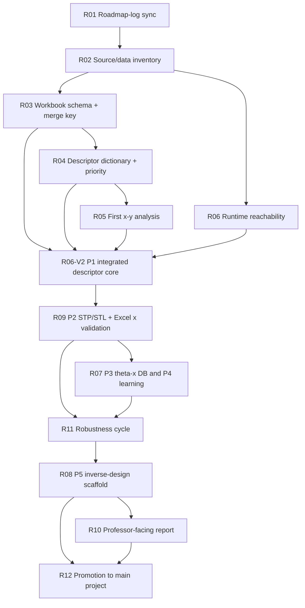

# URP4-1 Micro Roadmap

Audience: Chuck + AI  
Status: living document  
Last updated: 2026-07-27  
Linked log: `outputs/URP4-1_ROADMAP_LOG.md`  
Global changelog: `outputs/URP4-1_CHANGELOG.md`
Professor macro roadmap: `outputs/URP4-1_PROFESSOR_PROJECT_ROADMAP_20260629.md`

---

## CONTROL-TOWER CURRENT POINTER — SG020 resolves all 192 nonincident branches as unique micro-chains / 2026-07-27

```text
exact C0325 edges / full components                  2,604 / 36
target transition observations / branches            432 / 192
same-component unique paths                           432 / 432
shortest-path graph hops                         272 x 1 + 160 x 2
exact path length                              0.01160–0.01350 mm
independent QA                                                8/8
```

Immediate order:

```text
1. `STRICT-GEOM-021_C_UNIQUE_MICROCHAIN_CONTINUATION_GRAPH_CLOSURE_AUDIT_NO_Y`: combine 64 direct + 192 unique micro-chain continuations
2. replay candidate graph degree parity, components and cycle closure
3. fail closed before any raster eligibility decision
4. HOLD: locality threshold, B extrapolation, descriptors and y/modeling
```

All 192 branches rejected by SG019's 0.002/0.005 mm windows remain in the same exact-section component and have one unique one- or two-hop path. Their topological length is 232–1176 times their straight-line clearance, proving that Euclidean proximity is not a valid substitute for exact section topology. No larger threshold was selected.

Primary evidence:
`experiments/lab_001_xy_connection_20260626/results/SG020_L28/STRICT_GEOM_020_C_NONINCIDENT_CURVE_COMPONENT_AND_PATH_LENGTH_SPECTRUM_REPORT_20260727.md`

---

## CONTROL-TOWER CURRENT POINTER — SG019 solves curve identity and isolates 192 nonincident branches / 2026-07-27

```text
exact C0325 section edges                                  2,604
unique transition curves                              536 / 536
stable branch curve identities                        256 / 256
direct/window-stable ray continuations                 64 / 256
nonincident branches without <=0.005 mm path          192 / 256
independent QA                                                8/8
```

Immediate order:

```text
1. STRICT-GEOM-020: full-component connectivity for 192 nonincident curves
2. freeze unbounded shortest-path length, hops and multiplicity spectrum
3. separate nonlocal same-component paths from disconnected/near-miss cases
4. HOLD: threshold choice, raster, descriptors, B extrapolation, y/modeling
```

SG019 proves the polar transitions are exact native section curves, not angular sampling noise. Exact curve identity resolves all 64 face-ambiguous tracks, but 192 branches are stable nonincident curves outside both preregistered local windows. The next task measures their full connectivity spectrum without choosing a larger radius post hoc.

Primary evidence:
`experiments/lab_001_xy_connection_20260626/results/SG019_L28/STRICT_GEOM_019_C_EXACT_SECTION_CURVE_FACE_BOUNDARY_CONTINUATION_REPORT_20260727.md`

---

## CONTROL-TOWER CURRENT POINTER — SG018 resolves transitions but rejects face-only ray continuation / 2026-07-27

```text
problem populations                           560 = 256 / 96 / 208
refined transitions / bisection traces                  536 / 4,904
transition face lineage                               536 / 536
branch tracks                                                 256
unique / no / ambiguous ray matches                    0 / 192 / 64
independent QA                                                8/8
```

Immediate order:

```text
1. STRICT-GEOM-019: recover exact section-curve/face-boundary ancestry
2. order half-edges by local tangent and curve parameter at each node
3. test one-to-one curve continuation before another graph replay
4. HOLD: raster, descriptors, B extrapolation, route winner, y/modeling
```

SG018 proves that angular transitions themselves are reproducible and face-traceable, but face identity is too coarse: 192 tracks match no native ray and 64 match two or four rays. The next unit is the exact intersection-curve half-edge, not another angular sample or a face label.

Primary evidence:
`experiments/lab_001_xy_connection_20260626/results/SG018_L28/STRICT_GEOM_018_C_POLAR_TRANSITION_AND_FACE_BRANCH_REPORT_20260727.md`

---

## CONTROL-TOWER CURRENT POINTER — SG017 exposes moving polar boundary branches / 2026-07-27

```text
angular samples / boundary samples / face hits      30,240 / 4,082 / 6,314
SG016 midpoint exact replay                                    3,360 / 3,360
resolved target nodes / unresolved target nodes                    16 / 80
stable internal / external rays                                  176 / 32
angular unresolved / radius unstable                             128 / 144
candidate graph odd vertices                                           102
independent QA                                                        8/8
```

Immediate order:

```text
1. STRICT-GEOM-018: refine polar inside/outside transitions by angle
2. track each branch across radius using exact face/solid signatures
3. rebuild a branch-level, non-mutating graph and test closure
4. HOLD: raster, descriptors, B extrapolation, route winner, y/modeling
```

SG017 exactly reproduces SG016's midpoint calculations but proves that midpoint-clean rays are not fixed local boundaries. The next unit is a polar transition branch, not an original ray or one global radius.

Primary evidence:
`experiments/lab_001_xy_connection_20260626/results/SG017_L28/STRICT_GEOM_017_C_NODE_SECTOR_MULTIANGLE_AND_FACE_PARTITION_REPORT_20260727.md`

---

## CONTROL-TOWER CURRENT POINTER — SG016 finds boundary-coincident angular sectors / 2026-07-27

```text
odd nodes / incident rays / unique edges             120 / 480 / 360
clean 2-external+2-internal nodes                                 24
unresolved or radius-unstable rays                         224 + 64
provisional graph edges / odd vertices                    206 / 108
independent QA                                                  8/8
```

Immediate order:

```text
1. STRICT-GEOM-017: multi-angle interior sampling on the 96 unresolved nodes
2. map every ON ray to coincident source-face/solid partitions
3. derive atomic angular material sectors and replay the boundary graph
4. HOLD: raster, descriptors, B extrapolation, route winner, y/modeling
```

SG016 proves that a single midpoint ray can coincide with a real boundary. Another global-radius sweep cannot resolve angular occupancy.

Primary evidence:
`experiments/lab_001_xy_connection_20260626/results/SG016_L28/STRICT_GEOM_016_C_ODD_NODE_ENDPOINT_REFINEMENT_AND_EXACT_SEGMENT_LINEAGE_REPORT_20260727.md`

---

## CONTROL-TOWER CURRENT POINTER — SG015 finds 40 mixed-role edges tied to odd vertices / 2026-07-27

```text
SG014 unresolved edges / SG015 samples               646 / 5,814
uniform internal / mixed along edge                   606 / 40
mixed external endpoints at SG014 odd nodes            40 / 40
slice-0325 odd-node cohorts                       40 + 40 + 40
independent QA                                               8/8
```

Immediate order:

```text
1. STRICT-GEOM-016: refine all 120 odd-node incident sectors and endpoints
2. recover exact segment/source-owner lineage at 40 mixed transitions
3. build non-mutating segment candidates and replay topology
4. HOLD: raster, descriptors, B extrapolation, route winner, y/modeling
```

A native section edge is not guaranteed to have one material role along its full length. Whole-edge relabeling would erase the measured transitions.

Primary evidence:
`experiments/lab_001_xy_connection_20260626/results/SG015_L28/STRICT_GEOM_015_C_ALONG_EDGE_MULTIPOINT_AND_LOCAL_CLEARANCE_REPORT_20260727.md`

---

## CONTROL-TOWER CURRENT POINTER — SG014 full C classification finds local-scale transitions / 2026-07-27

```text
C edges / offset states                             5,208 / 41,664
robust internal / external                          4,104 / 458
offset instability / sensitivity mismatch             226 / 420
SG012 exact parity                                       512 / 512
slice 0174 / 0325 odd vertices                              0 / 120
independent QA                                                8/8
```

Immediate order:

```text
1. STRICT-GEOM-015: sample the 646 unresolved edges along their parametric length
2. measure local two-sided state-transition and clearance scales
3. preregister any adaptive rule before graph replay
4. HOLD: raster, descriptors, B extrapolation, route winner, y/modeling
```

No tested global epsilon (`1e-5` through `1e-2 mm`) closes both slices. The next problem is local and along-edge, not another post-hoc global threshold sweep.

Primary evidence:
`experiments/lab_001_xy_connection_20260626/results/SG014_L28/STRICT_GEOM_014_C_FULL_SECTION_EDGE_OWNER_UNION_BOUNDARY_CLASSIFICATION_REPORT_20260727.md`

---

## CONTROL-TOWER CURRENT POINTER — SG013 subset closure failed; full C classification required / 2026-07-26

```text
C source section edges                                  5,208
SG012-confirmed seams excluded                            512
odd vertices per slice                            128 -> 256
components per slice                               36 -> 52
independent QA                                           8/8
```

Immediate order:

```text
1. STRICT-GEOM-014: classify all 5,208 C section edges by solid-union occupancy
2. preserve lineage and offset-stability state for every edge
3. rebuild an external-boundary graph only after complete classification
4. HOLD: raster, descriptor replacement, B extrapolation, route winner, y/modeling
```

SG013 is a negative sufficiency test, not a reversal of SG012: the `512` local seam labels remain valid, but they are not the complete internal-seam population.

Primary evidence:
`experiments/lab_001_xy_connection_20260626/results/SG013_L28/STRICT_GEOM_013_C_SOLID_UNION_SEAM_EXCLUSION_GRAPH_CLOSURE_REPORT_20260726.md`

---

## CONTROL-TOWER CURRENT POINTER — SG012 confirms C internal union seams / 2026-07-26

```text
affected edges / offset observations                  1,168 / 9,344
C internal union seams                                    512 / 512
C cross-solid opposing face pairs                         256 / 256
B volume-incomplete edges                                 656 / 656
independent QA                                                 8/8
```

Immediate order:

```text
1. STRICT-GEOM-013: remove only C confirmed seams in an isolated graph view
2. recompute odd degrees, components and cycle closure; no raster
3. retain B as unresolved until a complete volume source exists
4. HOLD: canonical raster, descriptor replacement, route winner, y/modeling
```

Primary evidence:
`experiments/lab_001_xy_connection_20260626/results/SG012_L28/STRICT_GEOM_012_COINCIDENT_FACEWISE_SECTION_MULTIMAP_AND_OWNER_PARITY_REPORT_20260726.md`

---

## CONTROL-TOWER CURRENT POINTER — SG011 confirms coincident-face ancestor reattribution / 2026-07-26

```text
SG010 neighbor relations / unique faces                 624 / 496
individual section and exact-node continuation          496 / 624
compound exact tangent replay                                624
same ancestor / reattributed ancestor                     0 / 624
separate B325 free-edge cohort                                 16
independent QA                                               8/8
```

Immediate order:

```text
1. STRICT-GEOM-012: build coincident facewise-section -> compound-edge multimap
2. inspect shell/solid/orientation owner parity without rasterization
3. keep the 16 free-edge cases separate
4. HOLD: raster, descriptor replacement, route winner, y/modeling
```

Primary evidence:
`experiments/lab_001_xy_connection_20260626/results/SG011_L28/STRICT_GEOM_011_LOCAL_NEIGHBOR_FACE_SECTION_CONTINUATION_AND_COMPOUND_REPLAY_REPORT_20260726.md`

---

## CONTROL-TOWER CURRENT POINTER — professor redirects priority to descriptor discovery / 2026-07-22

```text
current-bank evidence                  XREG 431 + T3I 42 + T3O 22
literature/official sources                                  12
candidate groups                                             14
first implementation groups                                   5
producer / independent / protected QA        12/12 / 18/18 / 29/29
performance-y / fit / selection / promotion          0 / 0 / 0 / 0
```

Immediate order:

```text
1. PREREGISTER: PRM-076 L1 formula/unit/phase/axis/synthetic-truth contract
2. IMPLEMENT PANEL: chord, 3D S2, lineal path, fabric tensor, voxel Euler
3. CENSUS Y-BLIND: coverage, uniqueness, redundancy, T8/T9 and convergence
4. SECOND LANE: skeleton graph and 3D local thickness/bottleneck
5. WAIT IMMUTABLY: new compression/model packet before renewed feature selection
6. HOLD: GNN, broad method sweep, feature promotion and inverse-design claims
```

Primary evidence:
`experiments/lab_001_xy_connection_20260626/results/R09-20260722-PRM075_LITERATURE_GUIDED_DESCRIPTOR_DISCOVERY_AND_PRIORITY.md`

---

## CONTROL-TOWER CURRENT POINTER — PRM-069 SLICE-005 return technically frozen / 2026-07-22

```text
new cells / frozen baselines                      32/32 / 8/8
raw table hashes                                      160/160
aggregate matrix                     40 cells × 9 = 360 rows
return ZIP SHA-256 / CRC                          PASS / PASS
producer / archive readback QA                  24/24 / 12/12
raw mutation / y / fit / prediction              0 / 0 / 0 / 0
scientific convergence                                  pending
```

Immediate order:

```text
1. STRICT: SLICE005-CONVERGENCE-CONTROL-REVIEW (y-blind)
2. PARALLEL: FS4-P1-RUN-BOUNDED-4METHOD under PRM-068 permit
3. NB-DEV: STL Import True/False branch now unblocked in development copy
4. WAIT: DATA-INCOMING-COMP-001 from professor/doctor
5. HOLD: formula promotion, historical parity, winner and inverse-design claims
```

Primary evidence:
`experiments/lab_001_xy_connection_20260626/results/R09-20260722-PRM069_SLICE005_RETURN_INTAKE_AUDIT.md`

---

## CONTROL-TOWER CURRENT POINTER — PRM-068 AUTH2 GO; bounded P1 run is next / 2026-07-22

```text
SLICE-005 cells / table hashes             32/32 / 160/160
active compute / paused wrappers                    0 / 3
AUTH2 gates / permit loader                       16/16 / PASS
permit                                           created
prospective fit envelope                    1,535 / 4,000
PRM-068 y read / fit / prediction                 0 / 0 / 0
```

Immediate order:

```text
1. EXECUTE: FS4-P1-RUN-BOUNDED-4METHOD with the exact permit file/hash
2. REVIEW: grouped outer-fold predictions, null comparison, family risks and failures
3. INTAKE: SLICE-005 returned artifacts into an immutable local audit packet
4. CONTINUE: NB STL Import branch only after returned run identity is frozen
5. HOLD: P2/P3, recipe expansion, winner/promotion, inverse-design claims
```

Primary evidence:
`experiments/lab_001_xy_connection_20260626/results/R09-20260722-PRM068_FS4_P1_AUTH2_GO_REVIEW.md`

---

## CONTROL-TOWER CURRENT POINTER — PRM-053 FAST x-only census merged; STRICT still 0/32 / 2026-07-21

PRM-052 failed closed before generating values because one candidate ID was duplicated. PRM-053 repaired the identity without renaming or double-counting it.

```text
existing / new / combined candidates       240 / 152 / 392
new sensitivity / hold / rejected           95 / 51 / 6
new model-candidate values                         8,816
T8/T9 existing -> new-only -> combined      0.075799 -> 0.676258 -> 0.455142
T8/T9 combined rank                         2 / 1653, bottom 1%
execution / independent QA                  12/12 / 12/12
y / fit / promotion / tournament            0 / 0 / 0 / 0
STRICT LabPC cells                          0 / 32
```

Immediate order:

```text
1. STRICT: Chuck runs canonical Drive R1 CMD 00 -> 04 on LabPC
2. CONTROL: audit returned ZIP before any convergence decision
3. FAST: resolve PRM-054 pending leakage-safe nested-selection decisions
4. FREEZE: separate live-hash contract before one bounded grouped-GM replay
5. HOLD: active roster, broad model sweep, theta/ID shortcut, inverse, tournament
```

Primary evidence:
`experiments/lab_001_xy_connection_20260626/results/R09-20260721-PRM053_INDEPENDENT_CONTROL_REVIEW.md`

## CONTROL-TOWER CURRENT POINTER — LabPC USB factory prepared; copy and execution pending / 2026-07-21

`PRM-050` now packages the 32 pending convergence cells behind a LabPC live-doctor gate. No scientific cell has been executed under this contract.

```text
package / immutable hashes          167 MiB / 160 of 160
source STL / frozen baseline                   8 / 8
pending / executed cells                      32 / 0
doctor / package QA                      15/15 / 24/24
protected assets                               29/29
USB drive detected                                no
```

Immediate order:

```text
1. CONNECT: removable USB drive
2. COPY: outputs/URP4-1_R09_SLICE005_LABPC_FACTORY_USB_20260721
3. LABPC: run 00 doctor -> 01 install -> 02 run/resume -> 03 verify -> 04 collect
4. RETURN: ZIP + SHA manifest to the control tower
5. CONTROL: independent 32-cell replay/QA and frozen convergence gates
6. HOLD: resolution selection before returned evidence, Excel/y tuning, modeling, inverse
```

Primary evidence:
`experiments/lab_001_xy_connection_20260626/results/R09-20260721-SLICE-005_LABPC_USB_FACTORY_PREPARATION.md`

## CONTROL-TOWER CURRENT POINTER — B3 STREAMING canary passed; full factory still locked / 2026-07-21

Only `B3-COARSE-E/F` are accepted under `PRM-049`. The canary establishes deterministic execution and resource readiness, not scientific convergence.

```text
table SHA / scalar parity                         5/5 / 9/9
independent scalar replay                         18 rows / 1.11e-16
runtime E / F                                     65.556 / 65.225 s
peak RSS / output each                            0.2324 GiB / 17.340 MiB
PNG save-read-delete                              1601/1601 each
execution / independent / control QA              16/16 / 20/20 / 28/28
negative / visual / protected QA                  5/5 / 1/1 / 29/29
32 pending cells executed                         0
```

Immediate order:

```text
1. PRESERVE: PRM-047~049, accepted E/F and quarantined A/C lineage
2. FREEZE: a separate LabPC live-hash execution contract for 32 cells
3. EXECUTE: one model per process with checkpoint/resume and STREAMING cleanup
4. REVIEW: F001-F006 frozen convergence gates; F007-F008 sensitivity only
5. HOLD: formula/source changes, Excel/y tuning, promotion, inverse, tournament
```

Primary evidence:
`experiments/lab_001_xy_connection_20260626/results/R09-20260721-SLICE-005_B3_COARSE_DUPLICATE_CANARY_CONTROL_REVIEW.md`

## CONTROL-TOWER CURRENT POINTER — T3P mesh-native grouped-GM route rejected / 2026-07-21

PRM-042 was executed once under separately frozen PRM-043. The negative result is numerically reproduced and cannot be repaired by post-hoc threshold changes.

```text
rows / candidates / outer / inner folds             54 / 8 / 5 / 20
fits / ceiling                                             586 / 670
NONE folds / candidate-selected folds                         4 / 1
selected branch                   L / inertia_fraction_mid / OLS
pooled R2 / RMSE / Spearman        -21.589162 / 576.091420 / -0.006780
L selected / mean-null RMSE                 931.244581 / 114.632446
required gates                                               0 / 8
independent max prediction delta                           4.55e-13
execution / independent / control QA            12/12 / 12/12 / 21/21
```

Immediate order:

```text
1. PRESERVE: PRM-042/043, 54 OOF predictions and 0/8 negative result
2. NO-FIT DIAGNOSIS: support/range mismatch and family-transfer anatomy
3. STRICT PARALLEL: image/pixel/component traceability and configuration parity
4. NEW CONTRACT ONLY: any safety gate, representation or adaptive model change
5. HOLD: retuning, feature promotion, theta/identity shortcut, inverse, tournament
```

Primary evidence:
`experiments/lab_001_xy_connection_20260626/results/R09-20260721-T3P_CONTROL_TOWER_REVIEW_AND_NEGATIVE_MERGE.md`

---

## CONTROL-TOWER CURRENT POINTER — T3N explains the Lane K failure without another fit / 2026-07-21

The frozen T3MK artifacts were anatomized under PRM-039. The result confirms selection/generalization instability for the tested candidate pool and sample sizes, while preserving the original 1/8 failure and all scientific locks.

```text
rows / outer folds / candidate-branch cells          47 / 15 / 1800
fits / refits / new predictions                           0 / 0 / 0
inner-positive but outer-negative folds                         60%
families worse than mean null                                  3/3
selection entropy / maximum candidate share             0.960 / 20%
median top-2 margin / passing cells                      3.741% / 15
median outer/inner RMSE ratio                                1.488
rho(inner gain, outer gain)                                -0.321
top-five model SSE share                                   50.407%
diagnostic gates / independent metric parity       10/10 / 1.11e-16
```

Immediate order:

```text
1. PRESERVE: PRM-038 negative result and PRM-039 no-fit anatomy
2. STRICT-L7-002: historical L7 geometry/configuration/crosswalk audit, no fit
3. TRACE: distinguish current LEGACY-PY parity from historical Excel source identity
4. DECIDE: resolvable source/config mismatch vs historical provenance ceiling
5. HOLD: new model, row deletion, feature promotion, identity/theta X, inverse, tournament
```

Primary evidence:
`experiments/lab_001_xy_connection_20260626/results/R09-20260721-T3N_CONTROL_TOWER_REVIEW.md`

---

## PRIOR CONTROL-TOWER POINTER — T3M Lane K failed known-family interpolation / 2026-07-21

PRM-038 was executed once without changing its candidates, folds, thresholds or rows. The run is technically valid and independently reproduced, but its known-family route is scientifically rejected under all-required KG01–KG08.

```text
Lane K rows / families                               47 / C,L,T
outer / inner folds                                      15 / 50
fits / ceiling                                         5552 / 6080
OOF R2 / RMSE / Spearman          -0.416715 / 145.653856 / -0.019776
mean-null / frozen-G improvement                 -13.831% / -21.636%
families improved / required gates                       0/3 / 1/8
execution / independent / control / visual QA  10/10 / 10/10 / 20/20 / 3/3
protected / maximum reproduction error              29/29 / 1.14e-13
```

Immediate order:

```text
1. PRESERVE: valid negative PRM-038 execution and all 47 OOF predictions
2. NO-FIT ANATOMY: explain inner-selection/outer-generalization failure without refitting
3. STRICT PRIORITY: historical Excel/LEGACY-PY/image/configuration parity and slice-setting optimization
4. DECIDE AFTER EVIDENCE: representation revision vs more data vs new preregistered model
5. HOLD: gate retuning, candidate promotion, family/theta identity as X, inverse design, actual tournament
```

Primary evidence:
`experiments/lab_001_xy_connection_20260626/results/R09-20260721-T3M_LANE_K_CONTROL_TOWER_REVIEW.md`

---

## PRIOR CONTROL-TOWER POINTER — T3M separates known-family interpolation from unseen-family generalization / 2026-07-21

The next modeling question is now hash-frozen without reading target magnitudes or fitting. T3M prevents a family label shortcut by treating family/domain only as split, routing and reporting metadata.

```text
Lane K primary rows / families                      47 / C,L,T
Lane K outer / inner folds                              15 / 50
Lane G role                              frozen T3JX LOFO reference
B / F roles                              low-n hold / descriptive
candidates / representation families                    30 / 4
minimum fold candidates / families                      25 / 4
future fit ceiling                                         6080
main / independent / control / visual QA   24/24 / 31/31 / 23/23 / 1/1
y reads / fits / predictions / promotions               0 / 0 / 0 / 0
```

Immediate order:

```text
1. PRESERVE: PRM-038 two-estimand contract, 47-row Lane K and frozen Lane G anchor
2. REVALIDATE: contract/input/protected hashes before execution
3. EXECUTE ONCE: `T3M_LANE_K_BOUNDED_EXECUTION_SEPARATE_AUTHORIZATION`
4. REPORT SEPARATELY: Lane K known-family results vs frozen Lane G unseen-family reference
5. PARALLEL STRICT: historical Excel/LEGACY-PY/image/configuration parity
6. HOLD: family ID as X, B/F primary claims, L/L10 deletion, promotion, inverse, tournament
```

Primary evidence:
`experiments/lab_001_xy_connection_20260626/results/R09-20260721-T3M_CONTROL_TOWER_REVIEW.md`

---

## PRIOR CONTROL-TOWER POINTER — T3L finds broad L direction heterogeneity, not an L10 source break / 2026-07-20

The frozen 30-candidate representation has been audited across all exact54 families without fitting. The result rules out a simple L10 asset repair and redirects the next experiment toward explicit domain-conditional evaluation.

```text
candidates / L rows                                  30 / 20
L-opposite / jackknife-robust candidates               9 / 6
representation families carrying reversal                  4
same non-neutral B/C/L/T direction candidates          0 / 30
L10 X extremes / frozen breadth gate                   3 / 6
L10 source audit / source-QC extremes               13/13 / 0
L10 target robust z / frozen threshold             -2.311 / 3.5
fits / refits / deletions / promotions                 0 / 0 / 0 / 0
```

Immediate order:

```text
1. PRESERVE: PRM-037 all-30 signs, L10 source/hash/GM42 and negative gates
2. PREREGISTER NO-FIT: `T3M_L_DOMAIN_CONDITIONAL_REPLAY_PREREGISTRATION_NO_FIT`
3. SEPARATE: Lane K known-family interpolation vs Lane G unseen-family stress test
4. FREEZE: routing metadata, nested selection, nulls, F n=2 policy, fit ceiling
5. PARALLEL STRICT: historical Excel/LEGACY-PY/image/configuration parity
6. HOLD: family ID as unrestricted X, L/L10 deletion, promotion, inverse, tournament
```

Primary evidence:
`experiments/lab_001_xy_connection_20260626/results/R09-20260720-T3L_CONTROL_TOWER_REVIEW.md`

---

## PRIOR CONTROL-TOWER POINTER — T3K localizes ordering failure in L / 2026-07-20

The frozen T3JX OOF has been decomposed without fitting, refitting or retuning. The original 7/8 failure remains unchanged.

```text
rows / unordered pairs                              54 / 1431
global Spearman / gate                         0.161426 / 0.20
within / cross-family inversion                 0.5027 / 0.4260
L Spearman / remove-L descriptive Spearman     -0.1774 / 0.3448
L10 inversions / total-SSE share                 49/53 / 15.41%
T8/T9 predicted/actual gap ratio                         0.0527
fits / refits / retuning / promotions                    0 / 0 / 0 / 0
```

Immediate order:

```text
1. PRESERVE: T3JX failure state and T3K 54-row/1,431-pair anatomy
2. NO-FIT `T3L_L_FAMILY_SIGN_STABILITY_AND_SOURCE_FORENSIC_NO_FIT`: test all 30 T3I candidates
3. STRICT-LINK: audit L10 and L-family source/crosswalk/configuration lineage
4. DECIDE: representation-domain problem vs source-row problem vs mixed
5. HOLD: L/L10 deletion, threshold retuning, new fit, promotion, theta/ID, inverse, tournament
```

Primary evidence:
`experiments/lab_001_xy_connection_20260626/results/R09-20260720-T3K_CONTROL_TOWER_REVIEW.md`

---

## PRIOR CONTROL-TOWER POINTER — T3JX replay improves RMSE but fails frozen rank gate / 2026-07-20

The representation-only FAST replay is complete and independently reproduced. It is promising sensitivity evidence, but not a preregistered pass.

```text
fits / ceiling                                  2350 / 2430
OOF R2 / RMSE                         0.081452 / 116.169545
null / T3D improvement                    5.559% / 17.553%
selected identity stability                           5 / 5
required gates / failure                    7 / 8 / SG07
Spearman / threshold                         0.161426 / 0.20
promotion / inverse / tournament                    0 / 0 / 0
```

Immediate order:

```text
1. PRESERVE: T3JX 2,350-fit, OOF, gate and independent-replay artifacts
2. NO-FIT: T3K ordering/generalization failure anatomy
3. DIAGNOSE: rank inversions, L degradation, F n=2 leverage, T8/T9 compression
4. PARALLEL STRICT: historical Excel/source/configuration/crosswalk parity
5. HOLD: threshold retuning, promotion, GM E2, theta/identity, inverse design, tournament
```

Primary evidence:
`experiments/lab_001_xy_connection_20260626/results/R09-20260720-T3JX_CONTROL_TOWER_REVIEW.md`

---

## 0. One-line mission

이 문서는 박사님 프로젝트 로드맵을 실제 코드·파일·검증 작업으로 쪼개는 마이크로 실행계획이다.

```text
P1 integrated descriptor implementation                         [completed]
→ P2 external STP/STL import + Excel descriptor validation      [active]
→ P3 new-model generation + theta-x database
→ P4 theta-x AI learning
→ P5 connect professor x-y asset + inverse design
```

2026-07-01 superseding clarification: the current critical path is **R09/P2**, not professor handoff alone. The frozen candidate remains the descriptor core, while external reference import and Excel reproduction are tested in a new candidate/versioned validation lane.

2026-07-01 PM professor clarification: the immediate comparison is not strict byte/exact equality. Use `x = current parameters`, `y = Excel parameters`, keep the same variable order, plot/check `y=x` and `y=a*x`, and separately list standout/outlier values. Slice settings should be taken from `파라미터 추출법_0724.pptx`; INP nodes are not currently available, so the working reference path uses the staged STL/STP files.

현재 최우선 과업은 **P2/R09: 외부 STP/STL을 추적 가능하게 불러오고, legacy preprocessing/legacy formula lineage 조건을 복원하여 같은 model ID의 Excel 구조인자를 재현하는 것**이다.

### 0.1 2026-07-15 versioned-cycle and descriptor-schema freeze

현재 실행 순서는 “모든 구조인자를 완벽히 확정한 뒤 이동”에서 아래 반복 cycle로 바뀐다.

```text
theta -> geometry -> image/pixel -> x -> grouped x-y -> inverse candidate
-> forward verification -> next version
```

- 과학적 상태와 모델링 사용 상태를 별도 열로 관리한다.
- Excel parity와 predictive utility를 별도 gate로 둔다.
- F001-F006=`confirmed_core`, F007/F008=`provisional_extended`, F009-F012=`hold_excluded`인 `DESCRIPTOR-SCHEMA-v0.1`을 동결한다.
- T8/T9 collision은 후속 descriptor 설계의 우선 표적이지만 전체 cycle을 막지 않는다.
- Excel 열 문자는 workbook마다 의미가 다르므로 반드시 source alias를 붙인다.
- `R09-RESLICE-003` all-58 F001-F008 factory는 58/58 실행·finalize·독립 hash replay를 통과했다. 모델별 실패 격리·PNG readback=0 hard gate·table/hash freeze 후 임시 PNG 삭제 계약이 전 family에서 확인됐다.
- `FACTORY-PREP-001`은 RUN-139 상태와 토너먼트 용어를 동기화하고 `TOUR-C001` Data/Analysis Factory skeleton을 준비했다. 이 preparation pass는 DATASET/x-x 실행 또는 roster 결정을 뜻하지 않는다.

다음 순서:

```text
R09-RESLICE-003 58-model extraction                         [completed]
-> FACTORY-PREP-001 steering/skeleton                       [completed]
-> PRM-028 generator intake + modular/DLP contracts          [active]
-> professor periodic-x metadata/data intake                [waiting external]
-> matched descriptor differential validation
-> DLP theta-geometry-x dataset freeze
-> grouped theta-x learning
-> domain-aware x-y refinement
-> theta-x-y integration and forward verification
```

STRICT lane에서는 F008 full-family parity, F007 별도 utility, F009-F012 공식/population, Point INP/STL population, Surface DDG mesh/source를 병렬 추적한다.

All-58 result boundary:

- technical artifact pipeline: confirmed pass, 58/58;
- F008 MassOri IP avg: likely overall, median relative difference 0.2561%, but L7/row36 21.4813% unresolved outlier;
- F007 historical Thickness identity: rejected; separate utility identity retained;
- T8/T9: nine-row representation near-collision confirmed;
- T5/T6/T10/T16: x-only until one-to-one y is verified.
- Master Ledger v0.1: synchronization-required draft; 58 pending run slots와 22-model/198-row materialized descriptor snapshot이 섞여 있으므로 덮어쓰지 않는다.
- Main League는 Historical Parity/Predictive Utility, Auxiliary Tournament는 Configuration/Fidelity/Theta, Division은 ALL/BCL/F/T/domain-specific이다. Specialist는 league가 아니다.
- `TOUR-C001`의 primary roster, Z/AI/AY/AQ 결합, redundancy/near-collision threshold, starter/challenger 수, composite weights, active roster는 pending decision이다.

### 0.2 PRM-028 seven-lane parallel roadmap — 2026-07-16

The tournament route is retained but no longer treated as the only immediate lane.

| Lane | Purpose | Current state | Next gate |
|---|---|---|---|
| `DESC-ACCURACY` | formula/population/engineering meaning/discrimination | RUN-139 technical pass; canonical set incomplete | source-scoped player and validation-panel freeze |
| `DESC-DIFF` | ARTIFACT-FULL vs STREAMING and SLICE vs DIRECT | contract/matrix drafted | matched geometry/config preregistration |
| `GEN-MODULAR` | Lattice/TPMS/Voxel plugin contract | two notebooks ingested and statically audited | resolve TPMS VF/count/thickness/open-cell policy |
| `DLP-INTAKE` | periodic ~190 + aperiodic ~150 VF30/45/60 intake | schema/input packet ready | professor release and metadata |
| `THETA-X` | paired theta-geometry-x learning | blocked | immutable DLP dataset + base-geometry grouped split |
| `X-Y-REFINE` | legacy metal x-y refinement and DLP domain policy | existing evidence retained | domain-aware preregistration; no blind pooling |
| `TOURNAMENT-DESIGN` | factory/roster/threshold/HQ design | side-fork packet `ready_for_merge` but non-authoritative | separate control-tower merge review |

Immediate boundaries:

- `GEN-LATTICE-TYPEAB-20260716` and `GEN-TPMS-MULTIWALL-VF50-20260716` stay immutable and unexecuted.
- `NB-CURRENT` is not patched; future role is orchestrator over plugins.
- Type A+B COM/SOUND printing slices are not RUN-139 descriptor slices.
- metal and DLP y rows remain separate until material/process/test policy is approved.
- DLP 340 generation/training, DATASET-v0.1, x-x, team tournament and roster decisions remain unexecuted.
- `tournament-factory-hq` and its prototype/site files remain untouched.

### 0.3 CODE-MAP-001 modular code integration roadmap — 2026-07-16

The 138-file inventory and 30-asset curated registry replace the ambiguous idea of copying every old/new code file into one notebook.

```text
immutable professor/TA source
├─ LEGACY-PY -> reference adapters + golden tests
├─ Training 1st~5th -> output-specific method plugins
├─ Lattice/TPMS/Voxel -> generator plugins
└─ NB-ORIG -> lineage/archive

versioned implementation
├─ R09/RUN-139 -> descriptor service after frozen-output replay
├─ semantic training service + grouped evaluator
└─ thin orchestrator notebook v0.3
```

| Phase | Purpose | State | Gate |
|---|---|---|---|
| `CINT-00` | code asset freeze/classification | completed | 138-file manifest + 30-asset disposition |
| `CINT-01` | common interfaces and source-scoped identities | completed | `URP4-CONTRACT-v0.1`; 24/24 tests; 28/28 protected assets/site states unchanged |
| `CINT-02` | LEGACY adapters and golden fixtures | completed | 6 authorities + 7-model slice panel; 56/56 replay/guard checks |
| `CINT-03` | descriptor service modularization | completed | 174/174 primitive hashes; 522/522 frozen regression; B3 STREAMING parity 4/4 |
| `CINT-04` | Lattice Type A+B plugin | conditional pass | Type-A graph/STL source parity passed; Type-B/STEP/printability remain explicit external gates |
| `CINT-05` | TPMS Multiwall plugin | conditional pass | 98-row registry and fixed fixture source parity passed; production VF/count/thickness/open-cell/mesh policy remains open |
| `CINT-06` | Voxel plugin | conditional pass | 3-source core identity, 300-row registry and fixed fixture passed; production size/grid/VF/boundary/thickness/export policy open |
| `CINT-07` | DLP theta-geometry-x freeze | local contract pass; external release open | 56-control registry + 60 probes + fail-closed join passed; official x rows remain 0 pending five external gates |
| `CINT-08` | Training engine modularization | next | output-specific grouped evaluation engine/parity without fitting a model |
| `CINT-09` | thin orchestrator notebook v0.3 | pending | versioned end-to-end smoke without overwriting v0.2 |
| `CINT-10` | inverse design + forward verification | pending | y* candidate survives the same forward pipeline |

External decisions that do not block completed CINT-01 or next CINT-02 but block later promotion:

- final packaging: one physical notebook or thin notebook + modules;
- NB-CURRENT v0.2 is user-confirmed as professor-approved; preserve it and build later v0.3 separately;
- TPMS production VF/count/thickness/open-cell contract;
- Voxel production size/grid/VF/boundary/thickness/export policy;
- Lattice Type-B `Variables.xlsx` provenance;
- Training 5th-FIXED single authority versus output-specific method comparison.

The original control-tower session owns integration/source authority. The separated tournament/dashboard session may consume only frozen promoted IDs; it must not silently promote code or scientific status.

### 0.4 CINT-07 theta activity and DLP join boundary — 2026-07-19

```text
THETA-ACTIVITY-REGISTRY-v0.1: 56 source-scoped controls
prior parameter_json registry: 242 rows, separate population
OFAT probes: 60 = 42 changed + 17 unchanged + 1 quarantined
THETA-GEOMETRY-X-v0.1: local fail-closed join contract
geometry-only fixtures: 3, all x_count=0
official DLP theta_geometry_x rows: 0
```

Changed fixtures support parameter activity but do not prove universal causal
importance. Unchanged fixtures remain unresolved unless an explicit source
metadata/skip branch also proves inactivity. Seed is realization identity and
predictor-excluded. Numerical/repair/scale controls are not silently pooled with
scientific theta.

VF30/45/60 siblings must share `base_geometry_id` and
`vf_sibling_group_id`, carry unique target VF/geometry hashes, and remain in one
evaluation fold. Any descriptor must point to the exact GeometryArtifact ID and
byte hash; any y-bearing row must identify material, process and test domain.

Local CINT-08 code modularization can proceed. Official theta-x learning remains
blocked until `CHUCK-DLP-X-001` closes the five external release gates.

2026-07-01 B3 one-model forensic update: B3 mismatch is no longer treated as primarily a heavy-compute/resolution problem. Legacy-v2 formula replay strongly improved `Thickness` and `Perimeter-to-area` against Excel, so the immediate P2 task is now family-by-family formula-lineage classification before any research-lab-PC full-resolution run.

2026-07-01 B3 formula-variant sweep update: quick z/x sweeps confirmed the same leading candidates for B3 `Thickness` and `Perimeter-to-area`, while `Angle`, `Curvature`, and `Mass orientation` remain unresolved. The next step is a narrow unresolved-family B3 sweep, not a full lab-PC run.

2026-07-01 B3 survivor update: full-resolution survivor sweeps produced strong B3 candidates for `Angle` and `Curvature`; `Mass orientation` remains unresolved. Use cheap pre-screening before full-resolution survivor validation for future formula forensics.

2026-07-02 PPTX textification update: Chuck completed a manual page-by-page review of `파라미터 추출법_0724.pptx`. Use `outputs/manual_textification_templates/01_PPTX_PAGE_BY_PAGE_AI_DRAFT_파라미터_추출법_0724.md` as the working parameter/slice reference from now on; the original PPTX is a visual fallback. The next R09 step is `R09-20260702-007E`: build the reviewed-PPTX-rule to legacy/current-code crosswalk, isolate B3 `Mass orientation` aggregation/stdev mismatch, then test the provisional B3 formula map on representative C/L/F/T models.

2026-07-02 professor follow-up update: Chuck confirmed that normalized surface area used STL-measured surface area, but the professor said the value is not fully accurate and needs improvement. Chuck also confirmed that slice-based descriptors were generated in Ntop, while the project goal is to reproduce them one-step in Python. Therefore R09/P2 is split into `R09-SURF` and `R09-SLICE`; do not force all descriptors into one 30 mm or 40 mm scale.

2026-07-02 B3 MassOri update: B3 MassOri is no longer treated as a generic formula mismatch. Targeted tests showed a strong slice-spacing trend: `81 slices -> 161 slices -> 801 slices` moves MassOri averages toward Excel. The best current candidate is `1000 px × 801 slices`, `xyz`, connected components on `Red ∪ Blue ∪ Purple`, and denominator-weighted aggregation (`weight = 0.5×Red + 0.5×Blue + Purple`). This candidate has median abs diff `0.002183` across the six MassOri rows and `y=a*x` slope `0.997317`, but IP-stdev remains unresolved. Strategy decision: adopt this as `MassOri v0.2 working candidate`, continue representative-family validation, and keep `MassOri_IP_stdev` as `unresolved / low-confidence` instead of blocking all MassOri progress.

2026-07-02 forensic factory update: R09 now has a laptop-validated production line for Friday lab-PC execution. New factory stages are `legion_smoke`, `representative_low`, `lab_pc_massori_801`, `lab_pc_massori_axis_audit`, and `lab_pc_probe_ppt_layer_z`. Laptop validation passed: doctor `PASS`, smoke `3/3 success`, representative low `4/4 success`. The recommended Friday order is: run doctor, optionally run representative low on the lab PC if the copied workspace is untested, then run `lab_pc_massori_801` for `B3/C1/F1/L1` at `1000px x 801 slices`, `xyz`, weighted MassOri v0.2. Runbook: `experiments/lab_001_xy_connection_20260626/results/R09_FORENSIC_FACTORY_RUNBOOK_20260702.md`.

R07/R08의 생성·역설계 탐색 결과는 삭제하지 않지만, P1 통과 전에는 P2/P5 성공 근거로 사용하지 않는다.

---

## 1. Operating philosophy

### 1.1 Professor gate first

2026-06-29 박사님 설명에 따라 전체 프로젝트는 5개 macro gate를 순서대로 통과한다.

현재 micro-roadmap의 critical path:

```text
validated legacy reference freeze
→ legacy-to-notebook module map
→ same-input formula/schema/numerical parity
→ integration/fallback/repeatability validation
→ P1 acceptance
```

빠른 탐색은 허용하지만, 현재 macro gate보다 뒤 단계의 결과를 성공으로 승격하지 않는다.

### 1.2 Roadmap and log must stay synchronized

이 로드맵은 “해야 할 일의 지도”이고, `URP4-1_ROADMAP_LOG.md`는 “실제로 한 일의 증거 장부”다.

모든 작업은 다음 ID 체계를 따른다.

```text
Roadmap task: R01, R02, R03, ...
Task log: R01-YYYYMMDD-001, R01-YYYYMMDD-002, ...
```

예:

```text
R05-20260626-001
```

뜻:

```text
Roadmap R05 과업에 대해 2026-06-26에 수행한 첫 번째 작업 로그
```

### 1.3 Score honestly

각 과업은 100점 만점으로 평가한다.

| 점수 | 판정 | 의미 |
|---:|---|---|
| 90-100 | strong pass | 재현 가능하고, 설명 가능하고, 다음 과업의 입력으로 써도 안전 |
| 80-89 | pass | 사용 가능하지만 작은 보완점이 있음 |
| 60-79 | weak pass | 결과는 있으나 불안정하거나 검증 부족 |
| 40-59 | incomplete | 일부 작업만 됨. 다음 과업 입력으로 쓰기 위험 |
| 0-39 | fail / not started | 아직 결과로 인정 불가 |

통과 기준:

```text
score >= 80
and no critical risk
and output files are traceable
```

---

## 2. Current project state

### 2.1 Evidence sources

이 로드맵은 아래 파일들을 근거로 작성했다.

| Evidence | Path | Used for |
|---|---|---|
| AI entrypoint | `AI_START_HERE.md` | 현재 목표, active lab, read policy |
| Lab manifest | `experiments/lab_001_xy_connection_20260626/lab_manifest.md` | x-y 연결 실험 목표와 성공 기준 |
| Input/output map | `outputs/input&output.md` | 실제 코드 용어, 입출력 흐름 |
| Micro strategy | `outputs/URP4-1_역설계_마이크로전략_20260625.md` | 박사님 피드백 이후 연구 방향 |
| Research guide | `outputs/URP4-1_연구가이드_역설계실험기록방법론_20260625.md` | 실험 기록, 변수 관리, 검증 방법론 |
| File roles | `outputs/workspace_file_roles.md` | AI/human 파일 역할 분리 |
| Professor macro roadmap | `outputs/URP4-1_PROFESSOR_PROJECT_ROADMAP_20260629.md` | 박사님 5단계 의도, gate, 질문 |

### 2.2 Active lab

현재 실험은 원본을 직접 건드리지 않고 아래 disposable lab에서 진행한다.

```text
experiments/lab_001_xy_connection_20260626/
```

핵심 원칙:

```text
original files stay preserved
trial-and-error happens inside lab
successful outputs may be promoted later
```

### 2.3 Reference Excel, model naming, and existing x-y asset

Professor-side updates received through Chuck through 2026-07-01:

```text
The Excel workbook contains actual experimental values and structural descriptors and should be used as reference.
The supplied 56+(2) figure is the model-family naming authority.
Only STP and STL geometry files are in scope; INP is excluded.
The immediate relation is theta -> x. An x-y connection already exists for the later stage.
```

Roadmap implication:

- Use matched Excel structural descriptors as the P2 validation target for current-version descriptor results.
- Do not locate or rebuild the x-y pipeline during P2. The professor will provide the existing x-y asset for the downstream stage.
- Existing R03-R05 analysis remains exploratory lineage work, not the current critical path.
- P1 integration is complete; P2 focuses on STP/STL import, model-ID matching, and Excel descriptor reproduction.
- Preserve traceable IDs across `candidate_id`, `structure_id`, experimental `sample_id`, and the professor's existing x-y asset.
- Treat `generated_stl` and `imported_stl` as different source types. Generated STL is controlled NB-CURRENT output and retains its existing slicer route. Imported STL is external experimental-y geometry and must use a dedicated preflight/robust-slicing development route.
- Read STP directly as CAD B-rep and preserve it as the paired imported-STL validation reference. Do not use facet-only STL-to-STP conversion as the normal import solution; it cannot recover absent solid/topology information.
- The imported-STL route must trace mesh QA, triangle-plane intersection, segment/contour closure, outer/hole/material classification, connected-component preservation and pixel rasterization. Validate it against paired original-STP masks/profiles/descriptors before descriptor trust.
- For external geometry, validate common Point/Surface/Slice descriptors first. Lattice node/strut values require an explicit node-edge-radius graph and are N/A in P2 unless such a graph is supplied or a separate reconstruction algorithm is validated.

#### 2.3.1 Confirmed STL source-type policy — 2026-07-27

Professor guidance confirms that the existing generated-STL slicer remains in service. The active development target is only imported STL. Use the controlled vocabulary and route registry in `outputs/URP4-1_STL_SOURCE_TYPE_AND_IMPORTED_SLICER_POLICY_20260727.md`.

```text
generated_stl -> GEN-STL-NATIVE-CONTROLLED -> existing path + regression guard
imported_stl  -> IMP-STL-ROBUST-DEV        -> dedicated mesh/contour/raster QA
original_stp  -> IMP-STP-PERSOLID-REFERENCE -> imported route ground reference
```

Current `IMP-STL-STEP-PROXY-B0/B1` negative evidence is L28 imported-STL evidence. It does not reject or modify the generated-STL route.

Implementation checkpoint `IMSTL-001-20260727-001` passed: the fail-closed router and seven-source immutable preflight are operational. L28 imported STL has zero open boundary edges but large duplicate/non-manifold populations; original STP is valid and scale-matched. The active next gate is IMSTL-002 duplicate/intersection/contour semantics on selected slices, not generic repair.

Questions to confirm with the professor:

1. Which of the two distinct T19 STL files is the intended D-surface revision? The ZIP T19 STP and individual T17 STP are already byte-identical.
2. Is Notion `B1 ... SC5` the same model as figure/Excel `B1 SC`?
3. Which unit, orientation, point population, slice resolution, and preprocessing settings produced the Excel descriptors?
4. After P2, what family scope, theta ranges, sample counts, and constraints define the theta-x database?

### 2.4 Personal-PC / research-lab-PC compute policy

Professor/TA-side guidance received on 2026-06-28:

```text
Code development may be performed on Chuck's personal computer.
Compute-intensive work may use the research-lab computer.
```

Assignment by roadmap task:

| Task | Personal computer | Research-lab computer | Lab-PC trigger |
|---|---|---|---|
| R06-V2 | module/code mapping, formula parity, unit tests, small same-input golden tests | only if a required parity test is too heavy locally | current critical path; prefer Legion until a measured heavy test exists |
| R07 | parameter inventory, code reading, alias/crosswalk work, initial ranges, 1-3 candidate smoke tests | batch sensitivity/DOE, repeated generation, multi-candidate descriptor extraction | first planned heavy use; use lab PC when the run exceeds 5 candidates, requires slow point/interior descriptors, or is estimated to exceed 30 minutes |
| R08 | inverse-design algorithm development, unit tests, tiny candidate-set dry run | broad candidate search, repeated optimization, batch STL generation and descriptor validation | use lab PC for the actual search after the local MVP works |
| R09 | scorecard design, table-level validation, ordinary statistics | bulk geometry/descriptor revalidation when many candidates must be rerun | conditional; not required for document/table work |
| R10 | report writing and figure assembly | normally unnecessary | use only if figures require heavy geometry reruns |
| R11 | tabular bootstrap/holdout tests when small | repeated geometry generation, descriptor recomputation, large robustness sweeps | strongly recommended for geometry-level robustness |
| R12 | review, promotion, documentation, version-control work | normally unnecessary | use only for post-promotion heavy verification |

Current gate: P1 implementation is complete. Begin `IMSTL-001` source router/preflight contract, then selected L28 imported-STL robust-slicer development against paired original STP. Keep the generated-STL route unchanged and regression-tested. Do not launch R07 theta-x production or R08 inverse search until the corresponding upstream gate passes.

Before the first heavy lab-PC run:

1. Record CPU, physical/logical cores, RAM, GPU/VRAM, storage/free space, OS, Python/conda, and access constraints in the Obsidian device inventory.
2. Reproduce or export the KMK312 environment without modifying the authoritative personal-PC copy.
3. Run the same one-candidate benchmark on both computers with identical seed/config/input.
4. Compare wall time, generation status, descriptor schema, numerical tolerance, and output paths.
5. Move batch work only after the research-lab computer is both faster and output-compatible.

Do not assume that a stronger GPU automatically accelerates the current notebook. The measured bottleneck may be CPU-bound or serial, so the benchmark result decides placement.

### 2.5 Throughput-first search policy — deferred to P2/P5

Chuck's project priority, confirmed on 2026-06-28, is **result-first high-throughput exploration**. This remains the intended P2/P5 compute strategy, but it is inactive during the P1 handoff/promotion gate.

The implementation should use a funnel rather than applying every expensive descriptor to every candidate:

```text
large theta pool
-> generation/validity checks
-> cheap descriptor screening
-> x-y surrogate/ranking
-> expensive point/interior/full descriptors for finalists
-> repeated final validation
```

Operational rule:

| Tier | Candidate scope | Compute | Purpose |
|---|---:|---|---|
| T0 | as many as practical | parameter/constraint checks only | reject invalid or duplicate theta before geometry work |
| T1 | large pool | generation plus cheap descriptors | broad search and coarse ranking |
| T2 | top 10-20% or resource-limited equivalent | medium-cost descriptor set | refine ranking |
| T3 | top 1-5% or resource-limited equivalent | slow point/interior/full descriptors | engineering validation |
| T4 | final 3-10 candidates | repeated full validation | select reportable result |

Minimal non-negotiable safeguards:

- preserve `candidate_id`, seed, config, code/change ID, machine ID, runtime, and output path;
- reject failed, NaN-heavy, duplicated, or physically invalid candidates before ranking;
- reproduce final candidates at least once;
- keep baseline and final validation data separate.

The goal is not to understand every candidate. The goal is to search widely while keeping the winning result reproducible and defensible.

### 2.6 Dual-computer execution workflow — preserved, currently paused

- Legion 5 is the control node and single source of truth for code, configs, registries, analysis, and logs.
- The research-lab computer is a disposable compute worker and must execute immutable run bundles rather than host ad-hoc source edits.
- Full operating instructions: `outputs/R07_DUAL_COMPUTER_EXECUTION_PLAYBOOK_20260629.md`.
- Research-PC intake tools: `tools/research_pc_intake/`.

The original sequential first-day plan was superseded after discovering that the research PC is a shared workstation currently in use. Use the revised two-lane task table below; do not use the original 002-005 sequence from the 2026-06-28 draft.

Shared-workstation rule added on 2026-06-29:

- The research PC's original KMK312 is the authoritative environment.
- Another person is currently using the computer.
- After obtaining permission, Chuck may collect hardware specifications only while it remains occupied.
- Runtime import/CuPy probes, one-candidate benchmarks, and batch calculation must wait until the current user has finished.
- Legion-side R07-003/004 and R08-001 are preserved as pre-gate assets. Do not continue R07/R08 merely because the research PC becomes free; resume compute only when P1 needs it or after P1 passes.

Revised two-lane plan on 2026-06-29:

| Lane | Role | Dependency | Task logs |
|---|---|---|---|
| Legion main lane | P1 evidence complete; prepare professor handoff and controlled promotion | always available; current project critical path | active `R06V2-20260630-002` |
| Research-PC accelerator lane | only a P1 parity test proven too heavy locally, then later P2/P5 batch work | permission, availability, and current macro-gate need required | R07-002 and later production tasks paused |

Updated task assignment:

| Task log | Machine | Work | Gate/result |
|---|---|---|---|
| `R07-20260629-002` | research PC | existing KMK312/core/CuPy probe | run only after current user finishes and permission is confirmed |
| `R07-20260629-003` | Legion | theta inventory, generator grouping, descriptor alias and cost classification | completed; 241 theta rows and 142-key crosswalk |
| `R07-20260629-004` | Legion | constraints/search ranges, candidate table, checkpoint/resume batch bundle | completed; 89 ranges, three-family pilot, and lattice OFAT |
| `R07-20260629-005` | research PC | identical one-candidate compatibility/runtime benchmark | requires R07-002 pass |
| `R07-20260629-006` | research PC | 10-20 candidate T0/T1 pilot and worker scaling | begin at conservative workers, scale only from measured CPU/RAM behavior |
| `R07-20260629-007` | research PC | first production batch | requires pilot pass and traceable result bundle |

Machine-specific strategy:

- Legion: small deterministic runs, generally 1-3 candidates and cheap descriptors; avoid blocking multi-candidate point/interior extraction.
- Research PC: use `F:\URP4_RUNS` for heavy output only after the current user's Abaqus job has finished; avoid D: because only about 24 GB is free.
- Research-PC CPU scaling: benchmark conservative worker counts first; do not jump directly to 64 workers because BLAS/OpenMP and per-process memory can oversubscribe 32 physical cores.
- Research-PC GPUs: two RTX 3090 devices are present, but the notebook may use only one CuPy device; dual-GPU work is optional and must be proven by the R07-002/R07-006 measurements.
- The same config/schema/run ID must work on both machines; only batch size, worker count, backend, and output root may differ by machine profile.

Active Abaqus resource observation on 2026-06-29:

- another user's Abaqus/Explicit 2024 job requests 13 CPUs and runs in double/interactive mode;
- it checked out 14 license tokens and only 4 of 50 remained at the observation time;
- it is writing under F: and reported two preprocessing warnings;
- do not close the terminal, press Ctrl+C, inspect/modify its files, write URP4-1 output to F:, or start another Abaqus job;
- the other user's directory and license-server address are intentionally not retained in project documentation;
- Abaqus could potentially become a performance-`y` simulation/validation tool, but this is only a hypothesis until the TA confirms relevance, permission, output metrics, and license policy.

---

## 3. Roadmap overview

| ID | Task | Cycle | Priority | Current status | Current score | Pass? |
|---|---|---|---:|---|---:|---|
| R01 | Project control tower: roadmap-log sync | MVP infra | 2 | active/completing | 85 | yes |
| R02 | Source/data inventory and baseline freeze | MVP | 2 | completed | 88 | yes |
| R03 | Workbook schema and x-y merge key | exploratory/reference | 8 | completed; preserve until professor's existing x-y asset is received | 82 | yes for prior scope |
| R04 | Descriptor dictionary and priority ranking | exploratory/reference | 9 | completed first-pass dictionary; inherited-header defects found | 84 | yes for prior scope |
| R05 | First x-y baseline relationship analysis | exploratory/reference | 10 | actual-experiment Excel reference analysis; not current critical path | 84 | yes for prior scope |
| R06 | Main notebook runtime reachability | P1 support | 3 | KMK312 generation preview + staged descriptor smoke passed; not full legacy parity | 86 | yes for runtime scope |
| R06-V2 | Legacy-to-main-notebook integration parity | P1 | 2 | completed and frozen; descriptor core reused by R09 | 98 | strong pass |
| R07 | theta → x parameter-descriptor map and DB | P3/P4 | 3 | preparation assets preserved; resume after R09 pilot/full gate | 82 | yes for prior scope |
| R08 | Inverse-design MVP: y* → x* → theta* | P5 preparation | 6 | scaffold preserved at 75; paused until P1-P4 gates | 75 | no |
| R09 | External STP/STL import + Excel descriptor validation | P2 | 1 | active; all-58 geometry gate and five-model path-safe image/readback/deletion R1 passed; F001-F008 larger batch eligible, F009-F012 held; F008 MassOri avg likely parity, F007 Thickness historical parity rejected; T8/T9 remain near-collision | 95 | no |
| R10 | Professor-facing research narrative/report | Refinement | 10 | partial notes exist | 30 | no |
| R11 | Robustness/stability cycle | Refinement | 11 | not started | 0 | no |
| R12 | Promote successful lab changes to main project | Refinement | 12 | not started | 0 | no |

Important interpretation:

- R06-V2 implementation evidence remains frozen; current critical path is R09 external-reference descriptor validation.
- Prior R03-R08 results keep their historical scores and evidence but do not override the professor's macro gates.
- R07 production remains paused until R09 establishes a trusted descriptor pipeline; R08 remains paused until theta-x and x-y gates pass.
- If professor answers change scope or acceptance criteria, update the macro roadmap first and this micro roadmap second.

---

## 4. Roadmap tasks

## R01. Project control tower: roadmap-log sync

### Goal

사람과 AI가 같이 보는 전체 로드맵, 과업 평가 기준, 작업 로그 동기화 체계를 만든다.

### Why this matters

이 프로젝트는 코드, 교재, 논문, Excel, 노트북, lab, 로그가 섞여 있다.  
AI가 매번 모든 것을 읽으면 토큰과 시간이 낭비되고, 사람이 현재 상태를 감독하기도 어렵다.  
따라서 로드맵과 로그가 프로젝트의 control tower가 되어야 한다.

### Success criteria

- [x] Roadmap file exists.
- [x] Roadmap log file exists.
- [x] Task ID format is defined.
- [x] Scoring rule is defined.
- [x] AI entrypoint links roadmap.
- [x] Global changelog records the change.
- [ ] The system is tested in at least one future task.

### 100-point scoring rubric

| Item | Points |
|---|---:|
| Roadmap covers full project from inventory to inverse design | 25 |
| Log format links directly to roadmap IDs | 20 |
| Success/failure criteria are explicit | 20 |
| File/directories to create are listed | 15 |
| Risks and future improvements are included | 10 |
| Verified through actual later use | 10 |

### Current evaluation

Current score: 85/100  
Pass: yes

Reason:

- 문서 구조와 ID 체계는 만들어졌다.
- 아직 실제 분석 과업에서 한 번 이상 사용해 본 상태는 아니므로 10점은 보류한다.
- 로드맵은 살아있는 문서이므로 R02 수행 후 다시 R01 점수를 갱신한다.

### Planned / generated files

| Type | Path |
|---|---|
| Roadmap | `outputs/URP4-1_ROADMAP.md` |
| Roadmap log | `outputs/URP4-1_ROADMAP_LOG.md` |
| AI entrypoint update | `AI_START_HERE.md` |
| Global changelog | `outputs/URP4-1_CHANGELOG.md` |

### Actual touched files

To be updated in `URP4-1_ROADMAP_LOG.md`.

### Future improvements

- Add a machine-readable YAML/CSV task table if manual Markdown updates become cumbersome.
- Add a script that checks whether every roadmap task has at least one log entry.

### Risks

- Risk: too much logging can slow the project down.
  - Reason: Chuck needs speed this week.
  - Mitigation: keep task logs concise but evidence-based.

---

## R02. Source/data inventory and baseline freeze

### Goal

현재 실제로 존재하는 원본 파일, lab 복사본, workbook sheet, notebook, legacy scripts, images, pptx를 목록화하고 baseline hash를 고정한다.

### Why this matters

역설계는 실험처럼 진행된다.  
어떤 파일 버전에서 어떤 결과가 나왔는지 모르면 나중에 성능 비교가 불가능하다.

### Success criteria

- [ ] Source file inventory table exists.
- [ ] SHA256 hash is recorded for core source files.
- [ ] Workbook sheet names and dimensions are recorded.
- [ ] Main notebook cell/function inventory is recorded at rough level.
- [ ] Lab copy and original file locations are clearly separated.
- [ ] Missing critical files are listed.

### 100-point scoring rubric

| Item | Points |
|---|---:|
| Source file list complete | 20 |
| Core file hashes recorded | 20 |
| Workbook sheet inventory complete | 20 |
| Notebook/script inventory complete | 20 |
| Original vs lab copy distinction clear | 10 |
| Missing/uncertain items documented | 10 |

### Current evaluation

Current score: 88/100  
Pass: yes

Reason:

- Source file inventory and SHA256 hash tables were generated.
- Workbook sheet inventory was generated for `총정리` and `Summary`.
- Main notebook rough cell inventory was generated.
- Legacy script function/class inventory was generated.
- Original source and lab copy paths are explicitly separated.
- Remaining weakness: workbook semantic interpretation and x-y merge key are intentionally deferred to R03.

### Files/directories to create

| Output | Path |
|---|---|
| Inventory report | `experiments/lab_001_xy_connection_20260626/results/R02_source_data_inventory.md` |
| File inventory table | `experiments/lab_001_xy_connection_20260626/reports/tables/R02_file_inventory.csv` |
| Hash table | `experiments/lab_001_xy_connection_20260626/reports/tables/R02_file_hashes.csv` |
| Workbook sheet table | `experiments/lab_001_xy_connection_20260626/reports/tables/R02_workbook_sheets.csv` |
| Notebook cell table | `experiments/lab_001_xy_connection_20260626/reports/tables/R02_notebook_cells.csv` |
| Script function table | `experiments/lab_001_xy_connection_20260626/reports/tables/R02_script_functions.csv` |
| Reproducible script | `experiments/lab_001_xy_connection_20260626/scripts/R02_source_data_inventory.py` |

### Actual touched files

| Path | Action | Evidence |
|---|---|---|
| `experiments/lab_001_xy_connection_20260626/scripts/R02_source_data_inventory.py` | created | Script executed successfully |
| `experiments/lab_001_xy_connection_20260626/results/R02_source_data_inventory.md` | created | R02 report |
| `experiments/lab_001_xy_connection_20260626/reports/tables/R02_file_inventory.csv` | created | 12 source files inventoried |
| `experiments/lab_001_xy_connection_20260626/reports/tables/R02_file_hashes.csv` | created | 12 SHA256 hashes recorded |
| `experiments/lab_001_xy_connection_20260626/reports/tables/R02_workbook_sheets.csv` | created | 2 workbook sheets inventoried |
| `experiments/lab_001_xy_connection_20260626/reports/tables/R02_notebook_cells.csv` | created | 19 notebook cells inventoried |
| `experiments/lab_001_xy_connection_20260626/reports/tables/R02_script_functions.csv` | created | 83 script inventory rows generated |
| `outputs/URP4-1_ROADMAP.md` | modified | R02 score/status updated |
| `outputs/URP4-1_ROADMAP_LOG.md` | modified | R02 task log added |
| `outputs/URP4-1_CHANGELOG.md` | modified | CHG-013 added |
| `experiments/lab_001_xy_connection_20260626/runlog.md` | modified | R02 run recorded |
| `experiments/lab_001_xy_connection_20260626/decision_log.md` | modified | R02 decision recorded |

### Future improvements

- Add automatic inventory script.
- Include notebook cell headings and function names.

### Risks

- Risk: workbook has Korean sheet/column names that are easy to misread.
  - Reason: later merge depends on exact sheet and column interpretation.
  - Mitigation: export raw schema first; do not rename columns until mapping is documented.

---

## R03. Workbook schema and x-y merge key

### Goal

기존 Excel에서 descriptor-like `x`와 performance `y`가 어떤 sheet/column에 있는지 확인하고, 어떤 key로 연결할 수 있는지 확정한다.

### Why this matters

AI/ML 분석은 `x`와 `y`가 같은 sample/structure를 가리킨다는 전제가 있어야 가능하다.  
merge key가 틀리면 상관관계나 모델 결과는 전부 가짜가 된다.

### Success criteria

- [x] Candidate x sheets and y sheets are identified.
- [x] Candidate ID columns are listed.
- [x] Merge key is chosen or declared unresolved.
- [x] Duplicate IDs and missing IDs are counted.
- [x] Clean x-y table(s) are produced where valid.
- [x] If a universal merge is unsafe, blocker is explicitly documented.

### 100-point scoring rubric

| Item | Points |
|---|---:|
| x/y sheet identification | 20 |
| ID/merge key evidence | 25 |
| duplicate/missing analysis | 20 |
| clean merged table | 25 |
| limitations documented | 10 |

### Current evaluation

Current score: 82/100  
Pass: yes, with review flags

Reason:

- R03 separated the workbook into two observation levels instead of forcing one unsafe table.
- Vibration: `Summary!A:E` uses sample IDs and matched `총정리!D:D` sample rows exactly: 131/131 matches, 524 duplicated value checks, 0 mismatches.
- Compression: `Summary!H:AB` uses structure IDs and matched `총정리!C:D` geometry rows with flags: 44 exact-pass matches, 5 alias matches, 13 duplicate-ID ambiguities, 2 unmatched IDs.
- Two processed x-y tables now exist, and merge limitations are explicit.

### Files/directories to create

| Output | Path |
|---|---|
| Schema report | `experiments/lab_001_xy_connection_20260626/results/R03_workbook_schema_and_merge_key.md` |
| Sample-level vibration x-y table | `experiments/lab_001_xy_connection_20260626/data/processed/R03_xy_merged_vibration_sample_level.csv` |
| Structure-level compression x-y table | `experiments/lab_001_xy_connection_20260626/data/processed/R03_xy_merged_compression_structure_level.csv` |
| Column map | `experiments/lab_001_xy_connection_20260626/reports/tables/R03_column_map.csv` |
| Merge diagnostics | `experiments/lab_001_xy_connection_20260626/reports/tables/R03_merge_diagnostics.csv` |
| ID mapping | `experiments/lab_001_xy_connection_20260626/reports/tables/R03_id_mapping.csv` |
| Variable registry starter | `experiments/lab_001_xy_connection_20260626/results/R03_R04_variable_registry_starter.xlsx` |

### Future improvements

- Build a repeatable Excel parsing script.
- Save original column names and normalized English aliases side by side.
- Future experimental y-data integration:
  - When new experimental data arrives, inspect whether its ID columns can map to existing `structure_id`, `sample_id`, `candidate_id`, or generated file names.
  - If IDs differ, create an explicit crosswalk table before any modeling.
  - Keep the current Excel-derived merge tables as dry-run/baseline references, not as the final y-data authority.

### Risks

- Risk: structure IDs and performance sample IDs may not match one-to-one.
  - Reason: performance rows may represent repeated tests such as `B1-1`, while descriptors may be per structure family such as `B1`.
  - Mitigation: explicitly define `sample_id`, `structure_id`, and replicate handling.
- Risk: future experimental data may use a different ID system from the legacy Excel and the main notebook.
  - Reason: lab measurement sheets often use specimen names, batch IDs, test IDs, or manually assigned labels that do not equal notebook `candidate_id`.
  - Mitigation: require a future experimental ID crosswalk before R05/R09 results are treated as final evidence.

---

## R04. Descriptor dictionary and priority ranking

### Goal

구조인자 `x` 후보들을 정의하고, 공학적 근거와 우선순위를 붙인다.

### Why this matters

무작정 모든 변수를 모델에 넣으면 작은 데이터에서 과적합이 쉽다.  
먼저 물리적으로 말이 되는 변수군부터 평가해야 한다.

### Success criteria

- [x] Descriptor families are grouped.
- [x] Each descriptor has code/source origin where possible.
- [x] Engineering rationale is written.
- [x] Expected related performance targets are listed.
- [x] First-priority descriptors are selected.
- [x] Exclusion/low-priority reasons are documented.

### 100-point scoring rubric

| Item | Points |
|---|---:|
| Descriptor family grouping | 20 |
| Code/source traceability | 20 |
| Engineering rationale | 25 |
| y-target relevance | 20 |
| priority decision quality | 15 |

### Current evaluation

Current score: 84/100  
Pass: yes, first-pass registry is usable

Reason:

- R04 produced a first-pass descriptor dictionary with stable `variable_id` values, family labels, engineering rationale, data-quality scores, merge-support scores, and recommended-use decisions.
- R04 produced a target-y dictionary for vibration and compression performance metrics.
- A review queue documents compression merge ambiguity, unknown columns, low-priority descriptors, and notebook/workbook alias risk.
- Remaining limitation: notebook aliases are not finalized, and compression duplicate IDs need review before fully automated modeling.

### Files/directories to create

| Output | Path |
|---|---|
| Descriptor dictionary | `experiments/lab_001_xy_connection_20260626/results/R04_variable_dictionary_and_priority.md` |
| Priority table | `experiments/lab_001_xy_connection_20260626/reports/tables/R04_descriptor_priority.csv` |
| Target-y priority table | `experiments/lab_001_xy_connection_20260626/reports/tables/R04_target_y_priority.csv` |
| Review queue | `experiments/lab_001_xy_connection_20260626/reports/tables/R04_variable_review_queue.csv` |
| Notebook/Excel exact-name overlap | `experiments/lab_001_xy_connection_20260626/reports/tables/R04_notebook_excel_name_overlap.csv` |
| Human-readable review workbook | `experiments/lab_001_xy_connection_20260626/results/R04_variable_registry_review.xlsx` |

### Future improvements

- Add ontology-style links: `theta parameter → descriptor family → performance target`.
- Add “known confounders” such as density, material, sample size, print quality.

### Risks

- Risk: descriptor names in legacy scripts, notebook output, and workbook may differ.
  - Reason: same physical concept may appear under multiple names.
  - Mitigation: maintain alias map and do not overwrite raw names.

---

## R05. First x-y baseline relationship analysis

### Goal

기존 workbook 기반으로 첫 `x → y` 관계 분석을 수행한다.

Important status update:

```text
This R05 analysis is a pipeline dry-run / early baseline using the existing Excel workbook.
It is not the final x-y evidence if future experimental y-data is provided later.
```

### Why this matters

역설계의 첫 질문은 “어떤 구조인자가 성능을 설명할 가능성이 높은가?”다.  
이 분석은 완벽한 최종 모델이 아니라 feature 후보를 줄이는 첫 필터다.
또한 실제 실험 데이터가 도착하기 전까지, 데이터 정리·결측 처리·상관 분석·baseline model·리포트 생성까지의 전체 분석 파이프라인을 미리 검증하는 dry-run 역할을 한다.

### Success criteria

- [ ] At least one target `y` is selected.
- [ ] Selected `x` columns are documented.
- [ ] Missing values and sample count are reported.
- [ ] Correlation/association analysis is produced.
- [ ] Simple baseline model is tried if data size allows.
- [ ] Feature ranking is interpreted with engineering caution.
- [ ] Report explicitly labels existing Excel results as dry-run / early baseline.
- [ ] Future experimental y-data integration requirements are listed.

### 100-point scoring rubric

| Item | Points |
|---|---:|
| y target selection | 10 |
| x selection and preprocessing | 20 |
| missing/sample diagnostics | 15 |
| correlation/statistical analysis | 20 |
| baseline model or reason not to model | 15 |
| interpretation and caveats | 20 |

### Current evaluation

Current score: 84/100  
Pass: yes, as a dry-run baseline

Reason:

- R05 produced dataset diagnostics, target summaries, feature-target association rankings, simple cross-validated ridge baseline metrics, and lightweight SVG summary figures.
- The analysis evaluated 4,664 x-y feature-target pairs and completed 42 baseline model runs.
- Vibration was analyzed at sample level using exact sample-ID matches.
- Compression was analyzed at structure level using exact structure-ID matches, with exact+alias included as a sensitivity scope.
- Because future experimental y-data may become the final modeling basis, R05 is interpreted as pipeline rehearsal and early hypothesis generation, not final evidence.

### Files/directories to create

| Output | Path |
|---|---|
| Notebook | `experiments/lab_001_xy_connection_20260626/notebooks/R05_xy_baseline_analysis.ipynb` |
| Script | `experiments/lab_001_xy_connection_20260626/scripts/R05_xy_baseline_analysis.py` |
| Report | `experiments/lab_001_xy_connection_20260626/results/R05_xy_baseline_report.md` |
| Feature ranking | `experiments/lab_001_xy_connection_20260626/reports/tables/R05_feature_ranking.csv` |
| Figures | `experiments/lab_001_xy_connection_20260626/reports/figures/R05_*` |
| Dataset diagnostics | `experiments/lab_001_xy_connection_20260626/reports/tables/R05_dataset_diagnostics.csv` |
| Target summary | `experiments/lab_001_xy_connection_20260626/reports/tables/R05_target_summary.csv` |
| Model metrics | `experiments/lab_001_xy_connection_20260626/reports/tables/R05_model_metrics.csv` |

### Future improvements

- Bootstrap/stability selection.
- Partial correlation controlling relative density.
- Cross-validation if enough samples exist.
- Re-run the same R05 pipeline when future experimental y-data arrives.
- Compare Excel-baseline feature rankings against future experimental-data feature rankings.
- Record whether the same x descriptors remain important across both data sources.

### Risks

- Risk: small dataset creates unstable correlations.
  - Reason: workbook may have limited samples and many descriptors.
  - Mitigation: treat results as hypothesis ranking, not final causal proof.
- Risk: the existing Excel y-data may not represent the final experimental performance targets.
  - Reason: professor-side future experimental data may supersede the workbook as the final validation/modeling source.
  - Mitigation: label all R05 outputs as dry-run / early baseline and design scripts so they can ingest a later experimental y-data table.

---

## R06. Main notebook runtime reachability (prior scope)

### Goal

메인 노트북의 `theta → G → x` 경로가 KMK312에서 통제된 방식으로 실행되고 추적 가능한 output을 만드는지 확인한다.

This prior task does **not** establish professor P1 legacy-to-notebook scientific/numerical parity. That expanded gate is R06-V2.

### Why this matters

역설계는 결국 `theta*`를 제안하고 다시 구조를 생성해야 한다.  
정방향 생성/descriptor 파이프라인이 불안정하면 역설계 결과도 검증할 수 없다.

### Success criteria

- [ ] Main notebook execution path is documented.
- [ ] Candidate table output exists or missing reason is known.
- [ ] Generation outputs are traceable.
- [ ] Descriptor outputs are traceable.
- [ ] Known suspected bugs are tested.
- [ ] Failures and fallback behavior are documented.

### 100-point scoring rubric

| Item | Points |
|---|---:|
| Notebook flow map | 15 |
| candidate/generation output validation | 20 |
| descriptor output validation | 25 |
| fallback/NaN/failure tracking | 20 |
| bug list with evidence | 20 |

### Current evaluation

Current score: 86/100  
Pass: yes, for controlled KMK312 preview validation

Reason:

- R06 mapped the main notebook execution flow and extracted function inventory, dependency status, output artifact traceability, static descriptor output schema, and failure/bug log.
- The notebook has 19 cells and 178 function definitions.
- Static descriptor output schema extraction found 142 output keys.
- Critical dependency blockers were resolved for support/static-validation work by creating the project-local `.venv`:
  - `networkx`, `scipy`, `skimage`, `joblib`, `pandas`, and related analysis packages now import successfully;
  - environment record: `environment/ENVIRONMENT_SETUP_20260626.md`;
- TA/assistant guidance received after environment setup says main notebook actual execution should use `KMK312 (Python 3.12.12)`.
- `KMK312.zip` was provided, extracted under `tools/envs/KMK312`, wrapped by `tools/run_kmk312_python.cmd`, and registered as Jupyter kernel `kmk312-urp4-1`.
- KMK312 core import check passed for the main CPU notebook path.
- Controlled KMK312 safe notebook now runs a 3-candidate generation preview successfully.
- Generated outputs are written to short Windows-safe runtime path `C:\URP4_R06`.
- Staged descriptor smoke test passed 7/7 stages on one generated lattice candidate.
- Known remaining limitations:
  - full descriptor extraction for multiple candidates is slow, especially point/interior descriptors;
  - the safe notebook intentionally separates generation preview from staged descriptor extraction;
  - notebook descriptor keys still need a crosswalk to R04/R05 stable variable IDs.

### Files/directories to create

| Output | Path |
|---|---|
| Validation notebook | `experiments/lab_001_xy_connection_20260626/notebooks/R06_forward_pipeline_validation.ipynb` |
| Dry-run script | `experiments/lab_001_xy_connection_20260626/scripts/R06_forward_pipeline_validation.py` |
| Report | `experiments/lab_001_xy_connection_20260626/results/R06_forward_pipeline_validation.md` |
| Output schema table | `experiments/lab_001_xy_connection_20260626/reports/tables/R06_descriptor_output_schema.csv` |
| Failure table | `experiments/lab_001_xy_connection_20260626/reports/tables/R06_failure_log.csv` |
| Flow map | `experiments/lab_001_xy_connection_20260626/reports/tables/R06_notebook_flow_map.csv` |
| Function inventory | `experiments/lab_001_xy_connection_20260626/reports/tables/R06_function_inventory.csv` |
| Dependency check | `experiments/lab_001_xy_connection_20260626/reports/tables/R06_dependency_check.csv` |
| Output artifact validation | `experiments/lab_001_xy_connection_20260626/reports/tables/R06_output_artifact_validation.csv` |
| KMK312 safe preview notebook | `experiments/lab_001_xy_connection_20260626/notebooks/R06_KMK312_preview_safe.ipynb` |
| KMK312 operational guide | `experiments/lab_001_xy_connection_20260626/results/R06_KMK312_operational_guide.md` |
| KMK312 runtime smoke report | `experiments/lab_001_xy_connection_20260626/results/R06_KMK312_runtime_smoke_report.md` |
| KMK312 descriptor smoke table | `experiments/lab_001_xy_connection_20260626/reports/tables/R06_KMK312_descriptor_stage_smoke.csv` |

### Future improvements

- Convert notebook functions into importable modules.
- Add automated regression tests for known edge cases.
- Create a controlled R06 preview execution path with `run_generation_mode="preview"` or `auto_run_generation=False`.
- Build a descriptor-key alias/crosswalk table from R06 notebook descriptor keys to R04/R05 stable variable families.
- Treat `.venv` as a support/static-analysis environment only; verify professor-facing notebook execution under `KMK312 (Python 3.12.12)`.
- Only escalate to system-level installs for FreeCAD/CUDA/VTK if the MVP actually needs them.
- Optimize or gate slow point/interior descriptors before running large descriptor batches.
- Add a descriptor mode system: `smoke`, `light`, `standard`, `full`.

### Risks

- Risk: notebook may rely on interactive state or hard-coded paths.
  - Reason: research notebooks often accumulate hidden state.
  - Mitigation: run in copied lab and record every dependency/path failure.
- Risk: default notebook settings can trigger a full 1000-candidate generation run.
  - Reason: `auto_run_generation=True` and `run_generation_mode="all"` in the main notebook config.
  - Mitigation: never run original notebook in-place; use a lab copy or patch with preview/none mode first.
- Risk: duplicate generation function definitions make execution order ambiguous.
  - Reason: Cell 7 contains auto-run logic before later redefinitions of key generation functions.
  - Mitigation: refactor or move auto-run guard after final definitions before trusting full generation.
- Risk: full descriptor extraction times out in notebook execution.
  - Reason: point/interior descriptor extraction took about 356 seconds for one lattice candidate in KMK312 smoke testing.
  - Mitigation: keep descriptor extraction staged and measured; do not run multi-candidate full descriptor extraction as a blocking notebook cell.

---

## R06-V2. Legacy-to-main-notebook integration parity

### Goal

박사님이 검증했다고 밝힌 legacy 파일을 정답 reference implementation으로 두고, 필요한 legacy workflow를 하나의 Jupyter notebook에 연결하고 기존 출력·파일·실행 의미가 보존되는지 검증한다.

### Why this matters

메인 노트북은 새로운 독립 알고리즘이 아니라 여러 validated legacy workflow의 통합본으로 시작되었다. 단순 실행 성공은 통합 정확성을 증명하지 않는다.

### Success criteria

- [x] Supplied validated legacy file versions are frozen by SHA-256.
- [x] Every scientific legacy function/module is mapped to a notebook cell/function or documented I/O/presentation replacement.
- [x] Formula, unit, aggregation, and weighting parity is documented.
- [x] Golden inputs are processed by legacy and notebook implementations.
- [x] Same-input outputs match the legacy reference by native output type under documented internal comparators.
- [x] Intermediate candidate parameters, generation rows, IDs, STL paths, and descriptor schemas connect correctly.
- [x] Failure/fallback evidence is visible: baseline six failures and v0.1 E2E defects were preserved and corrected.
- [x] End-to-end notebook execution uses the intended final definitions/order in KMK312.
- [x] Repeat descriptor execution is deterministic: 438 compared fields, 0 failures.
- [x] Professor P1 acceptance definition is recorded: validated legacy codes connected into one Jupyter notebook.

### 100-point scoring rubric

| Item | Points |
|---|---:|
| canonical legacy scope/version freeze | 15 |
| legacy-to-notebook module map | 20 |
| formula/unit/aggregation parity | 20 |
| same-input numerical parity | 25 |
| integration/failure/repeatability validation | 15 |
| professor/TA acceptance definition | 5 |

### Current evaluation

Current score: 98/100  
Pass: **strong pass in lab; source promotion pending**

Reason:

- Baseline notebook: 81/87 controlled checks passed; DDG mean H and slice P/A defects were isolated.
- Integrated candidate v0.2: 93/93 controlled checks passed.
- Deterministic build hash reproduced twice.
- KMK312 repeated lattice E2E: 439 descriptor fields, 438 compared repeat fields, 0 failures.
- Lattice/TPMS/Voxel family matrix: 3/3 generation and core descriptor paths passed.
- Original notebook remains unchanged; promotion requires a separate indexed decision.

### Files/directories to create

| Output | Path |
|---|---|
| Module map | `experiments/lab_001_xy_connection_20260626/reports/tables/R06V2_legacy_notebook_module_map.csv` |
| Formula/unit parity | `experiments/lab_001_xy_connection_20260626/reports/tables/R06V2_formula_unit_parity.csv` |
| Golden case registry | `experiments/lab_001_xy_connection_20260626/reports/tables/R06V2_golden_case_registry.csv` |
| Numerical parity results | `experiments/lab_001_xy_connection_20260626/reports/tables/R06V2_numerical_parity_results.csv` |
| Verification script/tests | `experiments/lab_001_xy_connection_20260626/scripts/R06V2_legacy_notebook_parity.py` |
| P1 report | `experiments/lab_001_xy_connection_20260626/results/R06V2_integration_parity_report.md` |
| Integrated candidate | `experiments/lab_001_xy_connection_20260626/notebooks/R06V2_integrated_legacy_candidate_v0_2.ipynb` |
| Final P1 gate | `experiments/lab_001_xy_connection_20260626/results/R06V2_P1_gate_report.md` |
| Three-family E2E | `experiments/lab_001_xy_connection_20260626/results/R06V2_candidate_v0_2_family_e2e_report.md` |

### Current known P1 test cases from exploratory work

- Slice formula/version differences between `2._Parameter_result_0727.py`, `3._parameter_angle_all_0727.py`, and notebook Cell 12.
- Blank-parent Excel headers caused Thickness/Angle variables to be misclassified as generic descriptors.
- Notebook default descriptor grid 96 -> 160 slices -> 200 pixels can remove IP components.
- Duplicate generation definitions and auto-run ordering can execute earlier implementations.
- Logged generation parameters can be unconsumed by geometry functions.
- Point/interior descriptors have extreme runtime and may activate fallback/resource behavior.

These discrepancy candidates were tested. Mean H and P/A were confirmed defects in the baseline and corrected in candidate v0.2; the remaining items are documented non-blocking boundaries in the final P1 report.

### Risks

- Non-blocking boundary: legacy v2 and v3 slice definitions differ.
  - Handling: candidate v0.2 follows v3 and preserves the v2 difference in the parity table.
- Non-blocking boundary: legacy INP nodes and notebook STL vertices are not the same mesh population.
  - Handling: deterministic `point_legacy_mesh_nodes_*` is explicit; sampled point descriptors remain additional features.
- Non-blocking boundary: PyVista images and legacy histogram workbooks are not in the numerical descriptor gate.
  - Handling: keep them visible in the module map and ask for correction during professor handoff if they are required.
- Promotion risk: lab evidence could be lost by silently overwriting the original notebook.
  - Handling: preserve hashes and promote only under `R06V2-20260630-002` after acceptance.

### Immediate R06-V2 action

`R06V2-20260630-002`: professor/TA handoff of candidate v0.2 and the 98/100 gate report. Promote to the main project only after acceptance; do not silently overwrite the preserved original.

---

## R07. theta → x parameter-descriptor map

Macro status: **P2 preparation asset — P1 passed in lab, but still paused until professor/TA handoff and P2 requirements are recorded.**

### Goal

생성 파라미터 `theta`가 어떤 descriptor `x`에 영향을 줄 가능성이 높은지 mapping한다.

### Why this matters

역설계는 `y* → x*`만으로 끝나지 않는다.  
최종적으로 `x*`를 만들 수 있는 `theta*`를 찾아야 한다.

### Success criteria

- [x] Generation parameter list is extracted.
- [x] Parameter families are grouped by generator type.
- [x] Expected descriptor effects are hypothesized.
- [x] Existing code/output evidence is linked.
- [x] First search ranges are proposed.

### 100-point scoring rubric

| Item | Points |
|---|---:|
| theta parameter inventory | 25 |
| generator-type grouping | 15 |
| theta→x hypothesis quality | 25 |
| code/output evidence | 20 |
| initial search range proposal | 15 |

### Current evaluation

Current score: 82/100  
Pass: yes for the R07 MVP; TPMS/voxel sensitivity and multi-seed robustness remain refinement work.

Reason:

- The 1,000-candidate R06 table was converted into 241 mode-specific theta definitions and 89 retained first-search ranges.
- All three generator families completed one KMK312 generation + cheap-T1 descriptor pilot on Legion with checkpoint/resume.
- A 15-candidate fixed-seed periodic-isotropic lattice OFAT found effects for 6/7 tested parameters.
- `node_count=10..24` had no effect in that mode because all values map to `n_base=3`; it was removed from the current inverse-search range.
- `min_thickness_mm` showed a threshold response and remains included as nonlinear.
- TPMS/voxel sensitivity and repeated-seed evidence are not yet complete.

Score breakdown:

- theta parameter inventory: 23/25
- generator-type grouping: 15/15
- theta→x hypothesis quality: 16/25
- code/output evidence: 18/20
- initial search range proposal: 10/15

### Files/directories to create

| Output | Path |
|---|---|
| Parameter map | `experiments/lab_001_xy_connection_20260626/results/R07_theta_to_descriptor_map.md` |
| Parameter table | `experiments/lab_001_xy_connection_20260626/reports/tables/R07_theta_parameter_table.csv` |
| Search range table | `experiments/lab_001_xy_connection_20260626/reports/tables/R07_initial_search_ranges.csv` |
| Theta-descriptor edges | `experiments/lab_001_xy_connection_20260626/reports/tables/R07_theta_descriptor_edges.csv` |
| Descriptor crosswalk/cost | `experiments/lab_001_xy_connection_20260626/reports/tables/R07_descriptor_crosswalk_cost.csv` |
| T0 batch report | `experiments/lab_001_xy_connection_20260626/results/R07_t0_batch_preparation.md` |
| Resumable runner | `experiments/lab_001_xy_connection_20260626/scripts/R07_resumable_t1_runner.py` |
| Three-family Legion pilot | `experiments/lab_001_xy_connection_20260626/results/R07_legion_t1_pilot_report.md` |
| Lattice OFAT report | `experiments/lab_001_xy_connection_20260626/results/R07_lattice_ofat_report.md` |
| Dual-computer playbook | `outputs/R07_DUAL_COMPUTER_EXECUTION_PLAYBOOK_20260629.md` |
| Research-PC intake tools | `tools/research_pc_intake/` |
| Transfer manifest | `outputs/R07_TRANSFER_MANIFEST_20260629.md` |

### Actual touched files/directories

- `experiments/lab_001_xy_connection_20260626/scripts/R07_*.py`
- `experiments/lab_001_xy_connection_20260626/config/R07_machine_batch_profiles.json`
- `experiments/lab_001_xy_connection_20260626/data/processed/R07_*.csv`
- `experiments/lab_001_xy_connection_20260626/reports/tables/R07_*.csv`
- `experiments/lab_001_xy_connection_20260626/results/R07_*.md`
- `C:\URP4_R07\legion_t1_pilot_20260629`
- `C:\URP4_R07\legion_lattice_ofat_20260629`
- Project roadmap, roadmap log, global/lab changelogs, lab runlog/decision log, and Obsidian URP4-1/TODO records.

### Future improvements

- Run reduced-cost TPMS/voxel sensitivity tests.
- Repeat active lattice parameters across multiple seeds and modes.
- Add Bayesian optimization later if data supports it.

### Risks

- Risk: some parameters may be logged but not actually influence geometry.
  - Reason: prior review suspected some stored parameters may not affect mask generation.
  - Mitigation: validate parameter effect empirically before using in inverse search.

---

## R08. Inverse-design MVP: y* → x* → theta*

Macro status: **P5 scaffold — paused until P1-P4 gates pass.** Preserve R08-001 as diagnostic evidence; do not continue performance-optimization claims.

### Goal

목표 성능 `y*`가 주어졌을 때, 후보 구조인자 `x*`와 생성 파라미터 `theta*`를 제안하는 최소 역설계 알고리즘을 만든다.

### Why this matters

이 프로젝트의 최종 성과는 “분석했다”가 아니라 “원하는 성능에 맞는 구조 후보를 제안했다”에 가깝다.

### Success criteria

- [x] One target performance is chosen.
- [x] Candidate x target range is proposed.
- [x] Candidate theta range is proposed.
- [x] At least one candidate design is generated or specified.
- [x] Descriptor validation compares generated x against target x provisionally.
- [x] Failure/uncertainty is documented.

### 100-point scoring rubric

| Item | Points |
|---|---:|
| target y specification | 10 |
| y→x reasoning | 25 |
| x→theta reasoning | 25 |
| candidate generation/specification | 20 |
| validation and caveats | 20 |

### Current evaluation

Current score: 75/100  
Pass: no

Reason:

- The exact legacy compression dataset defines `SEA y*=643.902` as its 90th percentile, but the unit remains unconfirmed.
- Seven legacy x target ranges were estimated from the top-20% SEA cohort.
- Seven selected legacy x variables were mapped to notebook slice outputs at formula level; four are provisionally comparable without scale conversion.
- Five fixed-seed lattice candidates were generated; all had unique geometry/T1 descriptors, but only three met the ±0.05 volume-fraction gate.
- Two retained candidates completed the corrected z-slice bridge. They matched 1/4 and 2/4 provisionally comparable legacy high-SEA x ranges.
- No candidate has measured/simulated SEA, so no `predicted_sea` or performance-optimum claim is allowed.

Score breakdown:

- target y specification: 8/10
- y→x reasoning: 20/25
- x→theta reasoning: 15/25
- candidate generation/specification: 18/20
- validation and caveats: 14/20

### Files/directories to create

| Output | Path |
|---|---|
| Target spec | `experiments/lab_001_xy_connection_20260626/reports/tables/R08_target_spec.csv` |
| MVP script | `experiments/lab_001_xy_connection_20260626/scripts/R08_inverse_design_mvp.py` |
| Candidate recommendations | `experiments/lab_001_xy_connection_20260626/reports/tables/R08_candidate_recommendations.csv` |
| Generation candidate table | `experiments/lab_001_xy_connection_20260626/data/processed/R08_lattice_candidate_table.csv` |
| Selected-x crosswalk | `experiments/lab_001_xy_connection_20260626/reports/tables/R08_selected_x_crosswalk.csv` |
| Validation scorecard | `experiments/lab_001_xy_connection_20260626/reports/tables/R08_validation_scorecard.csv` |
| Slice comparison | `experiments/lab_001_xy_connection_20260626/reports/tables/R08_slice_target_comparison.csv` |
| Report | `experiments/lab_001_xy_connection_20260626/results/R08_inverse_design_mvp.md` |

### Actual touched files/directories

- `experiments/lab_001_xy_connection_20260626/scripts/R08_inverse_design_mvp.py`
- `experiments/lab_001_xy_connection_20260626/scripts/R07_resumable_t1_runner.py`
- `experiments/lab_001_xy_connection_20260626/data/processed/R08_lattice_candidate_table.csv`
- `experiments/lab_001_xy_connection_20260626/reports/tables/R08_*.csv`
- `experiments/lab_001_xy_connection_20260626/results/R08_inverse_design_mvp.md`
- `C:\URP4_R08\legion_lattice_bridge_20260629`
- `C:\URP4_R08\legion_lattice_slice_bridge_20260629`
- `C:\URP4_R08\legion_lattice_slice_bridge_v2_20260629`

### Future improvements

- Replay legacy and notebook slice formulas on identical masks.
- Correct R04 blank-parent header inheritance and rerun the affected R05 feature-family labels.
- Add surrogate model only after generated candidates receive authoritative y labels.
- Add Pareto optimization for multiple performance targets.
- Add uncertainty score for each candidate.

### Risks

- Risk: y→x relation may be too weak for confident inverse design.
  - Reason: small/noisy data.
  - Mitigation: present MVP as ranked hypothesis generator, not as final optimizer.
- Risk: generated slice x and legacy workbook x may not share scale/preprocessing.
  - Reason: legacy PNG slicing and notebook STL voxelization are different input paths; thickness and perimeter-to-area also need scale/unit alignment.
  - Mitigation: formula-parity replay and unit confirmation before numerical promotion.

---

## R09. Validation and experiment scorecard system

### 2026-07-01 active scope — supersedes the earlier generic scorecard-only scope

R09 is now the professor-defined P2 gate:

```text
model-family figure + Excel reference x + Notion STP/STL
-> confirmed model_id registry
-> external geometry import
-> current descriptor extraction
-> x_current versus x_excel
-> discrepancy classification and pass/fail
```

Parallel work packages:

1. `R09-A0`: read-only external-STL preflight for loadability, finite geometry, scale, components, boundary/non-manifold edges, winding, and watertightness;
2. `R09-A`: supplied STL baseline through the existing `load_stl_mesh_arrays` path after QA;
3. `R09-B`: direct STP B-rep import and controlled tessellation to the same `V,F` interface in a new candidate, while frozen candidate v0.2 remains unchanged;
4. `R09-C`: figure/Excel/Notion ID registry and alias control;
5. `R09-D`: Excel structural-descriptor crosswalk;
6. `R09-E`: B3/C1/L1/F1 pilot comparison, discrepancy diagnosis, then full available-model comparison.

2026-07-02 source/provenance split:

| Lane | Scope | Working source/provenance | Immediate work |
|---|---|---|---|
| `R09-SURF` | surface area / normalized surface area | STL-measured surface area; likely native 30 mm external STL scale; accuracy needs improvement | reconfirm STL bbox/scale, calculate mesh surface area, test `SA/(VF×30³)^(2/3)` and scale-consistent alternatives, compare with Inventor/Ntop/STP controlled tessellation if available |
| `R09-SLICE` | Thickness, Mass orientation, Curvature, Angle, Perimeter-to-area | Ntop slice descriptors; reproduce with Python one-step using reviewed-PPTX settings: 40 mm, 4000 px, 0.05 mm, z/x/xy/xyz | start with B3 MassOri stdev hypotheses, then code crosswalk and representative C/L/F/T generalization |
| `R09-POINT` | Distribution / point descriptors | Ntop INP-node population | do not expect exact STL-vertex parity unless original INP nodes are provided |

Scale rule:

```text
30 mm STL surface area / (VF × 30³)^(2/3)       OK
40 mm scaled surface area / (VF × 40³)^(2/3)    OK
30 mm STL surface area / (VF × 40³)^(2/3)       NO
40 mm scaled surface area / (VF × 30³)^(2/3)    NO
```

MassOri stdev hypothesis order for `R09-SLICE`:

1. legacy population, unweighted, `ddof=0`;
2. same population, `ddof=1`;
3. weighted standard deviation using `0.5×red + 0.5×blue + purple`;
4. mean of within-layer component standard deviations;
5. `3×3` Excel crosswalk swap among `IP/LIP/LTP-stdev`.

### Goal

각 generated structure, descriptor table, x-y analysis, inverse-design candidate를 같은 기준으로 평가하는 scorecard를 만든다.

### Why this matters

연구는 결과뿐 아니라 실패 기록도 자산이다.  
성공/실패 기준이 없으면 많은 실험을 해도 무엇이 좋아졌는지 모른다.

### Success criteria

- [x] Raw STP/STL source manifest and SHA-256 hashes exist.
- [x] Figure/Excel/Notion model-family registry exists.
- [x] Excel workbook was inspected read-only and rendered for QA.
- [x] Every locally staged external STL has a geometry-preflight row and classification.
- [x] Supplied STL pilot descriptors are extracted and joined to Excel by confirmed ID.
- [ ] STP importer produces traceable `V,F` with explicit unit/tessellation settings.
- [x] Point and slice descriptor comparison tables exist for B3/C1/L1/F1; surface curvature is deliberately not substituted for slice-overlay curvature.
- [x] Every first-pilot mismatch has a preliminary class and no alias/fallback is silent.
- [x] External node/strut descriptors are marked N/A unless a traceable graph exists; no graph values are inferred silently from a surface mesh.
- [ ] Accepted pilot is repeated before the full available-model batch.
- [ ] Geometry scorecard exists.
- [ ] Descriptor scorecard exists.
- [ ] x-y model scorecard exists.
- [ ] Inverse-design candidate scorecard exists.
- [ ] Scores are linked to run IDs.
- [ ] Risks and assumptions are captured.
- [ ] Future experimental y-data integration scorecard exists.
- [ ] Excel-baseline results and future experimental-data results can be compared.

### 100-point active P2 scoring rubric

| Item | Points |
|---|---:|
| source hashes, model registry, immutable intake | 20 |
| external STL QA/import | 15 |
| common Point/Surface/Slice pilot reachability | 15 |
| Excel variable crosswalk and row-level comparison | 15 |
| mismatch diagnosis and accepted Excel reproduction | 15 |
| direct STP import and same-model format comparison | 10 |
| deterministic repeat, full-batch expansion, and log linkage | 10 |

### Current evaluation

Current score: 88/100  
Pass: no

Reason:

- Raw reference models are frozen: 33 STP attachments and 33 STL attachments, with INP/ZIP excluded.
- Model registry exposes `T17` versus `T19`, duplicate T19 files, and `B1 SC` versus `SC5` rather than silently normalizing them.
- Four ZIP central directories were inspected without full download: 94 geometry entries and 29 genuinely new files; all 60 atomic figure IDs now have an STL source.
- T19 ZIP STP and individual T17 STP are byte-identical, so comparison may proceed with preserved source names and a provisional alias.
- Excel was imported read-only with artifact-tool: `총정리` is 212x219 and `Summary` is 132x28.
- External STL QA: 33/33 load and source-hash pass; 33/33 surface path ready; 32/33 solid/slice ready. L5 is the single repair/review case.
- B3/C1/L1/F1: common Point/Surface/Slice reachability 4/4; external lattice graph status correctly remains `not_lattice`.
- Explicit crosswalk: 58 fields/model and 232 numeric same-ID comparisons exist. The earlier exact-equality view produced 0/232 exact matches, but the professor's updated comparison rule is now `x_current` versus `x_excel` by `y=x` / `y=a*x` similarity and outlier review.
- New y=x similarity analysis: point-global distribution is very strong (`a=0.9838`, Pearson `r=0.9996`, `R²_y=x=0.9977`); point-local is also usable but less tight (`a=0.9299`, `r=0.9611`). Slice families remain the main discrepancy zone.
- The family plots show slice thickness, overlay curvature, and perimeter/area are not explained by the current low-resolution/current-slice path; they must be rerun against the PPT slice settings before scientific pass/fail claims.
- PPT-style slice reproduction has now been implemented as a direct plane-section -> 2D mask -> red/blue/purple overlay -> IP/LIP/LTP descriptor lane. B3-z `ppt_layer_smoke` ran 801 slices at 512 px in 73.7 s; B3-z `ppt_full_override` proved 4000 px works for 41 slices in 118.7 s.
- A cautious pre-lab-PC setting sweep (`R09-20260701-007A`) ran 12 low-cost jobs across B3/C1/L1/F1 and three setting hypotheses. All ran successfully, but no candidate is strong enough to fix the full-run standard yet: best median relative error is still about 0.870 and overall Pearson r is only about 0.171.
- Therefore, true `ppt_full` on the research-lab PC is intentionally paused until a narrower convergence check is done and the TPMS representative comparison gap is recovered from the processed R03 T1/T17 rows or explicitly deferred.
- B3 one-model forensic replay (`R09-20260701-007B`) shows that formula lineage is now the leading explanation for part of the mismatch. Excel `Thickness LTP` for B3 is `463.9658`, while legacy-v2 replay gives `474.8109` (relative difference `0.0234`) versus previous current relative difference `0.9852`. B3 x/z `Perimeter-to-area` also improves sharply under legacy-v2 pixel-based P/A.
- B3 quick z/x formula-variant sweep (`R09-20260701-007C`) confirms stable leading candidates across axes: `Thickness -> binary_area__legacy_axis_area` and `Perimeter-to-area -> pa__label_all__pixel__pixel_area_1__pixel_length_1`. `Angle`, `Curvature`, and `Mass orientation` remain unresolved and should be tested next with narrower formula variants.
- B3 survivor sweep (`R09-20260701-007D`) adds strong B3 candidates for `Angle` and `Curvature`: fixed `0.5 mm` adjacent-slice spacing for angle, and raw IP/LIP denominator plus LTP sqrt-total divided by `π` for curvature. `Mass orientation` remains unresolved.
- Legacy audit confirms the population difference: Excel point statistics start from INP `*NODE`; current pilot statistics start from deduplicated STL vertices.
- Legacy audit and PPT text confirm the slice path starts from PNG layers/color overlays with 40 mm model scale, 0.05 mm layer height, 4000x4000 px images, and z/x/xy/xyz directions. The next implementation should use those settings as the slice reproduction authority.
- STP direct import, accepted setting recovery, B3 family-by-family formula-lineage mapping, TPMS representative coverage, deterministic parity rerun, and full-batch expansion remain pending.
- Generated STL success does not waive external-STL QA because provenance, units, topology, and tessellation quality differ.

### Files/directories to create

| Output | Path |
|---|---|
| Scorecard protocol | `experiments/lab_001_xy_connection_20260626/results/R09_validation_scorecards.md` |
| Scorecard template | `experiments/lab_001_xy_connection_20260626/reports/tables/R09_scorecard_template.csv` |
| Experimental y-data integration template | `experiments/lab_001_xy_connection_20260626/reports/tables/R09_future_experimental_y_data_template.csv` |
| Excel-vs-experiment comparison table | `experiments/lab_001_xy_connection_20260626/reports/tables/R09_excel_vs_experimental_validation.csv` |
| Raw geometry manifest | `experiments/lab_001_xy_connection_20260626/data/raw/notion_reference_models_20260701/R09_reference_model_manifest.csv` |
| Model-family registry | `experiments/lab_001_xy_connection_20260626/reports/tables/R09_model_family_registry_20260701.csv` |
| Human registry report | `experiments/lab_001_xy_connection_20260626/results/R09_model_family_registry_20260701.md` |
| P2 validation plan | `experiments/lab_001_xy_connection_20260626/results/R09_reference_descriptor_validation_plan_20260701.md` |
| External STL preflight table | `experiments/lab_001_xy_connection_20260626/reports/tables/R09_stl_quality_preflight_20260701.csv` |
| External STL preflight report | `experiments/lab_001_xy_connection_20260626/results/R09_stl_quality_preflight_20260701.md` |
| Four-model descriptor pilot | `experiments/lab_001_xy_connection_20260626/results/R09_stl_reference_pilot_report_20260701.md` |
| Excel-current crosswalk | `experiments/lab_001_xy_connection_20260626/reports/tables/R09_excel_pilot_crosswalk_20260701.csv` |
| Excel-current comparison | `experiments/lab_001_xy_connection_20260626/reports/tables/R09_excel_pilot_comparison_20260701.csv` |
| Pilot comparison report | `experiments/lab_001_xy_connection_20260626/results/R09_excel_pilot_comparison_report_20260701.md` |
| Legacy preprocessing recovery audit | `experiments/lab_001_xy_connection_20260626/results/R09_legacy_preprocessing_recovery_20260701.md` |
| y=x similarity report | `experiments/lab_001_xy_connection_20260626/results/R09_y_equals_x_similarity_report_20260701.md` |
| y=x summary table | `experiments/lab_001_xy_connection_20260626/reports/tables/R09_y_equals_x_similarity_summary_20260701.csv` |
| y=x outlier table | `experiments/lab_001_xy_connection_20260626/reports/tables/R09_y_equals_x_outliers_20260701.csv` |
| y=x family plot | `experiments/lab_001_xy_connection_20260626/reports/figures/R09_y_equals_x_by_family_20260701.png` |
| PPT slice reproduction script | `experiments/lab_001_xy_connection_20260626/scripts/R09_ppt_slice_setting_reproduction_probe.py` |
| PPT slice reproduction summary | `experiments/lab_001_xy_connection_20260626/results/R09_ppt_slice_reproduction_summary_20260701.md` |
| B3-z PPT-layer comparison | `experiments/lab_001_xy_connection_20260626/reports/tables/R09_ppt_slice_reproduction_B3_z_ppt_layer_smoke_20260701_excel_comparison.csv` |
| PPT setting validation sweep report | `experiments/lab_001_xy_connection_20260626/results/R09_ppt_slice_setting_validation_sweep_20260701.md` |
| PPT setting validation sweep candidate summary | `experiments/lab_001_xy_connection_20260626/reports/tables/R09_ppt_slice_setting_validation_sweep_candidate_summary_20260701.csv` |
| B3 formula-lineage summary | `experiments/lab_001_xy_connection_20260626/results/R09_B3_one_model_formula_lineage_summary_20260701.md` |
| B3 legacy-v2 replay report | `experiments/lab_001_xy_connection_20260626/results/R09_B3_legacy_formula_replay_20260701_report.md` |
| B3 formula-variant z/x summary | `experiments/lab_001_xy_connection_20260626/results/R09_B3_formula_variant_sweep_20260701_quick_zx_summary.md` |
| B3 unresolved-family survivor summary | `experiments/lab_001_xy_connection_20260626/results/R09_B3_formula_variant_sweep_20260701_007D_survivor_summary.md` |

### Future improvements

- Make scorecard machine-readable.
- Use scorecard to compare code versions.
- Include columns for `data_source`, `raw_or_processed`, `unit`, `structure_id`, `sample_id`, `candidate_id`, `batch_id`, and `validity_flag`.
- Add validation checks for ID coverage, unit consistency, repeated-test handling, and missing performance metrics.

### Risks

- Risk: scorecards become bureaucracy.
  - Reason: too many metrics can slow execution.
  - Mitigation: only track metrics that affect decisions.
- Risk: future experimental data may contradict the Excel dry-run feature ranking.
  - Reason: the current Excel workbook may be historical, processed differently, or not aligned with final experimental protocol.
  - Mitigation: treat contradiction as research signal; compare data-source assumptions before changing inverse-design logic.
- Risk: a visually valid external STL may be open, non-manifold, multi-component, or scaled differently.
  - Reason: STL stores triangles and normally carries no reliable unit or solid-topology declaration.
  - Mitigation: preflight every source, preserve raw bytes, create any repaired derivative in a versioned processed directory, and compare geometry metrics before descriptor use.
- Risk: external lattice node/strut descriptors are mistaken for common mesh descriptors.
  - Reason: `extract_lattice_descriptors(row)` requires `parameter_json` node/edge/radius data that STP/STL alone does not provide.
  - Mitigation: mark the family N/A during P2 and treat mesh-to-graph reconstruction as a separately gated future work package only if required.

---

## R10. Professor-facing research narrative/report

### Goal

박사님에게 설명 가능한 형태로 “현재 어디까지 왔고, 다음에 무엇을 검증할지” 정리한다.

### Why this matters

성과는 코드뿐 아니라 설명 가능성이다.  
Chuck이 직접 이해하고 말할 수 있어야 프로젝트가 Chuck의 것이 된다.

### Success criteria

- [ ] 5-sentence update exists.
- [ ] One-page technical summary exists.
- [ ] Current evidence and uncertainty are clearly separated.
- [ ] Next experiment is proposed.
- [ ] Figures/tables are referenced.

### 100-point scoring rubric

| Item | Points |
|---|---:|
| concise summary | 20 |
| technical accuracy | 25 |
| evidence/uncertainty separation | 25 |
| actionable next step | 20 |
| presentation clarity | 10 |

### Current evaluation

Current score: 30/100  
Pass: no

Reason:

- Micro-strategy and study materials already include report-like summaries.
- A current results-based report does not exist yet.

### Files/directories to create

| Output | Path |
|---|---|
| Update memo | `experiments/lab_001_xy_connection_20260626/results/R10_professor_update.md` |
| Figure bundle | `experiments/lab_001_xy_connection_20260626/reports/figures/R10_*` |

### Future improvements

- Convert to slide deck if needed.

### Risks

- Risk: sounding more certain than the data supports.
  - Reason: early x-y analysis may be weak.
  - Mitigation: explicitly label hypothesis, evidence, and unknowns.

---

## R11. Robustness/stability cycle

### Goal

초기 x-y 결과와 inverse-design 후보가 데이터 처리, target choice, descriptor subset에 얼마나 민감한지 검증한다.

### Why this matters

한 번의 correlation 결과만으로 연구 결론을 내리면 위험하다.  
반복/부트스트랩/holdout/descriptor subset을 통해 안정성을 봐야 한다.

### Success criteria

- [ ] At least one robustness test is run.
- [ ] Feature ranking stability is measured.
- [ ] Confounder sensitivity is discussed.
- [ ] High-risk conclusions are downgraded if needed.
- [ ] Roadmap scores are updated based on robustness.

### 100-point scoring rubric

| Item | Points |
|---|---:|
| robustness test design | 20 |
| execution | 25 |
| stability metrics | 25 |
| interpretation | 20 |
| roadmap/log updates | 10 |

### Current evaluation

Current score: 0/100  
Pass: no

Reason:

- Robustness analysis depends on R05-R08 outputs.

### Files/directories to create

| Output | Path |
|---|---|
| Robustness notebook | `experiments/lab_001_xy_connection_20260626/notebooks/R11_robustness_stability.ipynb` |
| Robustness script | `experiments/lab_001_xy_connection_20260626/scripts/R11_robustness_stability.py` |
| Report | `experiments/lab_001_xy_connection_20260626/results/R11_robustness_report.md` |

### Future improvements

- Add model uncertainty.
- Add data augmentation only if scientifically justified.

### Risks

- Risk: dataset too small for robust ML.
  - Reason: URP datasets are often limited.
  - Mitigation: use simple models and honest uncertainty.

---

## R12. Promote successful lab changes to main project

### Goal

Lab에서 검증된 코드/문서/분석만 본 프로젝트 구조로 승격한다.

### Why this matters

실험실은 실패해도 되는 공간이고, main project는 신뢰 가능한 결과만 남겨야 한다.

### Success criteria

- [ ] Promotion candidate is identified.
- [ ] Evidence from lab log is linked.
- [ ] Files to promote are listed.
- [ ] Original files are backed up or preserved.
- [ ] Changelog entry is written.
- [ ] Post-promotion verification is done.

### 100-point scoring rubric

| Item | Points |
|---|---:|
| promotion rationale | 20 |
| evidence linkage | 20 |
| safe file handling | 20 |
| changelog completeness | 20 |
| post-promotion verification | 20 |

### Current evaluation

Current score: 0/100  
Pass: no

Reason:

- No lab result has been promoted yet.

### Files/directories to create

| Output | Path |
|---|---|
| Promotion report | `outputs/R12_promotion_report_YYYYMMDD.md` |
| Promoted files | to be decided |

### Future improvements

- Initialize a real git repository if Chuck approves.
- Use branches/tags for major experimental milestones.

### Risks

- Risk: promoting unstable lab code into source.
  - Reason: early experiments are exploratory.
  - Mitigation: require score >= 80 and reproducible output before promotion.

---

## 5. Task dependency map



---

## 6. Update protocol

After every meaningful work session:

1. Add a task log entry to `outputs/URP4-1_ROADMAP_LOG.md`.
2. Update the affected task score in this roadmap.
3. Update `Actual touched files` for that task.
4. If files changed, add an entry to `outputs/URP4-1_CHANGELOG.md`.
5. If lab experiment was run, update the lab `runlog.md`.
6. If a research decision was made, update the lab `decision_log.md`.

Minimum acceptable log:

```text
what changed
why
which files
score before/after
evidence
next action
```

---

## 7. Immediate next action

Start with:

```text
R09-20260708-020TD_EXPERIMENT_DESIGN_MATRIX_AND_SELECTED_Y_DECISION_BASIS
```

Objective:

```text
Use 020T global x-y atlas, 020T-A x-feature clusters, 020T-B y-target groups, and 020T-C family-aware x-y evidence to build the selected-y decision basis and experiment/modeling design matrix before 020U.
```

Expected outputs:

```text
experiments/lab_001_xy_connection_20260626/scripts/R09_020TD_experiment_design_matrix_and_selected_y_decision_basis.py
experiments/lab_001_xy_connection_20260626/results/R09-20260708-020TD_EXPERIMENT_DESIGN_MATRIX_AND_SELECTED_Y_DECISION_BASIS_report_20260708.md
experiments/lab_001_xy_connection_20260626/reports/tables/R09-20260708-020TD_selected_y_decision_matrix_20260708.csv
experiments/lab_001_xy_connection_20260626/reports/tables/R09-20260708-020TD_experiment_design_matrix_20260708.csv
experiments/lab_001_xy_connection_20260626/reports/tables/R09-20260708-020TD_selected_y_shortlist_20260708.csv
experiments/lab_001_xy_connection_20260626/reports/tables/R09-20260708-020TD_modeling_policy_by_target_20260708.csv
```

Current inserted sequence:

```text
020T completed:
  all-y x->y relationship atlas

020T-A completed:
  x-x descriptor relation atlas

020T-B completed:
  y-y performance relation atlas

020T-C completed:
  family-aware x-y atlas refinement

020T-D official minimal merge completed:
  FORK-A selected-y matrix accepted as draft decision basis
  FORK-B descriptor guardrails accepted
  FORK-C batch manifest accepted as pilot-prep only
  FORK-D theta schema accepted as draft only

020U-prep next:
  selected-y and feature policy
  leakage-safe dataset definition
  no full modeling until policy is explicit
```

Current next task:

```text
R09-20260708-020U-B_YG002_DATASET_FREEZE_AND_MODELING_GO_NO_GO_REVIEW
```

Hard blocks:

```text
Do not patch NB-CURRENT MassOri/Curvature stdev yet.
Do not run full 020U yet.
Do not run full lab-PC batch extraction yet.
Do not treat theta-family mapping as canonical yet.
```

Current selected-y prep result:

```text
first-pass MVP y: YG002 / FX / Max. Plateau stress / compression / maximize
secondary compression y: YG004 / GI / Average stress
secondary vibration y: YG018 / GP and YG019 / GQ
caution y: YG006 / GF / Energy absorption efficiency
```

Next allowed scope:

```text
Run only a constrained YG002 leakage-safe baseline dry-run if Chuck proceeds.
Use the frozen YG002-A/YG002-B datasets.
No full 020U, broad model search, or NB-CURRENT patching.
```

Current 020U-A result:

```text
YG002-A core blueprint = Y_FX + X_AJ + X_DL.
YG002-B sensitivity blueprint = YG002-A + X_AB.
YG002-C control subset = YG002-A + X_G.
No model training was run.
```

Current 020U-B result:

```text
Decision: GO-CONDITIONAL.
YG002-A core blueprint frozen: Y_FX + X_AJ + X_DL.
YG002-B sensitivity blueprint frozen: YG002-A + X_AB.
YG002-C Maxwell control subset frozen: YG002-A + X_G.
Readiness score: 84 / 100.
```

Current next task:

```text
R09-20260708-020U-E_TRAINING_CODE_CROSSWALK_AND_FEATURE_SELECTION_POLICY_NO_TRAINING
```

Current 020U-C result:

```text
Decision after dry-run: conditional_continue.
A_ridge_X_AJ_X_DL improved over null: MAE 89.9111 vs 106.807.
B_ridge_X_AJ_X_DL_X_AB slightly improved over A: MAE 89.3220.
C_ridge_X_AJ_X_DL_X_G was numerically best: MAE 71.1495, but remains Maxwell control subset only because TPMS rows are excluded.
```

Next allowed scope:

```text
Build a semantic crosswalk between the previous registry and Training workbook/code.
Extract professor/TA feature-selection method families.
Separate lattice-only features from all-family descriptors.
Do not train broad models yet.
```

Current professor/TA alignment update:

```text
Notion models may be 30x30 while legacy Excel may be 40x40.
Scale-aware correlation can be acceptable even when exact values differ.
x-x / y-y / one-y-at-a-time x-y direction is professor-aligned.
Feature selection code in Training should steer x-x.
Lattice features apply to B/C/L; F/T require separate handling.
Methods 1/2/3/4 are output-dependent candidates, not simple version ranking.
Pixel size and slice spacing/count must be optimized.
```

## Latest handoff override — 2026-07-08 R09-20260708-020U-E completed

If older roadmap blocks conflict with this section, use this section as the current R09/020U state.

Latest completed:

```text
R09-20260708-020U-E_TRAINING_CODE_CROSSWALK_AND_FEATURE_SELECTION_POLICY_NO_TRAINING
```

Primary report:

```text
experiments/lab_001_xy_connection_20260626/results/R09-20260708-020U-E_TRAINING_CODE_CROSSWALK_AND_FEATURE_SELECTION_POLICY_NO_TRAINING_20260708.md
```

Critical findings:

```text
Training FX = Com. Strength.
Training GM = Max. Plateau stress.
Training Summary Z = Max. Plateau stress.
Previous 020U/YG002 used FX as Max. Plateau stress, so y targets must be remapped by semantic meaning before further Training-based modeling.
Training AB = Thickness LIP.
Training AJ = Mass Orientation IP-stdev.
Training DL = Curvature LTP.
Previous 020U-C feature letters are historical dry-run labels only until semantic feature remapping is done.
```

Current policy:

```text
I:Y = added lattice/partial feature block; use for B/C/L-focused branches only unless missingness is explicitly handled.
Z:FU = legacy-compatible all-family core; safest baseline feature scope.
I:FU = all features; output-wise candidate only.
Methods 1/2/3/4/5 = output-dependent method families, not a monotonic version ladder.
Training_260508_Alltogether-5th_method_FIXED.ipynb is the highest-priority future integration source.
```

Current next task:

```text
R09-20260708-020U-F_TRAINING_TARGET_SELECTION_AND_METHOD_POLICY_GATE_NO_BROAD_TRAINING
```

Hard guardrail:

```text
No full 020U modeling.
No broad Training model search.
No NB-CURRENT patch.
No LEGACY-PY edit.
No original Excel edit.
No random row split.
Resolve selected-y and selected-x semantic crosswalk first.
```

## Latest handoff override — 2026-07-08 R09-SLICE direction alignment completed

If older roadmap blocks conflict with this section, use this section as the current descriptor-validation state.

Latest completed:

```text
R09-20260708-SLICE_DIRECTION_ALIGNMENT
```

Primary report:

```text
experiments/lab_001_xy_connection_20260626/results/R09-20260708-SLICE_DIRECTION_ALIGNMENT_20260708.md
```

Current professor-aligned interpretation:

```text
CSV x-x/y-y/x-y analysis remains useful for strategy, feature forensics, Training crosswalk, selected-y planning, and baseline feasibility.
But official descriptor extraction validation cannot be CSV-only.
Official validation requires image slicing + pixel read + connected-component/pixel descriptor calculation artifacts.
```

Two active lanes:

```text
Lane A — Training / CSV / 020U:
  high-level modeling strategy, selected-y policy, feature/method selection.

Lane B — R09-SLICE:
  lower-level physical descriptor x evidence, image artifacts, pixel/component tables, formula trace, Excel comparison.
```

New R09-SLICE queue:

```text
R09-SLICE-001_IMAGE_SLICING_PIXEL_READ_PIPELINE_SPEC
R09-SLICE-003_PIXEL_SIZE_SLICE_SPACING_DOE_PLAN
R09-SLICE-002_B3_PILOT_FULL_ARTIFACT_GENERATION
R09-SLICE-004_DESCRIPTOR_TRACEABILITY_CHECKLIST
```

Current next task:

```text
R09-SLICE-001_IMAGE_SLICING_PIXEL_READ_PIPELINE_SPEC
```

Parallel but not substituting:

```text
R09-20260708-020U-F_TRAINING_TARGET_SELECTION_AND_METHOD_POLICY_GATE_NO_BROAD_TRAINING
```

Hard guardrail:

```text
No CSV-only descriptor-validation pass.
No NB-CURRENT patch.
No LEGACY-PY edit.
No original Excel edit.
No Training source edit.
No broad Training model search.
No full STP/STL extraction batch until slice artifact schema and DOE plan are defined.
```

## Latest handoff override — 2026-07-08 R09-SLICE-001 completed

If older R09-SLICE blocks conflict with this section, use this section as the current descriptor-validation control state.

Latest completed:

```text
R09-SLICE-001_IMAGE_SLICING_PIXEL_READ_PIPELINE_SPEC
```

Primary report:

```text
experiments/lab_001_xy_connection_20260626/results/R09-SLICE-001_IMAGE_SLICING_PIXEL_READ_PIPELINE_SPEC_20260708.md
```

Key official tables:

```text
reports/tables/R09-SLICE-001_pipeline_stage_contract_20260708.csv
reports/tables/R09-SLICE-001_run_manifest_fields_20260708.csv
reports/tables/R09-SLICE-001_artifact_directory_plan_20260708.csv
reports/tables/R09-SLICE-001_validation_gate_checklist_20260708.csv
reports/tables/R09-SLICE-001_b3_pilot_minimum_packet_20260708.csv
reports/tables/R09-SLICE-001_claim_gate_matrix_20260708.csv
reports/tables/R09-SLICE-001_descriptor_trace_rules_20260708.csv
reports/tables/R09-SLICE-001_subagent_merge_review_20260708.csv
```

Current official descriptor-validation contract:

```text
S00 source registration
S01 geometry preflight and scale lock
S02 slice plan definition
S03 rasterization / image slicing
S04 pixel read and binary mask construction
S05 overlay image construction
S06 connected component extraction
S07 descriptor calculation
S08 LEGACY-PY / Excel comparison
S09 review, confidence labeling, and promotion decision
```

Current next task:

```text
R09-SLICE-003_PIXEL_SIZE_SLICE_SPACING_DOE_PLAN
```

Why next:

```text
B3 pilot should not start from hidden/random pixel/slice/component settings.
DOE seed settings must be defined before R09-SLICE-002_B3_PILOT_FULL_ARTIFACT_GENERATION.
```

Hard guardrail:

```text
No image/full-family batch yet.
No NB-CURRENT patch.
No LEGACY-PY edit.
No original Excel edit.
No Training source edit.
MassOri stdev / Curvature stdev / avg에 대한 std remain unresolved.
```

## Latest handoff override — 2026-07-08 R09-SLICE-003 completed

If older R09-SLICE blocks conflict with this section, use this as the current execution-control state.

Latest completed:

```text
R09-SLICE-003_PIXEL_SIZE_SLICE_SPACING_DOE_PLAN
```

Primary report:

```text
experiments/lab_001_xy_connection_20260626/results/R09-SLICE-003_PIXEL_SIZE_SLICE_SPACING_DOE_PLAN_20260708.md
```

Key official tables:

```text
reports/tables/R09-SLICE-003_doe_factor_table_20260708.csv
reports/tables/R09-SLICE-003_doe_run_matrix_20260708.csv
reports/tables/R09-SLICE-003_validation_metric_table_20260708.csv
reports/tables/R09-SLICE-003_promotion_gate_table_20260708.csv
reports/tables/R09-SLICE-003_legion_labpc_execution_policy_20260708.csv
reports/tables/R09-SLICE-003_b3_seed_policy_20260708.csv
reports/tables/R09-SLICE-003_next_action_queue_20260708.csv
```

Current B3 seed candidate:

```text
B3 / z-axis / 1000x1000 / 801 slices / 0.05 mm / cc8 / min component 2 px
threshold, inside-fill, exact source file, and scale policy must be explicitly logged in R09-SLICE-002.
```

Current next task:

```text
R09-SLICE-002A_LOCK_B3_SOURCE_GEOMETRY_AND_HASH
```

Hard guardrail:

```text
No full-family extraction.
No 4000px/high-resolution run without lab-PC decision.
No NB-CURRENT / LEGACY-PY / original Excel edits.
MassOri stdev / Curvature stdev / avg에 대한 std remain unresolved.
```

## Latest handoff override — 2026-07-09 R09-SLICE-002A completed

If older R09-SLICE blocks conflict with this section, use this as the current B3 pilot state.

Latest completed:

```text
R09-SLICE-002A_LOCK_B3_SOURCE_GEOMETRY_AND_HASH
```

Primary report:

```text
experiments/lab_001_xy_connection_20260626/results/R09-SLICE-002A_LOCK_B3_SOURCE_GEOMETRY_AND_HASH_20260709.md
```

Locked primary source:

```text
source_id: B3SRC-STL-001
format: STL
path: experiments/lab_001_xy_connection_20260626/data/raw/notion_reference_models_20260701/stl/B3-Basic_Cubic-BCC_Lattice.stl
sha256: a272cdb9222309756d52e07d7bd10bf5c2eb7ebe3b216005fec40c6653843a30
bbox_size_mm: [30.0, 30.0, 29.999999046325684]
```

Alternate source:

```text
source_id: B3SRC-STP-001
format: STP
status: alternate_for_R09_STP_proof
```

Current next task:

```text
R09-SLICE-002C-POLICY-DECISION
```

Latest completed gate:

```text
2026-07-09 R09-SLICE-002B completed.
Run packet:
experiments/lab_001_xy_connection_20260626/runs/r09_slice_runs/R09S002_B3_z1000x801_srca272cdb92223_cfg66979db936/
Report:
experiments/lab_001_xy_connection_20260626/results/R09-SLICE-002B_CREATE_B3_RUN_MANIFEST_AND_DIRECTORY_SKELETON_20260709.md
config_hash10 = 66979db936
```

Latest smoke result:

```text
2026-07-09 R09-SLICE-002C completed with caveat.
Accepted run environment: tools/envs/KMK312/python.exe
Run packet: experiments/lab_001_xy_connection_20260626/runs/r09_slice_runs/B3_002C_KMK312_cfg66979d/
Report: experiments/lab_001_xy_connection_20260626/results/R09-SLICE-002C_B3_SMOKE_IMAGE_PIXEL_COMPONENT_PACKET_20260709.md
Result: filled masks, overlays, pixel tables, and component tables generated.
Caveat: 30mm source bbox conflicts with 801×0.05mm = 40mm span.
```

Latest policy decision:

```text
2026-07-09 N40_BBOX_EXACT processed STL branch created.
Report: experiments/lab_001_xy_connection_20260626/results/R09_N40_BBOX_EXACT_STL_NORMALIZATION_20260709.md
Processed geometry:
experiments/lab_001_xy_connection_20260626/data/processed/notion_reference_models_20260709_n40_bbox_exact/stl/
Result: 34/34 raw STL files processed, failure_count = 0, independent bbox check max error = 0.0 mm.
B3 processed source for 002D:
experiments/lab_001_xy_connection_20260626/data/processed/notion_reference_models_20260709_n40_bbox_exact/stl/B3__a272cdb922__N40_BBOX_EXACT.stl
```

Hard guardrail:

```text
No official full 801-slice image run yet.
002D is no longer blocked by the 30mm-vs-40mm scale policy; use the N40_BBOX_EXACT processed B3 STL.
No STP-as-primary until direct STP/B-rep proof.
No hidden threshold/fill/scale rule; current working policy is in 002B manifest.
No NB-CURRENT / LEGACY-PY / original Excel edits.
```

## Latest handoff override — 2026-07-09 Professor roadmap v0.8 alignment

If older R09/P2/Training blocks conflict with this section, use this as the current macro-to-micro alignment.

Updated macro source:

```text
outputs/URP4-1_PROFESSOR_PROJECT_ROADMAP_20260629.md
version: 0.8
```

Current interpretation:

```text
The professor's active priority is still descriptor validation, not broad modeling.
Official descriptor validation must be image slicing + pixel read + connected-component/pixel trace.
CSV x-x/y-y/x-y analyses remain useful as strategy and feature-selection support.
Scale-aware comparison is acceptable: y=x, y=a*x, correlation, and standout/outlier review.
40x40x40 STL normalization is allowed as a separate processed branch.
Training code is a parallel feature-selection/modeling strategy asset, not a replacement for descriptor validation.
```

Primary next task:

```text
R09-SLICE-002D_B3_STANDARD_SEED_FULL_ARTIFACT_PACKET
```

Required input:

```text
experiments/lab_001_xy_connection_20260626/data/processed/notion_reference_models_20260709_n40_bbox_exact/stl/B3__a272cdb922__N40_BBOX_EXACT.stl
```

Primary sequence:

```text
R09-SLICE-002D
-> R09-SLICE-002E descriptor calculation + Excel comparison
-> R09-SLICE-002F DOE sensitivity / candidate lock review
```

Parallel support lane:

```text
R09-TRAIN-001 / 020U-F_TRAINING_TARGET_SELECTION_AND_METHOD_POLICY_GATE_NO_BROAD_TRAINING
```

Training support scope:

```text
Use TRAINING_LINE_BY_LINE_INDEX_20260709.md and alias workbook sheet 02.
Prioritize TRAIN-5TH-FIXED for I/O and feature-block mapping.
Do not run broad training yet.
Do not treat methods 1~5 as ordinal quality ranking.
Handle Lattice New features only for valid family policies: B/C/L versus F/T.
```

Mass-scale guardrail:

```text
Do not jump directly to thousands of generated models.
First prove one B3 full artifact packet.
Only after representative artifact proof may the production path use generate-image -> read pixel/component CSV -> delete image streaming.
```

## Latest handoff override — 2026-07-09 R09-SLICE-002D completed

If older R09-SLICE-002D blocks conflict with this section, use this section as the current B3 artifact-packet state.

Completed task:

```text
R09-SLICE-002D_B3_STANDARD_SEED_FULL_ARTIFACT_PACKET
```

Report:

```text
experiments/lab_001_xy_connection_20260626/results/R09-SLICE-002D_B3_STANDARD_SEED_FULL_ARTIFACT_PACKET_20260709.md
```

Run root:

```text
experiments/lab_001_xy_connection_20260626/runs/r09_slice_runs/B3_002D_N40_z1000x801_cc8m2_cfgb623aef192/
```

Result:

```text
801 z-slice mask images.
800 adjacent-slice overlay images.
801 slice-pixel table rows.
800 overlay-pixel table rows.
37627 connected-component rows.
KMK312 runtime confirmed.
```

Current caveat:

```text
This is artifact-generation proof only.
It does not yet prove descriptor formula correctness, Excel similarity, LEGACY-PY parity, or NB-CURRENT validity.
odd_scanline_rows_total = 1 and endpoint_adjusted_count = 2 remain tracked.
```

Current next primary task:

```text
R09-SLICE-002E_descriptor_calculation_and_excel_comparison
```

## Latest handoff override — 2026-07-09 R09-SLICE-002E completed

If older R09-SLICE-002E or descriptor-comparison blocks conflict with this section, use this section as the current descriptor-validation state.

Completed task:

```text
R09-SLICE-002E_descriptor_calculation_and_excel_comparison
```

Report:

```text
experiments/lab_001_xy_connection_20260626/results/R09-SLICE-002E_DESCRIPTOR_CALCULATION_AND_EXCEL_COMPARISON_20260709.md
```

Figures:

```text
experiments/lab_001_xy_connection_20260626/reports/figures/R09-SLICE-002E_yx_scatter_by_descriptor_20260709.png
experiments/lab_001_xy_connection_20260626/reports/figures/R09-SLICE-002E_best_rel_diff_bar_20260709.png
experiments/lab_001_xy_connection_20260626/reports/figures/R09-SLICE-002E_formula_family_heatmap_20260709.png
```

Current interpretation:

```text
002E consumed saved 002D mask PNGs, rebuilt overlay components, calculated descriptor candidates, and compared B3 against Excel.
This is artifact-backed B3 evidence, not canonical formula proof.
MassOri stdev now aligns closely for B3 in the image-artifact path, which means backend/fill/pixel lineage is a real validation variable.
```

Current next primary task:

```text
R09-SLICE-002F_B3_SENSITIVITY_AND_REPRESENTATIVE_GATE
```

## Latest handoff override — 2026-07-09 R09-SLICE-002F completed

If older R09-SLICE-002F or B3-sensitivity blocks conflict with this section, use this section as the current descriptor-validation state.

Completed task:

```text
R09-SLICE-002F_B3_SENSITIVITY_AND_REPRESENTATIVE_GATE
```

Report:

```text
experiments/lab_001_xy_connection_20260626/results/R09-SLICE-002F_B3_SENSITIVITY_AND_REPRESENTATIVE_GATE_20260709.md
```

Figures:

```text
experiments/lab_001_xy_connection_20260626/reports/figures/R09-SLICE-002F_target_survivor_sensitivity_20260709.png
experiments/lab_001_xy_connection_20260626/reports/figures/R09-SLICE-002F_filter_stability_summary_20260709.png
```

Current interpretation:

```text
002F reused the saved 002E image-artifact component table and tested endpoint, odd-scanline, and boundary-trim sensitivity.
B3 endpoint sensitivity passed.
Known odd-scanline sensitivity passed.
B3 survivor formula stability passed.
Canonical formula promotion remains blocked because evidence is still B3-only.
```

Current next primary task:

```text
R09-SLICE-002G_C1_L1_REPRESENTATIVE_ARTIFACT_PACKETS_AND_COMPARISON
```

## Latest handoff override — 2026-07-09 R09-SLICE-002G completed

If older R09-SLICE-002G or representative-family blocks conflict with this section, use this section as the current descriptor-validation state.

Completed task:

```text
R09-SLICE-002G_C1_L1_REPRESENTATIVE_ARTIFACT_PACKETS_AND_COMPARISON
```

Report:

```text
experiments/lab_001_xy_connection_20260626/results/R09-SLICE-002G_C1_L1_REPRESENTATIVE_ARTIFACT_PACKETS_AND_COMPARISON_20260709.md
```

Current interpretation:

```text
C1/L1 full image/pixel/component artifact packets were generated under KMK312.
C1 and L1 pass representative best-row stability.
B3 survivor cross-family transfer is caution, so formula policy must be descriptor-specific.
Canonical formula promotion and NB-CURRENT patching remain blocked.
```

Current next primary task:

```text
R09-SLICE-002G-REVIEW_descriptor_specific_failures_and_patch_policy
```

## Latest handoff override — 2026-07-10 R09-SLICE-002G-REVIEW completed

If older formula-policy or stdev-column blocks conflict with this section, use this section as the current descriptor-validation policy.

Completed task:

```text
R09-SLICE-002G-REVIEW_descriptor_specific_failures_and_patch_policy
```

Report:

```text
experiments/lab_001_xy_connection_20260626/results/R09-SLICE-002G_REVIEW_DESCRIPTOR_SPECIFIC_FAILURES_AND_PATCH_POLICY_20260710.md
```

Current interpretation:

```text
The cached B3/C1/L1 review supports descriptor/population-specific candidates, not one universal formula set.
Working LTP-stdev target columns are P/Y/AG/AO/AW while raw Excel labels remain unchanged.
9 of 15 avg targets are likely enough to advance to exact LEGACY-PY parity.
All 15 stdev targets remain unresolved because the exact avg-related std population is not yet proven.
NB-CURRENT patching and canonical formula promotion remain blocked.
```

Current next primary task:

```text
R09-SLICE-002H_TARGET_COLUMN_REMAP_AND_CACHED_RECOMPARE
```

## Latest handoff override — 2026-07-10 R09-SLICE-002H completed

Completed task:

```text
R09-SLICE-002H_TARGET_COLUMN_REMAP_AND_CACHED_RECOMPARE
```

Current interpretation:

```text
R09-SCRIPT now maps P/Y/AG/AO/AW as working LTP-stdev targets.
Its cached B3/C1/L1 recomparison matches 002G-REVIEW exactly: 420/420 rows pass.
This confirms target lineage, not a new descriptor formula.
NB-CURRENT and LEGACY-PY remain unmodified.
```

Current next primary task:

```text
R09-SLICE-002I_LEGACY_PY_PARITY_SELECTED_AVG
```

## Latest handoff override — 2026-07-10 R09-SLICE-002I completed

Completed task:

```text
R09-SLICE-002I_LEGACY_PY_PARITY_SELECTED_AVG
```

Current interpretation:

```text
The B3/C1/L1 image-artifact route can call actual LEGACY-PY2 and LEGACY-PY3 functions without modifying either source codebase.
Angle, MassOri, and Thickness LIP are likely selected-average source-lineage candidates, not canonical formulas.
P/A is unresolved because selected IP/LIP populations do not transfer to legacy global-weighted aggregation across C1/L1.
All stdev definitions remain unresolved.
NB-CURRENT remains untouched and cannot be patched yet.
```

Current next primary task:

```text
R09-SLICE-002J_SELECTED_AVG_INCLUSION_AND_FALLBACK_SENSITIVITY_GATE
```

## Latest handoff override — 2026-07-10 R09-SLICE-002J completed

Completed task:

```text
R09-SLICE-002J_SELECTED_AVG_INCLUSION_AND_FALLBACK_SENSITIVITY_GATE
```

Current interpretation:

```text
The direct LEGACY-PY reference calculation is now exactly reproducible from saved image artifacts for all 21 checked routes.
MassOri and Thickness LIP are the only selected averages allowed to advance to a read-only patch proposal gate.
Angle is unresolved because the earlier R09-SCRIPT C1 candidate cannot be reproduced under the same saved-artifact policy.
P/A is unresolved because selected IP/LIP populations differ materially from LEGACY-PY3 global area weighting.
All stdev definitions remain unresolved; NB-CURRENT remains unmodified.
```

## Latest handoff override — 2026-07-10 R09-SLICE-002K completed

Completed task:

```text
R09-SLICE-002K_DESCRIPTOR_SPECIFIC_PATCH_PROPOSAL_GATE_FOR_MASSORI_AND_THICKNESS_ONLY
```

Current interpretation:

```text
The exact image-artifact LEGACY-PY route and the NB-CURRENT-E2E-SAFE generic voxel pseudo-slice route are different source contracts.
Do not overwrite NB-CURRENT-E2E-SAFE Cell 8D generic outputs. NB-CURRENT is a separate registry alias and was not the 002K static source-review file.
MassOri and Thickness LIP are conditionally approved only for a new versioned legacy-PNG compatibility helper in a disposable candidate.
Angle/P-A/stdev remain unresolved and excluded.
```

Current next primary task:

```text
R09-SLICE-002M_NB_COMPAT_DISPATCH_E2E_NONINTERFERENCE_TEST
```

## FINAL CURRENT POINTER — 2026-07-11 05:20 KST

Historical next-task text above is superseded.

```text
R09-SURF-003/004 complete.
Surface DDG canonical release: rejected/hold for the current method.
Await historical simplification/L5/remesh-tool inputs for that lane.
Continue the non-surface, leakage-safe GM Max. Plateau stress modeling-preparation lane after target-policy adoption.
```

## Latest handoff override — 2026-07-11 R09-SLICE-002M completed

Completed:

```text
R09-SLICE-002M_NB_COMPAT_DISPATCH_E2E_NONINTERFERENCE_TEST
generic-native 408/408 unchanged
compatibility parity 30/30 exact-or-roundoff
invalid input fail-closed; field collisions 0
```

Interpretation:

```text
This closes the disposable archived-PNG dispatch/non-interference implementation gate only.
NB-COMPAT-LEGACY-PNG-V0-1 remains validated_disposable; it is not NB-CURRENT.
Native STL-to-archived-PNG equivalence and Angle/P-A/stdev canons remain unresolved.
```

Current primary task:

```text
R09-POINT-001_POINT_MASS_DISTRIBUTION_SOURCE_AND_POPULATION_CROSSWALK
```

Current parallel no-training policy task:

```text
R09-TRAIN-002_CURRENT_DATA_FIVE_OUTPUT_FEATURE_SELECTION_PILOT_SPEC
```

## Latest handoff override — 2026-07-11 R09-TRAIN-002 completed

```text
R09-TRAIN-002 is complete as a policy/no-training gate.
First-pass semantic targets are GM/GX/HE/HF/GU; exact professor-confirmed five remain unresolved.
TRAIN-5TH-FIXED cannot be used unchanged because only HE overlaps its current 16 output columns.
First MVP is provisionally GM Max. Plateau stress using family-summary z rows and leakage-safe grouped evaluation.
```

Training lane next:

```text
TRAIN002-Q01 confirm/version-adopt five targets
→ separate immutable run-config candidate
→ GM family-summary-z dataset freeze
→ null + Ridge/ElasticNet grouped baseline
→ output-wise method-family comparison
```

Descriptor primary remains:

```text
R09-POINT-001_POINT_MASS_DISTRIBUTION_SOURCE_AND_POPULATION_CROSSWALK
```

## Latest handoff override — 2026-07-11 R09-POINT-001 completed

```text
Point formula/source/population crosswalk is complete.
Formula parity is 29/29 exact on the prior synthetic gate.
Excel Distribution aliases share 5,488 exact cells; Training adds 112 values and changes none.
Exact Excel source parity remains blocked because the historical INP population is absent.
```

Parallel Chuck input:

```text
R09-POINT-001_CHUCK_INPUT_PACKET_HISTORICAL_INP_20260711.md
```

Current AI primary:

```text
R09-AREA-001_INITIAL_AREA_SOURCE_COLUMN_UNIT_LINEAGE
```

Do not patch NB-CURRENT point inputs until INP population evidence exists.

## Latest handoff override — 2026-07-11 R09-AREA-001 completed

```text
Initial Area is not y metadata. It is three distinct x inputs at Training BO/EF/FU.
All values are 0.0016 mm²/pixel quantized; 588 shared Excel values are exact and Training adds 12.
The prior 020U-E output crosswalk has 35 forward-fill-contaminated y labels; use the R09-AREA-001 correction overlay.
NB-CURRENT does not implement Initial Area and must not be patched before the exact slice/lane rule is proven.
```

Parallel source-rule task:

```text
AREA-Q01 identify External/Internal Sound/Internal Heat slice/layer/direction selection
```

Current AI primary:

```text
R09-SURF-002_SURFACE_CURVATURE_MESH_QA_OUTLIER_CONVERGENCE_GATE
```

## Latest professor-direction override — 2026-07-11 / PRM-026

Source:

```text
CALL-DOCTOR-20260710-155723
experiments/lab_001_xy_connection_20260626/results/R09-20260711_DOCTOR_CALL_INTERPRETATION_AND_ROADMAP_ALIGNMENT_20260711.md
```

Current two-lane execution map:

```text
Lane A — Descriptor proof
R09-SLICE-002M
→ R09-POINT-001_POINT_MASS_DISTRIBUTION_SOURCE_AND_POPULATION_CROSSWALK
→ R09-AREA-001_INITIAL_AREA_TERM_FORMULA_AND_COLUMN_LINEAGE_LOCK
→ R09-SURF-002_SURFACE_CURVATURE_MESH_QA_AND_OUTLIER_GATE

Lane B — Current-data modeling, parallel
R09-TRAIN-002_CURRENT_DATA_FIVE_OUTPUT_FEATURE_SELECTION_PILOT_SPEC
→ exact target IDs/units/objectives
→ eligible x block and family policy
→ leakage-safe grouped-CV pilot, one output at a time
```

Event queue:

```text
new STL received → source hash/alias/family/duplicate intake
new compression y received → R09-YDATA-001 versioned intake → baseline retraining comparison
```

Decision guards:

```text
Training Excel is a schema-enriched variant of the existing dataset, not an independent sample source.
Use only descriptor columns that actually exist for the current pilot.
Surface curvature remains excluded from primary modeling until mesh-QA/outlier/convergence evidence passes.
The transcript term Initial Area is provisional until exact code/Excel lineage is confirmed.
Use grouped-CV R² as primary; training R² alone is not success evidence.
```

Current next primary task remains:

```text
R09-SLICE-002M_NB_COMPAT_DISPATCH_E2E_NONINTERFERENCE_TEST
```

Current parallel preparation task:

```text
R09-TRAIN-002_CURRENT_DATA_FIVE_OUTPUT_FEATURE_SELECTION_PILOT_SPEC
```

## Latest execution override — 2026-07-11 / R09-SURF-002

Completed:

```text
R09-SLICE-002M: archived-PNG compatibility dispatch/non-interference pass
R09-TRAIN-002: no-training five-target/feature/split policy
R09-POINT-001: formula/source-population lineage; INP parity externally blocked
R09-AREA-001: Initial Area x-column lineage; exact image source rule unresolved
R09-SURF-002: mesh-QA/outlier/simplification-sensitivity gate
```

Current scientific interpretation:

```text
Surface DDG has controlled formula evidence but not mesh-resolution convergence.
All five raw-versus-legacy-simplified comparisons failed/reviewed.
Do not patch NB-CURRENT or release surface curvature to primary modeling.
```

Current next primary task:

```text
R09-SURF-003_MULTI_RESOLUTION_SIMPLIFICATION_REMESH_DOE_SPEC_AND_FACTORY_PREP
```

Parallel external lanes:

```text
POINT-Q01 historical INP acquisition
AREA-Q01 exact slice/layer/direction rule
SURF-Q01 historical simplify Yes/No provenance
SURF-Q02 L5 repair versus exclusion decision
TRAIN002-Q01 exact-five confirmation/version adoption
```

## Latest execution override — 2026-07-11 / R09-SURF-003 and 004

```text
Pre-registration: completed (35 jobs; fixed tolerances and family gate).
All-tier execution: completed (16 complete, 8 guard-skip, 11 QA-reject, 0 error).
Model plateau passes: 0/7.
Canonical surface-DDG status: HOLD / excluded from primary modeling.
```

Do not rerun the same quadric-decimation ladder unchanged. The next surface-curvature branch requires at least one new source of information:

```text
historical simplify Yes/No and production mesh;
or a versioned lab-standard isotropic-remesh tool and parameter contract;
or a formally approved revised feature definition/tolerance justified before results.
```

Meanwhile the project is not blocked. Continue feature selection/modeling preparation with traceable non-surface descriptor blocks, grouped splits, and the versioned first candidate `EXCEL_TRAINING_TOTAL_260503:총정리!GM / Max. Plateau stress` after target-policy adoption.

## Latest handoff override — 2026-07-10 R09-SLICE-002L completed

Completed task:

```text
R09-SLICE-002L_DISPOSABLE_LEGACY_PNG_COMPATIBILITY_ADAPTER_PROTOTYPE
```

Current interpretation:

```text
NB-COMPAT-LEGACY-PNG-V0-1 is a validated disposable adapter, not a new canonical notebook.
Its archived PNG contract reproduced B3/C1/L1 approved MassOri and Thickness-LIP values 30/30 at exact-or-roundoff versus direct LEGACY-PY evidence. Thickness IP/LTP are intentionally not emitted.
It adds new lineage-labelled fields only; NB-CURRENT, NB-CURRENT-E2E-SAFE and generic-native outputs are unchanged.
```

Current next primary task:

```text
R09-SLICE-002M_NB_COMPAT_DISPATCH_E2E_NONINTERFERENCE_TEST
```

## AUTHORITATIVE END-OF-FILE POINTER — 2026-07-11 05:20 KST

The 2026-07-10 handoff above is retained as history and is superseded by:

```text
Latest completed: R09-SURF-003/004 (RUN-119/120).
Surface DDG: current method rejected/hold for canonical primary use; plateau pass 0/7.
Surface next input: historical simplification, L5 disposition, approved remesh tool/version.
Project next productive lane: non-surface GM Max. Plateau stress dataset freeze after target-policy adoption.
```

## AUTHORITATIVE CURRENT POINTER — 2026-07-13 / YPOL-GM-v0.1

```text
Target policy: adopted.
Dataset freeze: completed, 55 rows, zero-model leakage pass.
First baseline: completed, ElasticNet pooled OOF R2 0.0627.
Scientific status: weak signal; C/T transfer failure; no inverse-design authorization.
Next: add AQ External slice Curvature IP only, keeping rows/folds/models identical.
```

AQ is Excel slice-overlay Curvature IP, not surface DDG, and may enter only a sensitivity comparison.

## AUTHORITATIVE CURRENT POINTER — 2026-07-13 / RUN-123

```text
AQ-only sensitivity completed on identical RUN-122 folds.
Pooled improvement was negligible; C/T both worsened.
AQ primary promotion: rejected; keep sensitivity-only.
Next: diagnose C/T residual/information gaps without fitting another model.
```

## AUTHORITATIVE CURRENT POINTER — 2026-07-13 / RUN-124

```text
R09-TRAIN-006 completed with no new model.
C: large within-range errors; missing information/family mapping likely; extrapolation not primary.
T: 9/14 far-neighbor and 6/14 outside-range; extrapolation confirmed as material.
AQ repair: rejected for both C and T.
Next: R09-TRAIN-007 nested one-additional-feature selection inside outer training folds only.
```

Do not globally choose a feature from RUN-124 residual correlations and then test it on the same outer OOF structure. Generation parameters/theta and future compression data remain parallel, higher-value information lanes.

## AUTHORITATIVE CURRENT POINTER — 2026-07-13 / RUN-126

```text
R09-TRAIN-007-PREP and execution completed.
Current ambiguity concerns the selected/allowed representation, not every Excel x.
45 likely candidates registered; only AB/AK/AM executed in v0.1.
NONE selected in 4/5 outer folds; X_AB selected for L but failed outer L.
Added-feature effect versus NONE: delta R2 -0.1693, delta RMSE +10.28.
No feature promotion; no inverse-design authorization.
Theta registry created; theta-to-legacy-55 crosswalk unresolved.
Next: R09-THETA-001_ACTIVE_PARAMETER_CORRECTION_AND_PARAMETER_JSON_LONG_EXTRACT.
```

Do not expand the 42-row sensitivity registry on the same GM outcomes. New information must come from active theta/runtime evidence, row-level provenance, or future compression data.

## AUTHORITATIVE CURRENT POINTER — 2026-07-13 / RUN-127

```text
Three-lane control-tower merge completed without a new model fit.
PILOT: RUN-126 negative result independently reproduced.
VALID: core eligibility/T8-T9 result retained; stdev statistic metadata patch required before broad reuse.
THETA: 1000 parameter_json candidates -> 26108 unique long rows; corrected registry 242 rows.
Legacy-55 exact theta identity: 0/55. Proxy labels are not training theta.
Model A y=f(x) may continue under guardrails; legacy Model B y=f(theta) and Model C y=f(x,theta) are blocked.
Next: R09-THETA-002 legacy-generation provenance search and join gate.
Parallel maintenance: R09-VALID-008 metadata parser/lineage patch, no model refit.
```

Do not fabricate theta from family names or geometric resemblance. If historical provenance is unavailable, future generated theta/x/y must be managed as a separate cohort.

## AUTHORITATIVE CURRENT POINTER — 2026-07-14 / RUN-128~129

```text
R09-THETA-002 completed: exact legacy theta remains 0/55 after broad provenance and geometry-identity audits.
The current 1000-row generated campaign is a separate cohort; three realized preview STL have exact candidate_id -> theta lineage.

Direct same-cohort legacy y=f(theta) and y=f(x,theta): blocked.
New generated candidate_id -> theta -> G -> x: allowed as the professor-roadmap P3 lane.
Legacy/professor x -> y: continues as a separate guarded lane.
Connecting the modules: allowed only after descriptor transportability and x-support overlap pass.

R09-VALID-008 completed: metadata parser v2 accepted without changing TRAIN-007 results.
```

Next primary task:

```text
R09-THETA-X-001_PRIMARY3_STRATIFIED_GENERATED_PILOT
```

Execution order:

```text
three realized candidates smoke trace
-> freeze scale/image/population/artifact contract
-> small stratified generated pilot
-> compare generated x domain with legacy x domain
-> only then decide whether a larger batch is justified
```

Do not resume legacy-theta hunting without a genuinely new external record. Do not run the full candidate factory, attach legacy y to generated rows, or claim inverse design in THETA-X-001.

## AUTHORITATIVE CURRENT POINTER — PRM-027 / 2026-07-14 11:33 KST

The prior immediate pointer to `R09-THETA-X-001` is superseded for the next 72 hours.

```text
Deadline: 2026-07-17 11:33 KST
Immediate task: R09-SPRINT-001_FAST_XY_FEATURE_BLOCK_AND_METHOD_TOURNAMENT_PREREG
```

Parallel strategy:

```text
FAST — predictive utility
existing or separately versioned formula-consistent x
-> structure discrimination
-> grouped/family-aware x-y evaluation

STRICT — reference parity
Excel + LEGACY-PY + image/pixel/component trace
-> y=x / y=a*x / correlation / scale and outlier explanation

RESCUE — fresh extraction
trigger only when existing x cannot discriminate/connect y
-> frozen fresh-slice pipeline
-> new versioned x schema
-> grouped x-y re-evaluation
```

Decision rules:

- Excel mismatch alone does not exclude a descriptor.
- Track `reference_parity_status` and `predictive_utility_status` independently.
- Do not add theta merely to distinguish model identity. Legacy exact theta is 0/55.
- Preserve grouped/family-aware evaluation, no identity leakage, and explicit exploratory labels.
- A three-day deliverable may be a useful forward x-y route, a successful fresh-slice rescue, or a decisive evidence-backed failure boundary. It is not automatically an inverse-design claim.

Execution order:

```text
D0: freeze feature blocks, methods, grouped split, dual-status registry.
D1: execute FAST tournament while STRICT runs only decision-changing parity checks.
D2: consolidate the best route or trigger RESCUE.
D3 close: freeze report, metrics, visuals, provenance, limitations, and next decision.
```

Read:

`experiments/lab_001_xy_connection_20260626/results/R09-20260714-PRM027_DUAL_TRACK_THREE_DAY_EXECUTION_ALIGNMENT_20260714.md`

## AUTHORITATIVE CURRENT POINTER — R09-SPRINT-001 / G1 / 2026-07-14

Wave 1 and Wave 2 are complete.

```text
G0: conditional pass.
FAST V4 execution integrity: confirmed pass.
ALL55 predictive result: below minimum (R2 0.031488; RMSE improvement 2.891%).
BCL39 lattice branch: null fallback in every fold.
RESCUE trigger: confirmed.
```

The result is a defensible negative baseline, not a positive model. C remains the main grouped-transfer bottleneck, T remains near-null, and T8/T9 remain identical in the authorized representation. Do not broaden methods/features by weakening the frozen gate.

Immediate task:

```text
R09-RESLICE-001_STANDARDIZED_MATCHED_GEOMETRY_X_REEXTRACTION
status: activated_bounded_preparation
```

Execution order:

```text
exact geometry-y hash registry
-> X_RESLICE_V1 source/formula/unit/artifact contract
-> small matched C/T diagnostic pilot plus B/L controls
-> image slicing -> pixel read -> component table -> descriptor CSV
-> grouped x-y comparison against the same null/gates
-> only then decide on a laboratory-PC batch
```

Full batch, unmatched joins, silent x replacement, proxy theta, and inverse-design claims remain prohibited.

Read first:

`experiments/lab_001_xy_connection_20260626/results/R09-SPRINT-001_FAST_XY_FEATURE_BLOCK_AND_METHOD_TOURNAMENT_PREREG_20260714.md`

`experiments/parallel_forks/20260714_prm027_three_day_sprint_harness/G1_MERGE_DECISION.md`

## AUTHORITATIVE CURRENT POINTER — R09-RESLICE-001 / R1 / 2026-07-14

RESCUE preparation is complete, but execution is blocked.

```text
Preparation: conditional pass.
Exact geometry-y rows: 29 = B4 + C14 + L11.
Exact F/T: 0.
R1 pilot: fail_preparation_only.
Full batch/modeling: prohibited.
```

The intended C/T plus B/L diagnostic pilot cannot be composed because exact T geometry is absent. T8/T9 cannot be tested from filename or visual evidence. The rescue-local full-trace adapter is also not validated, and `XRV1-F009~F012` must be split or excluded.

Immediate Chuck input:

```text
Original T8 Diamond A STL
Original T9 Diamond B STL
Explicit mapping to frozen Excel rows 67 and 68
Source page/archive/sender provenance
```

Read:

`experiments/lab_001_xy_connection_20260626/results/R09-RESLICE-001_CHUCK_INPUT_PACKET_EXACT_T_GEOMETRY_20260714.md`

After intake:

```text
hash and mesh/bbox QA
-> separate N40 derivatives
-> exact registry rebuild
-> split/exclude ambiguous formula IDs
-> independent STRICT R1 pass
-> path-safe native trace adapter smoke
-> bounded C1 + T8/T9 + B3/L1 execution
```

## TELEMETRY CURRENT POINTER — TOUR-HQ-LIVE-007 / 2026-07-18

Tournament HQ's immutable RUN-139 polling gate and isolated authenticated read-only SSE transport are accepted. This is not an official changing factory event source.

```text
polling: 74 production cycles / 296 authenticated requests / 0 failures
SSE fixtures: 6/6; publisher fixtures: 9/9; full provider/unit suite: 34/34
snapshot anchor + Last-Event-ID + resume + gap reset: staged
append sequence + hash chain + provenance + crash recovery: staged
authenticated query-aware HTTP replay: staged and production-QA verified
signed HttpOnly browser session + fetch-stream: 55/55 production-browser paths accepted
official MODE-C: disabled; honest changing source absent
WebSocket / all writes: hold / prohibited
```

Next telemetry task:

```text
preferred: real append-only factory event-source authority/provenance contract
optional: receive-only WebSocket preregistration (two tasks)
```

This telemetry lane cannot authorize DATASET, x-x, roster, match, scientific promotion or writes.
## CONTROL-TOWER CURRENT POINTER — CTRL-SYNC-001 / 2026-07-18

Tournament HQ LIVE-001~007 is complete and accepted within its declared read-only telemetry scope.

```text
deployed: owner-only Sites v9 / commit 6ecd4b78018114a326b8e337a4f34f28e818148b
official fallback: 5-second polling
accepted SSE scope: isolated four-event mock transport only
official RUN-139 state: sequence 0 / event count 0
official MODE-C: disabled
WebSocket: optional/hold
writes: prohibited
DATASET-v0.1 / x-x / roster / match / training / tournament: not executed
```

Mandatory mock-dashboard work is closed. The original control tower resumes the professor/source/integration roadmap.

```text
Next: CINT-01 common interface and identity contracts
Then: CINT-02 LEGACY reference adapters and golden fixtures
```

The Tournament HQ must remain a read-only view. A real official event stream requires a separately approved append-only factory event-source and provenance contract.

## CONTROL-TOWER CURRENT POINTER — CINT-02 / 2026-07-19

The immutable LEGACY-PY adapter/golden-fixture gate is complete.

```text
source authorities: 6/6 SHA-256 exact
authority fixtures: 6/6 capture/replay pass
slice golden panel: B3/C1/L1/F1/F2/T8/T9
panel execution: LEGACY-PY-RESULT + LEGACY-PY-ANGLE-ALL, 14/14 pass
full registered checks: 56/56 pass, numerical drift 0
protected sources/site: 28/28 unchanged
official DATASET-v0.1 / x-x / roster / training / tournament: not executed
```

Only T8/T9 PNG inputs were newly generated; the other five model inputs were
reused. The adapter proves immutable reference execution, not canonical formula,
historical Excel identity, or predictive utility.

The next gate is `CINT-03`: modularize the RUN-139 descriptor service while
requiring frozen 58-model/522-row regression and preserving CINT-01 identities
plus CINT-02 source/fixture lineage.

Read:

`experiments/lab_001_xy_connection_20260626/results/CINT-02_IMMUTABLE_LEGACY_ADAPTERS_AND_GOLDEN_FIXTURES_20260718.md`

## CONTROL-TOWER CURRENT POINTER — CINT-03 / 2026-07-19

RUN-139의 descriptor 경로를 `urp4/descriptor_service/v0_1`으로 모듈화하고,
CINT-01 identity와 CINT-02 source lineage를 보존한 채 frozen regression을
통과했다.

```text
runtime: KMK312 / Python 3.12.12
frozen source assets: 7/7 SHA-256 exact
primitive tables: 174/174 SHA-256 exact
RUN-139 regression: 58/58 models, 522/522 rows
formula IDs: 8; scalar outputs: 9/model
maximum absolute drift: 5.684341886080802e-14 (tolerance 1e-12)
URP4-CONTRACT-v0.1 DescriptorResult: 522/522 valid and unique
B3 ARTIFACT-FULL versus STREAMING: slice/component/final 4/4 pass
streaming PNG lifecycle: 1,601 created/read/deleted; remaining 0
protected sources/site: 28/28 unchanged
official DATASET-v0.1 / x-x / roster / training / tournament: not executed
```

This is implementation equivalence, not scientific formula promotion. F001-F006
remain confirmed; F007 remains provisional/sensitivity; F008 remains likely; and
F009-F012 remain hold/unresolved.

The next integration gate is `CINT-04`: add the Lattice Type-A generator as a
versioned plugin while preserving the shared contracts. Type-B must remain an
explicit external-input gate until its required `Variables.xlsx` identity and
schema are available; no value may be guessed.

Read:

`experiments/lab_001_xy_connection_20260626/results/CINT-03_DESCRIPTOR_SERVICE_MODULARIZATION_AND_RUN139_REGRESSION_20260719.md`

## CONTROL-TOWER CURRENT POINTER — CINT-04 / 2026-07-19

The immutable Lattice Type A+B notebook has been extracted into a controlled
one-request plugin without executing its author-local orchestration cells.

```text
runtime: KMK312 / Python 3.12.12
plugin: urp4/generators/lattice_typeab/v0_1
source/negative tests: 11/11 pass
harness gates: 12/12 pass
Type-A graph arrays: exact source-function parity
Start/End graph descriptors: 44 fields, max abs error 9.094947017729282e-13
graph and STL repeat: exact SHA replay
plugin vs source STL: exact SHA replay
STEP: unavailable; exact source False/no-file parity
official Type-B: unresolved missing Variables.xlsx
synthetic Type-B: exact adapter test only
protected sources/site: 28/28 unchanged
```

CINT-04 is a conditional pass. Its source-equivalent STL is an overlapping,
non-boolean-unioned cylinder/sphere compound: welded QA reports 202 non-manifold
edges and 32.944831848 mm extent for a 30 mm node domain. Printability, external
size, official Type-B and STEP remain separate owner/input gates.

Next: `CINT-05 TPMS configuration and deterministic plugin-fixture gate`. Do not
run the TPMS production campaign until VF/count/thickness/open-cell settings are
versioned. Keep the CINT-04 Input Packet open in parallel.

Read:

`experiments/lab_001_xy_connection_20260626/results/CINT-04_LATTICE_TYPE_A_B_PLUGIN_FIXED_SEED_REPLAY_20260719.md`

## CONTROL-TOWER CURRENT POINTER — CINT-05 / 2026-07-19

`CINT-05` is a conditional source-replay pass. The current professor notebook's
14-equation x 7-template registry is 98/98 exact, and the grid-40 row-0 fixture
matches selected source functions exactly for repaired mask, vertices, faces,
quick descriptor and binary STL bytes under KMK312.

This is not a TPMS production-policy approval. The current source treats sampled
0.8--2.5 mm component thickness as metadata, permits the fixture despite
`open_cell=False`, and emits a source-exact STL with 99 nonmanifold edges, four
regions and 29.625 mm bbox for a 30 mm request. Production VF/count/thickness/
open-cell/grid/mesh policy remains unresolved.

Next: `CINT-06 Voxel source identity and fixed-mask replay`. Keep the CINT-04
Lattice external gates and CINT-05 TPMS production-policy Input Packet open in
parallel. Do not run the 98-geometry batch, DATASET, Training or tournament.

Primary evidence:
`experiments/lab_001_xy_connection_20260626/results/CINT-05_TPMS_MULTIWALL_CONFIGURATION_AND_DETERMINISTIC_FIXTURE_20260719.md`

## CONTROL-TOWER CURRENT POINTER — CINT-06 / 2026-07-19

`CINT-06` is a conditional source-identity and fixed-mask replay pass. The
selected Voxel kernel is exact across `NB-ORIG`, approved `NB-CURRENT`, and the
professor Multiwall notebook; `NB-CURRENT` is the authority. Its 300-row sampler
was reproduced exactly without generating the batch.

The single `40³ / 30 mm` periodic-isotropic fixture matched all three sources
exactly for mask, vertices, faces, quick descriptor and binary STL. KMK312 passed
13/13 tests and 14/14 gates. Protected source/site states remain 28/28 unchanged.

The source has split VF authority: initial/final rank operations use global
`TARGET_VF`, while symmetry finalization consumes `params["target_vf"]`. The
versioned plugin requires those values to equal the request. This is a guarded
source behavior, not production-policy approval.

Fixture QA was target/actual VF `0.30 / 0.30975`, one closed 2-manifold region,
boundary/nonmanifold edges `0/0`, and bbox `28.5 mm` for a 30 mm request.
Production size/grid/VF distribution/stochastic boundary/max-thickness/STEP and
extent policy remain open.

Next: `CINT-07 DLP theta–geometry–x freeze`. Do not launch the 300-geometry
batch, descriptor extraction, DATASET, Training, inverse design or tournament.

Primary evidence:
`experiments/lab_001_xy_connection_20260626/results/CINT-06_VOXEL_SOURCE_IDENTITY_AND_FIXED_MASK_REPLAY_20260719.md`

## CONTROL-TOWER CURRENT POINTER — CINT-08 / 2026-07-19

`CINT-08` is a local static-contract pass and remains blocked from model replay.
Nine immutable Training notebooks were audited without cell execution. The
versioned boundary preserves five nonordinal method families, B/C/L-versus-F/T
feature routing, grouped evaluation, nested/fixed selection scope and outer-OOF
ensemble rules.

```text
KMK312 local tests / cross-CINT / gates        31 / 114 / 21, all passed
protected assets                              28/28 unchanged
numeric x / numeric y                         0 / 0
models fitted / predictions                   0 / 0
YPOL-GM-v0.1                                  confirmed semantic witness
GM model_fit_authorized                       false
official DatasetManifest                      absent
```

Next local: `CINT-09_THIN_ORCHESTRATOR_SKELETON_NO_PRODUCTION_EXECUTION`.
External/data lane: approve a DatasetManifest and grouped replay contract. Do
not run DATASET-v0.1, x-x, selection, Training, inverse design or a tournament.

Primary evidence:
`experiments/lab_001_xy_connection_20260626/results/CINT-08_TRAINING_ENGINE_MODULARIZATION_NO_FIT_20260719.md`

## CONTROL-TOWER CURRENT POINTER — CINT-09 / 2026-07-19

The local integration skeleton is complete through CINT-09. Eight merged
CINT-01~08 interfaces pass a deterministic no-production DAG. Resume skips
passed work, failures are quarantined, dependents block, independent stages may
continue, and recovery requires explicit retry under an unchanged plan identity.

```text
local stages                               8/8 passed
external Dataset/model stages             2/2 blocked
resume validator calls                    0
KMK312 tests / cross-CINT / gates          33 / 147 / 21, all passed
protected assets                          28/28 unchanged
scientific execution                      none
```

There is no further default local abstraction task. Chuck's 2026-07-19
control-tower correction authorizes a bounded use of the existing RUN-139
population: `DATASET-XRV1-v0.1 -> y-blind T3 x-x`. It does not authorize model
fit, feature promotion, inverse design, or an actual tournament. STRICT parity
continues in parallel; periodic-x/theta-x is a future P3 input, not the immediate
emergency bottleneck.

Primary evidence:
`experiments/lab_001_xy_connection_20260626/results/CINT-09_THIN_ORCHESTRATOR_NO_PRODUCTION_EXECUTION_20260719.md`

## CONTROL-TOWER CURRENT POINTER — DATASET-XRV1 / T3 x-x / 2026-07-19

The bounded FAST dataset and no-y discrimination gate is now complete.

```text
RUN-139 -> DATASET-XRV1-v0.1                  passed
canonical descriptor observations             522
models / scalar players                        58 / 9
T3 x-x coverage                                9/9 at 100%
near-duplicate feature cluster                 F005/F006
representation near-collisions                 T5/T6, T8/T9
y read / fits / predictions                    0 / 0 / 0
active roster / feature promotion              not decided / locked
```

Immediate next order:

```text
1. FAST: exact GM join + grouped x-y replay preregistration and one bounded run
2. STRICT: Excel/LEGACY-PY/image-pixel parity continues independently
3. RESCUE: add directional/spatial/topology candidates against measured gaps
4. FUTURE P3: provenance-complete periodic-x/theta-x intake
```

Primary evidence:
`experiments/lab_001_xy_connection_20260626/results/R09-20260719-TOUR-C001_DATASET_XRV1_T3_XX_REPORT_20260719.md`

Registry synchronization:

```text
canonical human/AI ledger                    URP4-1_MASTER_LEDGER_20260719_v0_2.xlsx
parent snapshot                              20260715 v0.1 retained read-only
materialized models/runs/x rows              58 / 58 / 522
artifact index rows                          1,854
latest registry gate                         passed (RUN-161 / DEC-193)
```

The ledger synchronization does not change the scientific order above. Exact GM
preregistration is still next; periodic-x remains future P3.

## CONTROL-TOWER CURRENT POINTER — T4 GM replay held / 2026-07-19

The exact bounded replay executed and its negative evidence is merged on hold.

```text
exact GM / unique outer-OOF rows          54 / 54
inner / outer/control fits                360 / 5 / 5
outer-OOF R² / RMSE                       -0.720458 / 158.987641
mean-null improvement / Spearman          -29.249877% / -0.287822
pilot gates / formula stability           0/6 / 20%
promoted / active roster / T5 / inverse   0 / 0 / 0 / 0
```

Immediate order:

```text
1. FAST DIAGNOSIS: preregister no-promotion failure anatomy (within vs between family)
2. RESCUE DECISION: choose specialist, minimal team or new slice descriptor before fitting
3. STRICT: continue Excel/LEGACY-PY/image-pixel parity independently
4. T5: hold; the T4 evidence gate failed
5. FUTURE P3: provenance-complete periodic-x/theta-x intake
```

Master Ledger v0.2 remains canonical until the next anatomy/rescue contract is
accepted; this avoids a workbook version for each isolated negative gate.

Primary evidence:
`experiments/lab_001_xy_connection_20260626/results/R09-20260719-TOUR-C001_T4_GM_CONTROL_TOWER_REVIEW_20260719.md`

## CONTROL-TOWER CURRENT POINTER — T4 failure anatomy merged / 2026-07-20

The no-promotion anatomy ran with zero predictive fits and is merged as
diagnostic evidence.

```text
GM family eta-squared                       3.27%
best within-family centered rho             0.335183 (F007 std_pop)
maxT-adjusted passers                       0 / 9
shared specialist candidate                likely B/T preregistration only
minimal team / family team                  rejected / rejected
L7 STRICT priority                         confirmed
T8/T9 slice-rescue interpretation           unresolved, scaling-sensitive
promotion / roster / T5 / inverse           0 / 0 / 0 / 0
```

Immediate order:

```text
1. T4R-001 NO-FIT: freeze B/T specialist and T8/T9 scaling/contribution audit
2. STRICT: reconstruct L7 source/crosswalk/formula lineage in parallel
3. REVIEW: only then decide whether one bounded specialist replay is justified
4. HOLD: T5, theta injection, inverse design and actual tournament
```

Master Ledger v0.2 remains canonical. The next step is another contract and
audit, not an immediate model fit or threshold retuning.

Primary evidence:
`experiments/lab_001_xy_connection_20260626/results/R09-20260720-TOUR-C001_T4_GM_FAILURE_ANATOMY_CONTROL_TOWER_REVIEW_20260720.md`

## CONTROL-TOWER CURRENT POINTER — T4R-001 rescue audit merged / 2026-07-20

The no-fit rescue audit is complete and the next representation work is now
bounded by evidence rather than a broad feature sweep.

```text
T8/T9 broad collision stability                  confirmed, 6/6 population-SD
T8/T9 narrow 0.01 rule                           scaling-sensitive; not retuned
L7 current F008 vs LEGACY-PY                     confirmed parity, 0.0411%
L7 historical Excel discrepancy                  likely source/config/crosswalk
B/T F007 specialist                              preregistered only, unexecuted
fit / promotion / roster / T5 / inverse          0 / 0 / 0 / 0 / 0
```

Immediate order:

```text
1. RESCUE: bounded T8/T9 image-slice/configuration descriptor packet
2. STRICT: L7 historical geometry/configuration/crosswalk audit
3. REVIEW: decide whether the frozen <=34-fit B/T specialist replay is justified
4. HOLD: T5, theta injection, inverse design and actual tournament
```

Master Ledger v0.2 remains canonical.

Primary evidence:
`experiments/lab_001_xy_connection_20260626/results/R09-20260720-TOUR-C001_T4R_001_NOFIT_RESCUE_CONTROL_TOWER_REVIEW_20260720.md`

## CONTROL-TOWER CURRENT POINTER — T8/T9 detailed slice rescue merged / 2026-07-20

The image pipeline contains information that the frozen nine-scalar panel lost.

```text
new KMK312 model/config runs                   6/6 pass
readback mismatch / transient PNG remaining   0 / 0
strongly distinguishing rows                  3
robustly distinguishing rows                  2 (one duplicate pair)
unique likely rescue signals                  4
formula/feature promotion                     0
```

Immediate order:

```text
1. RESCUE-2: no-y seven-model CINT-02 panel uniqueness/redundancy audit
2. STRICT: continue L7 historical source/configuration/crosswalk reconstruction
3. REVIEW: decide minimal all-58 detailed image batch vs hold
4. REVIEW: only then consider the frozen <=34-fit B/T F007 specialist
5. HOLD: NB-CURRENT patch, roster, T5, theta, inverse design, tournament
```

Master Ledger v0.2 remains canonical.

Primary evidence:
`experiments/lab_001_xy_connection_20260626/results/R09-20260720-TOUR-C001_T4R_SLICE_001_T8_T9_CONVERGENCE_CONTROL_TOWER_REVIEW_20260720.md`

## CONTROL-TOWER CURRENT POINTER — seven-model no-y detailed-signal audit merged / 2026-07-20

The four detailed T8/T9 rescue identities have now passed an independent
B3/C1/L1/F1/F2 applicability check, but have not been promoted.

```text
evaluation finite values                       20/20
signals applicable                             4/4
redundancy clusters                            4
source reproduction                            10/10
decision                                       GO: separate all-58 contract
y / fits / promotion                           0 / 0 / 0
```

Execution clarification: this was a **value-computation GO**, while direct
source-matched execution was held because the reused B3/C1/L1/F1/F2 PNG
inventories did not contain source STL/hash identity. The later SLICE-003A gate
below supersedes the execution wording without deleting this historical result.

Immediate order:

```text
1. RESCUE-3: freeze resumable all-58 detailed image extraction contract
2. RESCUE-3: execute x-only four-signal batch and stop for review
3. STRICT: continue L7 historical source/configuration/crosswalk reconstruction
4. REVIEW: only then consider the frozen <=34-fit B/T F007 specialist
5. HOLD: NB-CURRENT patch, roster, T5, theta, inverse design, tournament
```

Master Ledger v0.2 remains canonical.

Primary evidence:
`experiments/lab_001_xy_connection_20260626/results/R09-20260720-TOUR-C001_T4R_SLICE_002_SEVEN_MODEL_NOY_CONTROL_TOWER_REVIEW_20260720.md`

## CONTROL-TOWER CURRENT POINTER — source-matched five-model gate passed / 2026-07-20

The four detailed signals have now survived a canonical-N40, exact
image/readback/direct-LEGACY rebuild rather than only a cached-PNG replay.

```text
canonical N40 source identities                   confirmed 5/5
exact model runs                                  passed 5/5
selected finite values                            20/20
signals / redundancy clusters                     4 / 4
old-cache vs new rank order                       Spearman 1.00 per signal
RESLICE proxy substitution                        rejected
decision                                          GO: separate source-matched all-58 x-only contract
y / fits / promotion                              0 / 0 / 0
```

Immediate order:

```text
1. RESCUE-4: freeze resumable all-58 source-matched P1000_S801 x-only contract
2. RESCUE-4: execute four-signal batch with per-model resume/quarantine and stop for review
3. STRICT: continue L7 historical source/configuration/crosswalk reconstruction
4. REVIEW: only then decide feature eligibility or the frozen B/T specialist replay
5. HOLD: NB-CURRENT patch, roster, T5, theta, inverse design, tournament
```

Master Ledger v0.2 remains canonical.

Primary evidence:
`experiments/lab_001_xy_connection_20260626/results/R09-20260720-TOUR-C001_T4R_SLICE_003A_MATCHED_SOURCE_FIVE_MODEL_CONTROL_TOWER_REVIEW_20260720.md`

## CONTROL-TOWER CURRENT POINTER — all-58 source-matched x packet completed / 2026-07-20

The separately frozen RESCUE-4 extraction has finished without accessing y or
performing selection. The current technical source is now the complete 58 × 40
direct-LEGACY candidate database.

```text
canonical N40 source identities / packets       58 / 58
reused / newly sliced                            7 / 51
candidate values / finite                        2,320 / 2,320
readback mismatch / transient PNG remaining      0 / 0
independent QA / protected / manifest            19/19 / 29/29 / 833/833
scientific status                                extraction confirmed; promotion not evaluated
```

Immediate order:

```text
1. STOP/REVIEW: inspect the completed all-58 x-only packet
2. NEW CONTRACT ONLY: all-58 candidate census / x-x / near-collision analysis
3. PARALLEL STRICT: continue L7 historical source/configuration/crosswalk reconstruction
4. LATER SEPARATE LANES: Excel parity and leakage-safe x-y
5. HOLD: NB-CURRENT patch, promotion, roster, T5, theta, inverse design, tournament
```

Master Ledger v0.2 remains canonical and unchanged.

Primary evidence:
`experiments/lab_001_xy_connection_20260626/results/R09-20260720-TOUR-C001_T4R_SLICE_004_ALL58_SOURCE_MATCHED_EXACT_EXTRACTION_REPORT_20260720.md`

## CONTROL-TOWER CURRENT POINTER — T3B x-only candidate census completed / 2026-07-20

The complete SLICE-004 raw tables were reused without regenerating images. T3B
has expanded the technical x space and measured coverage, variation, redundancy
and representation collisions while remaining completely blind to y.

```text
models / candidates / values                 58 / 240 / 13,920
direct / distribution-derived / z-profile   40 / 192 / 8
primary / sensitivity / hold / rejected     0 / 118 / 91 / 31
T8/T9 combined RMS / nearest-pair rank       0.075799 / 1
T3B QA / protected / manifest                13/13 / 29/29 / 20/20
scientific status                            x-only technical census; no promotion
```

Immediate order:

```text
1. STOP/REVIEW: preserve T3B frozen matrix and technical classifications
2. NEW CONTRACT ONLY: freeze y alias, row/group/holdout and nested-selection policy
3. PARALLEL STRICT: continue historical Excel/source/configuration parity work
4. REVIEW: decide whether a bounded leakage-safe y evaluation is authorized
5. HOLD: primary roster, NB-CURRENT patch, inverse design and tournament execution
```

Master Ledger v0.2 remains canonical and unchanged.

Primary evidence:
`experiments/lab_001_xy_connection_20260626/results/R09-20260720-TOUR-C001_T3B_CONTROL_TOWER_REVIEW_20260720.md`

## CONTROL-TOWER CURRENT POINTER — T3C exact-GM preregistration complete / 2026-07-20

The first post-T3B y contract is now frozen but has not been executed. It reuses
the already accepted exact-GM identity and grouped folds and prevents all
feature/model choices from seeing an outer test family.

```text
target / exact rows                         YPOL-GM-v0.1 / 54
outer / inner grouped folds                 5 / 20
T3B eligible / hold / rejected              118 / 91 / 31
primary candidates                          0
future fit ceiling                          9,470
T3C QA / protected / manifest               14/14 / 29/29 / 11/11
execution status                            locked; preregistration only
```

Immediate order:

```text
1. PRESERVE: T3B matrix and T3C contract hashes
2. NEW AUTHORIZATION ONLY: materialize exact 54-row dataset and bounded replay
3. REVIEW: sensitivity evidence; no automatic feature promotion
4. PARALLEL STRICT: historical Excel/source/configuration parity
5. HOLD: NB-CURRENT patch, theta expansion, inverse design and tournament
```

Master Ledger v0.2 remains canonical and unchanged.

Primary evidence:
`experiments/lab_001_xy_connection_20260626/results/R09-20260720-TOUR-C001_T3C_GM_CONTROL_TOWER_REVIEW_20260720.md`

## CONTROL-TOWER CURRENT POINTER — T3D GM grouped replay reviewed / 2026-07-20

The frozen T3C contract has now been executed. Candidate enrichment reduced the
previous T4 failure but did not generalize across a completely unseen family.

```text
exact rows / candidates / fits                 54 / 118 / 8,302
outer-OOF R2 / RMSE / Spearman                 -0.351295 / 140.901739 / 0.133219
mean-null RMSE improvement                     -14.5468%
descriptive gates                              3 / 6
candidate identity / config stability          60% / 40%
scientific status                              valid sensitivity run; promotion rejected
```

Immediate order:

```text
1. PRESERVE: T3D negative/generalization evidence; do not retune
2. DIAGNOSE: L-family transport failure and recurring angle-average lineage
3. PARALLEL RESCUE: detailed T8/T9 slice/configuration signals
4. PARALLEL STRICT: historical Excel/source/configuration parity
5. NEW CONTRACT ONLY: family specialist or next-y evaluation
6. HOLD: theta/ID injection, NB-CURRENT patch, inverse design, tournament
```

Master Ledger v0.2 remains canonical and unchanged.

Primary evidence:
`experiments/lab_001_xy_connection_20260626/results/R09-20260720-TOUR-C001_T3D_GM_CONTROL_TOWER_REVIEW_20260720.md`

## CONTROL-TOWER CURRENT POINTER — T3E L/domain diagnosis reviewed / 2026-07-20

T3E preserved T3D and isolated the dominant held-L failure without new fitting.
L values are inside the non-L numerical support, but the selected purple-area
q25 relationship reverses sign between L and non-L family-centered data.

```text
new fits / predictions / promotions             0 / 0 / 0
L versus non-L support shift                     rejected as primary cause
purple-q25 L / non-L centered Spearman           +0.287218 / -0.542857
L row share / selected OOF SSE share             37.037% / 59.263%
Angle IP/LIP                                     distinct related summaries
Angle LIP/LTP                                    exact duplicate lineage
scientific status                                diagnosis confirmed; promotion locked
```

Immediate order:

```text
1. PRESERVE: T3D and T3E evidence; do not retune
2. PREREGISTER: shared vs domain-gated vs shared-plus-specialist architecture
3. PARALLEL RESCUE: detailed T8/T9 slice/configuration signals
4. PARALLEL STRICT: historical Excel/source/configuration parity
5. HOLD: theta/family-ID shortcut, NB-CURRENT patch, inverse design, tournament
```

Master Ledger v0.2 remains canonical and unchanged.

Primary evidence:
`experiments/lab_001_xy_connection_20260626/results/R09-20260720-TOUR-C001_T3E_L_DOMAIN_ANGLE_CONTROL_TOWER_REVIEW_20260720.md`

## CONTROL-TOWER CURRENT POINTER — T3F architecture contract frozen / 2026-07-20

The post-T3E architecture comparison is now preregistered without new y access
or fitting. It distinguishes unseen-family transport from known-family
interpolation and prevents family/domain identity from becoming a shortcut
feature.

```text
Lane G                         LOFO B/C/F/L/T; unseen-family claim
Lane K                         within-family C/L/T; interpolation claim
architectures                  null / shared / domain-gated / shared+specialist
backbones                      fixed F001 / adaptive T3E diagnostic-4
future E1 ceiling              420 fits
E2 candidate enrichment        locked
scientific status              preregistered; execution locked
```

Immediate order:

```text
1. PRESERVE: T3D/T3E and T3F contract hashes
2. NEW AUTHORIZATION ONLY: bounded E1 architecture diagnostic
3. REVIEW: separate Lane G and Lane K results; adaptive claim ceiling
4. PARALLEL RESCUE: detailed T8/T9 slice/configuration signals
5. PARALLEL STRICT: historical Excel/source/configuration parity
6. HOLD: E2, theta/ID, NB-CURRENT patch, inverse design, tournament
```

Master Ledger v0.2 remains canonical and unchanged.

Primary evidence:
`experiments/lab_001_xy_connection_20260626/results/R09-20260720-TOUR-C001_T3F_FAMILY_DOMAIN_ARCHITECTURE_CONTROL_TOWER_REVIEW_20260720.md`

## CONTROL-TOWER CURRENT POINTER — T3F-E1 architecture rescue rejected / 2026-07-20

The bounded architecture diagnostic is complete. It preserves unseen-family
and known-family estimands and provides negative evidence against the tested
domain/specialist rescue under the frozen B0/B1 representations.

```text
fits / ceiling                    250 / 420
A1 relative winners                  4 / 4, descriptive only
A2/A3 challenger gates              12 / 12 fail
predictive promotion                 rejected
T8/T9                                unresolved
E2                                   locked
```

Immediate order:

```text
1. PRESERVE: T3F-E1 frozen OOF, metrics, gates and hashes
2. PREREGISTER NO-FIT: representation vs target failure decision (T3G)
3. COMPARE: targeted T8/T9/detail rescue vs next y vs STRICT parity
4. REVIEW: authorize E2 only if expected information gain is explicit
5. HOLD: theta/identity, NB-CURRENT/LEGACY-PY patch, inverse design, tournament
```

Master Ledger v0.2 remains canonical and unchanged.

Primary evidence:
`experiments/lab_001_xy_connection_20260626/results/R09-20260720-TOUR-C001_T3F_E1_CONTROL_TOWER_REVIEW_20260720.md`

## CONTROL-TOWER CURRENT POINTER — T3G selected GX target transfer / 2026-07-20

T3G compared the post-E1 branches without reading new y values or fitting. GX
Average stress has the highest expected information value because it reuses the
same fixed x and grouped evaluation to test whether the GM failure is target-
specific or representation-wide.

```text
primary next             GX Average stress target transfer (93/100)
parallel no-y design     topology/connectivity/profile representation (78/100)
parallel background      STRICT parity (70/100)
hold                     immediate GM E2 (40/100)
official GM objective    preserved
T3H execution            locked; preregistration required
control-tower final QA   39/39; merge manifest 26 entries
```

Immediate order:

```text
1. PREREGISTER T3H: freeze GX rows/missingness/gates, no fit
2. EXECUTE ONLY AFTER NEW AUTHORIZATION: A0/A1, B0/B1, <=64 fits
3. PARALLEL DESIGN: raw-table topology/connectivity/profile candidates, no y
4. PARALLEL STRICT: bounded source/configuration/crosswalk audit
5. HOLD: GM E2, target sweep, theta/ID, promotion, inverse design, tournament
```

Master Ledger v0.2 remains canonical and unchanged.

Primary evidence:
`experiments/lab_001_xy_connection_20260626/results/R09-20260720-TOUR-C001_T3G_CONTROL_TOWER_REVIEW_20260720.md`

## CONTROL-TOWER CURRENT POINTER — T3H GX exact51 preregistered / 2026-07-20

The diagnostic target and evaluation population are now frozen without
retaining GX magnitudes or fitting. Exact row policy reduces 58 GX-present
source rows to 51 direction-safe, exact-X rows.

```text
target                    GX Average stress / Initial Area / MPa
primary population        51: B5 C14 F2 L17 T13
held direction rows       L11 L12 L15
held identity             T5-6 versus separate T5/T6
held extras               L18-2 T10 T16
expected / ceiling        40 / 64 fits
execution                 locked
control QA / merge        52/52 / 37 hashed entries
```

Immediate order:

```text
1. PRESERVE: T3H contract, exact51 X-only view, split and gate hashes
2. NEW AUTHORIZATION ONLY: run frozen GX A0/A1 B0/B1 diagnostic
3. REVIEW: classify target-specific / representation-wide / mixed
4. PARALLEL: y-blind representation design and bounded STRICT parity
5. HOLD: GM E2, target sweep, identity copying, promotion, inverse design
```

Primary evidence:
`experiments/lab_001_xy_connection_20260626/results/R09-20260720-TOUR-C001_T3H_GX_CONTROL_TOWER_REVIEW_20260720.md`

## FUTURE RESEARCH INCUBATOR — IDEA-INC-001 network/deformation-path/multiscale descriptors / 2026-07-22

This is an **internal micro-roadmap research lane**, not a professor-roadmap requirement and not an active replacement for PRM-078. It preserves Chuck's cross-domain hypothesis that a structure can be represented as a spatial network and that performance may depend on how that network changes during deformation.

### What is already inside the current descriptor program

- PRM-076 already registers static topology/network candidates such as skeleton graphs, pore-body/throat networks, axial min-cut/path redundancy, Euler/ECT and component spatial statistics.
- It also registers spatial/multiscale candidates such as S2, lineal path, spectral density, wavelet scattering, granulometry and orientation harmonics.
- Therefore the static part of the side-session idea is not a separate restart; it is a useful interpretation layer over the existing `LIT-X001~X033` pool.

### New extension preserved by this incubator

```text
theta -> G0 -> G(strain,time) -> x(strain,time) -> performance y
```

The new candidate family is the **deformation path**, not only the initial geometry. Future candidates may include `delta x`, `dx/dstrain`, first-buckling strain, first-contact strain, graph connectivity loss, path/min-cut persistence, contact-graph transitions, localization and load-path redistribution.

Family-specific graph construction must remain explicit:

```text
Lattice -> node/strut graph
Foam/porous -> pore-body/throat or ligament skeleton
TPMS -> medial/surface/Reeb/cubical-topology representation
Voxel -> voxel adjacency or coarse region graph
```

Every value must carry physical field of view, voxel/pixel resolution, coarse-graining scale, boundary/periodic condition, material model, load case and strain/time snapshot. A graph alone is insufficient; the intended representation is `topology + spatial geometry + material distribution`.

### Activation gates

1. Complete the current static first-wave gate beginning with PRM-078.
2. Obtain traceable deformation snapshots from nonlinear FE, experiment/DIC or another provenance-complete source.
3. Freeze family-specific graph construction and cross-family comparability before calculation.
4. Pass synthetic event/topology truth, resolution and boundary-condition sensitivity gates.
5. Keep the lane y-blind until the representation and split contract are frozen.

### Current status

- `confirmed`: the static network/spatial/multiscale portion overlaps the existing PRM-076 pool.
- `likely`: `x(strain)` can separate structures that collide at the initial static `x0` but buckle/contact differently.
- `unresolved`: snapshot source, cross-family graph identity, material/contact dependence and computational cost.
- `rejected for current scope`: immediate nano-scale or full dynamic expansion, or treating graph/dynamic candidates as selected features.

Immediate next task remains `PRM-078_FIRST_WAVE_FIXED_DOMAIN_REPRESENTATIVE_PANEL`. IDEA-INC-001 is preserved for activation after evidence and data prerequisites are met.

## CURRENT POINTER — PRM-076 broad literature descriptor qualification / 2026-07-22

Professor-priority modeling remains paused until new labeled compression data. Descriptor discovery now covers ten domains rather than stopping at the first mechanics search.

```text
34 registered sources
33 registered candidate groups (LIT-X001~X033)
6 formula-frozen first-wave groups
0 equal-qualified / 0 promoted / 0 y read
producer / independent / protected QA = 21/21 / 28/28 / 29/29
```

Execution order:

```text
PRM-077 synthetic truth + cost canary for X001/X002/X003/X004/X005/X016
→ representative B3/C1/F1/F2/L1/L7/T8/T9 panel
→ descriptor-specific resolution review
→ full-58 y-blind coverage/variation/redundancy/collision census
→ technical_sensitivity / hold / rejected
→ only after new immutable y: grouped nested feature selection
```

Primary evidence:
`experiments/lab_001_xy_connection_20260626/results/R09-20260722-PRM076_LITERATURE_DESCRIPTOR_EQUAL_QUALIFICATION_PREREGISTRATION.md`

## CURRENT POINTER — PRM-077 first-wave synthetic gate passed / 2026-07-22

```text
candidate groups executed       6 / 33
synthetic fixtures             10
truth / axis checks            102/102 / 7/7
B3 noncanonical cost canary    6.032738 s total
equal-qualified / promoted     0 / 0
y / fit                        0 / 0
```

Next order: PRM-078 fixed-domain V64/V96 representative panel, then family/coverage/collision/cost review. Only after that review may resolution expansion or full58 be authorized.

Primary evidence:
`experiments/lab_001_xy_connection_20260626/results/R09-20260722-PRM077_FIRST_WAVE_SYNTHETIC_TRUTH_AND_COST_CANARY.md`

## CONTROL-TOWER CURRENT POINTER — PRM-074 F005/Δz sensitivity registration / 2026-07-22

```text
raw F005 slice fine median/q90 SRD       65.4157% / 65.8798%
F005/Δz slice fine median/q90/max SRD     1.4039% / 2.6274% / 3.4405%
normalized pixel/slice axis               strict / strict
candidate status                          likely sensitivity_candidate
raw parent                                hold
primary/canonical promotion               0 / 0
y read / fit / new slicing                0 / 0 / 0
QA                                        24/24 · 20/20 · 12/12 · 29/29
```

Immediate order:

```text
1. PRESERVE: PRM-074 contract, matrix, lineage and hashes
2. REGISTER: F005/Δz as sensitivity only; keep raw F005 held
3. DEFER CONFIRMATION: use a new independent spacing panel
4. CONTINUE: next professor-priority NB-DEV integration/regression action
5. EXTERNAL WAIT: immutable promised model/compression intake
6. LOCK: P1B-D until official Type-B source and crosswalk arrive
```

Primary evidence:
`experiments/lab_001_xy_connection_20260626/results/R09-20260722-PRM074_F005_PER_MM_YBLIND_PREREGISTRATION_AND_REPLAY.md`

## CONTROL-TOWER CURRENT POINTER — NB-DEV external STL route passed / 2026-07-22

```text
approved NB-CURRENT v0.2 hash       unchanged (29131c…6980f)
NB-DEV True route                   B3 -> integrated descriptor status ok
NB-DEV False route                  1000 candidate definitions; generation off
all-58 STL intake                   58/58 ID/path/hash/40 mm pass
unit / independent / protected QA  5/5 · 20/20 · 29/29
full descriptor batch / fit         0 / 0
```

Immediate order:

```text
1. PRESERVE: NB-CURRENT v0.2 and PRM-073 NB-DEV/hash evidence
2. PREREGISTER Y-BLIND: F005/Δz physical-rate candidate
3. REPLAY: frozen SLICE-005 panel only under the preregistered formula
4. WAIT/INTAKE: official Type-B variables and new compression packet
5. HOLD: P1B execution, P2/P3, promotion and inverse design
```

Primary evidence:
`experiments/lab_001_xy_connection_20260626/results/R09-20260722-PRM073_NB_DEV_STL_IMPORT_TRUE_FALSE_IMPLEMENTATION.md`

## CONTROL-TOWER CURRENT POINTER — FS4-P1 completed and stopped / 2026-07-22

The professor-directed four-method compatibility pilot completed under the exact PRM-068 permit. Execution integrity passed, but predictive utility did not.

```text
population / OOF rows                    54 / 216
reported / prospective fits              350 / 1,535
methods beating pooled null MAE/RMSE      0 / 4
A/B/C/D pooled OOF R²                    -0.300 / -0.310 / -0.346 / -0.322
held-L selected-feature sign agreement    0 / 6
winner / promotion / P2 authority         none / none / blocked
```

Immediate order:

```text
1. PRESERVE: exact permit, child contract, OOF rows, fit ledger and failure evidence
2. NO-FIT ANATOMY: decompose L-domain reversal, B/T local gains and F small-n uncertainty
3. METHOD QA: isolate Method-B convergence warnings and Method-D missing lattice input
4. PREREGISTER P1B ONLY IF JUSTIFIED: one bounded hypothesis, new authorization required
5. PARALLEL: F005-per-mm preregistration and NB-DEV STL Import remain separate lanes
6. HOLD: winner promotion, P2/P3, target sweep, inverse design and post-result retuning
```

Primary evidence:
`experiments/lab_001_xy_connection_20260626/results/R09-20260722-PRM071_FS4_P1_BOUNDED_4METHOD_CONTROL_REVIEW.md`

## CONTROL-TOWER CURRENT POINTER — repeat P1 stopped; conditional specialist P1B locked / 2026-07-22

PRM-072 completed without fitting. It separates common-representation transport failure from the one Method-D input branch that PRM-071 could not actually test.

```text
new fit / refit / prediction                    0 / 0 / 0
minimum pooled method-prediction Pearson        0.988036
held-L strong sign conflict                     4 / 4
selected-set median Jaccard                     0.267
same-data known-family replay                    rejected (T3M/T3N)
P1B-D specialist contract                       conditional / input-blocked
```

Immediate order:

```text
1. PRESERVE: PRM-071 negative result and PRM-072 anatomy
2. STOP: wider optimizer grid and repeated same-data known-family search
3. PRIMARY INTERNAL: NB-DEV STL Import True/False implementation on a copy
4. PARALLEL Y-BLIND: preregister and replay F005-per-mm
5. EXTERNAL WAIT: official lattice structural variables and new compression packet
6. HOLD: P1B execution, P2/P3, promotion, target sweep and inverse design
```

Primary evidence:
`experiments/lab_001_xy_connection_20260626/results/R09-20260722-PRM072_P1_FAILURE_ANATOMY_AND_P1B_PREREGISTRATION_NO_FIT.md`

## CONTROL-TOWER CURRENT POINTER — PRM-070 SLICE convergence review merged / 2026-07-22

The frozen eight-model SLICE-005 panel now supports P1000-S801 for eight of nine current scalar outputs. Pixel convergence is strict `9/9`; slice convergence is strict `8/9`. Raw F005 is held because it scales with slice spacing. No performance y, fit, prediction or feature promotion occurred.

Immediate order:

```text
1. NEXT: execute the exact-permit FS4-P1 bounded four-method grouped-family pilot
2. PARALLEL: preregister F005/Δz as a derived candidate; no retroactive promotion
3. PARALLEL: implement STL Import True/False only in an NB-CURRENT development copy
4. WAIT: immutable intake of the professor's new models/compression data
5. HOLD: P2/P3, winner promotion, inverse-design claim and broad target sweep
```

Primary evidence:
`experiments/lab_001_xy_connection_20260626/results/R09-20260722-PRM070_SLICE005_CONVERGENCE_CONTROL_REVIEW.md`

Current indices: `PRM-070 / RUN-215 / DEC-247 / CHG-234 / LAB-CHG-206 / R09-BB-851~861`.

## CONTROL-TOWER CURRENT POINTER — PRM-066 executable layer ready, execution still locked / 2026-07-21

The previously missing executable engineering layer now exists as isolated `FS4-P1-EXEC-LAYER-v0.1`. Four guarded methods and all 20 frozen method×outer-fold graphs construct and clone successfully. This closes PRM-065's engineering blocker `AUTH-G12`, but it does not clear the authorization blocker.

```text
methods / graphs                         4 / 20
future fits / ceiling                    1,535 / 4,000
authorization-first fit/predict methods  8 / 8
unit / producer / independent QA         13/13 / 24/24 / 24/24
negative / control / protected           8/8 / 12/12 / 29/29
actual y read / fit / prediction         0 / 0 / 0
AUTH2 permit                             absent
```

Immediate order:

```text
1. PRESERVE: PRM-066 package, hashes, ledgers, tests and no-fit evidence
2. REVIEW: FS4-P1-AUTH2-LIVE-HASH-REVIEW
3. DECIDE: one explicit GO or STOP after current resource/isolation check
4. IF GO: execute only the frozen bounded P1 contract with live fit ledger
5. HOLD: P2/P3, winner/promotion, target sweep, inverse design
6. PARALLEL: preserve active SLICE-005 and incoming-data intake lanes
```

Primary evidence: `experiments/lab_001_xy_connection_20260626/results/R09-20260721-PRM066_FS4_P1_EXEC_LAYER_IMPLEMENTATION_NO_FIT.md`

Current indices: `PRM-066 / RUN-211 / DEC-243 / CHG-230 / LAB-CHG-202 / R09-BB-814~822`.

## CONTROL-TOWER CURRENT POINTER — PRM-067 P1 ready scientifically, held by active SLICE-005 / 2026-07-22

The AUTH2 review closes the scientific/data/code readiness question for the current frozen hashes. It does not issue a permit because Legion5 is not isolated from the active SLICE-005 pipeline.

```text
live identities / scientific gates       36/36 / 12/12
protected / PRM066 postmerge              29/29 / 37/37
adapters / executable graphs              4 / 20
authorization-first methods               8/8
future fits / ceiling                     1,535 / 4,000
active SLICE-005 processes                5
decision                                  STOP_CURRENT_EXECUTION_RESOURCE_HOLD
permit / y read / fit / prediction        false / 0 / 0 / 0
```

Immediate order:

```text
1. PRESERVE: PRM-067 hashes, resource snapshot and no-permit decision
2. CONTINUE EXTERNAL: let SLICE-005 finish without control-tower mutation
3. RETRY AUTH2: only on a fresh zero-process Legion5 snapshot
4. ALTERNATIVE: separately doctor/hash-bind LabPC; never inherit authority
5. IF GO: execute only the frozen bounded P1 ledger
6. HOLD: P2/P3, winner/promotion, target sweep, inverse design
```

Primary evidence: `experiments/lab_001_xy_connection_20260626/results/R09-20260722-PRM067_FS4_P1_AUTH2_LIVE_HASH_REVIEW.md`

Current indices: `PRM-067 / RUN-212 / DEC-244 / CHG-231 / LAB-CHG-203 / R09-BB-823~831`.

## CONTROL-TOWER CURRENT POINTER — PRM-064 FS4-P1 adapters ready / execution locked / 2026-07-21

Current state:

```text
PRM-064 static adapters                    merged
representative adapters                    4/4
compiled frozen-fold plans                 20
unit / producer / independent              18/18 / 24/24 / 24/24
negative / control / protected             9/9 / 12/12 / 29/29
future conservative estimator fits         1,535 / 4,000
actual y read / fit / prediction            0 / 0 / 0
execution authorization                    false
running SLICE-005 mutation                  0
```

Immediate order:

```text
1. FS4-P1-AUTH: replay live hashes and issue execute-or-stop review; no automatic fit
2. IF AUTHORIZED: implement a separately hashed executable layer and run only bounded P1
3. PARALLEL SLICE: preserve current external run; audit returned identity/artifacts when complete
4. THEN NB-DEV: implement STL Import True/False only in a development copy after run identity return
5. NEW-DATA: intake DATA-INCOMING-COMP-001 immediately when delivered
6. HOLD: P2/P3, winner selection, promotion, inverse design and tournament until P1 evidence
```

Primary evidence:

- `experiments/lab_001_xy_connection_20260626/results/R09-20260721-PRM064_FS4_P1_ADAPTER_IMPLEMENTATION_NO_FIT.md`
- `experiments/lab_001_xy_connection_20260626/results/PRM064_MERGE_PACKET.md`
- `experiments/lab_001_xy_connection_20260626/factories/TOUR-C001/analysis_factory/figures/PRM064_FS4_P1_no_fit_adapter_control.png`

Indices: `PRM-064 / RUN-209 / DEC-241 / CHG-228 / LAB-CHG-200 / R09-BB-796~804`.

## CONTROL-TOWER CURRENT POINTER — PRM-065 immediate execution STOP / engineering continues / 2026-07-21

```text
live identities                         32/32 PASS
protected originals                     29/29 PASS
KMK312/runtime/resources                10/10 PASS
DatasetManifest / fold identities       PASS
future fit estimate                     1,535 / 4,000
executable estimator layer              ABSENT -> STOP
parent execution authority              FALSE -> STOP
active SLICE-005 process chain           5 rows / read-only hold
current P1 execution                     STOP
project / engineering continuation       GO
```

Immediate order:

```text
1. EXEC-LAYER NO-FIT: separately version estimator constructors and deterministic fit accounting
2. EXEC-QA NO-FIT: synthetic-X constructor/negative/resource tests; no dataset y
3. AUTH2: replay all live hashes and explicitly GO or STOP
4. P1 RUN: only if AUTH2 says GO; preserve 1,535/4,000 and 6-block/12-scalar ceilings
5. PARALLEL: keep SLICE-005 read-only; choose resource isolation before real fit
6. HOLD: P2/P3, winner, promotion, inverse design and tournament
```

Primary evidence:

- `experiments/lab_001_xy_connection_20260626/results/R09-20260721-PRM065_FS4_P1_LIVE_HASH_EXECUTE_OR_STOP_REVIEW.md`
- `experiments/lab_001_xy_connection_20260626/results/PRM065_MERGE_PACKET.md`
- `experiments/lab_001_xy_connection_20260626/factories/TOUR-C001/analysis_factory/figures/PRM065_FS4_P1_execute_or_stop_control.png`

Indices: `PRM-065 / RUN-210 / DEC-242 / CHG-229 / LAB-CHG-201 / R09-BB-805~813`.

## CONTROL-TOWER CURRENT POINTER — PRM-063 FS4-P1 preregistration frozen / 2026-07-21

```text
DatasetManifest                         exact54 × technical220
representative methods                  4 compatibility probes
outer / inner                           5 family folds / 20 grouped partitions
hard ceiling                            100 evaluations / 4000 estimator fits
producer / independent / negative / control
                                        24/24 / 24/24 / 10/10 / 12/12
execution / fit / prediction / selection / promotion
                                        0 / 0 / 0 / 0 / 0
```

Immediate order:

```text
1. NEXT AI: implement four representative adapters in isolation without y access or fit
2. TEST: unit, source-lineage and negative fixtures; freeze adapter hashes
3. REVIEW: control tower separately authorizes or rejects one unchanged P1 execution
4. PARALLEL: preserve SLICE-005; NB import development still waits for returned identity
5. HOLD: P1 execution, P2/P3, winner selection, promotion and inverse-design claims
```

Primary evidence:
`experiments/lab_001_xy_connection_20260626/results/R09-20260721-PRM063_FS4_P1_REPRESENTATIVE_COMPATIBILITY_EXECUTION_PREREGISTRATION_NO_EXECUTION.md`

## CONTROL-TOWER CURRENT POINTER — PRM-062 FS4 dataset contract merged / 2026-07-21

```text
XREG registry/calculated/technical          431 / 430 / 220
trace / exact GM rows                        58 / 54
official provisional DatasetManifest         valid
fit / prediction / selection / promotion     0 / 0 / 0 / 0
STRICT SLICE-005                              running parallel, untouched
NB-CURRENT-DEV import branch                  blocked until returned run identity
```

Immediate order:

```text
1. NEXT AI: FS4-P1 representative compatibility execution preregistration only
2. HOLD EXECUTION: require separate live-hash authorization after prereg review
3. PARALLEL: preserve and later audit returned SLICE-005 identity/artifacts
4. THEN NB-DEV: optional STL Import True/False branch in a development copy
5. EXTERNAL: intake DATA-INCOMING-COMP-001 immediately when delivered
6. HOLD: promotion, inverse design and unrestricted tournament
```

Primary evidence:
`experiments/lab_001_xy_connection_20260626/results/R09-20260721-PRM062_A03_COMPARATOR_REPAIR_ACCEPTANCE.md`

## CONTROL-TOWER CURRENT POINTER — XREG-v0.1 candidate governance complete / 2026-07-21

The professor-directed broad descriptor bank is now reconciled without changing any calculated value or selecting a feature.

```text
registered / calculated / models       431 / 430 / 58
technical sensitivity                  220
hold / rejected                        171 / 37
redundant / uncalculated hold          2 / 1
matrix continuity                      byte-identical to PRM-058
y / fit / selection / promotion        0 / 0 / 0 / 0
```

Immediate order:

```text
1. PRESERVE: XREG-v0.1, PRM-059 fail-closed evidence and all pair/missingness guards
2. CONTINUE EXTERNAL: running SLICE-005 job; no source/config mutation
3. NEXT AI: four-code feature-selection method crosswalk + grouped/nested no-training contract
4. BLOCKED: NB-CURRENT-DEV STL Import True/False implementation until run identity returns
5. WAITING EXTERNAL: register DATA-INCOMING-COMP-001 immediately on delivery
6. HOLD: full-data winner, active roster, feature promotion, inverse-design/tournament claim
```

Primary evidence:
`experiments/lab_001_xy_connection_20260626/results/R09-20260721-PRM060_CONTROL_TOWER_REVIEW.md`

## CONTROL-TOWER CURRENT POINTER — FS4 static integration complete / 2026-07-21

The professor-directed four-code feature-selection merge now has a no-fit integration contract.

```text
base competitors                         methods 1 / 2 / 3 / 4
coordinator/reference                    method 5; not a fifth competitor
source recipes                           5 / 10 / 18 / 1
XREG fold-internal technical pool        220
model fit / selection / promotion        0 / 0 / 0
```

Immediate order:

```text
1. NEXT AI: FS4-002 immutable XREG-GM DatasetManifest + join/leakage QA
2. CONTINUE EXTERNAL: STRICT SLICE-005 without mutation
3. THEN REVIEW: separate FS4-P1 representative compatibility authorization
4. CONDITIONAL: P2 full 34-recipe comparison only after P1 technical pass
5. CONDITIONAL: method-4/OOF merge only with complete inner-OOF base predictions
6. BLOCKED NB DEV: wait for returned SLICE source/config identity
7. WAITING EXTERNAL: DATA-INCOMING-COMP-001 for final confirmation
```

Primary evidence:
`experiments/lab_001_xy_connection_20260626/results/R09-20260721-PRM061_FS4_METHOD_INTEGRATION_PREREGISTRATION_NO_FIT.md`

## CONTROL-TOWER CURRENT POINTER — professor directive expansion / 2026-07-21

The active strategy now has four coordinated implementation lanes plus incoming
external data. Broad descriptor calculation is encouraged, but feature use is
still selected and validated rather than assumed.

```text
LAB-RUN          current laboratory computation; preserve and await manifest
FAST-DESCRIPTOR  PRM-058 all58 no-y zero-aware value/census next
NB-DEV           optional STL Import True/False -> shared descriptor interface
FS-MERGE         four method families -> grouped/nested consensus or ensemble
NEW-DATA         DATA-INCOMING-COMP-001 -> immutable models/test intake
```

Immediate order:

```text
1. DO NOT TOUCH: source/configuration used by the running laboratory job
2. RUN NOW: PRM-058 live-hash no-y all58 calculation and x-only census
3. THEN: candidate-bank reconciliation and duplicate/applicability QA
4. DEVELOP SEPARATELY: STL import switch in an NB-CURRENT development copy
5. PREREGISTER: four-code feature-selection merge without full-data leakage
6. INTAKE ON ARRIVAL: new models + compression tests as an external packet
```

Primary evidence:
`experiments/lab_001_xy_connection_20260626/results/R09-20260721_PROFESSOR_DIRECTIVE_DESCRIPTOR_IMPORT_FS_AND_INCOMING_COMPRESSION_ALIGNMENT.md`

## CONTROL-TOWER CURRENT POINTER — PRM-058 x-only census complete / 2026-07-21

The first professor-directed descriptor-expansion execution is complete without
touching the laboratory job, notebook or performance data.

```text
calculated candidate bank             430
new PRM-058 values                     2,204 = 58×38
technical sensitivity / hold           9 / 30
T8/T9 new-only                         identical, distance 0
T8/T9 combined                         distance 0.445821, rank 2/1653
promotion / y / fit                    0 / 0 / 0
```

Immediate order:

```text
1. PRESERVE: PRM-058 430-bank, source hashes, pair guards and negative T8/T9 result
2. NEXT NO-Y: reconcile formula/population/unit/applicability across the 430 bank
3. CAPTURE: exact identity of the laboratory run when artifacts return
4. DEVELOP COPY: STL Import True/False -> shared geometry/descriptor interface
5. PREREGISTER: four-code grouped/nested feature-selection merge
6. INTAKE: DATA-INCOMING-COMP-001 before performance inspection
```

Primary evidence:
`experiments/lab_001_xy_connection_20260626/results/R09-20260721-PRM058_CONTROL_TOWER_REVIEW.md`

## CONTROL-TOWER CURRENT POINTER — PRM-057 zero-aware definition frozen / 2026-07-21

PRM-057 is complete as a no-y/no-fit engineering-definition preregistration. It
does not calculate values and does not authorize modeling.

```text
definitions                              39 = 14 invariant + 24 directional + 1 hold
mandatory directional blocks             12 red/blue pairs
positive-support guard                    at least 80/800 layer-pairs
values / y / fits / promotions            0 / 0 / 0 / 0
QA / protected / STRICT                   all pass / 29/29 / 0/32
```

Immediate order:

```text
1. PRESERVE: PRM-057 contract, registry, semantics, pair and support guards
2. PREREGISTER: PRM-058 with live hashes; do not execute PRM-057 directly
3. EXECUTE NO-Y ONLY: all-58 values followed by x-only coverage/redundancy/collision census
4. ENFORCE: red/blue pair blocks; signed balance remains hold
5. PARALLEL STRICT: LabPC Drive R1 CMD 00→04, currently 0/32
6. HOLD: y access, fit, promotion, inverse design and actual tournament
```

Primary evidence:
`experiments/lab_001_xy_connection_20260626/results/R09-20260721-PRM057_CONTROL_TOWER_REVIEW.md`

## CONTROL-TOWER CURRENT POINTER — PRM-056 tail-ratio route closed unchanged / 2026-07-21

The selected PRM-055 tail-ratio values were replayed without fitting from every retained all-58 overlay table. Implementation lineage is confirmed, but numerical and transfer safety is insufficient for reuse.

```text
all58 formula replay max delta             fraction 5.68e-14 / area 2.91e-11
exact54 epsilon-bound q10                  10/54, all q10 exactly zero
support attribution                       none 26 / tail 14 / backbone 10 / both 4
held-L selected/backbone RMSE              145.504068 / 100.258810
promotion / inverse / tournament           0 / 0 / 0
STRICT                                     0/32
```

Immediate order:

```text
1. PRESERVE: PRM-056 formula, source, support and L-row anatomy
2. CLOSE: unchanged tail-ratio reuse and promotion
3. KEEP UNRESOLVED: physical invalidity pending engineering/STRICT evidence
4. FAST NEXT: no-y/no-fit PRM-057 zero-aware engineering definition only; no backcast
5. STRICT NEXT: LabPC Drive R1 CMD 00→04 and returned ZIP control audit
6. HOLD: feature promotion, inverse design and actual tournament
```

Primary evidence:
`experiments/lab_001_xy_connection_20260626/results/R09-20260721-PRM056_CONTROL_TOWER_REVIEW.md`

Current indices: `PRM-056 / RUN-201 / DEC-233 / CHG-220 / LAB-CHG-192 / R09-BB-727~732`.

## CONTROL-TOWER CURRENT POINTER — PRM-054 FAST contract frozen / 2026-07-21

- PRM-054 is the no-fit contract for one future nested exact54 GM replay.
- Fixed reference: `X_Z/X_AI/X_AY`; candidate pool: only 95 new PRM-053 sensitivity candidates.
- Outer LOFO eligibility B/C/F/L/T = 87/87/86/82/84; 82 candidates survive all five outer folds.
- Future fit ceiling is 5,770; actual y/fit/prediction/selection/promotion is 0/0/0/0/0.
- QA is 15/15 main, 16/16 independent, 10/10 negative and 20/20 control; protected 29/29.
- PRM-054 does not authorize execution. PRM-055 must independently bind live hashes and permit one bounded run.
- STRICT remains nonblocking and separate at 0/32 through the canonical Drive R1 factory.

Primary evidence:
`experiments/lab_001_xy_connection_20260626/results/R09-20260721-PRM054_CONTROL_TOWER_REVIEW_AND_PREREGISTRATION_MERGE.md`

Current indices: `PRM-054 / RUN-199 / DEC-231 / CHG-218 / LAB-CHG-190 / R09-BB-711~718`.

## CONTROL-TOWER CURRENT POINTER — PRM-055 valid negative / 2026-07-21

- One authorized exact54 execution completed at 5,182/5,770 fits.
- The blue-fraction-union tail-ratio candidate was selected in 4/5 folds; C selected the blue-area counterpart.
- Selected pooled R²/RMSE/Spearman = -0.059099/124.741119/0.406366.
- RMSE is 1.409% worse than fold-mean null and 6.302% worse than fixed `X_Z/X_AI/X_AY`.
- Macro-family RMSE improves 4.471% and four families improve, but held-L degrades 45.128%.
- Mandatory gates pass 5/9; promotion and inverse-design readiness are rejected.
- Independent replay matches selection 5/5 and OOF predictions within 5.68e-14; protected 29/29.
- Next FAST action is no-fit PRM-056 support/source anatomy only. STRICT remains independent at 0/32.

Primary evidence:
`experiments/lab_001_xy_connection_20260626/results/R09-20260721-PRM055_CONTROL_TOWER_REVIEW_VALID_NEGATIVE.md`

Current indices: `PRM-055 / RUN-200 / DEC-232 / CHG-219 / LAB-CHG-191 / R09-BB-719~726`.

## CONTROL-TOWER EXECUTION POINTER — R09-SLICE-005 Drive delivery ready / 2026-07-21

The bounded 32-cell STRICT convergence factory remains the only authorized
LabPC execution. Its delivery channel is now Google Drive rather than USB;
the computation itself stays on LabPC local storage.

```text
canonical packet   G:\내 드라이브\labfactory\URP4-1_R09_SLICE005_LABPC_FACTORY_GDRIVE_20260721_R1
return directory   G:\내 드라이브\labfactory\returned_results
execution          0/32 pending
scientific scope   unchanged under PRM-050
next gate          LabPC doctor + local installation + returned-ZIP independent audit
```

Do not calculate from the synchronized Drive folder and do not use the first
Drive copy marked `DO_NOT_USE__REPLACED_BY_R1.md`. No convergence, parity,
feature or inverse-design decision is unlocked until the returned results pass
the control-tower audit.

## CONTROL-TOWER CURRENT POINTER — STRICT/FAST dual-track / 2026-07-21

```text
STRICT       PRM-050, Drive R1 ready, 0/32; LabPC execution next
FAST         T3B bank 240 frozen; PRM-051 198-candidate estimate, 0 generated
relationship nonblocking and non-combinable; neither overwrites the other
```

Immediate order:

1. STRICT: Chuck runs LabPC Drive R1 CMD 00→04; control tower audits returned ZIP.
2. FAST: freeze PRM-052 bin/threshold/window details before any candidate calculation.
3. FAST: generate only eligible no-y candidates, then run x-only coverage/redundancy/collision census.
4. HOLD: y access, nested feature selection, promotion, inverse design and actual tournament.

Primary evidence:
`experiments/lab_001_xy_connection_20260626/results/R09-20260721-DUAL_TRACK_STRICT_SLICE005_AND_FAST_UTILITY_COORDINATION.md`

## CONTROL-TOWER CURRENT POINTER — STRICT convergence preregistered / 2026-07-21

The existing R09-SLICE-003 DOE has been reconciled with canonical RUN-139 and CINT-03. No completed baseline work will be repeated.

```text
contract                                  PRM-046
panel                                     B3/C1/L1/L7/F1/F2/T8/T9
pixel OFAT                                500/1000/2000 at 801 slices
slice OFAT                                401/801/1601 at 1000 px
RUN-139 baseline reuse                    8 cells
pending execution                         32 cells
primary / sensitivity / excluded          F001-006 / F007-008 / F009-012
execution authority                       locked
```

Immediate order:

```text
1. PRESERVE: PRM-046, matrices, formula scope, gates and hashes
2. AUTHORIZE SEPARATELY: live-hash execution addendum
3. CANARY: duplicate B3 coarse STREAMING cell on Legion5
4. QA: deterministic scalar delta <=1e-12 plus RSS/disk/runtime
5. EXECUTE IF PASS: 32-cell resumable one-model-per-process factory on LabPC
6. INDEPENDENT: convergence calculations and control merge/quarantine
7. HOLD: all58 rerun, formula patch, feature promotion, inverse design, tournament
```

Primary evidence:
`experiments/lab_001_xy_connection_20260626/results/R09-20260721-SLICE-005_CONTROL_TOWER_REVIEW_AND_PREREGISTRATION_MERGE.md`

## CONTROL-TOWER CURRENT POINTER — T3Q confirms held-L support extrapolation / 2026-07-21

T3Q made no fit, refit or new prediction. It decomposed the frozen T3PX result and independently reproduced all eight analysis tables.

```text
selected candidate / held family     inertia_fraction_mid / L
L outside non-L training range                    12 / 20
range overlap / maximum robust-z       0.036064 / 836365.142
frozen training scale                           1.021507e-4
held RMSE / null ratio                              8.123743
top-two inner margin                                0.241731%
support/range attribution                           confirmed
winner fragility                                    likely
runtime defect                                      rejected
```

Immediate order:

```text
1. PRESERVE: PRM-042/043 negative result and PRM-044 anatomy
2. PREREGISTER NO-FIT: support-aware abstention/fallback safety policy
3. STATE BOUNDARY: same-data safety analysis is exploratory, not validation
4. PARALLEL STRICT: image/pixel/component and configuration traceability
5. REVIEW BEFORE FIT: require a new contract and untouched evaluation
6. HOLD: clipping, promotion, theta/ID shortcut, inverse design, tournament
```

Primary evidence:
`experiments/lab_001_xy_connection_20260626/results/R09-20260721-T3Q_CONTROL_TOWER_REVIEW_AND_MERGE.md`

## CONTROL-TOWER CURRENT POINTER — T3R safety policy frozen, execution locked / 2026-07-21

PRM-045 defines only the prospective guard contract. It did not read targets, fit a model or backcast the known failure.

```text
guard / lane / future-gate / claim rules          12 / 4 / 10 / 7
unsafe primary action                         explicit abstention
fallback                                  training-mean null sensitivity
same-data validation                                    rejected
support-aware utility                                  unresolved
future execution / same-data replay                  locked / locked
```

Immediate order:

```text
1. PRESERVE: PRM-045 policy and its post-hoc boundary
2. DO NOT EXECUTE: exact54 backcast or fallback without new authorization
3. RETURN STRICT: reconcile existing R09-SLICE-003 DOE with RUN-139/CINT-03
4. PREREGISTER: bounded pixel-resolution/slice-spacing convergence execution
5. DO NOT REPEAT: DOE design, RUN-139 all-58 extraction or protected sources
6. HOLD: promotion, theta/ID shortcut, inverse design, actual tournament
```

Primary evidence:
`experiments/lab_001_xy_connection_20260626/results/R09-20260721-T3R_CONTROL_TOWER_REVIEW_AND_PREREGISTRATION_MERGE.md`

## CONTROL-TOWER CURRENT POINTER — T3O mesh-native census and T3P preregistration / 2026-07-21

T3O completed an exact, y-blind 3D mesh census after replacing the unsafe single-process attempt with a hash-frozen resumable factory. T3P then froze the only allowed next evaluation without reading target magnitudes or fitting.

```text
T3O canonical models / candidates                      58 / 22
T3O sensitivity / hold / QC                        8 / 10 / 4
T8/T9 distance / pair rank                  1.559945 / 537 of 1653
T3O gates / independent / control                8/8 / 19/19 / 20/20
T3P exact rows / candidates / outer / inner       54 / 8 / 5 / 20
T3P X-only partitions / minimum retained               25 / 5
future fit ceiling                                           670
current y reads / fits / predictions / promotions        0 / 0 / 0 / 0
```

Immediate order:

```text
1. PRESERVE: PRM-041 T3O matrix, checkpoints, QA and source hashes
2. PRESERVE: PRM-042 T3P target/split/filter/branch/gate hashes
3. CONTROL DECISION: separately authorize or hold one unchanged 670-fit T3P run
4. IF AUTHORIZED: live-hash validation, then one execution only
5. PARALLEL STRICT: wait for historical L7 artifacts; do not blind sweep
6. HOLD: theta/identity shortcut, feature promotion, inverse design, actual tournament
```

Primary evidence:
`experiments/lab_001_xy_connection_20260626/results/R09-20260721-T3P_CONTROL_TOWER_REVIEW.md`

## CONTROL-TOWER CURRENT POINTER — STRICT-L7-002 evidence ceiling / 2026-07-21

The professor-required STRICT L7 historical lineage audit is complete without fitting or modifying a descriptor formula.

```text
current NB-CURRENT vs direct LEGACY-PY IP difference          0.04111%
direct LEGACY-PY vs historical Excel IP difference           21.53127%
direct LEGACY-PY vs historical Excel LTP difference          0.001682%
simple model-row swap                                         rejected
historical component/population provenance                     likely
exact historical source/configuration                      unresolved
execution / independent QA                                  8/8 / 13/13
```

Immediate order:

```text
1. PRESERVE: PRM-040 evidence, current MassOri formula and L7 row
2. FLAG: historical L7 IP/IP-stdev as source-scoped provenance exception
3. CONDITIONAL: run STRICT-L7-003 only if historical artifacts are recovered
4. OTHERWISE: preregister the next no-fit data/representation action
5. HOLD: new adaptive fit, theta/identity shortcut, inverse design, tournament
```

Primary evidence:
`experiments/lab_001_xy_connection_20260626/results/R09-20260721-STRICT_L7_002_CONTROL_TOWER_REVIEW.md`

## CONTROL-TOWER CURRENT POINTER — T3I spatial-order candidates merged / 2026-07-20

The y-blind representation/source diagnosis is complete. It reuses the frozen
58-model raw tables and adds spatial ordering that T3B global distributions did
not retain.

```text
new candidate identities                  42
technical sensitivity / hold / source-QC  30 / 6 / 6
T8/T9 baseline -> expanded robust RMS      0.075799 -> 0.489332
T8/T9 expanded pair rank                   3 / 1653 (bottom-1%)
strong source-lane associations            0
formula parity                             580 / 580
promotion                                  0
```

Immediate order:

```text
1. PRESERVE: PRM-034 schema, T3I matrix, hashes and negative gates
2. PREREGISTER NO-FIT: T3J grouped-GM representation replay
3. FREEZE: family-aware split, nested candidate reduction, null and stop gates
4. PARALLEL: STRICT historical source/configuration/crosswalk parity
5. REVIEW BEFORE FIT: authorize or stop one bounded replay
6. HOLD: target sweep, GM E2, theta/ID, promotion, inverse design, tournament
```

Primary evidence:
`experiments/lab_001_xy_connection_20260626/results/R09-20260720-T3I_CONTROL_TOWER_REVIEW.md`

## CONTROL-TOWER CURRENT POINTER — T3H GX transfer indicates representation-wide failure / 2026-07-20

The frozen 51-row diagnostic is complete. Changing the target from official GM
Max. Plateau stress to GX Average stress did not rescue either fixed backbone
in unseen-family or known-family evaluation.

```text
fits / ceiling                         40 / 64
G B0 / B1 OOF R²                       -0.066529 / -0.648777
K B0 / B1 OOF R²                       -0.077067 / -0.447063
target-specific rescue                 rejected under frozen test
representation-wide failure            likely adaptive evidence
official GM target                     preserved
promotions                             0
```

Immediate order:

```text
1. PRESERVE: T3H exact51 OOF, null, gates, hashes and y=x figures
2. PREREGISTER NO-FIT: topology/connectivity/z-profile representation schema
3. CENSUS Y-BLIND: uniqueness, redundancy, T8/T9 separation and coverage
4. PARALLEL STRICT: historical source/configuration/crosswalk parity
5. REVIEW BEFORE FIT: decide bounded representation replay versus stop
6. HOLD: target sweep, GM E2, theta/ID, promotion, inverse design, tournament
```

Primary evidence:
`experiments/lab_001_xy_connection_20260626/results/R09-20260720-TOUR-C001_T3H_GX_CONTROL_TOWER_REVIEW_20260720.md`

## CONTROL-TOWER CURRENT POINTER — PRM-078 representative panel accepted / 2026-07-22

The six first-wave literature descriptor groups were executed on canonical B3/C1/F1/F2/L1/L7/T8/T9 geometry using one fixed 40 mm, cell-centred VTK voxel domain at V64 and V96.

```text
models / masks / scalar rows               8 / 16 / 1,392
producer / independent / protected QA      25/25 / 28/28 / 29/29
independent mask / value replay             16/16 / 192/192
panel-pair stable-not-final                 LIT-X004
pairwise unresolved                         LIT-X001/X003/X005/X016
physical-scale lineage patch required       LIT-X002
T8/T9 all-wave RMS / pair rank              0.111346 / 1 of 28
equal-qualified / active / promoted         0 / 0 / 0
```

Immediate order:

```text
1. PRESERVE: PRM-078 fixed masks, matrices, QA, figures and rejected A01 ledger
2. PREREGISTER: PRM-079 failure anatomy and bounded V128 contract
3. VERSION: fixed-physical-lag/integral child lineage for LIT-X002
4. SEPARATE: near-zero fabric components from stable rotational invariants
5. REVIEW: only then authorize targeted V128; V192/full58 remain locked
6. HOLD: y, fit, feature selection/promotion and inverse-design claims
```

T8/T9 is not declared resolved: it remains the nearest panel pair, and the apparent threshold crossing is driven by the resolution-unresolved fabric group. The current active task is `PRM-079_FIRST_WAVE_FAILURE_ANATOMY_AND_V128_PREREGISTRATION`.

Primary evidence:
`experiments/lab_001_xy_connection_20260626/results/R09-20260722-PRM078_FIRST_WAVE_FIXED_DOMAIN_REPRESENTATIVE_PANEL.md`

## CONTROL-TOWER CURRENT POINTER — PRM-079 failure anatomy accepted / 2026-07-22

PRM-078's `87` outputs are now separated by mechanism rather than treated as one convergence failure. The accepted A05 preserves every parent value and introduces only versioned child/policy identities.

```text
classified outputs / judgment states          87 / 26 confirmed·55 likely·6 unresolved
X002 physical child rows / summaries          288 / 18
producer / independent / protected QA         29/29 / 30/30 / 29/29
independent X002 replay                        288/288
new V128 masks / y / fit / promotion          0 / 0 / 0 / 0
```

Immediate order:

```text
1. PRESERVE: PRM-077 index outputs and all PRM-078 masks/values unchanged
2. TRUTH FIRST: test LIT-X002-PHYS-v0.1 analytic fixtures and axis permutation
3. CONDITION: apply frozen X005 invariant/near-zero/eigengap policy
4. EXECUTE BOUNDED: exactly B3/C1/F1/F2/L1/L7/T8/T9 at V128 once
5. REVIEW: V64/V96/V128 trend; no median-only convergence claim
6. HOLD: V192/full58/y/fit/selection/promotion/inverse design
```

The active next task is `PRM-080_FIRST_WAVE_CHILD_TRUTH_AND_BOUNDED_V128_CONFIRMATION`. V128 authorization is conditional on truth and hash preflight; it is not a blanket resolution expansion.

Primary evidence:
`experiments/lab_001_xy_connection_20260626/results/R09-20260722-PRM079_FIRST_WAVE_FAILURE_ANATOMY_AND_V128_PREREGISTRATION.md`

## CONTROL-TOWER CURRENT POINTER — PRM-080 truth-first bounded V128 accepted / 2026-07-22

The physical-lag X002 child passed analytic truth before geometry access, and the frozen eight-model panel was then evaluated once at fixed-domain V128.

```text
truth / axis permutation                     78/78 / 16/16
V128 masks / parent rows / child rows         8 / 696 / 144
producer / independent / protected QA         23/23 / 25/25 / 29/29
independent masks / anchors / X002 values      8/8 / 160/160 / 144/144
panel-confirmed groups                         X001/X002/X003/X004/X016
panel-unresolved group                         X005 (3/4 core; lambda3 rank boundary)
T8/T9 all-core RMS / pair rank                 0.0075237374 / 1 of 28
equal-qualified / active / promoted            0 / 0 / 0
V192 / full58 / y / fit / selection            0 / 0 / 0 / 0 / 0
```

Immediate order:

```text
1. PRESERVE: A01/A02 rejected attempts, A03 accepted outputs and hashes
2. PREREGISTER: PRM-081 full-58 y-blind census contract only
3. FREEZE: eligible outputs, unresolved-output retention, coverage and redundancy rules
4. FREEZE: collision metrics, family-support reporting and resource stop/resume rules
5. REVIEW: authorize a bounded full-58 census only after the contract passes QA
6. HOLD: V192, performance y, fitting, selection/promotion and inverse design
```

`panel_triplet_confirmed` is representative-panel resolution evidence, not final feature qualification. T8/T9 remains the closest pair, so the new groups have not yet solved the known representation collision.

Primary evidence:
`experiments/lab_001_xy_connection_20260626/results/R09-20260722-PRM080_X002_CHILD_TRUTH_AND_BOUNDED_V128_CONFIRMATION.md`

## CONTROL-TOWER CURRENT POINTER — PRM-081 full-58 y-blind census contract accepted / 2026-07-22

The first-wave full-population technical census is now preregistered, but it has not been executed.

```text
canonical population / families               58 / B5 C14 F2 L20 T17
fixed domain                                   40 mm / V128 / 0.3125 mm
persisted outputs/model / future rows          89 / 5,162
core / primary / held                          38 / 30 / 8
sensitivity / diagnostic trace                 34 / 17
cross-bank reference                           XREG-v0.1 / 430 candidates
all-model pairs / near-collision threshold     1,653 / robust RMS <= 0.10
producer / independent QA                      24/24 / 29/29
roster / negative fixtures                     89/89 / 12/12
geometry / protected hashes                    58/58 / 29/29
new masks / values / y / fit / selection       0 / 0 / 0 / 0 / 0
execution authorization                        false
```

Immediate order:

```text
1. PRESERVE: PRM-081 frozen contract, roster, threshold and shard rules
2. IMPLEMENT: PRM-082 resumable full-58 runner without scientific execution
3. TEST: synthetic/unit/fail-closed and exact-hash replay paths
4. REVIEW: live source/mask/code/config hashes and execute-or-stop decision
5. EXECUTE ONLY IF AUTHORIZED: a separately indexed y-blind full-58 census
6. HOLD: V192, performance y, fitting, feature selection/promotion and inverse design
```

`census_primary` means eligible for the future technical census, not scientifically qualified or selected. The eight held core outputs and 51 trace-only outputs remain visible and cannot auto-promote.

Primary evidence:
`experiments/lab_001_xy_connection_20260626/results/R09-20260722-PRM081_FIRST_WAVE_FULL58_YBLIND_CENSUS_PREREGISTRATION.md`

## CONTROL-TOWER CURRENT POINTER — PRM-082 runner ready / PRM-083 exact-hash permit issued / 2026-07-22

The full-58 runner is implemented and independently verified. No new scientific values were generated in this task.

```text
runner scope                                58 models / 89 outputs / V128 fixed 40 mm
shards / resume unit                        B,C,F,L,T / one atomic model block
existing-mask formula replay                712/712
producer / independent / protected QA       25/25 / 25/25 / 29/29
negative permit mutations                   7/7 rejected
B3 formula parity                           89/89
projected full execution                    about 7.66 min at 1.5x safety
new masks / values / y / fit / selection    0 / 0 / 0 / 0 / 0
PRM-083 permit                              GO_NEXT_INDEXED_EXECUTION
```

Immediate order:

```text
1. PRESERVE: runner/config/contract/permit exact hashes and A01/A02 provenance
2. EXECUTE: PRM-083 shards in frozen B -> C -> F -> L -> T order
3. RESUME: skip only exact hash-valid done markers; quarantine all partial blocks
4. MERGE: require 58x89 complete identity before any census table is admitted
5. AUDIT: independent 58-mask, formula-anchor, XREG redundancy and collision replay
6. STOP: scientific review before qualification, selection, y or inverse design
```

The permit authorizes only the next indexed y-blind execution. It does not qualify a descriptor and cannot be reused for V192, performance modeling or feature promotion.

Primary evidence:
`experiments/lab_001_xy_connection_20260626/results/R09-20260722-PRM082_FULL58_RUNNER_IMPLEMENTATION_AND_LIVE_HASH_AUTHORIZATION_NO_EXECUTION.md`

## CONTROL-TOWER CURRENT POINTER — PRM-083 full-58 census passed with unresolved primary collisions / 2026-07-22

```text
execution / atomic markers                 58/58 / 58/58
reused / newly rasterized masks             8 / 50
all-output / core rows                       5,162 / 2,204
independent QA                               15/15
primary finite / variation                   30/30 / 30/30
interpretable internal / cross-bank links    12 / 0
primary near-collisions                      5
T8/T9 primary RMS / rank                     0.000840 / 1
T8/T9 core RMS / rank                        0.226809 / 4
X005 lambda2 share of T8/T9 core distance    99.94%
y / fit / selection / promotion              0 / 0 / 0 / 0
```

Immediate order:

```text
1. PRESERVE: PRM-083 58x89 values, masks, markers, independent replay and raw census
2. SEPARATE: raw zero-slope cross-bank matches from interpretable redundancy
3. HOLD: all eight held outputs, especially X005/lambda2; no automatic rescue promotion
4. PREREGISTER: PRM-084 candidate-level qualification and resolution-rescue contract
5. TEST LATER: X005 stability or a stable invariant replacement under a separately authorized run
6. STOP: no y, fitting, feature selection, active-roster promotion or inverse-design claim
```

Primary evidence:
`experiments/lab_001_xy_connection_20260626/results/R09-20260722-PRM083_FIRST_WAVE_FULL58_YBLIND_EXECUTION_AND_CENSUS.md`

## CONTROL-TOWER CURRENT POINTER — PRM-084 candidate/X005 rescue contract frozen / 2026-07-22

```text
persisted candidates / primary review       89 / 30
individual rescue target                    LIT-X005::lambda2
target disclosure                           post-result confirmatory
rescue panel                                13 models
existing triplet anchors / added models      8 / 5
future new masks if separately permitted    10
candidate / rescue gates                     CQ01~06 / XR01~08
producer / independent / negative QA         13/13 / 20/20 / 12/12
new masks / values / y / fit / selection     0 / 0 / 0 / 0 / 0
execution authorization                     false
```

Immediate order:

```text
1. PRESERVE: PRM-083 values and all PRM-080 triplet evidence unchanged
2. DISTINGUISH: individual lambda2 strict status from unresolved X005 group status
3. IMPLEMENT: PRM-085 guarded V64/V96 rescue runner only
4. HASH-BIND: exact sources, masks, formula, 13-model panel, gates and output schema
5. REVIEW: issue a separate execute-or-stop decision; no automatic calculation
6. LOCK: y, fitting, selection, promotion and group release remain prohibited
```

Primary evidence:
`experiments/lab_001_xy_connection_20260626/results/R09-20260722-PRM084_CANDIDATE_X005_RESCUE_PREREG.md`

## CONTROL-TOWER CURRENT POINTER — PRM-085 guarded X005 rescue runner ready / 2026-07-22

```text
panel / resolutions / cells                 13 / 3 / 39
exact reuse / future generation             29 / 10
X005 outputs per cell / future total rows   13 / 507
producer / independent QA                   11/11 / 24/24
historical formula parity                   377/377
producer / independent negative tests        8/8 / 15/15
new masks / values / y / fit / selection     0 / 0 / 0 / 0 / 0
PRM-085 execution authorization              false
PRM-086 exact-hash permit                    issued
```

Immediate order:

```text
1. EXECUTE: PRM-086 only under the exact runner/config/contract/scope permit
2. MATERIALIZE: 29 exact reuse blocks before ten permitted V64/V96 generations
3. MERGE: reject unless all 39 markers and 507 values are hash-valid
4. REVIEW: tensor physics, lambda2 convergence/rank and T8/T9 + T5/T6 rescue
5. REPLAY: independent mask/formula/gate verification
6. STOP: no y, fitting, selection, feature promotion or X005 group release
```

Primary evidence:
`experiments/lab_001_xy_connection_20260626/results/R09-20260722-PRM085_X005_RESCUE_RUNNER_LIVE_HASH_NO_EXECUTION.md`

## CONTROL-TOWER CURRENT POINTER — PRM-086 lambda2 rescue rejected / 2026-07-22

```text
executed cells / merged values              39/39 / 507/507
exact reuse / new masks                     29 / 10
independent markers / formula / reraster    39/39 / 507/507 / 10/10
identity / physics / scalar convergence     PASS / PASS / PASS
rank / pair-delta / collision rescue        FAIL / FAIL / FAIL
lambda2 targeted rescue                     rejected
lambda2 retained role                       diagnostic-sensitivity hold
X005 group release                          false
y / fit / selection / promotion             0 / 0 / 0 / 0
```

Immediate order:

```text
1. PRESERVE: PRM-086 masks, values and failed frozen gates without threshold retuning
2. DISTINGUISH: scalar convergence from pair-difference convergence
3. REJECT: lambda2 as stable T8/T9 and T5/T6 general rescue
4. RETAIN: lambda2 only as diagnostic/sensitivity evidence
5. PREREGISTER: orthogonal second-wave topology/connectivity/distribution descriptors
6. LOCK: y, fitting, selection and promotion until representation evidence exists
```

Primary evidence:
`experiments/lab_001_xy_connection_20260626/results/R09-20260722-PRM086_X005_LAMBDA2_RESOLUTION_RESCUE_EXECUTION_AND_REVIEW.md`

## CONTROL-TOWER CURRENT POINTER — PRM-087 second-wave preregistration frozen / 2026-07-22

```text
literature registry / current candidate bank       33 / 89
starter groups / frozen outputs                    4 / 37
LIT-X017 topology / LIT-X009 connectivity          6 / 18
LIT-X012 heterogeneity / LIT-X023 spectrum         5 / 8
synthetic fixtures / technical gates               18 / 15
producer / independent / negative / protected QA  12/12 / 25/25 / 12/12 / 10/10
new real-model mask/value/y/fit/promotion           0 / 0 / 0 / 0 / 0
execution authorization                            false
```

Immediate order:

```text
1. PRM-088: execute synthetic truth and runtime/memory canary only
2. REVIEW: stop; reject any group whose identity or truth fixture fails
3. PRM-089: only after review, run the 13-model V64/V96/V128 y-blind panel
4. PRM-090: only after panel review, run the full-58 y-blind census
5. PRM-091: technical qualification review; no automatic feature promotion
6. LOCK: y, fitting, selection, roster change and inverse-design claims
```

Primary evidence:
`experiments/lab_001_xy_connection_20260626/results/R09-20260722-PRM087_SECOND_WAVE_REPRESENTATION_RESCUE_PREREGISTRATION.md`

## CONTROL-TOWER CURRENT POINTER — PRM-088 synthetic gate passed / 2026-07-22

```text
synthetic variants / scalar values                 23 / 228
truth / determinism / axis                         18/18 / 4/4 / 4/4
V64/V96/V128 cost cells                            12/12
independent formula / truth replay                  228/228 / 18/18
negative / protected                               12/12 / 9/9
groups eligible for bounded real-panel prereg      4/4
real-model access / y / fit / selection / promotion 0 / 0 / 0 / 0 / 0
PRM-089 automatic authorization                    false
```

Immediate order:

```text
1. PRESERVE: synthetic formulas, values, truth and cost evidence by hash
2. PRM-089: freeze exact 13-model panel, V64/V96/V128 reuse/generation lineage and output-specific gates
3. IMPLEMENT: resumable runner, atomic cells, quarantine and complete-only merge
4. REVIEW: issue a separate execute-or-stop permit only after live-hash/resource audit
5. DO NOT RUN: real models during PRM-089 preparation
6. LOCK: y, fitting, selection, promotion and inverse-design claims
```

Primary evidence:
`experiments/lab_001_xy_connection_20260626/results/R09-20260722-PRM088_SECOND_WAVE_SYNTHETIC_TRUTH_AND_COST_CANARY_REVIEW.md`

## CONTROL-TOWER CURRENT POINTER — PRM-089 panel preparation passed / 2026-07-22

```text
fixed-40 models / resolutions / cells              13 / 3 / 39
mask lineage                                        39/39 exact reuses; new masks 0
second-wave outputs / expected values               37 / 1,443
preparation / live-hash / independent QA            12/12 / 7/7 / 30/30
PRM-090 permit                                      valid, exact-hash, not executed
real values / y / fit / selection / promotion       0 / 0 / 0 / 0 / 0
```

Immediate order:

```text
1. PRESERVE: PRM-089 scope, source/mask provenance and 37-formula roster by hash
2. PRE-FLIGHT: run the PRM-089 doctor under KMK312; stop on hash/resource/permit failure
3. PRM-090: execute only the 39 reuse-only cells and complete 1,443-row merge
4. REVIEW: independently replay formulas, resolution gates, coverage and two collision diagnostics
5. DO NOT CLAIM: feature qualification, Excel parity, x-y utility or promotion from execution alone
6. LOCK: y, fitting, selection, promotion and inverse-design remain separate
```

Primary evidence:
`experiments/lab_001_xy_connection_20260626/results/R09-20260722-PRM089_SECOND_WAVE_13MODEL_PANEL_PREPARATION.md`

## CONTROL-TOWER CURRENT POINTER — PRM-090 real-panel technical review complete / 2026-07-22

```text
permit-bound cells / values                          39/39 / 1,443/1,443
new masks / y / fit / selection / promotion          0 / 0 / 0 / 0 / 0
independent marker/formula/gate/pair replay           39/39 · 1,443/1,443 · 37/37 · 74/74
resolution outcome                                    19 likely stable / 18 hold
T8/T9 / T5/T6 full diagnostic pass                    0/37 / 0/37
```

Immediate order:

```text
1. PRESERVE: exact real-panel values, masks and independent replay by hash
2. PRM-091: preregister technical qualification policy; no y/no fit
3. DECIDE: stable/hold routing, observed variation, named redundancy and full58 expansion criteria
4. DO NOT EXPAND: full58 second-wave values without its own contract and execution permit
5. DO NOT MODEL: x–y access or feature selection remains a later, separately gated stage
```

Primary evidence:
`experiments/lab_001_xy_connection_20260626/results/R09-20260722-PRM090_SECOND_WAVE_13MODEL_PANEL_EXECUTION_AND_TECHNICAL_REVIEW.md`

## CONTROL-TOWER CURRENT POINTER — PRM-091 policy frozen; full58 still locked / 2026-07-22

```text
technical routing cohort / held outputs              19 / 18
full58 scope if separately permitted                 58 × 19 = 1,102 V128 values
source/mask reuse audit                              58/58 hash-valid
policy / independent QA                              12/12 · 14/14
new masks / y / fit / selection / promotion          0 / 0 / 0 / 0 / 0
full58 execution                                     NOT AUTHORIZED
```

Immediate order:

```text
1. PRESERVE: PRM-090 values, PRM-091 contract, 58 hash-valid source/mask reuse registry
2. PREPARE: PRM-092 runner and independent preflight only; pin scope, hashes and resource cap
3. REQUIRE: a separate PRM-092 permit before any 58-model technical calculation
4. KEEP: 19 outputs technically routed, not selected; 18 outputs held
5. DO NOT: access y, fit, select, promote, generate masks or make inverse-design claims
```

Primary evidence:
`experiments/lab_001_xy_connection_20260626/results/R09-20260722-PRM091_SECOND_WAVE_TECHNICAL_QUALIFICATION_POLICY_PREREGISTRATION.md`

## CONTROL-TOWER CURRENT POINTER — PRM-092 runner ready; full58 execution locked / 2026-07-22

```text
future technical scope                                58 V128 masks × 19 outputs = 1,102 values
source/mask doctor                                    58/58 hash-valid
preparation / independent QA                          12/12 · 15/15
local 3× runtime estimate                             74 s (not an execution authorization)
run-cell / merge without permit                       fail closed / fail closed
actual full58 values / new masks / y / modeling        0 / 0 / 0 / 0
```

Immediate order:

```text
1. PRESERVE: PRM-092 runner, contracts, 66 frozen hashes and 58 source/mask scope
2. REVIEW: rerun doctor and independent pre-execution audit under KMK312
3. DECIDE: write a PRM-093 exact-hash permit or stop; no implicit execution
4. IF PERMITTED: calculate only 58×19 values, then independently replay technical coverage/variation/redundancy
5. DO NOT: read y, fit, select/promote features, generate masks or claim inverse design
```

Primary evidence:
`experiments/lab_001_xy_connection_20260626/results/R09-20260722-PRM092_SECOND_WAVE_FULL58_RUNNER_PREFLIGHT_NO_EXECUTION.md`

## CONTROL-TOWER CURRENT POINTER — PRM-093 permit valid; PRM-094 execution pending / 2026-07-22

```text
fresh permit gates / independent QA / mutations         12/12 · 15/15 · 11/11
source/mask doctor / manifest                           58/58 · 20/20
authorized technical scope                              58 V128 cells × 19 = 1,102 values
available RAM / free disk                               14.48 / 86.77 GiB
executed cells / merge / descriptor values              0 / 0 / 0
```

Immediate order:

```text
1. PRESERVE: exact PRM-093 permit and PRM-092 runner/config/contract hashes
2. PRM-094 PREFLIGHT: fresh doctor, no competing Python, permit-valid and resource checks
3. EXECUTE: only ordered 58 permit cells with atomic resume/quarantine; then complete-only merge
4. REVIEW: independently replay 1,102 formulas/markers and technical coverage/variation/redundancy/pairs
5. DO NOT: access y, fit, select/promote, create masks or make inverse-design claims
```

Primary evidence:
`experiments/lab_001_xy_connection_20260626/results/R09-20260722-PRM093_FULL58_EXECUTE_OR_STOP_PERMIT_REVIEW.md`

## CONTROL-TOWER CURRENT POINTER — PRM-094 full58 technical census complete; y remains locked / 2026-07-23

```text
permit cells / merged values                           58/58 · 1,102/1,102
independent QA / maximum formula error                 15/15 · 4.44e-16
full58 finite / variable / low-variation candidates    19 / 17 / 2
within-cohort proportional duplicate pairs             1
new masks / y / fit / selection / promotion             0 / 0 / 0 / 0 / 0
```

Immediate order:

```text
1. PRESERVE: exact atomic blocks, merged values and independent replay by hash
2. PRM-095: compare the 17 variable outputs with the existing full58 x bank, y-blind
3. ROUTE: freeze duplicate/redundancy and later nested-evaluation entry policy
4. HOLD: beta0 count/density as low-variation trace outputs; F-specific inference unresolved at n=2
5. DO NOT: read y, fit, select/promote, create new masks or make inverse-design claims
```

Primary evidence:
`experiments/lab_001_xy_connection_20260626/results/R09-20260723-PRM094_SECOND_WAVE_FULL58_EXECUTION_AND_INDEPENDENT_TECHNICAL_REVIEW.md`

## CONTROL-TOWER CURRENT POINTER — PRM-095 cross-bank routing complete; 15 blocks, no feature selected / 2026-07-23

```text
new × existing x comparisons                           17 × 89 = 1,513
exact / proportional / high-redundancy edges           0 / 0 / 10
primary-block / nonprimary-block / standalone new x    5 / 1 / 11
deterministic later comparison blocks                   15
producer / independent / negative QA                    15/15 · 20/20 · 6/6
y / fit / selection / promotion                         0 / 0 / 0 / 0
```

Immediate order:

```text
1. PRESERVE: 17 candidates, 1,513 relations, 15 blocks and explicit missing/degenerate states
2. PRM-096: choose the next route without opening y automatically
3. DEFAULT: consolidate the enriched descriptor bank and plan a third no-y wave while new y is pending
4. FREEZE: eight later nested-evaluation gates and inside-outer-fold block handling for eventual y-stage
5. DO NOT: call C2/S2 high correlation formula identity, select/promote a feature or mutate protected sources
```

Primary evidence:
`experiments/lab_001_xy_connection_20260626/results/R09-20260723-PRM095_FULL58_CROSSBANK_TECHNICAL_ROUTING_NO_Y.md`

## CONTROL-TOWER CURRENT POINTER — PRM-096 XREG-v0.2 consolidated; bounded third-wave preregistration next / 2026-07-23

```text
technical candidate bank                             89 + 19 = 108 outputs
model/value grid                                     58 / 6,264
unified redundancy graph                             23 edges / 89 blocks
multi-member / singleton blocks                      15 / 74
33-group routing                                     10 completed / 5 next / 1 control / 11 conditional / 4 hold / 2 rejected
producer / independent / negative QA                 15/15 · 18/18 · 6/6
y / fit / selection / promotion                      0 / 0 / 0 / 0
```

Immediate order:

```text
1. PRESERVE: XREG-v0.2 values, lineage and 89 block partition by hash
2. PRM-097: preregister X006/X008/X019/X024/X031 plus X028 negative control
3. FREEZE: formula, population, unit, boundary/resolution, synthetic truth, panel and cost stops
4. RETURN: control-tower review before any candidate execution or full58 expansion
5. DO NOT: open y, choose block representatives, promote features or mutate protected sources
```

Primary evidence:
`experiments/lab_001_xy_connection_20260626/results/R09-20260723-PRM096_ENRICHED_XREG_V0_2_AND_THIRD_WAVE_ROUTE_DECISION_NO_Y.md`

## CONTROL-TOWER CURRENT POINTER — PRM-097 contracts frozen; bounded synthetic/cost/panel execution next / 2026-07-23

```text
candidate groups / output schema                     6 / 72
formula contracts / synthetic fixtures               17 / 22
representative panel / resolution rows                36 / 24 (all unauthorized in PRM-097)
producer / independent / negative QA                  15/15 · 20/20 · 10/10
candidate/full58/y/fit/selection/promotion            0 / 0 / 0 / 0 / 0 / 0
```

Immediate order:

```text
1. PRESERVE: PRM-097 formulas, populations, fixtures, panel and cost stops by hash
2. PRM-098-A: execute every registered synthetic-truth fixture and independent replay
3. PRM-098-B: run one serial V64 resource canary per surviving group
4. PRM-098-C: only then run authorized B3/C1/L1/F1/T8/T9 panel-resolution cells
5. RETURN: control-tower review before any full58 expansion; y remains locked
```

Primary evidence:
`experiments/lab_001_xy_connection_20260626/results/R09-20260723-PRM097_THIRD_WAVE_FORMULA_AND_SYNTHETIC_TRUTH_PREREGISTRATION_NO_EXECUTION.md`

## CONTROL-TOWER CURRENT POINTER — PRM-098 bounded panel returned; full58 remains locked / 2026-07-23

```text
synthetic / V64 canary / independent QA              22/22 · 6/6 · 22/22
representative cells                                  139/144
technical resolution-qualified outputs                6/37
lineage / ECT reference / analytic controls            60/60 · 10062/10062 · 204/204
y / fit / selection / promotion / full58               0 / 0 / 0 / 0 / 0
```

Immediate order:

```text
1. PRESERVE: six likely outputs as unselected technical returns
2. HOLD: X006 cost; X008/X031 resolution; X028 negative control
3. PRM-099: audit cost, lineage and XREG-v0.2 overlap for only the six returns
4. DECIDE: issue or deny an exact-hash full58 permit; do not execute in PRM-099
5. KEEP LOCKED: performance y, model fitting, feature selection/promotion, inverse claims
```

Primary evidence:
`experiments/lab_001_xy_connection_20260626/results/R09-20260723-PRM098_BOUNDED_THIRD_WAVE_SYNTHETIC_COST_PANEL.md`

## CONTROL-TOWER CURRENT POINTER — PRM-099 exact-hash permit issued; PRM-100 execution next / 2026-07-23

```text
authorized future scope                                  58 models × 6 outputs = 348
X019 existing-parent parity                              24/24
V128 mask hashes / permit mutations / independent QA    58/58 · 10/10 · 20/20
small-panel overlap replay                               648/648 (10 high warnings)
actual full58 cells / merge / values                     0 / 0 / 0
y / fit / selection / promotion                          0 / 0 / 0 / 0
```

Immediate order:

```text
1. PRM-100 fresh doctor: permit, 58 masks, KMK312, resource/process gates
2. DERIVE: four X019 q50 ratios from frozen existing X001/X016 parents
3. COMPUTE: two X024 ECT summaries from existing V128 masks; retain curve artifacts
4. MERGE: only when all 58 atomic markers pass; expect exactly 348 values
5. REVIEW: full58 x-only coverage/redundancy/difficult pairs; keep y and promotion locked
```

Primary evidence:
`experiments/lab_001_xy_connection_20260626/results/R09-20260723-PRM099_THIRD_WAVE_TECHNICAL_RETURN_AND_FULL58_PERMIT_DECISION_NO_Y.md`

## PRM-100 complete — third-wave full58 V128 six-output execution and x-only review

```text
Permit execution / complete merge                          PASS: 58/58 / 348/348 finite values
X019 parent replay / X024 endpoint replay                  PASS: 232/232 / 58/58
Independent QA                                             PASS: 14/14
X019 four ratios, X024 total variation                     technically distinct versus XREG-v0.2
X024 absolute-AUC                                          two high-redundancy diagnostic edges to X004 Euler scalar
T8/T9 and T5/T6                                            not rescued by this six-output wave
y / fit / selection / promotion / inverse design           0 / 0 / 0 / 0 / 0
```

Immediate order: execute `PRM-101_XREG_V0_3_THIRD_WAVE_FULL58_CONSOLIDATION_AND_BLOCK_POLICY_NO_Y`; consolidate the exact six no-y values, preserve lineage and block the X024 absolute-AUC redundancy route from primary consideration. Keep all outputs unselected pending a separately authorized predictive-utility league.

Primary evidence:
`experiments/lab_001_xy_connection_20260626/results/R09-20260723-PRM100_THIRD_WAVE_FULL58_V128_SIX_OUTPUT_EXECUTION_AND_XONLY_REVIEW.md`

## PRM-101 complete — XREG-v0.3 no-y consolidation

`XREG-v0.3-TECHNICAL` now contains 114 candidates × 58 models = 6,612 value rows. No candidate is active or promoted. Four X019 ratios and X024 total variation remain likely/unselected; X024 absolute-AUC is preserved in the X004 Euler redundancy block. The next route is PRM-102 formula/synthetic-truth/resource preregistration only.

## PRM-102 complete — B/C high-throughput raw-table candidate lane

The operating policy is now A/B/C: strict gates only for new raw algorithms (A); 10–30 candidate batch contracts for verified raw-table statistics (B); lineage/redundancy-only batches for derived summaries (C). PRM-102 establishes the lane with 29 candidates × 58 models and no new masks. Next is PRM-103 batch consolidation/block policy, then another B/C cohort; do not reopen individual permit chains unless a route is Grade A.

## PRM-104 complete — overlay phase-profile B/C raw-table cohort

PRM-104 reuses 58 hash-frozen `overlay_pixel_readback.csv` artifacts (800 layer-pair overlays each) and adds 28 unselected candidates: 25 Grade-B colour-phase count-profile statistics and 3 Grade-C normalised phase-composition means. All `1,624` values are finite; producer/independent QA passes `8/8·8/8`.

The x-only audit finds no exact/proportional duplicate against XREG-v0.4, but records six crossbank and ten internal high-redundancy warnings. Those relationships, including the exact compositional dependency among the three fractions, are inputs to block policy — not a reason to delete or select candidates. T8/T9 and T5/T6 differ on all 28 candidates, without any performance interpretation. Next: PRM-105 consolidation into XREG-v0.5 only.

## PRM-105 complete — XREG-v0.5 overlay-phase consolidation

XREG-v0.5 contains 171 candidates, 9,918 value rows, 9,916 finite values, 135 graph-closure blocks and 43 redundancy edges. The 28 PRM-104 candidates are all retained/unselected. Six crossbank and ten internal high-redundancy relationships are recorded as constraints, while the red/blue/purple phase fractions remain one compositional block rather than separate starters.

Next: PRM-106 third B/C raw-table candidate cohort. The operation may reuse verified sources only; y, fitting, selection/promotion, inverse design and unapproved new raw algorithms remain locked.

## PRM-106 complete — slice/overlay profile-dynamics B/C cohort

PRM-106 adds 22 profile-shape and profile-dynamics candidates from 116 verified slice/overlay tables: 1,276 finite no-y values with producer/independent QA `8/8·8/8`. The full58 x-only census identifies five real structural relationships (two crossbank proportional, two internal exact and one internal high-redundancy), all retained for block policy. No candidate is removed, selected or promoted.

Next: PRM-107 XREG-v0.6 consolidation only; preserve the five relationships and keep y/selection locks.

## PRM-107 complete — XREG-v0.6 profile-dynamics consolidation

XREG-v0.6 now holds 193 candidates, 11,194 value rows, 152 blocks and 48 edges. The 22 PRM-106 candidates remain unselected: two join crossbank proportional blocks, four join two exact blocks, two join one high-redundancy block and 14 remain singleton. Producer/independent QA passes `8/8·8/8`.

Next: PRM-108 fourth B/C no-y candidate cohort. Continue batch expansion from verified sources; route new algorithms to Grade A.

## PRM-108 complete — axial-distribution and reflection-symmetry B/C cohort

PRM-108 adds 24 unselected candidates from the existing ordered SLICE-004 tables: axial weighted centroids/spreads of slice and overlay profiles, phase-fraction axial distributions, and front–back reflection asymmetry. All `1,392` values are finite and producer/independent QA passes `8/8·8/8`.

The full58 x-only audit finds no exact/proportional/high relation to XREG-v0.6 and one internal high-redundancy red/blue reflection-asymmetry edge. T8/T9 differs on 24/24 and T5/T6 on 23/24 candidates, without performance interpretation.

Next: PRM-109 XREG-v0.7 consolidation only. Preserve the 24-candidate lineage and single internal edge; keep y, fitting, selection/promotion and inverse-design locked.

## PRM-109 complete — XREG-v0.7 axial-distribution/symmetry consolidation

XREG-v0.7 now contains 217 candidates, 12,586 value rows, 12,584 finite values, 175 blocks and 49 edges. All XREG-v0.6 block IDs remain unchanged. The 24-candidate PRM-108 cohort becomes 22 singleton candidates and one two-member red/blue reflection-asymmetry block.

Producer/independent QA passes `8/8·8/8`; the only missing cells are the two inherited L10 e-fold values. No candidate is selected or promoted.

Next: PRM-110 fifth B/C no-y candidate cohort from verified raw tables or current XREG values.

## PRM-110 complete — axial-position shape and entropy B/C cohort

PRM-110 adds 24 unselected candidates from six verified through-axis profiles: weighted positional skewness/kurtosis, normalized entropy and center–edge mass contrast. All 1,392 values are finite and producer/independent QA passes `8/8·8/8`.

The x-only audit records three crossbank entropy links to the z-axis spectral-power fraction and seven internal matched-profile links. They are future block constraints, not deletion or selection evidence. T8/T9 differs on 24/24 and T5/T6 on 22/24 values.

Next: PRM-111 XREG-v0.8 consolidation only; retain all 10 high-redundancy edges and keep y/selection locks.

## PRM-111 complete — XREG-v0.8 axial-shape/entropy consolidation

XREG-v0.8 now contains 241 candidates, 13,978 value rows, 13,976 finite values, 193 blocks and 59 edges. The only missing cells remain the two inherited L10 e-fold values. PRM-110 contributes 16 singleton candidates, three crossbank-high blocks and five internal-high blocks; all 24 remain unselected.

One predecessor, `LIT-X023::axis_power_fraction_z`, joins the new entropy-connected component and therefore changes successor block ID. This graph closure changes no predecessor value, formula or scientific policy; every other predecessor block identity is preserved. Producer/independent QA passes `8/8·8/8`.

Next: PRM-112 sixth B/C no-y candidate cohort from verified raw tables or existing XREG values. Maintain y, fitting, selection/promotion and inverse-design locks.

## PRM-112 complete — axial weighted-quantile location B cohort

PRM-112 adds 24 unselected direct Grade-B candidates from existing ordered slice/overlay profiles. The q10/q25/q75/q90 positions locate where cumulative material or colour-phase count reaches each normalized axial percentile. All `1,392` values are finite and producer/independent QA passes `8/8·8/8`.

The full58 x-only audit finds no exact/proportional/high relation to XREG-v0.8; one cohort-internal q75 purple-overlay/material-area high relation is retained as a future non-selecting graph constraint. T8/T9 differs on 13/24 and T5/T6 on 15/24 candidates, without performance interpretation.

Next: PRM-113 XREG-v0.9 consolidation only. Preserve all 24 candidates and one internal edge; keep y, fitting, selection/promotion and inverse-design locked.

## PRM-113 complete — XREG-v0.9 weighted-quantile-location consolidation

XREG-v0.9 now contains 265 candidates, 15,370 value rows, 15,368 finite values, 216 blocks and 60 edges. Only the two inherited L10 e-fold cells remain missing. The PRM-112 cohort becomes 22 singleton candidates and one two-member internal-high block; no candidate is selected or promoted.

All 241 XREG-v0.8 predecessor block IDs and values are preserved. Producer/independent QA passes `8/8·8/8`.

Next: PRM-114 seventh B/C no-y candidate cohort from verified raw tables or existing XREG values. Keep y, fitting, selection/promotion and inverse-design locked.

## PRM-114 complete — overlay component inequality/concentration B/C cohort

PRM-114 adds 12 unselected candidates from the verified overlay connected-component populations: component-area tail, inequality and concentration statistics plus largest-component-share summaries across 800 overlay pairs. All `696` values are finite and producer/independent QA passes `8/8·8/8`.

The full58 x-only audit finds no exact/proportional/high relation to XREG-v0.9 or within the cohort. T8/T9 and T5/T6 differ on all 12 values, without any performance interpretation.

Next: PRM-115 XREG-v1.0 consolidation only. Preserve all 12 candidates without adding a relation edge; keep y, fitting, selection/promotion and inverse-design locked.

## PRM-115 complete — XREG-v1.0 component-inequality consolidation

XREG-v1.0 now contains 277 candidates, 16,066 value rows, 16,064 finite values, 228 blocks and unchanged 60 edges. The PRM-114 cohort becomes 12 singleton candidates, with no representative or active feature.

All 265 XREG-v0.9 predecessor values and block IDs are preserved. Producer/independent QA passes `8/8·8/8`.

Next: PRM-116 eighth B/C no-y candidate cohort from verified raw tables or existing XREG values. Keep y, fitting, selection/promotion and inverse-design locked.

## PRM-116 complete — component-filter-sensitivity B/C cohort

PRM-116 adds 11 unselected raw-vs-min2 component-count and cleanup-sensitivity candidates. All 638 values are finite and producer/independent QA passes `8/8·8/8`.

Five raw-count summaries are highly redundant with existing component summaries and will become non-selecting graph edges; the cleanup-sensitivity candidates remain distinct. Next: PRM-117 XREG-v1.1 consolidation only. Keep y, fitting, selection/promotion and inverse-design locked.

## PRM-117 complete — XREG-v1.1 component-filter-sensitivity consolidation

XREG-v1.1 now contains 288 candidates, 16,704 value rows, 16,702 finite values, 235 blocks and 65 edges. Five high relations are preserved as non-selecting edges; five predecessor members change labels only because the graph component expands. No candidate is selected or promoted.

Next: PRM-118 ninth B/C no-y candidate cohort from verified raw tables or existing XREG values.

## PRM-118 complete — slice component-filter-sensitivity B/C cohort

PRM-118 adds 11 unselected candidates from the already frozen 801-slice component-count profiles: direct raw-count summaries plus raw-minus-min2 cleanup-delta and normalized removed-fraction summaries. All `638` values are finite and producer/independent QA passes `8/8·8/8`; no new image, mask, mesh or slice was created.

The full58 x-only census finds two exact and nine high relations to XREG-v1.1, all expected where the raw slice-count population overlaps previously registered count summaries. No internal exact/proportional/high relation occurs. Preserve every candidate and all eleven crossbank links as non-selecting graph evidence; do not select or delete a candidate. Next: PRM-119 XREG-v1.2 consolidation only, with every y/model/selection lock retained.

## PRM-119 complete — XREG-v1.2 slice component-filter-sensitivity consolidation

XREG-v1.2 now contains `299` candidates, `17,342` value rows, `17,340` finite values, `240` graph blocks and `76` x-only relation edges. The two nonfinite values remain the inherited L10 cells; PRM-118 introduces no new missingness.

All 288 predecessor values and all 638 PRM-118 values independently replay within `1e-12`. The two exact and nine high crossbank links are retained without a representative. Eleven predecessor block labels change only because the graph components expand. Next: PRM-120 tenth B/C no-y candidate cohort from verified raw tables or current XREG values; keep y, fitting, selection/promotion and inverse-design locked.

## PRM-120 complete — overlay-pair component-composition B/C cohort

PRM-120 adds 24 unselected candidates from verified 800-pair connected-component area compositions. Effective component count, top-two area share, within-pair area CV and Gini profiles each receive six full-pair summaries. All `1,392` values are finite and producer/independent QA passes `8/8·8/8`; no image, mask, mesh or slice was created.

The full58 x-only audit finds three high crossbank and two high internal relations, with no exact/proportional duplicate. T8/T9 and T5/T6 differ on all 24 values, without a performance claim. Next: PRM-121 XREG-v1.3 consolidation only; retain all five high relations as non-selecting graph evidence and keep y/selection locks.

## PRM-121 complete — XREG-v1.3 overlay-pair component-composition consolidation

XREG-v1.3 now contains `323` candidates, `18,734` value rows, `18,732` finite values, `259` graph blocks and `81` x-only relation edges. The two nonfinite values remain inherited L10 cells; PRM-120 introduces no new missingness.

All 299 predecessor values and all 1,392 PRM-120 values independently replay within `1e-12`. Three crossbank and two internal high relations are retained without a representative; five predecessor labels change only by graph closure. Next: PRM-122 eleventh B/C no-y candidate cohort from verified raw tables or current XREG values; retain all y/model/selection locks.

## PRM-122 complete — profile jump-and-turn B/C cohort

PRM-122 adds 24 unselected ordered-profile roughness/turning candidates from existing 801-slice and 800-pair readbacks. All `1,392` values are finite and producer/independent QA passes `8/8·8/8`. The full58 x-only audit records two crossbank and three internal high relations; no y or feature decision occurs. Next: PRM-123 XREG-v1.4 consolidation only.

## PRM-123/124 complete — XREG-v1.4 and overlay phase-balance cohort

XREG-v1.4 contains `347` candidates, `20,126` values (`20,124` finite), `278` graph blocks and `86` x-only relation edges. PRM-124 then adds 18 unselected red/blue balance and normalized red-blue-purple composition-entropy profile statistics from frozen overlay readback tables. All `1,044` PRM-124 values are finite and independently replay within `2.22e-16`.

The PRM-124 x-only audit has no exact/proportional/high crossbank relation and two internal high relations. Neither cohort reads y nor selects/promotes a feature. Next: PRM-125 XREG-v1.5 consolidation; retain all y/model/selection locks.

## PRM-125 complete — XREG-v1.5 overlay phase-balance consolidation

XREG-v1.5 now contains `365` candidates, `21,170` values (`21,168` finite), `294` graph blocks and `88` x-only relation edges. The two historical missing values remain inherited. PRM-124 adds no missingness. All predecessor values and block IDs replay unchanged; all 18 RAW-X053 values independently replay.

The registry remains technical and non-selecting. Next: PRM-126 thirteenth B/C no-y candidate cohort from verified raw tables or XREG-v1.5 quantities; retain y/model/selection locks.

## PRM-126 complete — overlay component-density B/C cohort

PRM-126 adds 24 unselected area-normalized overlay component-density and retention-ratio candidates from frozen 800-pair readback tables. All `1,392` values are finite and independent direct replay passes within `2.27e-13`. The full58 x-only audit records no crossbank high relation and seven internal high relations; no y or feature decision occurs. Next: PRM-127 XREG-v1.6 consolidation only.

## PRM-131~137 complete — FAST batch-autopilot snapshot

XREG-v2.1 now holds `452` traceable candidates, `26,216` values (`26,214` finite), `345` non-selecting blocks and `143` x-only edges. Three Grade-B/C full58 raw-table waves appended 36 profile-shape candidates and independently replayed all predecessor/cohort values. This is a FAST no-y candidate bank, not a STRICT historical parity result. Next decision: continue bounded FAST expansion or focus strict descriptor-parity evidence.

## PRM-138~143 complete — second FAST batch-autopilot snapshot

XREG-v2.4 now holds `494` candidates, `28,652` values (`28,650` finite), `375` non-selecting blocks and `157` x-only edges. Three additional B/C waves append 42 full58 finite component-area/density/profile-shape candidates, with independent replay `3/3 PASS`. This remains FAST no-y work, not STRICT descriptor parity. 

## PRM-144~149 complete — third FAST batch-autopilot snapshot

XREG-v2.7 now holds `542` candidates, `31,436` values (`31,434` finite), `411` non-selecting blocks and `175` x-only edges. Three B/C waves append 48 full58 finite slice-piece-area, phase-balance and pair-inequality profile-shape candidates; independent replay passes `3/3`. This remains FAST no-y work, not STRICT descriptor parity.

## STRICT-REC-001 complete — strict descriptor-parity re-entry evidence

The next work is a **bounded strict re-entry**, not another FAST candidate wave. Existing evidence already fixes the six `LEGACY-PY` source hashes, a seven-model 40 mm/1000×1000/801-z golden panel, and RUN-139/CINT-03 174 raw-table hashes plus 522 scalar replay rows. Therefore `STRICT-PARITY-P1` may be prepared as `B3 golden PNG → LEGACY-PY named outputs → NB-CURRENT mapped entrypoint`.

This does not establish historical Excel parity. Historical INP node population, surface-DDG mesh policy, Excel MassOri/Curvature stdev population, and some model-to-Excel identities remain unresolved. Keep no-y/no-fit/no-selection locks until the next explicitly authorised stage.

## STRICT-PARITY-P1 complete — NB-CURRENT entrypoint audit

The planned direct B3 fixture run is not valid against NB-CURRENT's present notebook orchestration: Cell 12 derives masks from a 96³ STL voxelization. Effective config precedence yields 200 px/100 slices/z·x·y/min-component 2 (Cell 1 user settings override Cell 9 defaults; Cell 16 forces 100 slices). The legacy golden fixture is 40 mm, 1000 px, 801 z-slices and colour-combine PNG based.

This is a **pre-execution contract block**, not a failed descriptor result. The correct next scope is a disposable `golden_png_mode` compatibility adapter that feeds the same B3 masks to only the NB-CURRENT Cell-12 formula functions. Native STL mode stays a separately labelled lineage. Do not call either route historical Excel parity.

## STRICT-PARITY-P1A complete — B3 shared-mask formula compatibility

Using the frozen B3 `40 mm / 1000 px / 801 z` colour-combine PNG input, the read-only adapter passed identical masks to extracted NB-CURRENT Cell-12 and LEGACY-PY-ANGLE-ALL formula functions. MassOri, Thickness, Angle and Curvature matched at component-array, pair-array and weighted-summary level (`35,520` components per metric; `800` pairs). P/A is identical after its declared `px⁻¹ ↔ mm⁻¹` unit conversion (factor `25`) and area-weight conversion (`0.0016`); the largest transformed weight roundoff is `1.82e-12`.

This confirms a **shared-input formula family**, not NB-CURRENT native-orchestration parity or historical Excel parity. Next optional scope: a locked seven-model formula panel using the same adapter and frozen fixtures.

## STRICT-PARITY-P1B-v2 complete — locked seven-model shared-mask formula panel

The B3 result extends to all CINT-02 fixtures: `B3/C1/L1/F1/F2/T8/T9`, `800` frozen pairs per model, `7/7` panel passes and `35/35` metric-summary passes. MassOri, Thickness, Angle and Curvature agree directly; P/A agrees only after its already declared `px⁻¹ ↔ mm⁻¹` factor `25` and area-weight factor `0.0016`.

The first P1B attempt was correctly superseded rather than accepted: it supplied NB-CURRENT's default `min_pixels=2`, while LEGACY-PY-ANGLE-ALL has no component-size filter; T8/T9 exposed the singleton-component difference. P1B-v2 supplies `min_pixels=1` only to compare the same frozen component population. Native default `min_pixels=2`, native STL→voxel orchestration, LEGACY-PY-RESULT and historical Excel remain separate scopes.

## STRICT-PARITY-P2A complete — B3 native route preflight

The preflight resolves NB-CURRENT configuration precedence and freezes the execution packet without running descriptors. Effective post-Cell-16 slice settings are `96³ voxel / 100 slices / 200 px / z·x·y / step 1 / min-component 2`, not the earlier default-only reading of 160 px/z·x·xy·xyz. The B3 input is hash-pinned and its bbox is exactly 40 mm in all axes.

P2-G01/G02/G03/G07 pass. The native-computation gates G04 voxel trace, G05 slice trace and G06 descriptor trace remain pending. Next scope is one B3 native trace execution only; it remains separate from P1B-v2 and historical Excel parity.

## STRICT-PARITY-P2B complete — B3 native route trace baseline

The hash-pinned B3 N40 STL completed the exact AST-extracted NB-CURRENT native route under KMK312. The observed backend was `trimesh_voxelized_fill_resize`; the final `96³` mask contains `389,040` solid voxels at relative density `0.4397243923611111`. The packet preserves `300` slice rows, `297/297` valid pair rows and `1,161,060` component rows.

The exact NB-CURRENT entrypoint result and an independently reconstructed aggregation agree on all `366/366` fields at the registered tolerance. QA passes `7/7`, the manifest covers `10/10` result files with matching hashes, and two consecutive executions produced the same mask hash `917715e8…f55`.

This is a reproducible **single-model native technical baseline**, not LEGACY-PY-RESULT or historical-Excel parity and not evidence of family-wide validity. The next safe scope is a no-execution `P2C` contract and storage/runtime preflight for the locked B3/C1/L1/F1/F2/T8/T9 native panel; expansion remains prohibited until that contract passes.

## STRICT-PARITY-P2C complete — locked seven-model native expansion contract

The representative panel is frozen as B3/C1/L1/F1/F2/T8/T9. All seven inputs are unique hash-pinned canonical binary N40 STL files, retain a 40 mm bbox on every axis and replay their existing T3O source registries. P2C passed `8/8` metadata, protected-source, baseline, capacity, recovery and claim-boundary gates without importing or executing descriptor functions.

B3 remains the immutable P2B canary; it will not be recalculated. The next executable scope is six isolated P2D shards in order `C1 → L1 → F1 → F2 → T8 → T9`. Each shard owns its checkpoint, source/config identity, voxel mask, slice/pair/component trace, exact/manual aggregation comparison, QA and output manifest. A passed shard is immutable; a failed or mismatched shard is quarantined and individually resumable.

The capacity gate records 88.93 GiB free, a 10 GiB minimum and 3.0 GiB reserved for six new shards. The `10.1–50.5 min` total range is planning-only because STL triangle count does not determine component population. P2D, if it passes, will still be a native technical panel—not LEGACY-PY-RESULT or historical-Excel parity and not feature validation.

## STRICT-PARITY-P2D complete — locked seven-model native technical panel

B3 was reused from its immutable P2B packet; C1/L1/F1/F2/T8/T9 ran as six isolated, resumable KMK312 shards with one execution-code hash and the frozen P2C config. Each new shard passes `7/7` and all `12/12` hashed artifacts; the merged representative panel passes `8/8`.

The panel retains 2,100 slice records, 2,079 pair records and 8,385,756 component-value records. Exact NB-CURRENT entrypoint and independently reconstructed aggregation agree across all 2,562 fields with zero mismatches. Six new shards completed in 602.0 seconds, and the full P2D pack uses about 272.6 MB.

T8/T9 remain close but not identical under the native representation: their source and voxel-mask hashes differ, and 37 of 197 shared finite numeric output fields differ beyond `1e-12`. This resolves an **exact native descriptor collision**, not the question of performance relevance or sufficient separation.

The next strict scope should be a configuration-delta audit between the P2D native population and the P1B-v2 frozen-PNG population after explicit unit mapping. It must not call unlike inputs parity, and it must not access y or promote features.

## STRICT-PARITY-P2E complete — native versus frozen-PNG configuration delta

P2E confirms that P1B-v2 and P2D point to the same N40 STL source hash for all seven representatives. It also records why equal descriptor values are not a valid target: P1B-v2 reads a frozen-PNG, `1000×1000`, 801-slice, `0.05 mm`, no-minimum population, whereas P2D reads a voxel-derived, `200×200`, 100-slice, `0.4040404 mm`, min-component-2 population. The 70-row comparison is therefore an x-only configuration-delta bridge, not LEGACY-PY-RESULT or historical-Excel parity.

The bridge reveals a configuration-specific limitation that must remain visible. P2D z-LTP MassOri and Thickness retain cross-model variation, but Angle is fixed at 90° and Curvature plus P/A are fixed at 0 across B3/C1/L1/F1/F2/T8/T9. These three fields are `degenerate_hold` for this exact native z-LTP proxy; this does not reject their formulas globally. P2D z-IP remains nonfinite for MassOri/Thickness/Angle/Curvature, so it is not a replacement population.

The next strict scope is `P2F`, a read-only root-cause audit of existing P2D pair/component traces. It must determine whether the constant z-LTP fields arise from component population, overlay values, LTP aggregation or a trace-recording issue. It creates no new geometry, masks, images or slices; does not access y; and authorizes no NB-CURRENT change or feature action.

## STRICT-STEP-001 complete — professor-directed STEP-preferred import route

The professor clarified that STL-originated slicing is error-prone and directed the route to use STP/STEP, converting STL first only when STEP is absent. The former STL-only `NB-DEV v0.3` is therefore retained as historical development evidence but is no longer the target intake route. Approved NB-CURRENT v0.2 is unchanged; the new work is isolated in `NB-DEV v0.4` and `urp4.geometry_io.v0_2`.

The new route is deterministic and exclusive: direct STEP/STP wins per model ID; otherwise a processed-watertight STL creates a labelled `facet-derived STEP proxy`, then enters the same OCP/OpenCascade B-rep intake. The 58-model intake is complete with 33 direct STEP sources and 25 proxy sources. B3 direct STEP reads as a valid B-rep, is normalized to 40 mm, and reaches the existing slice descriptor path. All 25 proxy candidates are technically eligible after in-memory topology precheck.

This is a source-lineage correction, not a claim that every prior discrepancy was caused only by STL. The old native STL path also differed in voxel grid, slice count/pixel size, minimum-component filtering, aggregation population and historical PNG/INP provenance. In v0.4, downstream slices still pass through controlled B-rep tessellation and the existing voxel-mask code. The next primary strict task is an exact B-rep plane-section rasterizer prototype on B3; it must preserve direct STEP source identity and compare no y values. P2F remains valid only as a historical diagnosis of the old STL-native route.

## STRICT-GEOM-001 checkpoint — L28 UBCCz paired source test

L28 UBCCz is now the bounded geometry/slice test panel: three VF levels each have raw STL
and professor-supplied ORIGINAL-STP. The intended comparison remains DIRECT-STL versus
labelled STL2STP fallback versus ORIGINAL-STP reference candidate.

Phase 0/1 is complete under KMK312/OCP. All raw sources are hash-preserved; ORIGINAL-STP files
are valid B-reps while STL files are non-watertight and have a roughly 2.6% volume gap to paired
STP. All pairs are cubic but not 40 mm (31.521000 / 31.959480 / 32.391540 mm). The no-automatic-
scale gate blocks conversion, slicing and descriptor calculation until Professor Kim confirms
whether to retain the supplied scale, create documented 40-mm analysis copies, or obtain 40-mm
pairs. This is a correct scientific stop, not a CAD-backend failure.

## STRICT-GEOM-001 Phase 4–8 complete — route difference confirmed, cause and semantics held

Professor Kim authorized a common 40 mm **analysis coordinate** for this bounded comparison; it does not overwrite L28's supplied physical dimensions. A DIRECT-STL-RAW, B STL2STP-PROXY and C ORIGINAL-STP-BREP all completed 801 masks, 800 overlays and 800 pair-descriptor packets under the same hash-pinned N40 configuration. Raw source SHA, image readback, z-index and route-complete checks pass.

The three representations are not interchangeable under this pipeline. Mean all-slice IoU is A↔B `0.968830`, A↔C `0.916337` and B↔C `0.943015`; at slice 0174 / 8.70 mm, A/C IoU is `0.443112` with `16,627` XOR pixels. This confirms computed route disagreement, not topology causality. The STL-derived proxy remains a faceted fallback (`0` solids / `455` shells), not reconstructed CAD.

The pixel foreground is generated by scanline-filled spans, but 0174 has a line-like visual appearance and a median horizontal span of 2 px. The physical semantic interpretation is therefore `unresolved_raster_semantics`; it may be thin/grazing material or a contour/fill-defect candidate. No FAST-path decision, VF30/VF60 extension or resolution change is authorized.

Next strict scope is design-only `STRICT-GEOM-002_PIXEL_SEMANTICS_AND_RESOLUTION_STABILITY_GATE`: known analytic closed-box/cylinder/annulus/open-contour fixtures, then selected normal/anomaly slices at multiple pixel resolutions and subpixel phases with physical-area filters. It remains separate from y, feature selection, modeling and inverse design.

## STRICT-GEOM-002 complete — conditional semantics established; L28 attribution remains held

Known closed analytic shapes pass the current A-style triangle and C-style B-rep section/raster route at 500–4000 px, including expected component and hole identities. However, a deliberately open U contour becomes a filled `400 mm²` foreground at every tested resolution under the same even/odd rule. The project must therefore require source/section closure evidence before treating arbitrary mask foreground as physical material.

On bounded L28 slice re-rasterization, A/C route disagreement persists across resolution and subpixel phase for anomalies 0174 and 0325, whereas normal 0366 remains high agreement. This is not a verdict on STL, STEP, proxy or pixel size: L28 endpoint diagnostics can arise from source topology, section representation, curve sampling or quantization. Next is a no-y stored-segment closure-tolerance/loop audit, not a full rerun or a route acceptance decision.

## STRICT-GEOM-003 complete — sampled-cycle closure filter rejected for B/C

The stored L28 segment graph was audited over a pre-registered tolerance ladder with exact raw-mask replay. The graph itself is not a reliable physical-closure proxy for B/C: normal B/C section 0366 contains no cycle-only components at every tested tolerance, while its raw mask replays exactly. A normal slice behaves differently and collapses only when clusters merge at one pixel, confirming that no tolerance can be silently selected.

The next evidence layer is the B-rep section shape's native wire/edge lineage before curve sampling. It must remain selected-slice/no-y and cannot change the raster, descriptor or source-route policy until separately reviewed.

## STRICT-GEOM-004 complete — native-wire lineage separates section topology from sampled fragmentation

For B/C at L28 VF45 slices 0174/0325/0366, the pre-curve-sampling OCP `section.Shape()` edge sets were checked at the frozen `1e-6…0.04 mm` ladder. Although the raw section shape stores an edge compound rather than explicit wires, every set reconstructs to wires with 100% edge coverage and no closed/disconnected diagnostics (`48/48` observations; independent QA `7/7`). At the same time, the stored sampled polylines retain the SG003 unmatched endpoints.

Thus sampled endpoint fragmentation is not sufficient to label the native B-rep section open. This is evidence about representation lineage, not a declaration that ORIGINAL-STP is ground truth or that the STL-derived proxy is adequate. Material semantics, source fidelity, source-route acceptance and descriptor replacement remain held.

The next strict step is a **preregistration only** for `STRICT-GEOM-005_WIRE_CONNECTED_RASTER_SENSITIVITY_NO_Y`: a selected-slice sensitivity comparison of native-wire-connected boundary treatment against retained raw rasterization. It must preserve all actual boundaries, forbid silent gap healing and cannot replace the frozen masks/descriptors, expand VF coverage or enter y/modeling.

## STRICT-GEOM-005 complete — wire ordering is invariant under the frozen segment rasterizer

The same B/C native section edges were sampled through RAW enumeration and reconstructed-wire order at the selected slices/tolerance endpoints. Wire grouping changed substantially, but every arm retained the identical native-edge multiset and produced a bitwise-identical 1000 px even/odd raster. This confirms that the frozen rasterizer consumes a sorted intersection set and is insensitive to segment order when geometry is unchanged.

Wire ordering is therefore rejected as a route-correction hypothesis. It does not select a source or resolve material semantics. Any wire-aware face/polygon fill is a new **Grade-A** raw raster algorithm; the next step is its design-only preregistration with analytic closed/open fixtures, strict no-heal behavior and protected-artifact comparison before any execution.

## STRICT-GEOM-006 preregistered — Grade-A wire-aware face-rasterizer is gated by analytic truth

The next candidate algorithm does not reorder segments: it builds planar faces only from eligible native B-rep wires and classifies the existing pixel centres against those faces. That is intentionally treated as a new Grade-A rasterizer. The contract rejects every geometry-changing convenience operation and keeps `TopAbs_ON` out of primary material membership.

Execution starts with analytic square, cylinder, annulus, two-island and open-U controls at four resolutions. The open U must yield zero face-derived material; any failure blocks the selected B/C L28 comparison. Until those gates pass, no L28 image, descriptor or canonical-artifact change is allowed.

## STRICT-GEOM-006 Phase A complete — analytic face path passes only after endpoint-quarantine correction

The closed analytic fixtures satisfy their area/component/hole truth across 500–4000 px. During the negative control, `ShapeAnalysis_Wire` closure/connectivity alone proved inadequate: it called the open U eligible. The gate was corrected to require native curve endpoint degree two at every quantized endpoint, then independently verified: all closed fixture wires pass, while U is blocked before `MakeFace` and yields zero material.

This is a successful **algorithm gate**, not an L28 result. The next step is design-only `STRICT-GEOM-007`, which must restrict use to B/C selected slices, preserve noncanonical output lineage, report every wire eligibility decision and never overwrite SG001. Only after that contract is accepted may a bounded sensitivity calculation occur.

## STRICT-GEOM-007 preregistered — bounded B/C selected-slice sensitivity only

The project Settings Index address is `IDX-URP4-1-GEOM-RASTER / CFG-SG007-L28VF45-BC-P1000-X3-FACE-IN r1`. It freezes L28 VF45 B/C, slices 0174/0325/0366, N40 1000 px and the corrected SG006 no-heal face eligibility rule. Each route/slice is a separate resumable shard, and any uneligible wire quarantines that shard without repair or fallback.

The design and identity QA pass `7/7`, but L28 execution remains zero. The next strict step may execute only these six noncanonical shards and compare them to retained SG001 masks. It cannot extract descriptors or select B/C, because no external physical/trusted-image acceptance criterion exists.

## STRICT-GEOM-007 Phase B complete — all imported shards blocked by the simple-loop endpoint gate

All six B/C selected-slice shards completed terminally with no runtime error, but none was eligible to emit a face mask. The native edge multiset is fully preserved and OCP closure/connectivity diagnostics are clean; the blocker is the coordinate endpoint-degree-two rule, which affects 26–85% of connected wires by route/slice.

The project therefore rejects direct generalization of the SG006 simple closed-loop rule to complex imported L28 section networks. It also rejects silently using only the clean loops, because that would delete a large source-dependent population. Next is `STRICT-GEOM-008`, a no-raster audit of junction incidence, coincident coedges and deterministic planar cycle decomposition. No route or descriptor work resumes before that evidence.

## STRICT-GEOM-008 complete — native junction graph confirmed; ungrounded cycle pairing rejected

The registered topology audit shows that coordinate endpoints, BRep vertices and OCP topological vertices yield the same graph population at `1e-6 mm`. Numerical endpoint mismatch and duplicate edge signatures do not explain SG007. Four sections contain odd-degree vertices; the other two are all-even but retain 400 degree-four junctions. No tested tolerance yields a unique simple-cycle population.

Accordingly, the next strict step is `STRICT-GEOM-009_SECTION_EDGE_ANCESTOR_FACE_AND_MATERIAL_BOUNDARY_LINEAGE_AUDIT_NO_Y`. It must ask whether source face/solid/shell ownership can resolve which incident edges share a physical material boundary. Rasterization remains locked, and ambiguous or unavailable ancestry must lead to quarantine rather than geometric repair or arbitrary pairing.

## STRICT-GEOM-009 complete — ancestry resolves most junctions but isolates residual half-edges

Every registered section edge has complete source/cutter face and shell/solid ownership lineage. That lineage removes graph-pairing ambiguity: no junction has multiple ancestry matchings, both slice-0366 populations are unique, and all C degree-four junctions at 0174/0325 are unique.

The population is still incomplete at bounded residuals. C retains degree-five nodes with two owner-consistent pairs plus one unmatched half-edge; B additionally has 32 degree-four incomplete nodes per affected slice. The project therefore moves to `STRICT-GEOM-010_RESIDUAL_HALFEDGE_TRANSVERSALITY_AND_SOURCE_CONTACT_AUDIT_NO_Y`. It must distinguish tangent/grazing/contact events from transverse material branches before any exclusion or raster rule.

## STRICT-GEOM-010 complete — residuals are transverse and cannot be discarded as grazing noise

The SG009 residual population is deterministically reproducible: 640 half-edges, each on one exact source boundary. Every residual source face and boundary edge crosses the slice plane under the registered differential metrics. Short curve length therefore does not justify deletion.

For 624 residuals, a same-owner planar neighbor is absent from the full-section junction ancestry even though the whole bounded face spans both sides of the plane. Because a whole-face bound is not local intersection proof, the next task is `STRICT-GEOM-011_LOCAL_NEIGHBOR_FACE_SECTION_CONTINUATION_AND_COMPOUND_REPLAY_NO_Y`: section each unique neighbor face alone and compare its local curve with the compound result. Raster remains locked.

## STRICT-GEOM-011 complete — local geometry is present but compound ancestry is reattributed

All `496` unique neighboring source faces generate positive-length individual sections, and all `624` registered residual-node continuations reappear in the compound section with exact local direction. In every relation, however, the compound edge reports a different coincident source face as ancestor. The issue is therefore not missing geometry; it is many-to-one ownership/ancestry representation.

The separate 16 B0325 residuals are free/single-face source boundaries and remain isolated. The next task is `STRICT-GEOM-012_COINCIDENT_FACEWISE_SECTION_MULTIMAP_AND_OWNER_PARITY_AUDIT_NO_Y`, which must recover all coincident contributing faces and inspect owner parity before any material-boundary or raster rule is attempted.

## STRICT-GEOM-012 complete — C affected curves are internal solid-union seams

Every affected C edge retains material occupancy on both sides throughout the registered offset ladder. The coincident continuation faces belong to different solids and have opposing normals, so the `512` affected C edges are internal seams rather than external material boundaries. Exact owner memberships can vary inside multi-solid overlaps, but boolean union occupancy remains stable.

B cannot receive the same verdict because locally relevant proxy shells are not all valid closed volumes; all `656` affected edges remain unresolved. Next, SG013 removes only the confirmed C seam labels from an isolated graph view and asks whether odd degrees and cycle failures disappear. It cannot mutate sources or generate a raster.

## Imported-STL route — IMSTL-002 completed; material-union gate next

`IMSTL-002-20260727-001` completed the fixed L28 VF30/VF45/VF60 × slices 174/325/366 prototype. Raw parity and independent QA pass, but no deduplication variant meets advancement or strict-equivalence criteria. Difficult sections have no open degree-1 endpoints; their junction/odd-degree graph and severe material underfill identify global even-odd overlap cancellation as the next likely failure mode.

Next is `IMSTL-003_L28_ORIENTED_NONZERO_WINDING_AND_MATERIAL_REGION_DOE`. It remains a selected-slice Grade-A experiment. Full triad/full-801, 58-model expansion, NB-CURRENT patching, y and modeling stay locked.

## Imported-STL route — IMSTL-003 development winner found

The same raw oriented non-zero-winding rule raises selected-slice mean IoU to `0.976876` and worst IoU to `0.971267` across L28 VF30/VF45/VF60. This identifies a credible imported-STL material-fill algorithm but is not final validation because the nine development slices informed route selection.

Next is full, no-retuning `IMSTL-004`: all 2,403 L28 slices, profile/descriptor comparison and generated-STL regression. NB-CURRENT integration remains locked until that gate.

## Imported-STL route — IMSTL-004 screening qualification completed

The frozen oriented non-zero-winding rule completed every L28 VF30/VF45/VF60 slice. All three routes pass the preregistered screening gate and independently replay `14/14`, while generated-STL regression passes. They do not pass strict original-STP equivalence: average IoU remains around `0.979`, area bias is `1.76–1.94%`, and very small near-boundary sections dominate worst IoU.

The route may now enter `IMSTL-005` as an explicitly qualified imported-STL screening path on an NB-DEV copy. It is not canonical or an exact STP substitute. Integration must retain source-type routing, route/config provenance, generated-route regression and descriptor policy; D007 remains held. Expansion beyond L28 requires a separate generalization gate.

## Imported-STL route — IMSTL-005 NB-DEV integration passed

NB-DEV v0.5 now has an explicit exclusive router. Generated candidates retain the existing native slice function; imported STL uses streaming oriented non-zero winding and preserves an 801-row route/hash/normalization trace while discarding masks by default after pixel/component calculation.

One actual L28 VF30 P1000/Z801 notebook execution and independent `16/16` QA pass. The notebook remains a development copy. Next is IMSTL-006: preregister a small B/C/L/F/T and source-quality panel, test selected slices first, and authorize full execution only for sources that pass. Full58 and NB-CURRENT promotion remain locked.

## Imported-STL route — IMSTL-006 partial generalization completed

The frozen selected-slice gate passed B3/C1/L1/T1/T8/T9 and failed F1 at symmetric slices 200/600. Only passing models entered full P1000/Z801 extraction; all six completed 801 traces, 800 valid pairs and full finite descriptor coverage. Independent QA exactly replays all 63 selected P1000/P500 masks. This confirms the selected-first factory and sampled B/C/L/T operation, not universal imported-STL or exact-STP equivalence.

F1 remains outside the full route. Its IoU miss is narrow (`0.949045` versus `0.95`) while occupied area differs only `0.0602%` and masks are visually coherent, so the next task is the bounded `IMSTL-007_F1_SELECTED_SLICE_RESOLUTION_AND_PIXEL_PHASE_DIAGNOSIS_NO_Y`. Full58, y, training, feature promotion and NB-CURRENT modification stay locked.

## HQ integration — URP4-1_DELIVERABLE v0.1 completed

The approved modular components now have one execution entry point: `URP4-1_DELIVERABLE/URP4_1_HQ.ipynb`. Its controller is the only user-edit surface; dependent settings are derived and hash-frozen before any output is created.

The package preserves source-specific behavior instead of forcing one geometry representation. Generated STL retains the native RUN-139 image/pixel route, imported STL uses IMSTL oriented non-zero winding, and original STP remains strict/reference preflight. Silent STL→STEP fallback is rejected. Training and feature selection are present only as locked interfaces.

HQ QA passes, including imported L28 and generated-fixture P1000/Z801 full extraction. This is an integration decision, not a relaxation of the scientific roadmap: F1, all58 imported generalization, direct STP descriptor extraction, Type B input and production TPMS/Voxel policy remain unresolved. The next scientific task remains `IMSTL-007`.

## HQ submission audit amendment — conditional review build ready

The final debug cycle expands evidence to actual Lattice Type A, TPMS and Voxel P1000/Z801 full chains and raises the integrated audit to `10/10`. A caller-CWD path defect and several Controller contract gaps were fixed. The clean doctor-review package is `URP4-1_SUBMISSION_20260728_v0_1(.zip)`.

This does not close the scientific roadmap. Generated mesh extents differ from the nominal 40 mm contract and Lattice/TPMS topology is not clean, so generated-family domain/normalization policy must be decided before canonical descriptor use. F1 diagnosis remains the next computation; Type B, direct STP, all58 and modeling remain gated.

## HQ control-tower merge — conditional official state

`CTRL-20260728-M01` independently replayed the live and clean-release Controller, smoke and integration suites and accepted HQ v0.1 as the official technical integration state. The submission ZIP and restored folder are byte-identical, and protected sources remain unchanged.

This merge does not alter the scientific sequence. `IMSTL-007` remains first; generated 40 mm domain, Type B, direct STP, all58 and modeling remain separate gated decisions.

## Imported-STL route — IMSTL-007 F1 discretization diagnosis completed

The frozen nine-slice, four-resolution, four-phase experiment reproduces the prior P500/P1000 masks exactly and shows convergence at higher resolution. The two former failures improve from IoU `0.949045` to `0.973985/0.971320`; every high-resolution disagreement is boundary-band explained and filtered topology is invariant. Independent QA replays 144 masks and 432 metrics.

F1 is now screening-qualified for a P1000/Z801 full extraction, not strict-STP or all-F/all58 approved. P1500 remains diagnostic only; the registered production setting remains P1000/Z801. Next is `IMSTL-008_F1_FULL_P1000_Z801_AND_FAMILY_NONREGRESSION_NO_Y`, while y, modeling, NB-CURRENT promotion and broader expansion remain locked.

## HQ full-pipeline architecture — Blueprint v0.2 development backbone

`HQ-BLUEPRINT-001` adds `URP4_1_HQ_BLUEPRINT_v0_2.ipynb` as a 22-stage development map. HQ v0.1 remains the official technical integration state and the clean submission is unchanged. The blueprint is status-only: unsupported import/generate, y, selection, Training, ensemble and inverse-design switches fail closed.

The project policy is now explicit: **all geometry used for analysis targets 40×40×40 mm**, while the source geometry and normalized derivative remain separate hash-addressed artifacts. Centered uniform bbox scaling is the working normalization method. Imported-STL in-memory normalization is available; generated Lattice/TPMS/Voxel normalization is not an approved execution path until `HQ-GEOM-001` implements and regresses it against the family-specific domain/topology contract.

Descriptor extraction and Feature Selection are separate by construction. The RUN-139 nine scalars are a minimal validated slice service, not the whole descriptor inventory. Wider LEGACY-PY direct scopes and XREG-v2.7's 542 FAST no-y candidates are inventoried with lineage/confidence and remain unselected. A future immutable full-X export precedes any y-aware Feature Selection, and selection may never delete or overwrite full X.

The next scientific execution remains `IMSTL-008_F1_FULL_P1000_Z801_AND_FAMILY_NONREGRESSION_NO_Y`. Type B, direct STP descriptor extraction, all58, official y, modeling and inverse design remain separately gated.

## Imported-STL route — IMSTL-008 F1 full extraction completed

F1 now completes the official HQ v0.1 imported-STL P1000/Z801 image-readback chain: 801 slices, 800 overlays, four primitive tables and nine RUN-139 scalar rows. Independent QA reconstructs every scalar from the primitive tables, replays the nine IMSTL-007 F1 masks exactly and replays 54 accepted B/C/L/T representative masks exactly.

This closes the bounded F1 technical question without approving exact STP parity, other F geometries or all58. F001–F006 keep confirmed RUN-139 lineage; F007/F008 remain likely and unselected. The next gated engineering task is `HQ-GEOM-001_GENERATED_FAMILY_40MM_NORMALIZATION_IMPLEMENTATION_AND_REGRESSION_NO_Y`, implementing the already-adopted 40×40×40 mm analysis policy for generated Lattice/TPMS/Voxel while keeping y/modeling locked.

## HQ-GEOM-001 — generated 40 mm analysis derivative computed; official merge held

The bounded generated-family route now has a reproducible implementation: source STL is preserved; a distinct, centered-uniform `40×40×40 mm` derivative is created and hash-bound; native RUN-139 P1000/Z801 runs complete for Lattice A, TPMS and Voxel. This is a **technical execution pass**, not a canonical physical-mesh or LEGACY-PY/Excel-parity claim. Lattice and TPMS retain their source non-clean topology state; no repair was silently applied.

The first new verifier briefly reported a protected-tree mismatch because it omitted file size from the established identity algorithm. The corrected `relative-path + SHA-256 + byte-size` audit passes `31/31`; no source or baseline changed. A later versioned HQ development integration may consume this route, while y, Training, Feature Selection, all58 and direct-STP remain locked.

## HQ-GEOM-002 — topology-clean generated N40 development route passed

HQ v0.3 now contains a strictly isolated development route for controlled generated sources. The Voxel source (`topology_clean=true`) creates the same N40 derivative as HQ-GEOM-001 and repeats the native P1000/Z801 chain with `801` slices, `800` overlays, nine scalars, zero PNG mismatch and no retained PNG. Contract and reference-parity QA pass `6/6`; protected assets remain `31/31`.

The route deliberately rejects Lattice A and TPMS because their frozen source topology remains non-clean. This is a safety boundary, not a claim that they are unusable. The next task is `HQ-GEOM-003_GENERATED_LATTICE_TPMS_TOPOLOGY_EXCEPTION_CONTRACT_NO_Y`: preregister the allowed laboratory treatment before any new execution. HQ v0.1, all y/modeling work, all58 and physical-canonical claims stay locked.

## HQ-GEOM-003 — topology exception preregistered; execution held

The required source inspection is complete without new geometry processing. Lattice A has `6,798` non-manifold edges and `8,392` components; TPMS Gyroid has `103` non-manifold edges and `73` orientation conflicts. Both are hash-locked, confirmed non-clean source meshes, but their different signatures mean they require family-specific treatment.

The formal policy holds execution. Regeneration from a controlled parametric source is the likely preferred next route if available; a topology-changing repair needs a separate explicit contract; exclusion is a valid fallback. No automatic exception exists. The next action is a Chuck/doctor decision packet, then only the matching isolated validation task.

## STRICT-STEP-002 — B3 direct B-rep raster prototype passed

The original B3 STEP source now has direct selected-plane evidence that bypasses STL and facet proxy ingestion. At the N40 normalized mid-plane, 150 native B-rep section edges become 25 closed, face-eligible wires and produce 25 stable material components through a no-heal `TopAbs_IN` raster rule. P500/P1000 areas are `202.4448/202.5216 mm²` and have identical component/hole counts.

This is a direct source/input proof only. Before any direct-STEP 801-slice descriptor calculation, the project needs `STRICT-STEP-003_B3_DIRECT_BREP_SELECTED_SLICE_RESOLUTION_PHASE_AND_ROUTE_DELTA_CONTRACT_NO_Y`: a preregistered multi-height, multi-resolution and route-delta panel. The Lattice/TPMS topology-policy lane remains independently pending doctor input.

## STRICT-STEP-003 — direct-STEP panel is preregistered

The B3 multi-height/resolution/phase/route panel is now fixed but intentionally unexecuted: `3` heights × `3` resolutions × `2` phases × `2` routes = `36` cases. Future cases must preserve masks, component tables, wire/triangle diagnostics and hashes. Open or noneligible direct-B-rep wires are quarantined rather than repaired.

The next bounded task is `STRICT-STEP-004_B3_DIRECT_BREP_SELECTED_SLICE_RESOLUTION_PHASE_AND_ROUTE_DELTA_EXECUTION_NO_Y`. It may measure direct-versus-controlled route deltas, but it cannot infer a canonical winner, run Z801, aggregate descriptors or access y.

## ROUTE-VALID-001 — source-eligibility boundary before imported-STL validation

Index: `RUN-357 / DEC-362 / CHG-347 / LAB-CHG-316 / R09-BB-1315`.

The geometry inventory now separates three different routes: original STEP B-rep (A), controlled tessellation generated from that same STEP (B), and a separately stored paired imported STL (C). **A–B is not an imported-STL comparison**; it is a STEP-representation consistency check. Official imported-STL observations use A–C only when the pair identity and both source hashes are confirmed.

The current audit finds `24` confirmed pairs, `9` likely pairs and `25` STL-only models. C1 is the first confirmed-pair selected-slice pilot and has exact P1000 A–C mask/area agreement. This bounds a technical C1 observation, not an all-family, full-Z801, descriptor-formula, LEGACY-PY/Excel, or performance conclusion. B1/L7/F1 need their own bounded runs, while B3/L1 remain sensitivity-only and `L12–L20/T1–T16` remain in the STL-only lane.

## ROUTE-VALID-002 — B1/L7 cross-family selected-slice support

Index: `RUN-358 / DEC-363 / CHG-348 / LAB-CHG-317 / R09-BB-1316`.

B1 and L7 now repeat the C1 architecture with independently SHA-replayed confirmed STEP/STL pairs. At N40 z-mid PHASE-00, both P500 and P1000 show exact A–B and A–C masks. This is cross-family **selected-slice** support for the imported-STL route only. B1’s sub-pixel export residual is handled by a recorded run-local N40 grid adapter; L7 requires none. The next single bounded uncertainty is F1 pixel-phase/resolution stress testing. Full Z801, descriptor formula parity, performance data and NB integration remain locked.

## ROUTE-VALID-003 — F1 stress narrows the remaining attribution problem

Index: `RUN-359 / DEC-364 / CHG-349 / LAB-CHG-318 / R09-BB-1317`.

F1 completes a broad selected-slice stress matrix at N40: nine physical z positions, P500/P750/P1000/P1500 and four pixel phases. Route A (original STEP) and Route B (controlled tessellation from that same STEP) each generate 144 new immutable masks; Route C reuses the 144 frozen paired-STL masks. Traceability and independent replay pass `11/11` with no source mutation or Route C regeneration.

F1 is not route-policy evidence yet. All boundary positions are exact, but six interior z400 cases differ between A/B and the same six are also non-exact for A/C. This leaves a narrow representation/controlled-tessellation/curve-raster attribution question; it does not identify imported STL as the cause. The next bounded task repeats only z400 P750/P1000/P1500 phase 00/50X with exact-BRepClassifier anchors and a declared controlled-tessellation deflection sweep. Full Z801, descriptor, performance and NB integration remain locked.

## ROUTE-VALID-004 — source-aware route policy and integration gate

Index: `RUN-360 / DEC-365 / CHG-350 / LAB-CHG-319 / R09-BB-1318..1320`.

ROUTE-VALID-003A is **operationally quarantined** because exact-A resource attempts did not produce a complete official output. It does not reject ROUTE-VALID-003, and it leaves F1 z400 attribution `unresolved` only. The long exact-A calculation and explicitly declared controlled-tessellation deflection sensitivity remain a later STRICT path (`STRICT-F1-001`), not a retroactive gate.

The project now distinguishes two outcomes. A separately versioned **development** NB/controller integration is conditionally permitted: it may dispatch a hash-bound imported Route C only for `paired_confirmed` assets, retain source identity/config/output manifests, enforce fail-closed source checks and propagate `F1_Z400_UNRESOLVED`. Scientific **production qualification remains closed**: no selected-slice result establishes full-Z801, descriptor/formula, Excel/LEGACY-PY, y or Training parity. NB-CURRENT's generated route, NB-ORIG, LEGACY-PY, original geometry and Excel remain unchanged.

## NB-INTEGRATE-001 — Route-C versioned development controller completed

Index: `RUN-361 / DEC-366 / CHG-351 / LAB-CHG-320 / R09-BB-1321..1323`.

The ROUTE-VALID-004 gate is now implemented as an additive module and NB-DEV v0.6. It admits only a `paired_confirmed` imported STL with exact source SHA, explicit approved no-repair configuration and policy evidence SHA. It produces a development preflight manifest only; `execution_enabled=false` and scientific production qualification remains false. F1 propagates `F1_Z400_UNRESOLVED`, which prevents production release.

This is an implementation/fixture/manifest pass, not a slicer or descriptor pass. NB-CURRENT, NB-ORIG, LEGACY-PY, geometry and Excel remain unchanged. `STRICT-F1-001` and any source-specific execution remain deferred scientific work.
