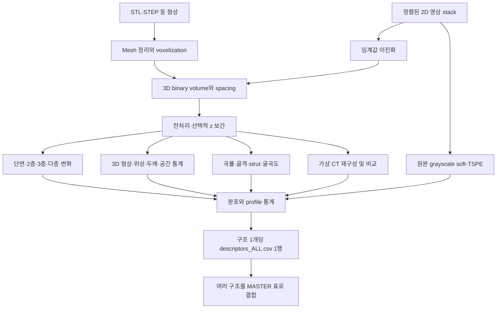

# 선행 구조인자 추출 알고리즘 해설

작성일: 2026-09-07. 분석 대상: 사용자가 지정한 `C:/Users/tjdgu/OneDrive/바탕 화면/urp/Code/`의 실제 코드와 노트북.

## 1. 이 코드를 연구의 어느 위치에서 읽어야 하는가

연구의 최종 목적은 기존 architected material 600개 이상의 **구조–성능 관계**를 학습하고, 이를 이용해 성능이 뛰어난 voxel-based architected material을 설계하는 것이다. 전체 연구는 다음 세 단계로 연결된다.

1. 구조에서 구조인자를 추출하는 알고리즘 구축.
2. 구조인자–성능 학습 모델 구축.
3. 역설계 기반 최적화 모델 구축.

**현재는 1단계 안에서도 선행 알고리즘의 구조를 이해하는 단계이다.** 따라서 여기서는 어떤 인자가 성능을 가장 잘 예측하는지 결정하기보다, ‘이 코드가 구조에서 무엇을 관측하고, 어떤 수식으로 숫자로 만들며, 그 숫자를 어느 범위까지 물리적으로 해석할 수 있는가’를 밝힌다.

이를 수식으로 쓰면 현재 코드는 다음의 특징 추출 함수에 해당한다.

\[
\mathbf d=\Phi(I;\Delta_x,\Delta_y,\Delta_z,\boldsymbol\theta)
\]

- \(I\): 재료가 차 있는 위치를 나타내는 3D voxel 구조.
- \(\mathbf d\): 구조 하나를 표현하는 구조인자 벡터.
- \(\Delta_x,\Delta_y,\Delta_z\): voxel의 실제 크기.
- \(\boldsymbol\theta\): 임계값, 전처리, lag, 분석 반경, 평활화 등의 계산 설정.

이후 2단계의 \(\hat{\mathbf y}=f(\mathbf d)\)가 성능을 예측하고, 3단계가 구조 \(I\)를 바꾸면서 목표 성능을 개선하게 된다. **제공 코드에는 성능 예측 학습이나 역설계 최적화가 구현되어 있지 않다.** 현재 결과는 그 두 단계의 입력 후보이다.

이 문서의 ‘물리적 의미’는 기하학적 관측량의 해석이다. ‘인자가 커지면 반드시 강도가 증가한다’는 식의 성능 법칙을 뜻하지 않는다. 구조뿐 아니라 모재 물성, 하중 방향, 경계조건, 파손·좌굴 기구가 함께 성능을 결정하기 때문이다.

## 2. 실제 파일들의 역할과 전체 Workflow

| 파일 | 역할 | 읽을 때의 기준 |
|---|---|---|
| `Architected_Material_Descriptor_v3_compatible.ipynb` | 설정, 입력, 추출 함수 호출, 저장을 연결하는 본 노트북 | 계산 순서와 입출력 흐름 |
| `descriptor_library.py` | 인자별 실제 수식과 계산 구현 | 인자 정의를 판단하는 최우선 근거 |
| `Architected_Material_Descriptor_Test_v3_compatible.ipynb` | 실제 구조와 단면 등을 확인하는 테스트용 노트북 | 시각적 검토용 진입점 |
| `stl_pipeline_driver.py` | 본 노트북의 코드 셀을 파일별로 재실행 | 배치 처리의 실행 방식 |
| `run_stl_batch_descriptor_extraction.py` | 여러 mesh를 순회하고 결과를 합침 | 다수 구조 처리 |
| `README_KO.md`, `VALIDATION.md` | 의도와 기존 검증 결과 설명 | 코드와 대조해서 읽을 참고 자료 |
| `MASTER_descriptors_ALL.csv` | 구조별 수치 열을 합친 표 | 실제 저장 열과 샘플 수 확인 |

노트북 bootstrap 셀의 `LIB_SOURCE`와 독립 `descriptor_library.py`의 내용을 대조했으며, 이번 제공본에서는 동일했다. README에 등장하는 `Exhaustive_v3`라는 파일명과 실제 `compatible` 파일명은 다르므로, 문서에 적힌 파일명을 현재 실행 파일명으로 그대로 받아들이면 안 된다.

여기서 중요한 점은 **TSPE 이미지를 이용해서 다른 모든 3D 인자를 재구성하는 방식이 아니라는 것**이다. 대부분의 인자군은 같은 전처리 volume을 독립적으로 읽는다. TSPE는 그 volume을 관측하는 여러 방법 중 하나이다.

노트북의 표시상 Cell 번호를 기준으로 보면 다음과 같다. 내부 JSON 배열의 index와는 다르다.

| 단계 | Cell | 핵심 결과 |
|---|---|---|
| 준비 | 01–03 | 라이브러리 생성, `config.json`, 환경 기록 |
| 입력·전처리 | 04–05 | `01_volume_raw.npz`, `02_volume_processed.npz` |
| 층별 분석 | 06–11 | slice, projection, pair, triplet, persistence, transition |
| 3D 분석 | 12–19 | 형상, 위상, 크기, 공간 통계, FFT, 골격, PH |
| 추가 분석 | 19b–19g | grayscale, soft-TSPE, 곡률, 굴곡도, strut, 가상 CT |
| 합치기 | 20–23 | 전체 CSV, QA, manifest, STL 내보내기, 여러 구조 집계 |

각 단계가 필요한 checkpoint를 읽고 자기 결과를 저장하므로 메모리가 초기화되어도 중간부터 재개할 수 있다. 다만 이는 설정 변경을 자동 추적하는 캐시 시스템은 아니다. 입력이나 해상도를 바꾸면 영향을 받는 하위 결과를 다시 계산해야 하며, 이전 실행의 JSON이나 grayscale checkpoint가 같은 폴더에 남으면 잘못 섞일 수 있다.

## 3. 모든 인자의 출발점: 구조를 수학적으로 표현하기

코드는 배열을 기본적으로 다음 순서로 해석한다.

\[
I[k,j,i]\in\{0,1\},\qquad \text{array axes}=(z,y,x)
\]

\(I=1\)은 solid, \(I=0\)은 void이다. \(z\) 방향의 \(k\)번째 단면은 \(S_k=I[k,:,:]\)이다. 전체 voxel 수를 \(N=N_zN_yN_x\), 단면 픽셀 수를 \(N_A=N_yN_x\)라고 하자.

\[
v_{\rm vox}=\Delta_x\Delta_y\Delta_z,
\qquad a_{\rm pix}=\Delta_x\Delta_y
\]

영상 입력은 파일명을 자연 정렬하고 8-bit grayscale로 읽은 뒤 \(I=\mathbf1[g>T]\)로 이진화한다. 기본 \(T=127\)이며 필요하면 solid/void를 뒤집는다. 파일명 정렬은 위치 보정이나 영상 정합을 수행한다는 뜻이 아니다. 단면들이 같은 좌표계에 정렬되어 있어야 한다.

Mesh 입력은 STEP이면 먼저 삼각 mesh로 변환하고, 정점 병합·퇴화 면 정리·normal 정리·일부 hole repair를 거친다. 기본 `auto`는 `trimesh_fill`을 시도하고 실패하면 평면–삼각형 교차선과 scanline의 짝홀 규칙을 사용하는 방식으로 넘어간다. backend에 따라 voxel 격자와 경계 표현이 달라질 수 있으므로 backend 기록도 계산 조건이다.

전처리에서 작은 연결 성분 제거와 hole filling은 실제 연결성·기공을 바꿀 수 있다. 기본 설정은 `MIN_COMPONENT_VOXELS=1`, `FILL_HOLES=False`로, 이 두 변경을 사실상 하지 않는다.

선택적인 z 보간은 두 단면의 signed distance field를 선형 보간한다.

\[
d_a=\operatorname{EDT}(S_a)-\operatorname{EDT}(\neg S_a),\quad
d_b=\operatorname{EDT}(S_b)-\operatorname{EDT}(\neg S_b)
\]
\[
S_t=\mathbf1[(1-t)d_a+td_b\ge0]
\]

보간은 측정되지 않은 형상을 가정해 채우는 과정이다. 새 정보를 실제로 측정한 것이 아니며, 이 함수의 2D 거리 변환은 물리적 spacing을 넣지 않고 계산한다.

## 4. ‘물리량 하나’가 ‘많은 CSV 열’이 되는 과정

이 코드는 구조 하나에서 하나의 평균만 구하지 않는다. 먼저 단면별·strut별·표면 정점별 값을 구하고, 그 값의 분포를 요약한다.

예를 들어 각 단면의 solid 비율 \(a_k\)를 계산하면:

\[
\bar a=\frac1m\sum_k a_k,\quad
\sigma_a=\sqrt{\frac1m\sum_k(a_k-\bar a)^2},\quad
CV_a=\frac{\sigma_a}{|\bar a|}
\]

`qstats()`는 유효한 유한값만 남겨 다음 **21개 통계량**을 출력한다.

| 통계량 | 의미 |
|---|---|
| n, mean, std | 유효 관측 수, 평균, 모집단 표준편차 |
| min, max, range | 극값과 전체 폭 |
| q01, q05, q10, q25, median, q75, q90, q95, q99 | 분위수와 중앙값 |
| iqr, cv | 중앙 50% 폭과 상대적 산포 |
| skew, kurtosis | 비대칭성과 첨도; 코드의 첨도는 SciPy 기본 excess kurtosis |
| rms, mad | 제곱평균제곱근과 중앙절대편차 |

`profile_stats()`는 여기에 층 순서에 따른 기울기, lag-1 상관, 평균 절대 1차 차분, 차분 RMS, 평균 절대 2차 차분을 추가한다. 데이터 길이가 충분하면 최대 26개이다.

\[
\overline{|\Delta a|}=\frac1{m-1}\sum_k|a_{k+1}-a_k|,
\qquad
\overline{|\Delta^2 a|}=\frac1{m-2}\sum_k|a_{k+2}-2a_{k+1}+a_k|
\]

이 차분들은 \(\Delta_z\)로 나누지 않는다. 따라서 이름에 gradient나 slope가 있어도 물리적 길이당 변화율이 아니라 **층 index당 변화**이다. NaN을 제거한 후 순서를 이어 붙인다는 점도 해석에 영향을 준다.

`triplet_A_111_fraction_all_mean`은 ‘각 3층 창에서 전체 단면 중 A가 차지하는 비율을 구한 다음, 그 비율을 창 전체에 걸쳐 평균한 값’이다. `soft_triplet_soft_A_mean_std`는 ‘각 창의 soft A 픽셀 평균을 구한 다음, 그 창별 평균들의 표준편차를 구한 값’이다. 이처럼 통계량의 통계량도 존재한다.

제공된 `MASTER_descriptors_ALL.csv`는 직접 확인 결과 **1행, 8,034열**이다. `sample_id`를 제외하면 8,033개 수치 후보이며, 샘플 ID는 `slices`이다. 600개 이상의 데이터가 이미 들어 있다는 의미는 아니다. 또한 이 수에는 가용성 flag와 계산 설정 같은 열도 포함되므로, 8,033개의 독립적인 물리 개념을 뜻하지 않는다.

## 5. 단면에서 시작해 층간 연속성을 관측하기

### 5.1 단면 형상: ‘이 높이에서 재료가 얼마나, 어떤 모양으로 존재하는가?’

함수: `slice_descriptor_table` — `descriptor_library.py:354`.

\[
A_k=|S_k|\Delta_x\Delta_y,\qquad
\phi_k=\frac{|S_k|}{N_A},\qquad
C_k=\frac{4\pi A_k}{P_k^2}
\]

\(A_k\)는 단면 solid 면적, \(\phi_k\)는 면적분율, \(P_k\)는 둘레, \(C_k\)는 원형도이다. 면적분율이 높다는 것은 해당 높이에 재료가 많이 있다는 뜻이고, 그 profile의 작은 값은 단면이 좁아지는 위치를 찾는 단서가 된다. 다만 이것만으로 그 면적 전체가 하중을 전달한다고 판단할 수는 없다.

추가 인자는 다음과 같다.

| 인자 | 계산·정의 | 해석 |
|---|---|---|
| specific perimeter | \(P_k/A_k\) | 같은 면적에 비해 경계가 얼마나 많은가 |
| component count | 2D 8-연결 성분 수 | 단면이 몇 조각으로 분리되는가 |
| Euler / hole proxy | \(\chi_{2D}=c-h\), \(h=c-\chi\) | 단면의 연결 조각과 구멍 |
| solidity | 가장 큰 조각의 면적 / convex hull 면적 | 오목하거나 파인 정도 |
| extent | 가장 큰 조각의 면적 / 그 bounding box 면적 | 사각 외접 영역의 채움 정도 |
| eccentricity | 등가 타원의 \(\sqrt{1-b^2/a^2}\) | 길쭉함 |
| equivalent diameter | \(2\sqrt{A/\pi}\) | 같은 면적의 원의 지름 |
| major/minor axis, orientation | 2차 모멘트 기반 등가 타원 | 단면의 길이와 방향 |
| centroid | 가장 큰 조각의 중심을 영상 크기로 정규화 | 큰 조각 위치의 편향·이동 |

주의: 여러 조각이 있으면 일부 형상값은 가장 큰 조각만 설명한다. 둘레·등가 축 길이의 단위 변환에 \(\sqrt{\Delta_x\Delta_y}\)를 사용하므로 \(\Delta_x\ne\Delta_y\)인 영상에서 엄밀한 물리 길이 보정은 아니다.

### 5.2 투영 texture: ‘어느 방향으로 재료가 모여 있는가?’

함수: `projection_texture_descriptors` — `descriptor_library.py:370`.

\[
P_{xy}(j,i)=\frac1{N_z}\sum_k I[k,j,i],\qquad
M_{xy}(j,i)=\max_k I[k,j,i]
\]

occupancy projection은 한 직선상의 재료 점유 비율이고, maximum projection은 그 선에 재료가 한 번이라도 나타나는지 표시한다. XY·XZ·YZ에 대해 계산한다. 이 투영은 물리적으로 보정된 X-ray 감쇠 영상이 아니다.

16단계로 양자화한 영상에서 거리 1·2·4 pixel, 방향 0·45·90·135도의 GLCM을 만든다. \(p_{uv}\)를 두 위치의 gray level이 \(u,v\)일 확률이라고 하면:

\[
\mathrm{contrast}=\sum_{u,v}(u-v)^2p_{uv},\quad
\mathrm{dissimilarity}=\sum_{u,v}|u-v|p_{uv}
\]
\[
\mathrm{homogeneity}=\sum_{u,v}\frac{p_{uv}}{1+(u-v)^2},\quad
\mathrm{ASM}=\sum_{u,v}p_{uv}^2,\quad
\mathrm{energy}=\sqrt{\mathrm{ASM}}
\]
\[
\mathrm{correlation}=\sum_{u,v}\frac{(u-\mu_u)(v-\mu_v)p_{uv}}{\sigma_u\sigma_v}
\]

공간적으로 밝고 어두운 영역이 급격히 번갈아 나타나면 contrast가 커질 수 있다. 일정한 점유 패턴과 불균일한 배치를 구분하는 영상 통계이며, 개별 역학 물성에 일대일로 대응하지 않는다. Hu moments 7개, 영상 Shannon entropy, gradient 분포도 추가한다. Hu moments는 정규화 중심 모멘트의 조합으로 투영 형상을 요약하는 보조값이다.

### 5.3 2층 중첩: ‘한 층 올라갔을 때 구조가 얼마나 유지되는가?’

함수: `pair_descriptor_table` — `descriptor_library.py:388`.

인접 단면 \(S_k,S_{k+1}\)에 대해:

\[
J_k=\frac{|S_k\cap S_{k+1}|}{|S_k\cup S_{k+1}|},\qquad
D_k=\frac{2|S_k\cap S_{k+1}|}{|S_k|+|S_{k+1}|}
\]
\[
f_{\Delta,k}=\frac{|S_k\triangle S_{k+1}|}{N_A},\quad
\delta\phi_k=\phi_{k+1}-\phi_k
\]

Jaccard와 Dice는 같은 XY 위치에서 재료가 유지되는 정도를 나타낸다. 대칭차는 사라진 영역과 새로 나타난 영역의 합이며, signed area change는 증가와 감소의 방향을 표시한다. 코드에는 작은 단면을 기준으로 하는 overlap coefficient와 각 단면 기준의 containment도 있다.

\[
O=\frac{|S_k\cap S_{k+1}|}{\min(|S_k|,|S_{k+1}|)},\quad
C_{k\to k+1}=\frac{|S_k\cap S_{k+1}|}{|S_k|}
\]

무게중심 이동은 모든 solid 픽셀의 중심 차이에 물리 spacing을 적용한 거리이다. 경계 이동은 각 경계점에서 다른 단면 경계까지의 최단거리 평균을 양방향으로 계산한다. 이는 Hausdorff 최대거리와 다르다.

**기울어진 연속 strut은 층마다 옆으로 이동하므로 중첩이 낮아질 수 있다.** 따라서 낮은 Jaccard가 곧 3D 단절이나 낮은 강도를 뜻하지 않는다.

### 5.4 3층 TSPE: ‘유지·출현·소멸을 구별하는가?’

함수: `triplet_state`, `triplet_descriptor_table` — `descriptor_library.py:404`, `:413`.

동일한 XY 위치의 세 단면 점유를 \(a,b,c\in\{0,1\}\)라고 하면:

\[
s=4a+2b+c\in\{0,\dots,7\}
\]

| 상태 | 이름 | z가 증가하는 방향에서의 의미 |
|---|---|---|
| 000 | background | 세 층 모두 void |
| 001 | single | 마지막 층에서만 solid |
| 010 | single | 가운데 층에서만 solid |
| 011 | C | 가운데·위층에서 solid, 아래층은 void |
| 100 | single | 첫 층에서만 solid |
| 101 | gap/re-entry | 가운데는 void이고 양끝에 solid |
| 110 | B | 아래·가운데층에서 solid, 위층은 void |
| 111 | A | 세 층 모두 solid |

\[
A=S_k\cap S_{k+1}\cap S_{k+2}
\]
\[
B=S_k\cap S_{k+1}\cap\neg S_{k+2},\qquad
C=\neg S_k\cap S_{k+1}\cap S_{k+2}
\]

여기서 A·B·C는 상호 배타적이다. B와 C에 A를 다시 포함하지 않는다. \(n_A,n_B,n_C\)를 각각의 픽셀 수라고 하자.

\[
f_A=\frac{n_A}{N_A},\quad
P_{\rm both}=\frac{n_A}{|S_{k+1}|},\quad
P_{\rm adjacent}=\frac{n_A+n_B+n_C}{|S_{k+1}|}
\]
\[
G=\frac{n_C-n_B}{n_B+n_C}
\]

- \(f_A\): 전체 단면에서 3층 연속으로 solid인 위치의 비율.
- \(P_{\rm both}\): 가운데층 재료 중 양쪽 층 모두에 이어지는 위치의 비율.
- \(P_{\rm adjacent}\): 가운데층 재료 중 한쪽 이상 인접층에도 나타나는 위치의 비율.
- \(G\): z 진행방향으로 출현하는 패턴과 소멸하는 패턴의 균형. 양수이면 C가 많다.

예를 들어 전체 100 pixel 중 \(n_A=20,n_B=10,n_C=5,n_{010}=5\)이면 가운데층 solid는 40 pixel이다. 이때 \(f_A=0.20\), \(P_{\rm both}=0.50\), \(P_{\rm adjacent}=0.875\), \(G=-1/3\)이다. 같은 A count라도 분모에 따라 질문이 달라진다.

상태분율 외에도 A/B/C/101 각각의 2D 조각 수·둘레·최대 조각 비율과 A–B, A–C, B–C 인접 pixel edge 수를 구한다. interface 값은 물리적 3D 계면 면적이 아니라 **2D 격자의 인접 edge count**이다.

상태 entropy는 \(H=-\sum p_s\ln p_s/\ln m_+\)이다. \(m_+\)는 발생한 상태 수이며, 모든 경우에 \(\ln8\)로 나누는 정의가 아니다. 한 상태 이하이면 0을 반환한다.

‘growth/decay’는 시간에 따른 성장·손상이 아니라 **정적인 구조를 z방향으로 읽으며 나타나는 변화**이다. z방향을 뒤집으면 B와 C가 교환된다. 101도 그 위치의 gap을 뜻할 뿐, 전체 3D에서 우회 연결이 없는지는 별도 분석이 필요하다.

8-state grayscale PNG는 \(\operatorname{round}(255s/7)\)로 라벨을 표시한 그림이다. 밝기가 실제 밀도나 CT 강도를 뜻하지 않는다. 예컨대 100은 011보다 밝게 인코딩되지만 solid bit 수는 더 적다.

### 5.5 다층 persistence와 lag: ‘연속성이 어느 길이까지 유지되는가?’

함수: `multilevel_persistence_descriptors`, `lag_overlap_descriptors` — `descriptor_library.py:438`, `:448`.

\[
P^{(K)}_k=\frac{|\bigcap_{j=0}^{K-1}S_{k+j}|}{|\bigcup_{j=0}^{K-1}S_{k+j}|},\qquad
J_{k,\ell}=\frac{|S_k\cap S_{k+\ell}|}{|S_k\cup S_{k+\ell}|}
\]

다층 persistence는 중간 층까지 모두 solid이어야 하므로 직선적인 지속성을 묻는다. lag 비교는 두 끝 단면만 비교하므로 중간이 비어 있어도 높을 수 있다. lag별 중첩의 재상승은 반복 구조의 단서가 된다.

상호정보량은 두 단면의 점유 여부가 서로를 얼마나 설명하는지 측정한다.

\[
MI=\sum_{u,v\in\{0,1\}}p_{uv}\ln\frac{p_{uv}}{p_up_v}
\]

기본 \(K\le7\), lag \(\ell\le12\)이다. lag의 물리적 분리 거리는 \(\ell\Delta_z\), K층 첫·끝 중심 간 거리는 \((K-1)\Delta_z\)이다. 코드의 decay AUC는 lag별 평균 Jaccard의 합이며 물리 길이에 대한 적분은 아니다.

### 5.6 상태 전이: ‘3층 창을 한 칸 이동하면 어떤 패턴으로 바뀌는가?’

함수: `triplet_transition_descriptors` — `descriptor_library.py:467`.

\[
M_{uv}=\sum_{k,x,y}\mathbf1[s_k(x,y)=u,\ s_{k+1}(x,y)=v]
\]

코드는 전체 전이 중 비율 \(M_{uv}/\sum M\)을 64개 열로 저장한다. 상태별 self probability 등 일부 값은 행 합으로 나눈 조건부 확률이다. 두 종류의 분모를 구분해야 한다.

겹치는 창에서는 \((a,b,c)\to(b,c,d)\)이므로:

\[
v=2(u\bmod4)+d,\qquad d\in\{0,1\}
\]

각 출발 상태에서 가능한 다음 상태는 두 개뿐이다. 64개 중 **48개는 정의상 불가능한 전이**이다. 특히 코드의 `B110_to_A111`, `A111_to_C011`은 불가능하다. 110은 100 또는 101로만, 111은 110 또는 111로만 갈 수 있다. 이런 열은 관측이 있으면 0이고 분모가 없으면 NaN이며, 새로운 물리적 변화를 담는 인자로 읽으면 안 된다.

## 6. 전체 3D 구조의 재료량·표면·연결성을 관측하기

### 6.1 상대밀도와 전역 형상

함수: `morphology3d_descriptors` — `descriptor_library.py:491`.

\[
\bar\rho=\frac1N\sum I,\quad
V_s=\sum I\,v_{\rm vox},\quad
V_b=Nv_{\rm vox},\quad
\phi_v=1-\bar\rho
\]

단일한 균질 모재와 빈 공간으로 이루어졌다면 이 solid 체적분율을 \(\rho^*/\rho_s\)로 해석할 수 있다. 여러 모재나 미세 기공의 밀도 차이는 이진 모델에 들어 있지 않다.

\(V_b\)는 **분석 배열 전체의 부피**이다. 따라서 외부 여백이나 unit cell crop 규칙이 달라지면 같은 구조의 상대밀도도 달라진다. 상대밀도는 이후 성능 비교의 중요한 기준이므로 분석 영역의 정의부터 통일해야 한다.

Marching cubes로 표면 mesh를 만들고 삼각형 면적을 합해 \(A_s\)를 계산한다.

\[
S_v=\frac{A_s}{V_s},\quad
\Psi=\frac{\pi^{1/3}(6V_s)^{2/3}}{A_s},\quad
C=\frac{36\pi V_s^2}{A_s^3}=\Psi^3
\]

비표면적 \(S_v\)는 단위 solid 부피당 경계의 양이고, 구형도 \(\Psi\)와 compactness는 재료가 얼마나 조밀한 형태로 모였는지를 표현한다. 표면적이 크다는 사실만으로 기계 성능의 좋고 나쁨을 판단할 수 없다. convex hull 부피 대비 solid 부피는 3D solidity이다.

solid 좌표 \(\mathbf r\)의 공분산은:

\[
\mathbf C=\langle(\mathbf r-\bar{\mathbf r})(\mathbf r-\bar{\mathbf r})^T\rangle,
\quad R_g=\sqrt{\operatorname{tr}\mathbf C}
\]

고유값 \(\lambda_1\ge\lambda_2\ge\lambda_3\)로 \(\lambda_1/\lambda_3\), \((\lambda_2-\lambda_3)/\lambda_1\), \((\lambda_1-\lambda_2)/\lambda_1\)을 구해 전체 재료 분포의 방향성·평면성·선형성을 나타낸다. `inertia_cov_eig*`는 질량 관성모멘트 자체가 아니라 **좌표 공분산 고유값**, 단위는 길이 제곱이다.

### 6.2 surface fabric과 방향성

표면 삼각형 \(f\)의 단위 법선 \(\mathbf n_f\)와 면적 \(A_f\)를 이용한다.

\[
\mathbf F=\frac1{A_s}\sum_f A_f\mathbf n_f\mathbf n_f^T
\]

고유값이 비슷하면 법선 분포가 여러 방향에 퍼져 있고, 한 값이 크면 특정 방향 법선이 많다. 등방적인 법선 분포에서는 각 고유값이 \(1/3\)에 가깝다.

\[
FA=\sqrt{\frac32\frac{\sum_i(\lambda_i-\bar\lambda)^2}{\sum_i\lambda_i^2}}
\]

법선 방향은 strut의 축 방향과 같은 개념이 아니다. 또한 현재 고유값만으로는 우세한 방향이 실제 x·y·z 중 어디인지를 완전히 복원할 수 없다. 면 사이 dihedral angle 분포도 구하지만 이는 mesh 면의 꺾임각이며 곡률과 동일한 물리량은 아니다.

### 6.3 연결성·Euler·Betti proxy

함수: `topology_descriptors` — `descriptor_library.py:517`.

연결 성분은 서로 이동 가능한 solid 또는 void voxel 집합이다. 6-연결은 면 접촉, 18-연결은 면·모서리 접촉, 26-연결은 면·모서리·꼭짓점 접촉을 허용한다. 접촉 정의에 따라 연결 여부가 달라질 수 있다.

축 \(\alpha\)의 양쪽 분석면에 같은 solid 성분이 닿으면 spanning/percolation으로 표시한다. 이는 ‘그 방향으로 이어진 재료가 있는가’이며, 힘의 크기나 구조의 강성을 계산한 것은 아니다. 이 함수는 solid/void 성분 수를 모두 계산하지만, 축별 percolation 출력은 solid에 대해서 계산한다.

\[
\chi=\beta_0-\beta_1+\beta_2
\]

- \(\beta_0\): 연결 조각 수.
- \(\beta_1\): 독립적인 터널·고리 수.
- \(\beta_2\): 내부에 갇힌 빈 공간 수.

코드는 `solid_components_conn6`을 \(\beta_0\), 경계에 연결되지 않은 6-연결 void 성분 수를 \(\beta_2\) proxy로 놓고 \(\beta_1=\beta_0+\beta_2-\chi\)를 계산한다. 디지털 연결성의 쌍대성 및 경계 처리 때문에 **정확한 Betti 수로 단정하지 않고 proxy로 명시**해야 한다.

### 6.4 Euler filtration과 persistent homology

함수: `euler_filtration_descriptors`, `persistent_homology_descriptors` — `descriptor_library.py:540`, `:699`.

Euler filtration은 구조를 조금씩 침식·팽창시키며 \(\chi(r)\)를 기록한다.

\[
I_r=\begin{cases}
\operatorname{erode}^{|r|}(I)&r<0\\
I&r=0\\
\operatorname{dilate}^{r}(I)&r>0
\end{cases},\quad \chi(r)=\chi(I_r)
\]

얇은 연결부가 침식으로 끊기거나 작은 gap이 팽창으로 붙을 때 위상이 바뀐다. 이는 ‘얼마나 작은 형상 변화로 연결 구조가 바뀌는가’를 보는 기하학적 민감도이다. 실제 손상·제조 공정을 시뮬레이션한 것은 아니다. 기본 구조 요소는 6-이웃 계열이며 \(r\)은 mm가 아니라 반복 횟수이다.

선택 기능인 persistent homology는 signed distance field

\[
f=-\operatorname{EDT}(I)+\operatorname{EDT}(1-I)
\]

의 sublevel filtration에서 각 위상적 특징의 생성 \(b_i\)와 소멸 \(d_i\)를 추적한다. \(\ell_i=d_i-b_i\)의 개수·합·분포를 차원 0·1·2별로 저장한다. 코드에서는 downsampling 후 voxel 단위 거리를 사용하고 무한 수명은 제외한다. 따라서 PH lifetime count는 원래 구조의 Betti 수와 같은 값이 아니다. `gudhi`가 없으면 skip flag만 기록된다.

## 7. 두께·기공 크기와 공간적 배치의 척도

### 7.1 거리 변환 두께: ‘표면으로부터 얼마나 안쪽에 있는가?’

함수: `distance_thickness_descriptors` — `descriptor_library.py:551`.

\[
d_s(\mathbf r)=\min_{\mathbf q:I(\mathbf q)=0}\|\mathbf r-\mathbf q\|_{\Delta},
\qquad t_{\rm proxy}(\mathbf r)=2d_s(\mathbf r)
\]

solid voxel마다 가장 가까운 void voxel까지의 거리를 구해 두 배 한다. void에도 반대 phase까지의 거리를 적용해 pore diameter proxy를 얻는다. 물리 spacing을 사용하므로 단위는 mm이다.

**전체 solid voxel의 \(2d_s\)는 위치마다 다르다.** 같은 원통 안에서도 표면 가까이에서는 작고 중심에서 크다. 따라서 그 평균은 원통 지름의 평균과 같지 않다. 각 점을 포함하는 최대 내접구의 지름으로 정의되는 엄밀한 local thickness를 전부 계산하는 알고리즘도 아니다.

골격 위에서만 \(2d_s\)를 표본 추출한 `skeleton_sampled_solid_thickness_mm_*`는 중심부 두께에 더 가까운 정보를 제공한다. 그래도 node 팽대부, 비원형 단면, sheet 구조에서는 해석을 확인해야 한다. 이 차이가 strut 단면 크기와 전체 재료 내부 거리분포를 혼동하지 않는 핵심이다.

### 7.2 Granulometry: ‘어느 크기의 요소가 구조를 통과·유지하는가?’

함수: `granulometry_descriptors` — `descriptor_library.py:559`.

반경 \(r\) voxel의 구형 구조 요소 \(B_r\)로 opening과 closing을 수행한다.

\[
I\circ B_r=(I\ominus B_r)\oplus B_r,\quad
R_s(r)=\frac{|I\circ B_r|}{|I|}
\]

opening은 작은 돌출부·얇은 부위를 제거하는 방향으로 작용한다. 반경이 커질수록 어떤 크기에서 재료가 많이 사라지는지 보면 구조의 두께 척도를 파악할 수 있다. closing은 \((I\oplus B_r)\ominus B_r\)이고, 작은 틈을 메우는 경향을 본다. 유한 배열의 경계 효과로 부피비의 동작이 달라질 수 있다. void opening도 별도로 계산한다.

`ball(r)`는 voxel 좌표의 구이므로 비등방 spacing에서는 실제 공간의 구가 아니다. 엄밀한 연속 입도분포가 아니라 선택된 반경의 유지율이다.

### 7.3 Chord와 MIL: ‘직선으로 지나갈 때 재료가 얼마 동안 연속되는가?’

함수: `chord_descriptors`, `directional_descriptors` — `descriptor_library.py:570`, `:656`.

각 축의 모든 voxel line을 따라 solid 또는 void가 연속하는 run을 찾는다. run 길이가 \(n\) voxel이면:

\[
\ell=n\Delta_\alpha,\quad \mathrm{MIL}_{s,\alpha}=\frac1{N_{\rm runs}}\sum_j\ell_j
\]

chord 분포는 재료나 빈 공간을 직선으로 통과하는 거리 분포이다. 이 코드에서 MIL은 같은 solid/void run 길이의 산술평균이므로 `chord_*_mean`과 중복된다. strut을 비스듬하게 통과하면 chord는 strut의 실제 축 길이나 두께와 다르다. 배열 끝에서 잘린 run도 포함된다.

축별 평균의 최대/최소 비, CV와 phase 전이 횟수를 통해 방향성을 요약한다. 단면 점유 profile도 x·y·z 각각 계산한다.

### 7.4 Lineal path·2점·3점 상관: ‘공간적으로 무엇이 함께 나타나는가?’

함수: `lineal_path_descriptors`, `two_point_axis_descriptors`, `three_point_descriptors` — `descriptor_library.py:580`, `:595`, `:605`.

lineal path의 기본 질문은 길이 L인 선분의 모든 점이 같은 phase인가이다.

\[
L_s(L;\alpha)=\left\langle\prod_{j=0}^{L-1}I(\mathbf r+j\mathbf e_\alpha)\right\rangle
\]

현재 구현은 중심 정렬 convolution을 하고 배열 밖을 0으로 처리한 뒤 전체 배열에서 평균한다. 따라서 완전히 배열 안에 들어가는 시작점만으로 정규화한 엄밀한 유효 선분 확률과 다르며, 경계에서 낮아지는 surrogate이다. L은 voxel 개수이다.

두 점 상관은 두 위치가 동시에 solid일 확률이다.

\[
S_2(r;\alpha)=\langle I(\mathbf x)I(\mathbf x+r\mathbf e_\alpha)\rangle,
\qquad C_2(r)=\frac{S_2(r)-\bar\rho^2}{\bar\rho(1-\bar\rho)}
\]

이 코드는 배열 안의 유효 위치쌍을 사용하고, \(C_2\le e^{-1}\)가 처음 되는 lag를 상관 길이로 저장한다. 주기 구조에서는 상관이 진동할 수 있으므로 이 첫 교차값이 항상 unit cell 크기는 아니다.

세 점 상관은 두 직교 방향에 놓인 L자 패턴만 계산한다.

\[
S_3(r;\alpha,\beta)=\langle I(\mathbf x)I(\mathbf x+r\mathbf e_\alpha)I(\mathbf x+r\mathbf e_\beta)\rangle
\]

**S2/S3는 지정한 끝점들의 동시 점유이고, lineal path는 중간까지의 직선 연속 점유이며, percolation은 휘어진 경로도 허용하는 3D 연결성**이다. 같은 구조를 서로 다른 질문으로 관측하므로 이 셋을 함께 이해하는 것이 좋다.

### 7.5 Box counting·lacunarity·FFT: ‘어떤 크기로 반복되고, 얼마나 불균일한가?’

함수: `multiscale_descriptors`, `spectral_descriptors` — `descriptor_library.py:626`, `:638`.

한 변 k voxel의 box로 배열을 나누고 solid가 있는 box 수 \(N(k)\)를 센다.

\[
D_{\rm fit}=\frac{d\log N(k)}{d\log(1/k)},\qquad
\Lambda(k)=1+\frac{\operatorname{Var}(M_k)}{\operatorname{E}(M_k)^2}
\]

\(M_k\)는 각 box 안의 phase voxel 수이다. lacunarity가 크면 동일 크기의 box 사이에서 재료량의 불균일성이 크다. solid·void·boundary 각각 계산한다. 유한한 몇 개 크기에서 회귀한 차원이므로 구조가 수학적 fractal이라는 증거는 아니다. k로 나누어떨어지지 않는 배열 끝은 잘라낸다.

FFT에서는 평균 점유율을 뺀 뒤:

\[
P(\mathbf k)=|\mathcal F[I-\bar\rho]|^2,\qquad
\lambda_{\rm peak}=\frac1{|\mathbf k_{\rm peak}|}
\]

주요 반복 파장, power의 방향성, radial bin별 비율과 spectral entropy를 구한다.

\[
H_{\rm spec}=-\frac{\sum_jp_j\ln p_j}{\ln N_F},\qquad p_j=P_j/\sum P
\]

코드의 주파수는 cycles/mm이므로 파장은 \(1/k\)이며 \(2\pi/k\)가 아니다. 기본 최대 차원 128을 넘으면 단순 stride로 downsample한다. anti-aliasing과 창 함수 없이 FFT를 하므로 고주파 aliasing과 분석 영역 경계의 영향이 있을 수 있다. peak wavelength는 구조의 반복 척도 후보이며, 항상 CAD unit cell 길이와 일치하지 않는다.

## 8. 골격·strut·굴곡도: 재료가 연결되는 경로를 직접 관측하기

### 8.1 Voxel skeleton graph

함수: `skeleton_network_descriptors` — `descriptor_library.py:671`.

solid를 skeleton으로 줄이고, skeleton voxel을 정점으로, 26-이웃 접촉을 edge로 놓는다. 각 voxel의 degree가 1이면 endpoint 후보, 3 이상이면 branchpoint 후보이다.

\[
E=\frac12\sum_i d_i,\qquad
\bar d=\frac{2E}{V},\qquad
\mu=E-V+C
\]

\(\mu\)는 이 voxel graph의 cycle rank이다. 이것이 물리적 strut loop 수 또는 연속체 \(\beta_1\)와 같다고 단정할 수 없다. 26-이웃은 교차부에서 작은 삼각형 cycle을 만들 수 있기 때문이다.

코드의 skeleton length proxy는 `skeleton voxel 수 × 평균 spacing`이다. 대각선 edge의 실제 길이를 합한 값이 아니다. graph가 충분히 작으면 \(L=D-A\)의 두 번째 작은 고유값과 adjacency spectral radius도 계산한다. 이 값은 연결 형태를 설명하는 그래프 통계이고, 구조역학 stiffness matrix의 고유값은 아니다.

### 8.2 Strut/node graph

함수: `strut_graph_descriptors` — `descriptor_library.py:1067`.

앞의 voxel graph에서 degree가 2인 voxel의 연속 chain을 하나의 strut으로 축약한다. degree가 2가 아닌 voxel은 node 후보로 둔다.

\[
L_e=\sum_{(i,j)\in e}\|\mathbf r_j-\mathbf r_i\|,
\quad D_e=\|\mathbf r_{\rm end}-\mathbf r_{\rm start}\|,
\quad \tau_e=L_e/D_e
\]

경로의 \(2\operatorname{EDT}\)를 표본 추출해 strut별 평균 두께, 두께 CV, 최소/최대 비를 구한다. strut별 평균 두께들의 분포를 다시 요약한다.

\[
CV_{t,e}=\sigma(t_e)/\bar t_e,\qquad
\bar Z_{\rm network}=2N_{\rm strut}/N_{\rm node}
\]

길이가 길고 단면이 작은 부재, 중간에 얇아지는 부재, 높은 연결도를 가진 node를 구별하는 데 유용한 후보이다. 다만 이 코드의 aspect ratio는 `median(길이)/median(평균 두께)`이고, 각 부재의 길이/두께 비를 구한 후 중앙값을 취하는 것은 아니다.

구현상 서로 붙어 있는 junction voxel들을 하나의 물리적 node로 군집화하지 않는다. 따라서 실제 접합부 하나가 여러 node로 남을 수 있다. 모든 voxel degree가 2인 고립 loop는 시작 node가 없어 strut 추출에서 빠질 수도 있다. sheet형 구조의 skeleton은 beam lattice만큼 명확한 node/strut 해석을 갖지 않을 수 있다. 따라서 docstring의 ‘actual/true lattice graph’는 목표로 이해하고, 출력은 검토가 필요한 축약 그래프로 읽어야 한다.

주석의 3D 중심력 네트워크 기준 \(Z\approx6\)은 자유도–구속 수를 비교하는 Maxwell counting의 참조값이다. **Z가 6 이상이라는 사실만으로 모든 격자가 stretching-dominated라고 판정할 수 없다.** 기구학, 하중, 기하와 경계조건을 확인해야 한다. 특정 격자군에서의 더 강한 연결도 조건을 다룬 원논문도 이러한 구분의 필요성을 보여준다. [Deshpande, Ashby & Fleck, 2001](https://www.sciencedirect.com/science/article/abs/pii/S1359645400003797).

### 8.3 Phase tortuosity

함수: `tortuosity_descriptors`, `_axis_tortuosity` — `descriptor_library.py:1042`, `:1009`.

solid와 void를 각각 선택해 최대 연결 성분만 남긴다. 6-이웃 voxel graph의 edge 길이에 물리 spacing을 주고, 한쪽 면의 모든 source에서 반대 면까지 multi-source Dijkstra 최단거리를 계산한다.

\[
\tau_\alpha=
\frac{\frac1{|T|}\sum_{t\in T}\min_{s\in S}d_G(s,t)}{(N_\alpha-1)\Delta_\alpha}
\]

\(S\)는 입구면의 voxel 집합, \(T\)는 도달 가능한 출구면 voxel 집합이다. 직선 통로는 1에 가깝고 우회할수록 커진다. solid에서는 재료를 통한 경로, void에서는 빈 공간을 통한 경로의 굽음을 나타낸다.

이는 흐름이나 전류를 실제로 풀어 flux로 가중한 tortuosity가 아니라 **기하학적 최단경로 평균**이다. 6-이웃으로 인해 비스듬한 경로는 계단식 거리로 평가된다. 기본 최대 48 voxel 크기로 stride downsample하고, 최대 성분만 검사하므로 작은 spanning 성분을 놓칠 수 있다. NaN은 단절 외에도 downsampling이나 성분 선택의 결과일 수 있다.

## 9. 표면 곡률: strut·node·sheet 표면을 어떻게 구분하는가

함수: `curvature_descriptors` — `descriptor_library.py:858`.

연속 표면의 두 주곡률을 \(k_1,k_2\)라고 하면:

\[
H=(k_1+k_2)/2,\qquad K=k_1k_2
\]

| 표면 예 | H | K | 해석 |
|---|---|---|---|
| 반경 R의 구 | \(1/R\), 선택한 convex-positive 규약 | \(1/R^2\) | 두 방향으로 같은 부호의 곡률 |
| 반경 R의 원통 옆면 | \(1/(2R)\), 같은 규약 | 0 | 한 방향만 휘어짐 |
| 평면 | 0 | 0 | 두 방향 모두 평평함 |
| 안장 | 주곡률 크기에 따라 달라짐 | 음수 | 두 방향으로 반대로 휘어짐 |

코드는 voxel volume에 background 한 겹을 padding하고 Marching cubes로 표면을 만든 뒤, 기본 12회의 Taubin 평활화를 적용한다. 평활화 단계는 이웃 정점 평균 \(\bar{\mathbf v}_i\)에 대해 \(\mathbf v_i\leftarrow\mathbf v_i+\lambda(\bar{\mathbf v}_i-\mathbf v_i)\)를 적용하고, 이어 \(\mu\)를 적용한다. 기본값은 \(\lambda=0.5,\mu=-0.53\)이다. 계단형 noise를 줄이지만 기하를 전혀 바꾸지 않는 연산은 아니다.

각 정점의 면적은 인접 삼각형 면적의 1/3씩을 합한 barycentric area이다.

\[
A_i=\frac13\sum_{f\ni i}A_f,\quad
w_{ij}=\frac{\cot\alpha_{ij}+\cot\beta_{ij}}2
\]
\[
\mathbf H_i=\frac1{2A_i}\sum_jw_{ij}(\mathbf v_i-\mathbf v_j),\quad
H_i=\operatorname{sign}(\mathbf H_i\cdot\mathbf n_i)\|\mathbf H_i\|
\]
\[
K_i=\frac{2\pi-\sum_{f\ni i}\theta_{if}}{A_i}
\]

cotangent Laplacian과 angle defect에 기반한 이산 곡률 계열이다. 원논문의 mixed/Voronoi area와 제공 코드의 barycentric area는 구분해야 한다. [Meyer et al., Discrete Differential-Geometry Operators](https://geometry.caltech.edu/pubs/DMSB_III.pdf).

그 뒤:

\[
k_{1,2}=H\pm\sqrt{\max(H^2-K,0)},\quad
c=\sqrt{(k_1^2+k_2^2)/2}
\]
\[
SI=\frac2\pi\operatorname{atan2}(k_1+k_2,k_1-k_2)
\]

로 주곡률, curvedness, shape index를 계산한다. 코드에서는 \(|k_1-k_2|\le10^{-9}\)일 때 shape index를 0으로 둔다. 구처럼 두 주곡률이 같은 점의 이론적 극한값과 다른 예외 처리이다.

마지막으로 \(\varepsilon_K=10^{-6}\)을 기준으로:

\[
f_{\rm elliptic}=\frac{\sum_{K_i>\varepsilon_K}A_i}{\sum_iA_i},\quad
f_{\rm hyperbolic}=\frac{\sum_{K_i<-\varepsilon_K}A_i}{\sum_iA_i},\quad
f_{\rm near-zero}=\frac{\sum_{|K_i|\le\varepsilon_K}A_i}{\sum_iA_i}
\]

를 구한다. H·주곡률은 mm⁻¹, K는 mm⁻²이다. 일반 `qstats`는 정점별 동일 가중치이고, 별도 area-weighted mean과 위 분류 비율만 면적 가중치이다.

안장 비율은 sheet형 표면을 구분하는 단서이고, 원통형 면은 strut의 단서이다. 그러나 K가 0 근처인 분류에는 평면도 들어가므로 이를 순수한 strut 표면 비율로 읽으면 안 된다. 또한 유한 두께 TPMS sheet의 양쪽 외표면이 원래 최소 중간면과 동일한 H를 갖는다고 가정하면 안 된다.

## 10. Soft-TSPE와 가상 CT는 어떤 정보를 추가하는가

### 10.1 Soft-TSPE

함수: `load_image_stack_grayscale`, `soft_triplet_descriptor_table` — `descriptor_library.py:1192`, `:1251`.

세 층 강도를 \(g_0,g_1,g_2\in[0,1]\)로 놓고:

\[
A_s=\min(g_0,g_1,g_2),\quad
B_s=\min(g_0,g_1,1-g_2),\quad
C_s=\min(1-g_0,g_1,g_2)
\]

를 계산한다. 가장 약한 층의 점유 강도가 연속성을 제한한다는 fuzzy-AND 정의이다. 입력이 정확히 0/1이면 hard A/B/C mask와 같다.

그러나 중간 강도에서는 A/B/C가 배타적이지 않다. 세 값이 모두 0.5이면 \(A_s=B_s=C_s=0.5\)이고 합은 1.5이다. 따라서 이들을 합이 1인 상태 확률이나 실제 체적분율로 해석하면 안 된다.

영상 입력은 원본 영상을 8-bit로 읽고 255로 나눈다. 이것이 solid 점유율과 선형적으로 대응하려면 별도 영상·물성 보정이 필요하다. Mesh에는 원본 grayscale이 없어 binary volume에 기본 sigma 0.8 voxel의 Gaussian blur를 적용한다. 이는 인위적인 soft field이며, 측정 과정에서 잃은 grayscale 정보를 복원한 것이 아니다.

`soft_A_hard_agreement_dice`는 다음 두 mask를 비교한다.

\[
\mathbf1[\min(g_0,g_1,g_2)>c]
=\mathbf1[g_0>c]\mathbf1[g_1>c]\mathbf1[g_2>c]
\]

두 mask는 정의상 동일하므로 A가 있으면 Dice=1, 둘 다 비면 NaN이다. **이 값은 hard threshold의 정보 손실량을 측정하지 않는다.** 별도의 partial-volume fraction은 soft값이 0.02와 0.98 사이인 픽셀 비율로, 중간 강도의 존재를 보여준다.

soft 경로는 원본 해상도의 grayscale을 우선하고 hard 경로는 전처리·z 보간 결과를 사용한다. 두 인자군이 항상 동일한 공간 표본과 전처리에 기반하는 것은 아니다.

### 10.2 가상 CT 투영과 재구성

함수: `xray_ct_projection_reconstruction` — `descriptor_library.py:1305`.

이미 알고 있는 binary 단면을 Radon 투영한 다음 filtered back-projection으로 복원한다.

\[
p_\theta(s)=\iint I(x,y)\delta(s-x\cos\theta-y\sin\theta)\,dx\,dy
\]
\[
\tilde I(x,y)=\int_0^\pi(h_{\rm ramp}*p_\theta)(x\cos\theta+y\sin\theta)\,d\theta
\]

기본 180각도와 60각도를 비교하며 선택적으로 Poisson photon noise를 추가한다. noise 경로는 \(n\sim\operatorname{Poisson}(N_0e^{-\mu p})\), \(p_{\rm noisy}=-\ln(n/N_0)/\mu\) 형태이며 수치 clipping이 포함된다. 복원 영상은 각 단면 최대값의 절반을 기준으로 이진화한다.

그 결과를 원래 volume과 Dice·IoU·밀도 오차로 비교하고, 노트북에서 full-angle 재구성 volume의 두께 인자를 다시 구한다. 즉 주요 역할은 **재구성에 따른 형상·인자 변화의 진단**이다.

함수의 실제 입력은 원본 `volume`이다. 주석과 달리 임의의 실제 raw sinogram을 그대로 받는 함수가 아니다. 별도의 입력·기하 보정이 필요하다. `spacing`을 Radon 적분의 물리 길이 보정에 사용하지 않고, `output_size=sl.shape[0]`으로 정사각 복원하므로 비정사각 단면 입력에서 shape 불일치가 발생할 수 있다. 실측 CT의 보정된 물리 시뮬레이터로 바로 해석하지 않는다.

## 11. 현재 단계에서 반드시 구분할 구현상의 사항

이 절은 코드 수정 결과가 아니라 **정적 분석으로 확인한 사실과 추가 확인이 필요한 부분**을 구분한 것이다. 제공된 검증 보고서의 과거 테스트 결과를 이번에 재실행한 것으로 표현하지 않는다.

| 사항 | 확인한 내용 | 1단계에서의 의미 |
|---|---|---|
| Mesh 축 순서 | `_trimesh_fill_voxelize`는 `vg.matrix`를 transpose 없이 반환하고, 이후 함수는 z,y,x로 해석한다 | 일반적인 trimesh의 x,y,z 배열과 축이 바뀔 수 있다. 비대칭 직육면체로 실제 환경에서 확인할 우선 항목 |
| 배치 파일 탐색 | driver는 `Architected_Material_Descriptor_Exhaustive_v3*.ipynb`만 찾는데 제공 폴더에는 compatible 파일만 있다 | 현재 폴더 그대로의 자동 배치 탐색은 파일을 찾지 못한다 |
| 라이브러리 생성 | bootstrap이 라이브러리 파일을 쓴다; 현 제공본의 embedded/disk 코드는 동일 | 함수 수정 시 어느 사본이 실행·덮어쓰기되는지 추적 필요 |
| 불가능한 TSPE 전이 | 겹치는 3bit 창의 제약으로 48/64 전이가 불가능 | 64개를 모두 독립적인 변화 기구로 해석하지 않기 |
| Soft Dice | 두 비교 mask가 수학적으로 동일 | 정보 손실의 근거로 사용하지 않기 |
| 두께 proxy | 모든 solid voxel의 2×EDT를 요약 | 실제 부재 직경 분포와 구분 |
| Strut node | degree≠2 voxel의 군집 병합이 없다 | 실제 lattice coordination과 대조 필요 |
| 표면 경계 | 전역 표면용 `marching_mesh`는 padding이 없고 곡률용은 padding한다 | 경계에 닿은 구조에서 면적과 곡률이 다른 표면 관례를 사용할 수 있음 |
| 해상도·단위 | 일부 값은 mm, 일부는 voxel/pixel/층 index | 같은 이름이라도 설정을 맞춰야 비교 가능 |
| 단위 셀 경계 | 분석은 기본 유한 배열이며 주기 경계 연결을 구현하지 않는다 | 반복 unit cell의 무한 주기 연결성과 현재 spanning은 다름 |
| QA 의미 | `descriptor_QA.csv`는 finite/NaN/Inf 상태 검사 | 여러 샘플의 상수·상관성 검사를 완료한 것이 아님 |
| checkpoint 재사용 | JSON을 모두 합치고 기존 grayscale checkpoint를 우선 사용 | 다른 입력·설정의 잔존 파일을 혼합하지 않도록 실행 provenance 필요 |

축 순서의 근거는 trimesh 공식 소스의 matrix shape 및 좌표 변환 정의와 제공 코드의 `(z,y,x)` 관례를 대조한 것이다. 실제 설치 버전과 비대칭 형상을 이용한 재현 실행은 이번 문서 작성에서 하지 않았다. [trimesh VoxelGrid 공식 소스](https://raw.githubusercontent.com/mikedh/trimesh/main/trimesh/voxel/base.py).

곡률용 padding은 경계의 열린 mesh 문제를 줄이지만, 잘린 unit cell 표면에 끝마개를 추가한 효과를 낸다. 그 끝마개 곡률까지 내부 구조의 고유 표면 특성으로 해석하지 않도록 해야 한다. flood fill 역시 폐쇄 cavity와 열린 pore를 의도대로 보존하는지 입력 mesh별 확인이 필요하다.

## 12. 연구 목적에 연결해서 이해하는 순서

지금 단계에서 8천여 열을 하나씩 외우기보다, 다음 질문의 순서로 선행 알고리즘을 이해하는 것이 효과적이다.

| 구조에 묻는 질문 | 먼저 볼 인자 | 보완해서 볼 인자 |
|---|---|---|
| 재료를 얼마나 사용했는가? | relative density, solid volume | 분석 영역과 단면 면적 profile |
| 특정 높이에서 급격히 가늘어지는가? | slice area, 두께의 작은 분위수 | strut 두께 CV와 최소/최대 비 |
| 하중 방향으로 형태가 지속되는가? | pair·TSPE·persistence | 기울어진 경로를 허용하는 topology |
| 실제로 끝에서 끝까지 이어지는가? | spanning, component count | skeleton·strut graph·tortuosity |
| 부재와 표면은 어떤 종류인가? | strut 길이/두께, H·K 분포 | sheet/strut 형상의 시각적 대조 |
| 방향마다 구조가 다른가? | x/y/z chord·MIL·S2 | surface fabric, FFT anisotropy |
| 어떤 크기로 반복되고 불균일한가? | FFT 파장, lag overlap | granulometry·lacunarity |
| 숫자가 입력·계산 조건 때문에 달라졌는가? | backend, spacing, skip/NaN | 가상 CT 비교와 해상도 변화 검토 |

예를 들어 ‘동일한 상대밀도의 수직 strut과 기울어진 strut’을 비교하면, 재료량은 같아도 z방향 TSPE는 달라진다. 하지만 둘 다 3D 연결되어 있을 수 있다. 여기서 **TSPE는 축 방향의 동일 위치 지속성**, **topology는 경로의 존재**, **strut graph는 그 경로를 이루는 부재**, **두께는 경로의 단면 크기**, **곡률은 부재·접합부 표면 형상**을 설명한다. 이 관측들이 모여 구조의 형태를 다면적으로 표현한다.

향후 600개 이상을 같은 표에 넣으려면 1단계에서 적어도 분석 영역, 하중축 대응, voxel spacing, 전처리, 연결성, lag의 물리 길이, 경계조건을 명확하게 정의해야 한다. 같은 구조를 해상도만 바꿔도 인자가 크게 달라진다면, 2단계 모델은 구조의 물리적 차이와 디지털화 차이를 혼동할 수 있다.

이 단계의 이해·검증을 위한 최소 예제는 균일 구, 축이 다른 직선 원통, 기울어진 원통, 연결/절단된 lattice, sheet형 구조, 동일 형상의 해상도 변화이다. 구는 곡률, 직선 원통은 두께와 축 순서, 기울어진 원통은 TSPE–연결성의 차이, 절단 lattice는 spanning, 해상도 변화는 인자의 안정성을 확인하는 데 목적이 있다. 이는 후속 검증 제안이며 이번에 실행한 실험 결과가 아니다.

2단계의 feature selection과 학습 방법을 지금 확정할 필요는 없다. 다만 `relative_density=bbox_fill_fraction`, `compactness=sphericity³`, pair의 `Dice=2Jaccard/(1+Jaccard)`, MIL과 chord mean처럼 수학적으로 중복되는 항목이 있다는 사실은 현재 정의 단계에서 알아야 한다. 또한 후속 예측 성능만으로 현재의 물리적 정의가 올바르다고 역으로 보증할 수는 없다.

**현재 단계의 산출물은 ‘구조 → 계산 절차 → 수식과 단위 → 물리적 해석 → 적용 한계’를 연결한 설명 체계이다.** 성능이 뛰어난 구조를 고르는 판단은 이 정의와 추출의 신뢰성이 확보된 다음, 실제 성능 데이터 및 역학 검증과 함께 수행한다.

## 13. 원본 코드로 돌아가는 참조

아래 위치는 복사본이 아니라 사용자가 지정한 원본 폴더이다. 이 문서 작성 중 원본 코드는 수정하거나 전체 실행하지 않았다. 노트북 소스, 함수 구현, 기존 문서 및 CSV 구조를 읽고 대조했다.

- [본 노트북](<C:/Users/tjdgu/OneDrive/바탕 화면/urp/Code/Architected_Material_Descriptor_v3_compatible.ipynb>)
- [입력·voxelization](<C:/Users/tjdgu/OneDrive/바탕 화면/urp/Code/descriptor_library.py:247>)
- [통계량 집계](<C:/Users/tjdgu/OneDrive/바탕 화면/urp/Code/descriptor_library.py:325>)
- [단면·투영](<C:/Users/tjdgu/OneDrive/바탕 화면/urp/Code/descriptor_library.py:354>)
- [2층·3층·다층](<C:/Users/tjdgu/OneDrive/바탕 화면/urp/Code/descriptor_library.py:388>)
- [전역 형상·위상](<C:/Users/tjdgu/OneDrive/바탕 화면/urp/Code/descriptor_library.py:491>)
- [두께·공간 통계](<C:/Users/tjdgu/OneDrive/바탕 화면/urp/Code/descriptor_library.py:551>)
- [다중 척도·FFT·방향성](<C:/Users/tjdgu/OneDrive/바탕 화면/urp/Code/descriptor_library.py:626>)
- [골격·persistent homology](<C:/Users/tjdgu/OneDrive/바탕 화면/urp/Code/descriptor_library.py:671>)
- [곡률](<C:/Users/tjdgu/OneDrive/바탕 화면/urp/Code/descriptor_library.py:858>)
- [굴곡도](<C:/Users/tjdgu/OneDrive/바탕 화면/urp/Code/descriptor_library.py:1009>)
- [Strut graph](<C:/Users/tjdgu/OneDrive/바탕 화면/urp/Code/descriptor_library.py:1067>)
- [Soft-TSPE](<C:/Users/tjdgu/OneDrive/바탕 화면/urp/Code/descriptor_library.py:1251>)
- [가상 CT](<C:/Users/tjdgu/OneDrive/바탕 화면/urp/Code/descriptor_library.py:1305>)
- [배치 driver](<C:/Users/tjdgu/OneDrive/바탕 화면/urp/Code/stl_pipeline_driver.py>)
- [기존 검증 보고서](<C:/Users/tjdgu/OneDrive/바탕 화면/urp/Code/VALIDATION.md>)
